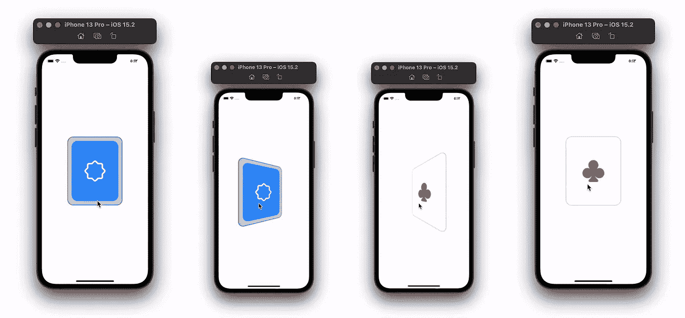
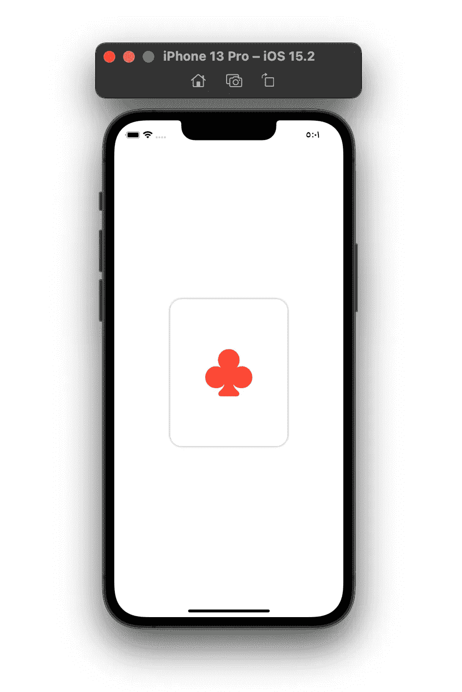
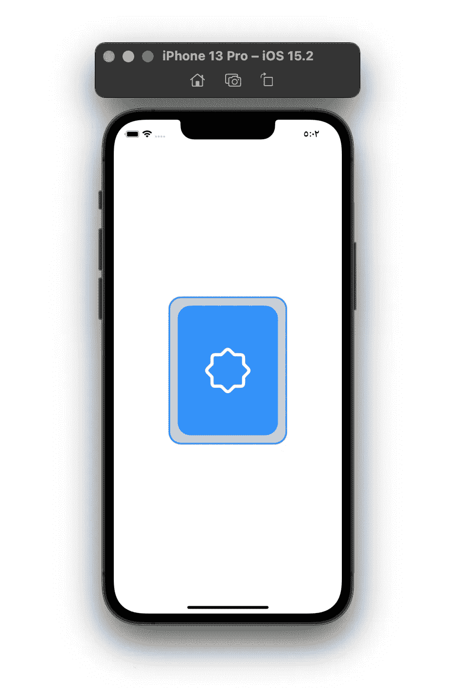
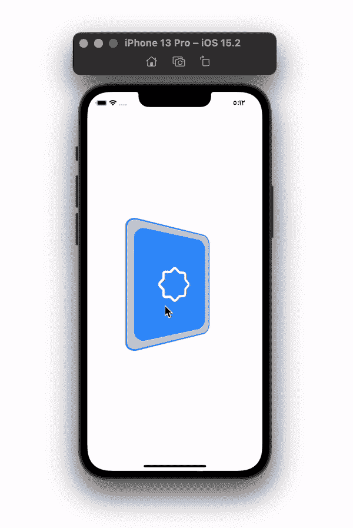

# SwiftUI 中的卡片翻转动画

> 原文：<https://betterprogramming.pub/card-flip-animation-in-swiftui-45d8b8210a00>

## 将后视图过渡到前视图制作成动画

在本文中，我们简单地使用两个视图(卡片的正面和背面)将视图翻转 180 度，我们将向任意方向移动 90 度来完成 180 度翻转。

# 卡片正面

设计卡片的前视图。卡片在开始的时候在它的背面。当用户点击卡片的背面时，视图将翻转到我们下面的前视图。

添加一个`rotation3dEffect()`修改器到你的堆栈中。卡片的 y 轴将是 1，x 和 z 是 0。

卡片将绕其 y 轴旋转；从右到左或从左到右。

角度是从我们将在下面创建的父视图中传递的。

# 卡片背面

卡片的背面也是如此。设计卡片的前视图。卡片将从这一面开始翻转。

添加`rotation3dEffect()`修改器，如下图所示。

# 卡片翻转动画

在父视图中，将两张卡添加到一个`ZStack`中。

使用`onTapGesture`修改器触发翻牌。

为翻牌动作创建一个函数。

在我们的函数中，用一个布尔变量跟踪卡片的一面。

使用两个`withAnimation()`修改器制作卡片正面和背面的动画。给你的动画一个持续时间值。

将第二个动画延迟与第一个动画的持续时间相同的值。

后卡的角度从 0°开始变化到 90°，卡的正面从-90°开始变化到 0°。通过将值改回其初始值来反转动画。

感谢您的阅读！