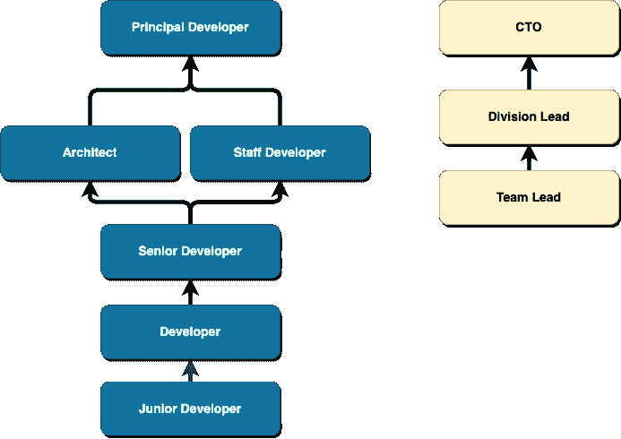

# 软件工程中的职业成长框架:综述

> 原文：<https://betterprogramming.pub/career-growth-frameworks-in-software-engineering-a-review-4aa6c59a9cf6>

## 绩效评估和职业发展机会与公司文化密不可分。了解它们随着时间的推移而变化和发展，将有助于指导我们在实施或修改增长框架时的选择

一个生长格子！Geddit？Geddit？[来源](https://unsplash.com/@sofelini?utm_source=medium&utm_medium=referral)

# 我们为什么要谈这个？

当我在接收端的时候，绩效评估从来都不是我关注的事情。老实说，他们很痛苦。

我在一家大型国际专业服务公司的肚子里度过了职业生涯的形成期。HR 是一台庞大的、运转良好的机器。一切都被正式化、模板化、标准化、润色和简化了。

专业服务公司通常不开发太多软件，所以他们的成立不是为了以任何方式支持或区分我们的软件工程角色。我们每年填写一次标准化的 [SMART](https://www.cognology.com.au/learning_center/howtowritesmartobj/) 绩效评估。一点都不好玩。感觉它浪费了我大量的时间，而且大多数问题都不相关。或者至少我们没有得到如何使它们相关的指导。尼尔·福特(Neal Ford)、丽贝卡·帕森斯(Rebecca Parsons)和帕特里克·夸(Patrick Kua)的《进化架构》(Evolutionary Architecture)中的一句话浮现在脑海中，“*越多的* ***可重用*** *的东西，越少的* ***可用*** *的东西就是*”与软件一样，绩效评估也是如此。

我们只是尽了最大努力做好文书工作。然后我们的老板会去找他的老板，告诉他们他的团队做得很好，我们会加薪。或者不是。这一切都非常不透明。据我所知，绩效评估只是巨大的公司引擎的一部分，它根据机器的突发奇想，吸收意见，吐出快乐或失望。

从那里，我走了一条迂回的路线，来到一家年轻的初创企业。在那里，我惊讶地得到了一个链接，链接到一个有几个方框的小电子表格，并被告知:“这是我们的绩效评估框架。”

这不是我所习惯的！我以前的经历让我觉得应该有更多的排场。作为一名新晋的、有上进心的、有事业心的工程经理，我觉得我有能力做得更好。我着手做了一些研究，并为我们职业发展框架的下一阶段发展提出了一个适度的建议。

这篇文章最初是作为给管理层的备忘录开始的。它从未被投递。我的研究让我说服自己不要交付它。我们拥有的一切都很好。

我已经习惯于期待业绩和增长是一个隆隆作响的机器的一部分，它制造了很多噪音，但完成的很少。回想起来，我相信我们简陋的电子表格(我们目前仍在使用！)，在公平、透明和设定职业期望方面做得比我以前的雇主的任何一家公司都要好。

在我们后工业化的历史中，职业发展是“职业阶梯”的同义词在这篇文章中，我想探讨一下这个想法的来源，为什么它在今天不再适用，然后为那些目前需要建立或调整职业框架的人提供一些实用的建议。

# 背景和背景

有一个虚构的故事，一家公司聘请了一名顾问来帮助确定和改善他们的文化。咨询师问:“在这里，你必须做些什么才能获得晋升？”在听到并记录下所有的回答后，顾问把它交还给公司，并说:“这就是你的文化。”

职业框架与你公司的文化密不可分，应该非常谨慎地制定。“把事情做好”需要大量的时间，并且增加了大量的计划和流程。简单地复制别人做过的事情，或者你在以前的雇主那里看到过的事情，是很有诱惑力的。然而，我们必须意识到，事情的发展有大量的社会和历史背景。

## 职业阶梯——历史背景

在工业革命之前，中层管理并不是一个真正的东西。通常情况下，除了企业的所有者之外，没有人与企业的运营有太多的关系。除了教会和军队之外，没有多少大型组织。可悲的是，那些确实存在的大多是以奴隶劳动为基础的。

工业革命后，劳动分工和管理的概念作为优化大规模生产和资源开发的方式得到了认可。工人被视为工业车轮上的齿轮，控制结构被置于优化生产的位置。

一个众所周知的例子是泰勒主义，也被称为“科学管理”，以弗雷德里克·温斯洛·泰勒(1856-1915)命名。泰勒试图将制造过程分解成可重复的、易于理解的、可以测量和优化的任务。在他的设想中，工程师将识别并分解工人们将执行的过程。

虽然泰勒希望他的方法能够减少工人和管理层之间的摩擦，但他的方法侧重于将计划与执行以及直接与间接工作分开。这使得工人变成了机器中无需思考、可替换的齿轮。

泰勒主义之后是福特主义，由亨利·福特在其制造工厂中首创。与寻求优化工人、任务和机器的泰勒主义相反，福特的贡献在于引入了装配线，将工作交给工人。它还包括关注成本最小化，而不是利润最大化。

工人流动率很高。据说，他在 1913 年不得不雇用 52，000 人来填补 14，000 人的劳动力，但福特试图通过增加工资来抵消这一点。虽然受到严厉批评，但泰勒主义和福特主义给美国制造业带来的效率提升可以说是美国赢得第二次世界大战的原因之一，并让它们在此后的一段时间里主宰了工业世界。

在二战后的美国，僵化的公司结构占据主导地位。技术和社会进步是缓慢的(与今天相比)，导致了对稳定的普遍期望和一个不成文的承诺，即雇员将是忠诚的，雇主将提供终身就业。不过，如果你是福特工厂的一名工人，这意味着你的家人要接受定期检查，以确保你的行为符合美国人的方式。

当时出现的公司结构产生于“科学管理”的成功，大体上是这一过程的翻版。管理层是泰勒的工程师，定义和分解流程，然后分配给非技术工人执行。在这种情况下，在企业界成功的职业生涯标志着从非熟练工人上升到熟练管理人员。

接下来，在 20 世纪 70 年代末，经济繁荣-萧条周期开始粉碎稳定、永久就业的幻想，就在全球化彻底摧毁它之前。现在的劳动力是多代同堂、不断变化和不稳定的。随着制造业转移到海外，就业也向知识型员工转移。创新和创造力得到了更多的重视。

软件工程作为一种职业在这个时候开始形成，并被硬塞进传统的公司模式中，尽管这种模式正在失去相关性。不仅传统的公司模型失去了相关性，而且程序员在其中的角色在短时间内也发生了巨大的变化。

毕竟，计算机最初只是一个职称。它指的是计算和制表信息的人，如导航数据或利率表。计算机的这种用法可以追溯到 17 世纪，当时并不被认为是一种创造性的职业。随着机械和电子计算机开始接管实际的计算工作，程序员的角色出现了，但仍然处于将计算视为生产线一部分的世界观的阴影下。

作为一个例子，请看 Frederick Brooks 在 1975 年写的开创性的文章“人月神话”，它提供了一个引人入胜的关于软件开发作为一种职业的曙光的一瞥。这本书的大部分内容仍然相关，但有些在出版几年后就过时了，比如他对[外科团队](https://softwareengineering.stackexchange.com/questions/355203/what-happened-to-the-surgical-team-pattern-from-the-mythical-man-month)的描述，其中一个“摇滚明星”程序员(外科医生)编写所有代码，而他周围的团队承担案头检查代码并将其打入的平凡工作。

在一个植根于泰勒主义的企业世界的背景下，计算和程序员向产品开发人员或软件工程师的快速演变，显然将成为错位和误解的沃土。

## 传统职业阶梯的问题

也许对职业阶梯最著名的批评是“彼得原理”，它可以追溯到 20 世纪 60 年代末。如果员工表现出色，他们就会得到晋升。当他们被提升到表现不佳的水平时，晋升就停止了。结果，随着时间的推移，每个职位都倾向于被一个不称职的员工占据。

彼得原则认为升职是出于认可和奖励表现的真实愿望，与之相反，我们有[呆伯特原则](https://cdn-images-1.medium.com/max/800/0*oloxFk-0oaYnw4sT)。该理论产生于 90 年代中期，认为提拔不称职的人进入管理层是让他们离开做“真正工作”的人的最有效方式。即开发人员和软件工程师。

在软件工程和其他基于知识的学科中，一个常见的抱怨是需要一种不需要进入管理层就能奖励和补偿熟练员工的方法。对这种抱怨最典型的反应是引入双轨职业阶梯。这个想法是提供一个替代的标题集，支付高达(或超过！)管理，同时允许员工保持个人贡献者的身份。

一个想象的，但典型的“双轨”职业阶梯

这在理论上没问题。然而，除了像谷歌这样的少数异类(其中“谷歌伙伴”是一个技术角色[相当于副总裁](https://www.quora.com/What-are-all-the-job-levels-in-Googles-technical-career-track))之外，它通常是在传统的、等级森严的公司框架内实现的，带有所有泰勒主义的包袱。其结果是，技术角色仍被视为工人，因此不如管理角色，或者说，尽管有双轨制，但仍存在的等级制度和官僚主义不利于营造一个工程师受到重视的环境。

那么*我们能做什么*让工程师们感到被重视呢？

## 内在奖励与外在奖励

凭直觉，我们明白我们想要一份令人满意的职业，想要足够的钱来支持我们想要的生活方式，如果可以的话，还需要供养亲属。作为雇主，我们也可能会想，如果有回报，交易的一部分是否是为了激励员工更努力地工作，做得更好。

这无疑是泰勒主义的一个重要方面:胡萝卜加大棒的思想。奖惩结合可以激励员工的理论。这是否适用于重复性的工厂工作是有争议的。但即便如此，软件开发人员也不是工厂工人。一旦满足了充足和公平的基本要求，外部奖励就不再是一个强有力的激励因素。事实上，在某些情况下，它们甚至会削弱动力。

Daniel Pink 在他的书《Drive》中谈到了这一点，这本书经常被技术领导者评为他们最有影响力的读物之一。执行你喜欢的任务本质上是有益的，比如精心设计架构良好的微服务，或者为设计问题找到一个特别优雅的解决方案。但是一旦外在的奖励成为执行任务的理由，它就可以开始接管，扼杀内在的享受。

纯外部激励的另一个问题是，如果执行不力，它会限制绩效。例如，如果你在某项业务指标上实现 10%的改进将获得奖金，你为什么要设定 15%的目标呢？如果根据某个任意设定的日期，你会因为“准时”而获得奖金，那你为什么还要尝试更快地完成呢？还可能存在利用系统来获得回报的诱惑，鼓励短期思维、丧失创造力，以及极端情况下的欺骗和不道德行为。

据称解决方案是确保内在动机因素得到承认和包括。增长框架不能仅仅是决定一个人的薪酬和职位。它还必须暴露和提升内部激励因素。

Pink 所描述的三个主要因素是掌握、自主和目标，这是相对自我描述的。

职业阶梯——或其他框架——可以帮助我们分配薪酬，这照顾到外部动机。但是它们能帮助我们获得内在动机吗？

## 辩论

传统的职业阶梯以及它们所暗示的自上而下的等级制度，被许多分享 Kaizen(持续改进)、协作、自主和组织敏捷性等进步理想的人视为诅咒。例如，见[格拉汉姆·利](https://medium.com/u/d7c08eb72c85?source=post_page-----4aa6c59a9cf6--------------------------------)的[这篇文章](http://www.grahamlea.com/2013/07/why-smart-software-teams-dont-need-senior-developers-tech-leads-or-architects/)，他在其他观点中认为，分配技能等级是一个回归问题，而不是分类问题，所以头衔和等级没有意义。网飞也有类似的结构(或者没有)。

[其他人](https://www.thebalancecareers.com/how-career-ladders-benefit-organizations-1669368) [认为](https://blog.usejournal.com/the-software-engineering-job-ladder-4bf70b4c24f3)阶梯或等级是必要的，以提供一个鼓励成长、激励员工的框架，并提供一个评估绩效的客观框架。针对等级制度的批评通过提出“职业道路”和“职业格子”等替代术语得到了一定程度的缓解。

当我们把辩论的范围扩大到特殊性和普遍性时，问题就变得复杂了。一些人越来越反对让“架构师”或“技术领导”自上而下地指导技术选择的想法。这与自主性相矛盾，自主性降低了内在动力。相反，通过自治团队和微服务，我们可以尝试创建一个环境，在这个环境中，好的架构和决策是每个人的责任。

但是，如果某件事是每个人的责任，那么它往往会变成任何人的责任。Pat Kua [认为](https://www.thekua.com/atwork/2014/10/do-we-need-a-tech-lead/)即使是一个自主、自给自足的团队也需要一个技术领导者。反题阵营提供了一个[反证](http://vvgomes.com/we-dont-need-tech-leads/)，然后[被帕特夸](https://www.thekua.com/atwork/2016/12/you-may-not-need-a-tech-lead-but-others-do/)反驳。尘埃落定后，其他人也加入了他们对这场辩论的看法，清楚地表明这个问题是复杂和有分歧的。

有任何种类的梯子或格子的想法也提出了另一个问题。我们如何让工程师登上我们的阶梯？他们站在哪一级？也许我们需要*衡量*他们的表现？

## 衡量开发人员绩效

> 告诉我你如何衡量我，我会告诉你我将如何表现。
> 
> —艾利·M·高德拉特

你不能。它不起作用。我们现在知道了。

开发人员的表现可以被衡量的假设来自于与制造业的错误类比。但就我个人而言，我更倾向于一个建筑隐喻。砖墙的建造速度与你砌砖的速度直接相关。因此，构建程序的速度与添加代码行的速度相关，对吗？

历史告诉我们，我们必须明确地说*不，这是错误的*。像大多数不正确但流行的理论一样，有一个天真的过度简化，然后是外推，这提供了一个令人信服的不可抗拒的逻辑，但忽略了其他相关的事实。没有人会仅仅为了[的纯粹乐趣而建造一堵墙。建筑是有用途的。这堵墙将是一个更大的建设项目的一部分，该项目有一个崇高的目标，比如为受压迫者提供住所，或者减少道路拥堵。](https://www.bbc.com/news/world-us-canada-46824649)

建筑项目很少能按时运行。通常项目越大，超支越多，花费的时间也越长。但是为什么呢？当然，这是基于你的砖层生产率的简单计算？

哦…我们是不是忘记了计划委员会、政府文书工作、建筑师、现场测量员、社区咨询、盲蛛、地面工程、砖层、瓦工、防水和潮湿天气，还有…好了，我现在可以停下来了。

在我们的构造类比中，软件工程师扮演什么角色？砌砖工人还是建筑师？地面工程队还是测量员？防水者还是社区咨询委员会？

答案是大部分。尤其是最近推动跨职能团队和 T 型员工。软件工程师的目标不是写代码，而是[构建产品](https://medium.com/@coderdan/the-coders-role-92fbc6cd5f2a)。

这是所有客观衡量个体开发者生产力的尝试最终失败的根本原因。直觉上，我们知道 UX 设计师的角色不是画线框和模型，而是设计体验。线框图是达到目的的一种手段，但是我们从来没有想过把“线框图的数量”作为设计师的一个性能指标。然而——对于软件工程来说，神话依然存在——多年来探索的度量标准的数量证明了这一点，例如:

*   工作时间
*   源代码行
*   故障率
*   [功能点](https://en.wikipedia.org/wiki/Function_point)
*   故事要点
*   代码“影响”

如果在团队或项目级别应用，上面的许多度量实际上是有用的。至少，它们有助于构建一幅业务如常的画面，这样你就可以了解你所做的改变是否产生了影响。这种数据驱动的决策目前很流行，但超出了本文的范围。然而，作为在职业框架内给软件工程师分配等级的工具，我们必须得出结论，定义和测量*度量*不是我们所寻求的。

# 其他人都在做什么？

网飞为工程师保留了一个平面结构。它的[文化甲板](https://www.slideshare.net/BarbaraGill3/netflix-culture-deck)很有名。该公司遵循这一原则，在她的[工作完成后](https://www.fastcompany.com/3056662/she-created-netflixs-culture-and-it-ultimately-got-her-fired)立即“解雇”了该公司的联合创始人帕蒂·麦考德。有趣的是，对于其他初创公司，帕蒂建议新公司不必太担心设定薪酬等级。

Spotify 推迟了八年才实施技术职业框架。这种延迟主要是因为他们觉得正式框架的开销在公司生命的早期阶段会适得其反，在这个阶段，角色和职责应该是不固定的。他们自己承认，他们可能等得有点太久了。在那段时间里，扁平的层级结构成为了公司文化的一部分，尽管不是有意的，也不是普遍的。他们旅行的细节已经在 T2 公开。

Medium 效仿了与 Spotify 类似的[模式](https://medium.com/s/engineering-growth-framework/engineering-growth-introduction-8ba7b78c8d6c)。事后看来，他们的模式感觉比 Spotify 更精致，执行得也更好。(尽管对于一家与文字如此紧密相连的公司，我期待一篇精彩的报道。)

谷歌和微软有双轨职业阶梯。谷歌一度试图采用扁平化的结构，但它以惊人的失败告终。不是自主团队做出他们自己的决定，所有的事情[都集中](http://www.news.com.au/finance/work/more-companies-are-adopting-a-flat-working-structure/news-story/335b71582702b0e2b9344c99d8e414ec)到唯一剩下的领导者，拉里·佩奇。

其他口头上宣传工程最佳实践的公司，如“Fog Creek”，有着更传统的职业发展道路。然而，他们的晋升标准是基于一个技能矩阵，强调增加责任范围。

Fog Creek 的创始人是 Joel Spolsky，也是 Stack Overflow 和 Trello 的幕后推手。他直言不讳地批评了工作场所传统的“命令和控制”管理方式，声称它们扼杀了员工的创造力和参与度。类似的观点也被用来反对泰勒主义和福特主义，以及它们对疏远工厂工人和降低工人技能的影响。

Valve 和 GitHub 正在试验非常扁平的结构和[hola racies](https://www.holacracy.org/)。Holacracy 因 Zappos 而出名，并因其无管理的组织结构而闻名。holacracy 背后的[论点是，它消除了经常发生在公司领导人和工人之间的目的淡化，公司领导人有远见，但如果不依靠工人就无法执行，工人可以执行，可能有想法，但可能无法将想法传达给上级。因为目标是三个内在激励因素中的一个，这个想法很有说服力。](https://blog.holacracy.org/how-your-organisation-can-thrive-in-a-disruptive-market-with-demanding-customers-and-a-millennial-be1e3475ae77)

Holacracy 是一个迷人的实验，值得比一个段落。但总的来说，早期采用者的经验表明，这是可行的，但需要比传统结构更多的承诺和反直觉的过程。在传统的公司结构中，领导者制定规则。在荷兰，T4 体系就是规则。想想君主制和民主制。

在君主政体中，你做君主叫你做的事。在一个民主国家，要改变规则就必须改变制度。这需要得到称职和公平的管理。在采用他们当前的框架之前，Medium [用](https://blog.medium.com/management-and-organization-at-medium-2228cc9d93e9) [Holacracy](https://www.holacracy.org/) 对进行了试验，但是放弃了它，主要是因为增加的开销无法扩展并且妨碍了他们的决策。

buffer[尝试了所有的事情](https://open.buffer.com/career-framework/)，然后选择了传统的双轨阶梯，拥有一系列技能。Buffer 的显著不同之处在于他们的分布式团队和他们对[公开工资](https://buffer.com/salary)的承诺。将公开薪资发挥到极致的是“iwantmyname”，他们为整个公司保持了[单薪](https://iwantmyname.com/blog/the-one-salary-experiment-ten-years-in)。

一个更标准的公开薪资的方法是使用技能矩阵来产生一个加权分数，将员工分配到一个级别。乐队会有相应的薪水。根据公司对公开工资和透明度的满意程度，员工的级别可能是公开的，但工资是隐藏的，工资公开但级别是隐藏的，或者工资和级别都是公开的。

# 共同主题

1.  “职业阶梯”已经死亡。职业道路或“格子”万岁。职业道路不应该直接通向管理层的想法是普遍的，没有争议的。
2.  **技能矩阵很常见。**尽管实施细节千差万别，但几乎所有的进步工程公司都会根据某种矩阵来评估绩效。几乎总是包括软技能和商业头脑以及纯粹的技术技能。
3.  **增长框架与文化密不可分。头衔(或没有头衔)、晋升标准和公司结构是公司文化和价值观的直观体现。**
4.  **成长框架与头衔是分开的。有可能将对外在头衔的关注与技能和成长分开。要回答的最重要的问题是“我如何成长？”**
5.  自主、掌握和目标至关重要。这三者协同工作，创造一个人们感到被重视、想要贡献并能够贡献的工作场所。
6.  你的水平应该反映你的能力，而不是定义它们。无论如何衡量，员工都应该明白他们的成长没有人为的限制，这一点很重要。他们的职位和薪水将公平地反映他们的成长和他们所做的工作，而不是相反。没有人会因为他们的职位较低而感到被忽视或被低估。相反，任何人都不应该觉得他们可以忽视组织中的问题，因为这是其他人的问题。

# 典型的权衡

1.  **深层次还是平层次？** 这是一个滑动标尺。扁平层级的支持者声称，扁平层级提高了自主性和参与度，减少了不必要的官僚主义和流程。很少有人赞成保持深层次结构，但这是占主导地位的现有公司结构。如果员工/团队还不具备自主决策的能力，就像谷歌的情况一样，那么消除所有层级可能会适得其反。
2.  **角色还是头衔？虽然有多种相互竞争的组织结构，如集体领导制和扁平层级制，但没有一种能消除对工作的需求。Holacracy 以“无管理”运动而闻名。这不是真的。管理仍然是必需的，但嵌入在角色中，而不是头衔中，可以由任何认为有资格并能履行职责的员工来完成。真正的权衡是，你是否将一个头衔分配给一个将执行某种类型工作的人，或者该工作与一个角色相关联，该角色可以像帽子一样在不同时间由不同的员工佩戴。**
3.  **集中还是分散决策？** 传统的公司结构，以及建筑师这样的头衔，都与自上而下的决策有关，而这些决策往往与现实情况相距甚远。替代方法允许决策的授权或分配。 [Holacracy](https://www.holacracy.org/) 代表分布式决策的极端。[授权板](https://medium.com/agile-reactor/delegation-boards-and-delegation-poker-managing-self-organisation-8cea213c4328)声称提供了一种自组织的中间方法。
4.  **头衔还是非头衔？**
    这场争论与等级、结构和角色有关。在传统结构中，争论的焦点是拥有头衔或“级别”(例如，工程师一、工程师二)是否会阻碍自主性和自组织性，同时也会形成等级制度。或者，可能根本没有头衔，工作职责与角色相关联，如在 holacracies 中。无头衔或固定头衔的支持者声称，它们不能准确反映技能沿着一个梯度发展，并且可能是人为限制的。头衔的支持者谈论结构的需要，外部比较薪水和角色期望的困难，并且帮助抵消在一个看起来不像高级开发人员的非多样化劳动力中有经验的员工可能面临的偏见。
5.  **迟早？** Spotify 和帕蒂·麦考德(来自网飞)主张推迟实施职业发展和薪酬等级的正式框架。理由是创建、维护和应用一个框架非常耗时，而且会增加开销。虽然公司规模更小，角色更灵活，但依靠直觉和共识也足够好了。他们自己也承认，Spotify 可能等了太长时间(八年)，这让旅程变得更加艰难，也阻碍了它的推广。
6.  **公开薪资还是关闭薪资？** 封闭式薪酬是行业的默认，支持者担心薪酬透明可能会引发同事之间的嫉妒，被断章取义，使得在预算有限的情况下更难招聘，或者让其他雇主更容易挖走员工。引用的另一个原因是，雇主很难解释相同职位的个人之间的工资差异。这意味着没有客观的方法来评估表现。然而，由于通过 glassdoor.com 等网站和市场数据很容易获得平均工资，这些理由越来越听起来像是借口。另一方面，薪酬透明有助于缩小女性和少数族裔的薪酬差距，并可能提高幸福感和士气(T4)。
7.  **常规还是非常规？** 有得有失！标题是约定俗成的。等级制度是传统的。封闭式工资是惯例。商业组织和职业发展中的许多想法目前都在争论之中。尝试新事物或走一条更进步的道路可能是一场赌博，并使从一群习惯于期待传统方法的候选人中招聘变得更加困难。另一方面，进步只发生在人们愿意在非传统上冒险的地方。此外，它可以创造一个差异化点，这样，尽管你的人才库可能较小，但你最终得到的员工都致力于这一事业，并有意选择了你的公司，因为它的文化和工作方式。

# 创建职业框架的实用建议

职业发展框架存在于不同维度的多种权衡和关注的结合点上。我敢肯定，比我更有想象力的人可以将它们整齐地归类，并分配给《哈利·波特》中的角色或龙与地下城中的角色。显然，职业发展的下一个创新将是，通过弄清楚你的公司是混乱邪恶、合法中立还是真正善良，让选择变得容易。

在那一天到来之前，任何希望实施或改善增长框架的人都会面临双重挑战。首先，决定你希望成为什么样的公司，并做出相应的权衡。其次，通过回答问题*“我如何成长？”来帮助员工实现目标、掌控和自主*

我们从哪里开始？从本文的研究和与其他技术领导者的交谈中提炼出的我的建议是:

1.  找出你的价值观。
    文化是你做的，而不是你说的。你的组织的价值观应该通过你评估和奖励员工的方式来体现和提升。如果你打算借用或修改别人发布的框架，你需要知道什么对你来说是重要的，这样你就可以相应地调整。如果你打算从头开始创造一些东西，你需要知道从哪里开始构建。不管怎样，这都很重要。
2.  **提前做一些决定。**在那之后，可能是头衔或者没有头衔。组织结构的其他方面更有可能是你成长的突现属性。知道你想把事情引向何处，但它们可能并不像试图预先确定的那样重要。
3.  **确保经理定期与他们的报告进行一对一的会谈。错过加薪或升职是非常不公平的，因为反馈一年才提供一次，而那时已经太晚了。定期补课有助于解决这个问题。关于有效的一对一会议，有大量的信息，这里不需要重复。但追赶的目的是证明一个定期的、半正式的论坛来接收反馈。这也是一个讨论目标和动机的地方。绩效评估中没有什么是令人惊讶的。使用“自主”、“目标”和“掌握”作为这些讨论的主题也可以很好地工作。**
4.  **有公平客观的评估方式(不是测量！)性能。**
    建立或借用能力矩阵。它应该描述每个级别的任务和行为。它可能不应该包括度量和测量。将它公平地应用于同一角色的所有级别。
5.  **有明确的方法来重新评估薪酬**。实际过程是什么可能并不重要，只要它是已知的和可接受的。理想情况下，绩效是连续评估的，而不是每年评估一次。如果你一年只给孩子一次关于他们行为和进步的反馈，你就不能指望抚养孩子——那么我们为什么要指望这对我们的员工有效呢？

大概就是这样。你不需要太多的流程——对于一个年轻的创业公司来说，少即是多！但是，如果你能保证定期反馈，并尽可能做到公平，这对于提供掌控、自主和目标有很大的帮助。

[1]听起来像敏捷！泰勒主义不管叫什么名字，闻起来还是像机油。

[2]仔细想想——这和如今人们因为在公共媒体上发布的内容而被解雇有什么不同吗？