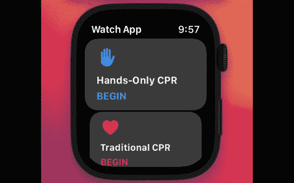

# 使用 SwiftUI 的 watchOS 应用程序的轮播列表视图

> 原文：<https://betterprogramming.pub/carousel-list-view-for-watchos-apps-using-swiftui-8b8e06941732>

## 构建漂亮的 watchOS 应用



我最近在开发名为“Pocket CPR”的 Apple Watch 应用程序，我注意到缺少涵盖 SwiftUI 功能的教程，例如专门针对 Apple Watch 的视图。

在本教程中，我将向您展示如何使用 SwiftUI 为 Apple Watch 创建如上所示的 Carousel 视图。

# 使用列表视图

SwiftUI 中的`List`视图在垂直列中显示可滚动数据的列表。

您可以使用`.listStyle`修饰符向列表中添加更多的定制。

在这种情况下，我通过添加`.listStyle(CarouselListStyle())`创建了一个 Carasouel 视图。Carasouel 列表视图的基本设置如下:

```
List {

  Text("One")
  Text("Two")
  Text("Three")
  Text("Four")
  Text("Five")

}.listStyle(CarouselListStyle())
```

# 最终代码

以下代码用于视频中显示的 Carasouel 视图。

这是一个使用`.listStyle(CarouselListStyle())`的列表视图，包含显示文本和按钮的 VStacks。

感谢阅读。

```
**Want to Connect?**If you enjoyed this article, please consider viewing my other projects on Github ([https://github.com/angelina-tsuboi](https://github.com/angelina-tsuboi)), and connecting with me on [Linkedin](https://www.linkedin.com/in/angelina-tsuboi-322028211/)!
```