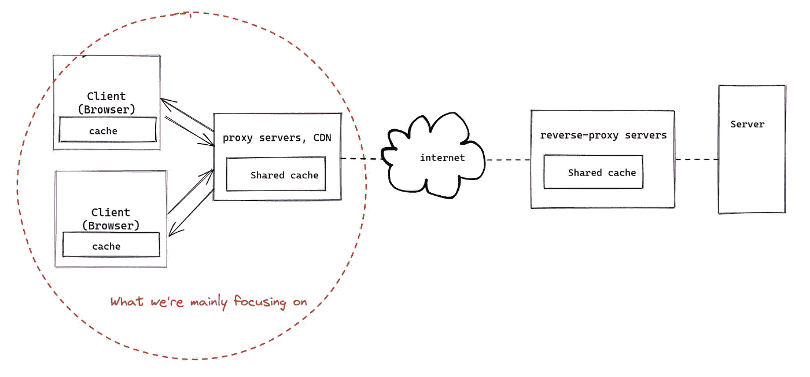
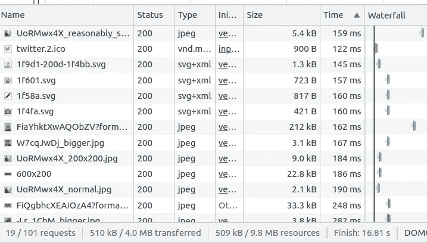
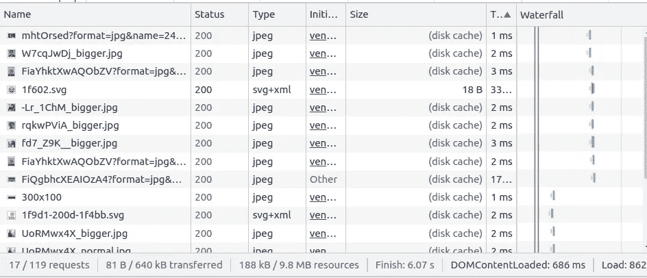
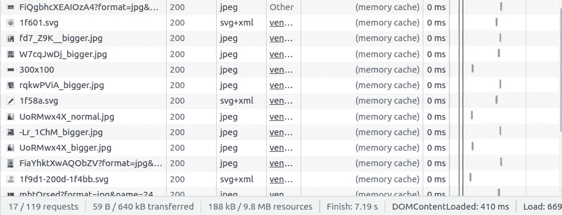
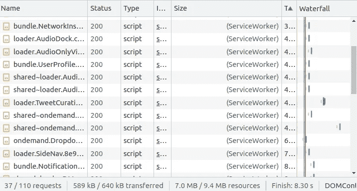
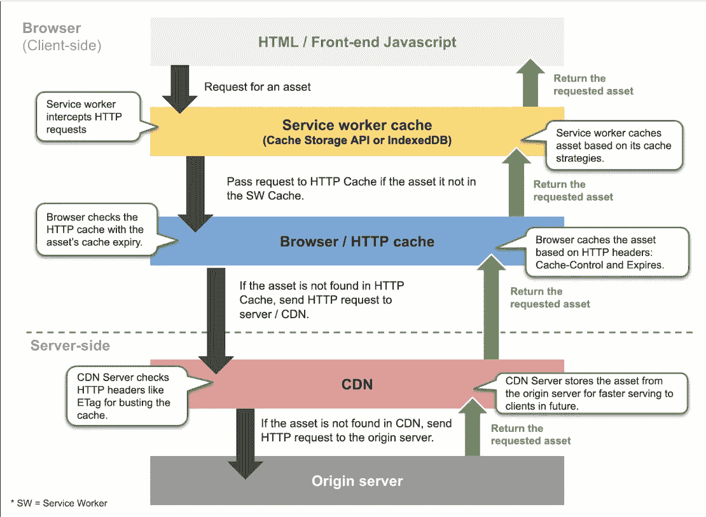
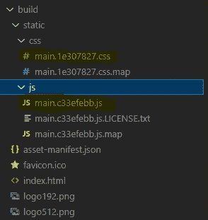
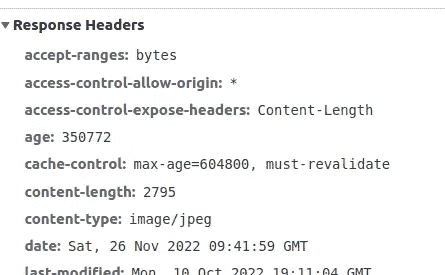
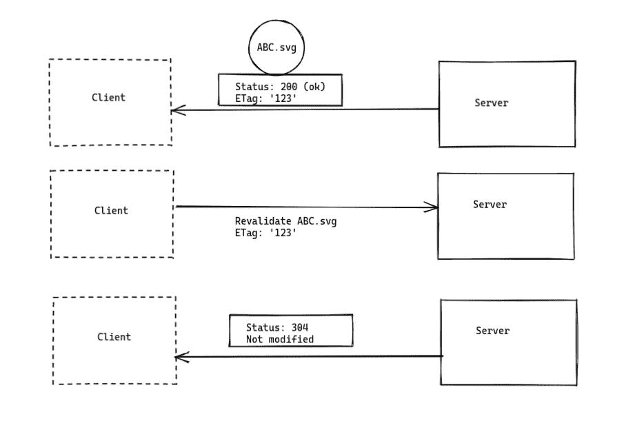

# 作为前端工程师利用缓存赚钱

> 原文：<https://betterprogramming.pub/cashing-in-on-caching-as-a-frontend-engineer-611a7c57f6b5>

## 通过学习缓存策略提高网站性能


照片由[沙哈达特·拉赫曼](https://unsplash.com/@hishahadat?utm_source=medium&utm_medium=referral)在 [Unsplash](https://unsplash.com?utm_source=medium&utm_medium=referral) 上拍摄

像 React.js、Next.js 等现代 javascript 框架。，通过更加模块化、声明式的开发风格提升了最终用户和开发人员的体验。虚拟 DOMS 和 diffing 有助于优化 DOM 操作。

但是对于浏览器来说，绘制 DOM 并不是唯一需要担心的事情。它还处理文件和网络呼叫；一堆 HTML，CSS，JS，字体，图片等等。，用于构建页面。

正如 Sam Thorogood 在这个[视频](https://www.youtube.com/watch?v=tprJYFkv4LU)中所说，前端工程师更经常地专注于提高[灯塔评分](https://web.dev/performance-scoring/)，这主要关注网站的首次加载体验。当用户再次访问网站时，我们还应该优先考虑第二次(或随后的)加载速度。这就是缓存和高效缓存策略发挥作用的地方。

> 缓存是将可重用数据存储在高速数据存储层中的想法，因此可以更快地检索这些数据以满足未来的请求。

如果一些文件在网站上不经常改变，浏览器可以缓存它们，这样它们可以更快地为未来的请求服务，并节省大量的网络调用。(还有网费！)

> "计算机科学中只有两个难题:缓存失效和事物命名."—菲尔·卡尔顿

在这篇文章中，我想分享我所学到的关于网络缓存的知识。

# 概观

这里有一个简化的视图，以便更好地理解主要参与者。除了客户端缓存，我们还在代理服务器或 cdn 上实现了共享缓存，可供多个客户端使用。



浏览器缓存和共享缓存

资源缓存是在`Cache-Control` HTTP 头的帮助下完成的。它有请求和响应指令，告诉浏览器和共享缓存如何访问资源(后面会详细介绍)。

# 浏览器端缓存初探

下面是我的 Twitter 个人资料页面第一次加载(或者清空缓存硬重装后)。观察“大小和时间”选项卡。



Chrome 开发工具的网络标签在第一次加载时显示 Twitter 网站上的图片(没有缓存)

这是我第二次打开它。请注意，时间急剧减少。



Chrome dev tools 的网络标签显示了第二次加载时 Twitter 网站上的图片(带磁盘缓存)

这是我每次打开它的钱。它在 0 ms 内加载。



Chrome dev tools 的网络标签显示 Twitter 网站上加载的图片(来自内存缓存)

Twitter 徽标、图标、我的个人资料横幅、个人资料图片等项目。，不经常更改，因此会被缓存。

但是为什么会有磁盘缓存和内存缓存呢？

# 浏览器中的缓存类型(Chrome)

Google chrome 有四种类型的缓存:

1.  内存缓存:内存缓存是一种短期缓存，它存储当前文档生命周期(非持久)内缓存的所有资源。在选项卡/会话关闭之前，此处缓存的资源会一直保留。它存储在内存中。
2.  磁盘缓存:磁盘缓存(HTTP 缓存)是一种永久缓存，允许资源在会话之间和跨站点重用。它是基于磁盘的缓存。
3.  服务工作者缓存:服务工作者有一个缓存 API，我们可以用它来控制缓存，并且是持久的。服务工作者是一个 JS 文件，是构建 PWA(渐进式 Web 应用程序)的基本组件。
4.  推送缓存:推送缓存是存储 HTTP/2 推送资源的地方。推送是一种性能优化技术，其中服务器在浏览器请求资源之前向浏览器发送一些资源。我们不会在这里深入讨论，因为我正在弄清楚它到底是如何使用的(让我知道你是否知道更多关于推送缓存的信息)

点击了解更多信息[。](https://calendar.perfplanet.com/2016/a-tale-of-four-caches/)

> **注意:**只有当页面上注册了服务工作者时，服务工作者缓存才会存在。

Twitter 的 JS 文件是从`Service` worker 缓存中加载的。这是因为 Twitter web 应用程序是一个 PWA，所以它注册了一个服务人员。



Twitter 站点的 JS 文件缓存在服务工作者缓存中

## 浏览器的缓存流程

根据 [web.dev](https://web.dev/service-worker-caching-and-http-caching/) 的说法，浏览器在检查资源时遵循缓存流顺序。内存缓存存在于服务工作者缓存之上(下图中缺失)。



浏览器的缓存流程

# 捆绑工具和缓存破坏

假设你的网站有一个`index.html`、`script.js`和`style.css`。您希望项目被缓存很长一段时间(比如一年左右)，但是您也在定期对`script.js`和`style.css`进行更改和部署。因为名称没有改变，所以用户可以从缓存中获得文件。

缓存破坏是解决这个问题的一种方式，我们在文件名中使用版本或哈希，以便浏览器可以加载它们并更新缓存。

我们将阻止浏览器缓存 HTML 文件，加载到`<link>`或`<script>`标签中的文件也将在它们的名称中有一个版本(大多数内容都有)，以便浏览器可以加载它们并更新缓存。

如果你使用过 [webpack](https://webpack.js.org/guides/caching/) 或者类似的工具来构建你的应用程序(或者使用类似于 [CRA](https://create-react-app.dev/docs/production-build/#static-file-caching) 的东西)，你一定见过捆绑的 CSS 和 JS 文件以`main.[content-hash].js`的格式有着奇怪的名字。每当文件内容发生变化时，内容哈希也会发生变化。



名称中的内容哈希支持缓存破坏

# 高速缓存控制标题

这是网络缓存的圣杯。作为来自服务器的响应的一部分的 cache-control 头可以告诉浏览器或代理是否缓存资源、应该缓存多长时间、是否应该重新验证等等。



包含 cache-control 的 HTTP 响应标头

例如，上面的配置说响应可以在缓存中存储一周，并在新鲜时重用。如果响应变得[陈旧](https://developer.mozilla.org/en-US/docs/Web/HTTP/Caching#fresh_and_stale_based_on_age)，那么在重用之前必须通过原始服务器的验证(因为`must-revalidate`响应指令)。

这可以根据我们的需要进行配置，而且非常广泛。我发现 [MDN 文档](https://developer.mozilla.org/en-US/docs/Web/HTTP/Headers/Cache-Control)是了解它的最佳地方。这里有一篇杰克·阿奇博尔德写的关于缓存最佳实践的文章。

# 验证、ETags 和 HTTP 状态代码 304

假设一个文件在缓存中，浏览器在使用它之前必须重新验证它。这可以在一个[实体标签(ETag)](https://developer.mozilla.org/en-US/docs/Web/HTTP/Headers/ETag) 即。HTTP 头。ETag 的值是表示文件的特定版本的标识符。它们还有助于防止文件的同时更新相互覆盖。例如:

```
ETag: "<etag_value>"
```

下面是它如何工作的简单概述。假设浏览器向服务器请求一个文件`ABC.svg`。



1.  服务器发回文件，生成一个 ETag，并将其与 200 HTTP 状态代码一起附加到响应头。然后，浏览器会对此进行缓存。
2.  现在，如果浏览器必须重新验证缓存中的文件，它会发送一个请求以及之前收到的 ETag。
3.  然后，服务器检查文件的 ETag，如果版本没有改变，它会发回一个带有 304 HTTP 状态码的响应，告诉浏览器文件没有被修改，可以重用旧文件。否则，服务器发送文件的新版本，以及新的 ETag 和 200 HTTP 状态码。

# 结论

缓存是提高 web 性能的重要组成部分。因此，理解它的工作原理是很重要的。这篇文章是对缓存的简单介绍，并不是深入的指导。

感谢阅读！

## **延伸阅读和参考资料**

*   [爱你的缓存](https://web.dev/love-your-cache/)
*   [利用长期缓存](https://web.dev/use-long-term-caching/)
*   [缓存最佳实践&最大年龄问题](https://jakearchibald.com/2016/caching-best-practices/)
*   [四个缓存的故事](https://calendar.perfplanet.com/2016/a-tale-of-four-caches/)
*   [https://developer . Mozilla . org/enUS/docs/Web/HTTP/Caching # types _ of _ caches](https://developer.mozilla.org/en-US/docs/Web/HTTP/Caching#types_of_caches)