# 抓住他们所有的铬扩展

> 原文：<https://betterprogramming.pub/catch-em-all-chrome-extension-d51a8b6813fd>

## 学习如何制作你的第一个 Chrome 扩展——第 2 部分

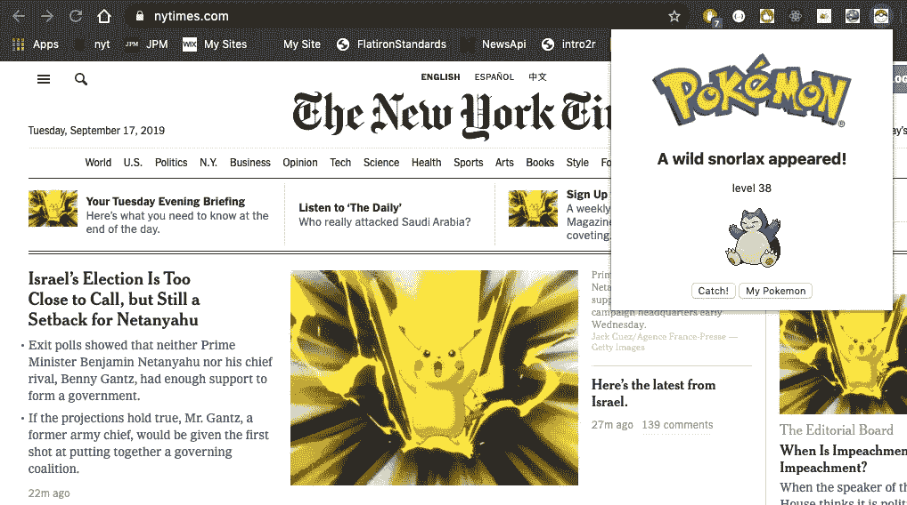

本文是学习如何构建浏览器扩展的两篇文章的第二部分。第一部分在这里有: [*把一切都换成皮卡丘 Chrome 扩展*](https://medium.com/better-programming/replace-everything-with-pikachu-chrome-extension-de40497c7f5a) 。

第一篇文章深入解释了什么是浏览器扩展，它有什么用，以及它的基本组件是什么。

这篇文章不是那个。我们将从头到尾编码。我们将使用普通的 JavaScript、HTML 和 CSS 创建一个遭遇口袋妖怪的浏览器扩展。

不要让这篇文章的长度成为衡量难度的标准。我用超级慢的方式写了很多图片。创建扩展的过程比您想象的要简单。

我们的路线图:

1.  设置 Chrome 扩展以显示弹出窗口。
2.  在后台脚本中获取口袋妖怪。
3.  在弹出窗口中显示获取的口袋妖怪。
4.  抓住他们！(使用 localStorage)。

如果一切按计划进行，我们就能做到:

好了，让我们开始吧！

# 设置

注意:如果您对这个初始设置有疑问，并且还没有阅读上一篇文章，请回去看看。这第一段节奏有点快。

创建新的目录和基本清单。

```
$ mkdir pokeCatcherExtension 
$ cd pokeCatcherExtension
$ touch manifest.json// Within manifest.json => {
  "name": "Poke Catcher", 
  "version": "1.0", 
  "manifest_version": 2
}
```

注意:Chrome 要求你使用清单版本 2 来加载你的扩展。莫名其妙，但无害。

您的目录应该如下所示:

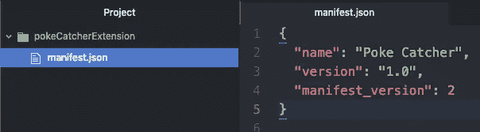

带一个正方形进来。用作我们扩展图标的 png 图像:

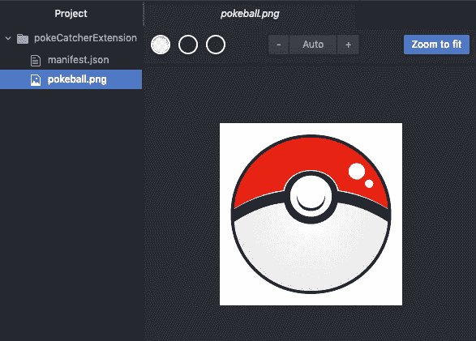

将此图像包含在清单中…

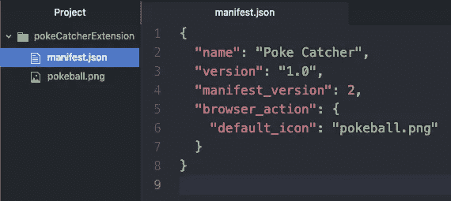

创建一个`background.js`文件来处理浏览器事件。

```
$ touch background.jsWithin background.js =>console.log('background script runnin runnin and...')
```

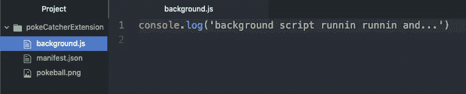

在我们的清单中包含新文件:

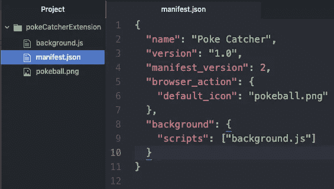

我们现在准备将这段代码作为扩展加载到 chrome 中。导航到 URL `chrome://extensions`。应该会出现下面的页面。确保*显影模式*(右上)已打开。

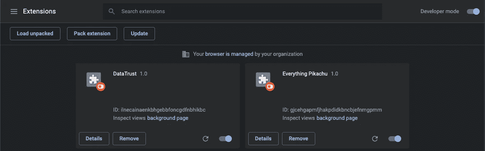

点击 *Load unpacked* (左上)，选择刚刚创建的目录。新的扩展卡应该出现在您的扩展管理页面中。


点击*背景页*进入背景页控制台。

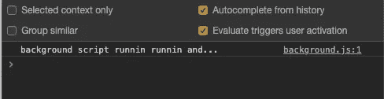

检查你的工具栏，在最右边的位置看到一个扑克球图标…


如果这三个结果都是你的，那么你就可以运行了！

我们在第 2 部分中的目标是*单击 Pokeball 图标来改变页面上的图像元素，*我们在本文中的目标是显示一个弹出页面。

让我们现在创建该页面。随便你怎么称呼它。`popup.html`好听，不言自明。

```
$ touch popup.html// Within popup.html

<h1> You done made it. </h1>
```

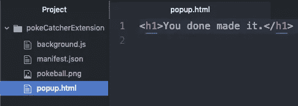

更新我们的清单，以便在单击扩展图标时默认显示这个新的 HTML 页面:

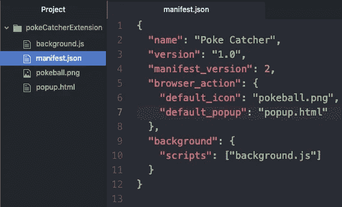

Chrome 要求您在编写清单时使用它们特定的语法。有关问题和(最好是)澄清，请查看[文档](https://developer.chrome.com/apps/manifest)。

**重要提示**:因为我们对扩展的结构进行了修改，所以返回到扩展管理页面(chrome://extensions)并重新加载`pokeCatcherExtension`。

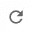

你猜怎么着？你刚刚做了一个 Chrome 扩展弹出窗口。

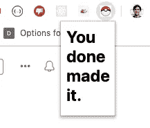

在我们进入下一部分之前，让我们风格化我们的`popup.html`并添加一个[口袋妖怪标志](https://www.google.com/search?q=pokemon+logo&safe=active&source=lnms&tbm=isch&sa=X&ved=0ahUKEwiw9YnotNjkAhVQKawKHYsHB4QQ_AUIEigB&biw=1181&bih=699#imgrc=dG7X4B1-nBEj4M:)的图像:

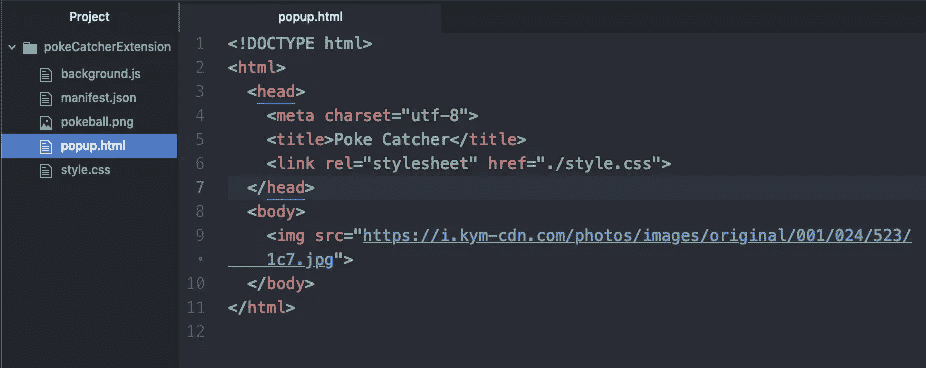

创建您的样式表。

```
$ touch style.css
```

添加这些基本规则(随意发挥，用你的风格变得时髦——为了简单起见，我将保持简单)。

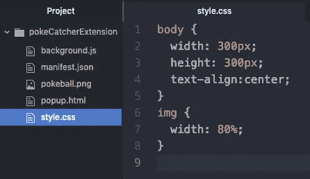

由于我们没有改变扩展的底层结构(即清单没有改变，只有样式改变了)，我们*不需要*重新加载我们的扩展。

我们可以直接回到我们的图标，点击查看这个漂亮的空白页…

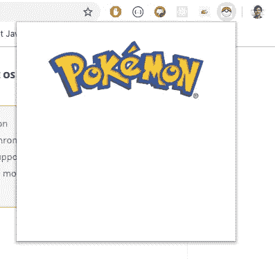

不错！我们现在有了一个运行的后台脚本和功能弹出窗口。继续下一个…

# 在后台获取口袋妖怪

在本节中，我们的第一个目标是在后台检索口袋妖怪。然后，我们将使用 Chrome-Speak(也称为 Chrome API)在每次加载新网页时检索一个新的口袋妖怪。

注意:在本文中，我将把 Chrome API 称为 Chrome-Speak，因为它就是 Chrome API。

## 首先，获取

打开后台脚本开发人员控制台。提醒一下(我开始时经常忘记)，这个控制台可以通过导航到您的扩展管理器`chrome://extensions`并点击*背景页面*来使用

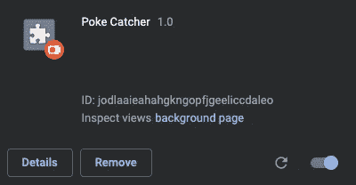

控制台是练习抓取的好地方。在控制台中失败是最快且无害的。控制台获取是快速原型制作的最佳方式。

我们将使用世界闻名的 [PokeAPI](https://pokeapi.co/) 来检索我们的口袋妖怪数据。检查一下，感受一下你能做什么(大量的)。

我们将从获取皮卡丘开始…

`URL: https://pokeapi.co/api/v2/pokemon/pikachu`

这是获取脚本，可以在我们的控制台中使用:

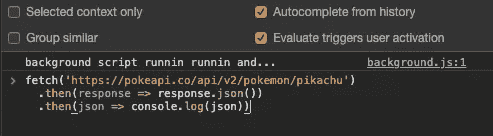

新来的？提醒:我们正在访问一个网站`pokeapi.co`，这个网站不是呈现一个网页，而是呈现一串信息。在这种情况下，这个特定的字符串将是皮卡丘的所有信息。`.then()s`允许我们查看这些信息，然后在我们的应用程序中使用它们。

按回车键。

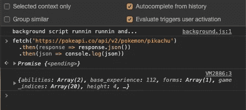

很好。通话成功。现在深入研究返回的对象并检索您想要的任何信息。注意，这个物体可不是闹着玩的…

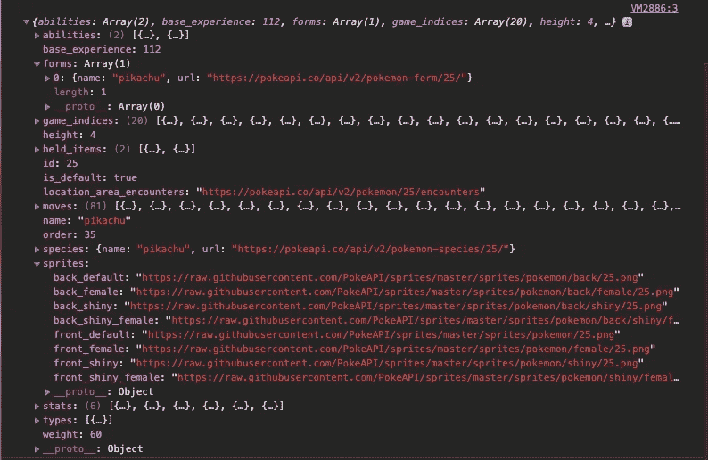

谢天谢地，组织得很好。我们想要口袋妖怪的名字和一个小图像。你会看到`name`可以这样找到…

```
returnedObject.forms[0].name
```

注意`forms`是一个包含单个对象的数组。于是有了`[0]`。

我们可以发现*图像*像这样:

```
returnedObject.sprites.front_default
```

我们应该在控制台上测试我们的理论。将返回的对象保存为全局变量(通过右键单击)并执行这些方法。

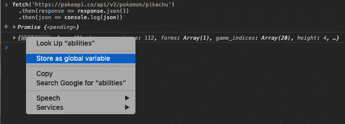

当我们*存储为全局变量*时，chrome 自动生成引用对象的`temp1`。使用`temp1`来测试这些方法。

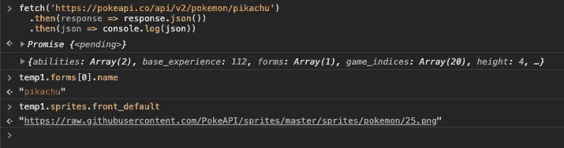

不错！我们有名称(红色)和网址(下划线)…请随意检查该网址。你应该在另一端找到你知道的人:

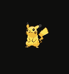

现在我们知道我们正在获取正确的数据，让我们将这些行插入我们的后台脚本。

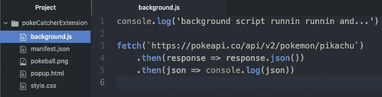

在管理页面中重新加载您的扩展，以见证您的工作的全部效果。当您返回到后台页面控制台时，您应该会看到我们刚刚练习检索的完整对象…

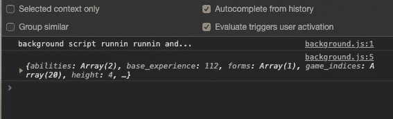

现在我们有了对象，让我们创建一个函数来记录我们检索到的口袋妖怪的名称和图像…

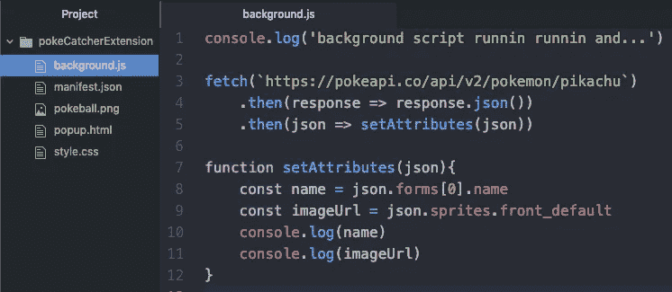

…再次重新加载您的扩展，返回控制台，您应该会看到…

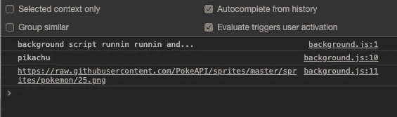

不错！那是一个合适的选择。

## 在页面加载时获取新的口袋妖怪

这个部分的第二阶段是在每次我们加载一个新页面*时执行一个新的获取*。为此，我们将使用 Chrome-Speak。**

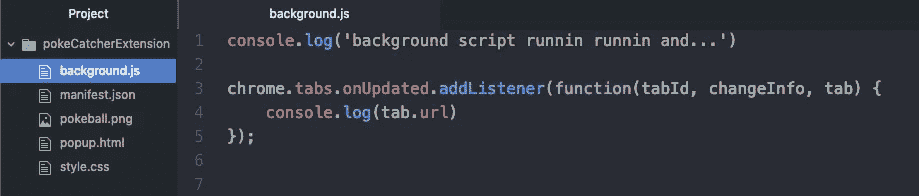

翻译:“chrome”给我当前窗口的“标签”，并“监听”它们何时被“更新”(重新加载)——当其中一个被更新时，请记录当前标签的“url”。

重要提示:你应该得到一个错误！

有一个重要的步骤我们还没有采取，它涉及到我们的清单。

赋予一个扩展命令标签发生什么的权力不是一件小事。Chrome 要求我们明确允许访问`tabs.onUpdated()`函数。

像这样更新您的清单:

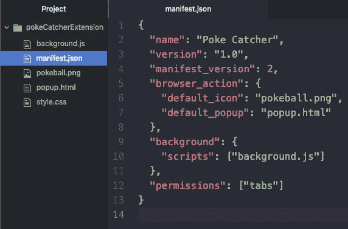

现在，重新加载扩展，加载一个网页，打开您的后台页面控制台，您应该会看到类似这样的内容:

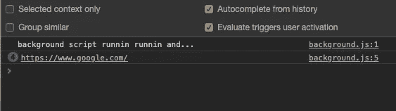

是谷歌！加载一个新网页，并查看记录到控制台的新 URL。

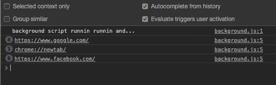

不错！

我们这一部分的目标首先是获取一个口袋妖怪，然后在我们加载的每个新页面上执行该操作。我们已经构建了等式的两边(我们的获取和我们的页面侦听器)。让我们把它们结合起来。

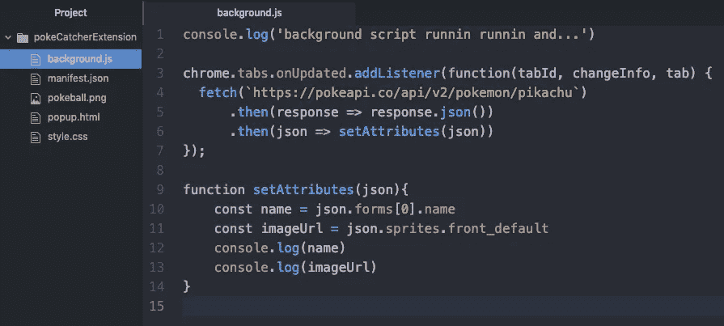

在扩展管理页面重新加载你的扩展，浏览几个网页。你的控制台应该充满了皮卡丘获取信息…

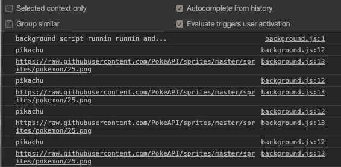

非常好。但是，尽管这很酷，我们不想在我们访问的每个页面上都看到皮卡丘。我们想要一个随机的口袋妖怪。让我们编写一个快速函数来从 PokeAPI 中检索任意一个口袋妖怪。

我们知道总共有 807 个口袋妖怪可供选择。快速浏览一下 PokeAPI 文档，我们了解到可以通过 ID 而不是名称进行搜索。即`/api/v2/pokemon/pikachu`与`api/v2/pokemon/25`相同。

随意创建一个从 1 到 807 的随机数生成器。我的心属于最初的 151 口袋妖怪，所以我将把我的随机数生成器限制为 1 到 151 之间的数字。

然后，我们将把这个数字插入到 fetch 调用的 URL 的最后一个空格中…

```
Random number generator: const pokemonId = Math.ceil(Math.random() * 151)
```

将`pokemonId`插入我们的获取并将其插入获取 URL。

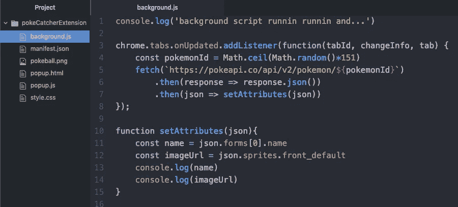

重新加载你的扩展和网上冲浪一点。你应该看到背景脚本每次都充满了新的口袋妖怪信息！！

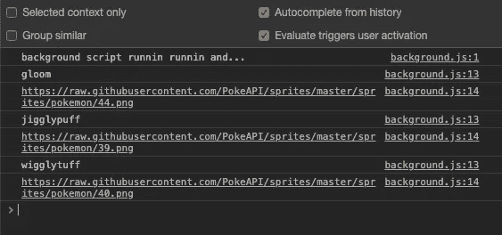

如果你做到了，那就太好了！我们刚刚完成了这一部分的目标:在每个新访问的站点的背景脚本中获取新的口袋妖怪。下一步:获取弹出窗口中的信息。

# 将口袋妖怪发送到弹出窗口

在上一篇文章中，我们能够从后台脚本向内容脚本发送消息。我们不能在这里这样做。弹出窗口实际上并不存在，直到你点击图标并强制迷你扩展窗口存在。

为了向弹出窗口发送消息，我们必须从弹出窗口*调用*到*后台脚本。*

以下是信息流:

1.  访问一个新的网页，后台脚本获取一个随机的口袋妖怪。
2.  将信息存储在可变变量中。
3.  打开弹出窗口并调用存储的信息。
4.  后台脚本接收调用，并发回它存储的口袋妖怪。
5.  Popup 收到口袋妖怪，并相应地改变它的外观。

我们完成了上一部分中的第一个问题。让我们快速解决第二个问题。

## 存储获取的口袋妖怪

不要把我们的`name`和`imageUrl`登录到控制台，让我们创建两个不断被新的口袋妖怪填充和替换的变量。

(让我们也削减脂肪和摆脱我们的控制台日志…)

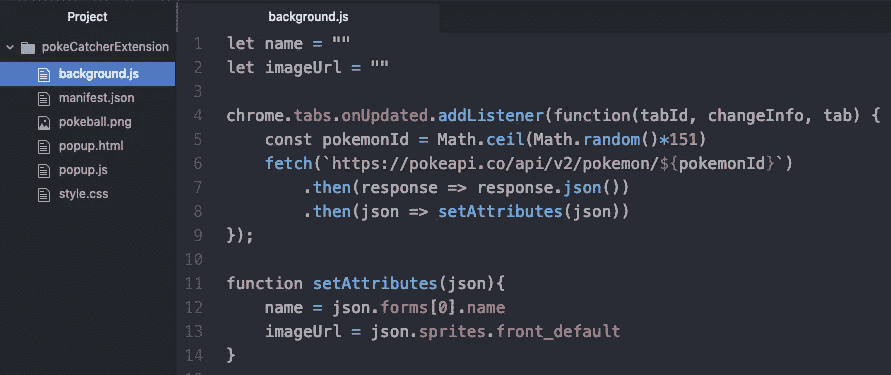

重新加载您的扩展，然后加载一个新网页或重新加载当前网页，并检查这两个变量是否会随着您的浏览而改变。

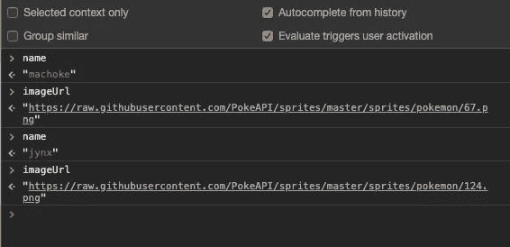

很好。现在让我们来看看弹出窗口。

## 从弹出窗口呼叫口袋妖怪

您会注意到现在唯一与弹出菜单相关的文件是`popup.html`。那不是逻辑的地方。让我们创建一个`popup.js`文件，将它链接到我们的 HTML，并用控制台日志测试它。

```
$ touch popup.js// Within popup.js =>console.log('popup script runnin runnin and...')
```

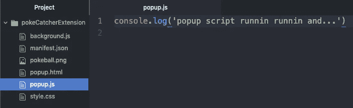

在我们的 HTML 中包含新脚本…

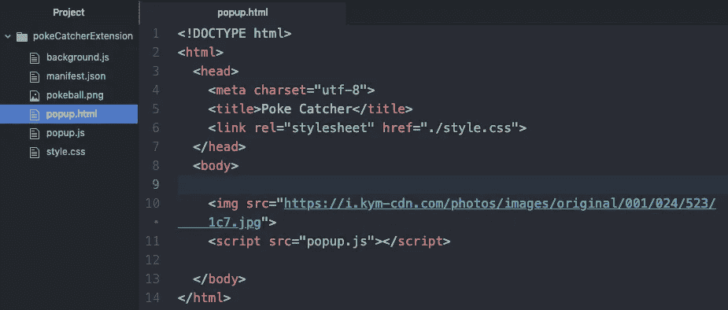

您可能认为我们需要将这个脚本包含在我们的清单中。我们没有！

这两者通过扩展的 HTML 页面间接相关。(与我们的样式表相同。)所以我们很好。Chrome 只要知道`popup.html`，就知道所有相关的样式表和脚本。

你现在已经出发了。单击扑克球图标。直接右键单击 HTML 并导航到 *inspect* 以检索弹出窗口的开发人员控制台。

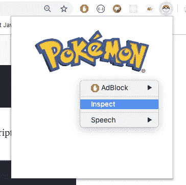

我们将立即看到我们写的`runnin runnin and…`日志…

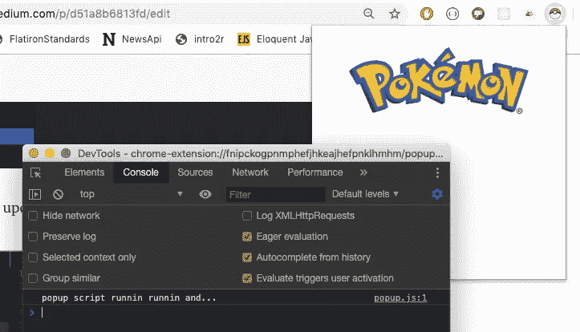

这意味着我们准备向后台脚本发送消息。为此，我们将使用一些 Chrome 语言。

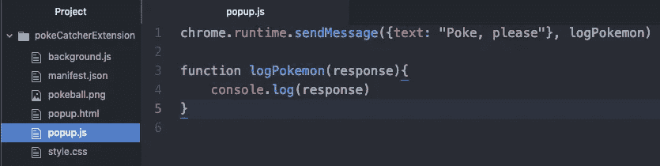

翻译过来就是:“chrome”，HTML 页面一加载，弹出窗口就“运行”，“发送”一条“消息到后台脚本。

该消息将是`“Poke, please”`，如果您从后台脚本得到响应，运行函数`logPokemon` *，*，该函数将控制台记录响应包含的任何消息。

如果我们单击扩展图标，什么也不会发生。我们的弹出脚本需要来自后台脚本的*响应*。现在让我们创建这个响应。


在上一节中，我们创建了两个变量:`name`和`imageUrl`。为了在 Chrome 网络上整齐地传递这些值，我们必须在一个对象内发送它们。注意，我们创建了一个对象`currentPokemon` 来实现这一点。

在前一篇文章中，我们已经使用了这种 Chrome-Speak 的确切形式。如果你需要翻译，就去找那篇文章。

重要的是，我们的后台脚本现在正在积极地监听消息。当它收到消息时，它将运行函数`sendPokeBack`*，将当前的口袋妖怪对象发送回发送者。*

*整个后台脚本现在看起来像这样:*

*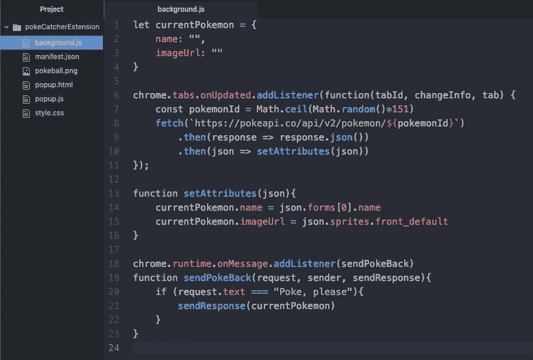*

***注意**我们在函数`setAttributes` *中改变了变量赋值的语法。*该函数现在与我们新配置的`currentPokemon` 对象*协同工作。**

*继续重新加载扩展，刷新页面，单击弹出窗口图标，并检查弹出窗口的控制台。您应该看到:*

*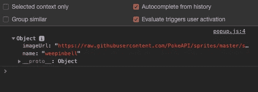*

*重复这个过程(减去重新加载扩展)，你应该得到另一个口袋妖怪…*

*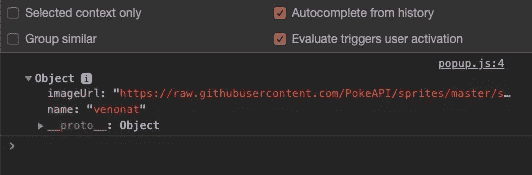*

*太好了。我们刚刚为两个不同的网站找回了两个不同的口袋妖怪。现在，这一部分的点睛之笔——在屏幕上显示它们！*

## *一只野生口袋妖怪出现了！*

*让我们从更新 HTML 文件开始，这样它就可以接收名称和图像了。*

*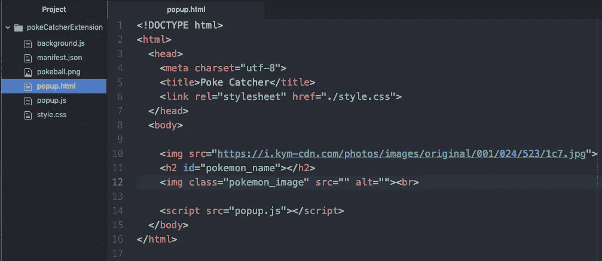*

*我们在体内创建了一个 h2 和一个图像标签。*

*注意:我对 img 使用了一个`class` ，对头部使用了一个`id` 。*

*现在，让我们编写脚本`popup.js` 在弹出窗口打开时为这两个标签填充值。*

*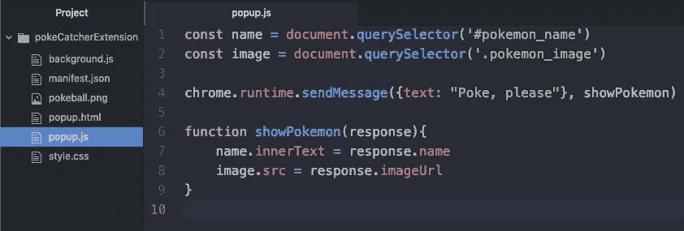*

*我把我们函数的名字从`logPokemon` 改成了`showPokemon` *，*这样更能说明问题。而且，我们不是记录文本，而是找到标题和图像，并用适当的口袋妖怪信息填充它们。*

*最终结果，加载两个不同的页面:*

*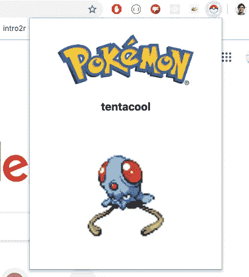**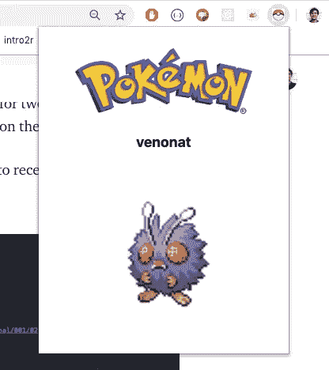*

*太棒了。更好的是，这标志着一个重要的检查点。*

*我们已经完成了困难的后台任务。我们在弹出脚本和背景页面之间进行无缝通信。捕捉口袋妖怪只需要一点本地存储魔法。*

*但在我们继续之前，让我们做一些快速造型。在我们的 CSS 中:*

*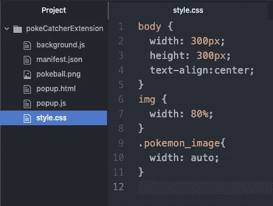*

*在我们的 JS 中:*

*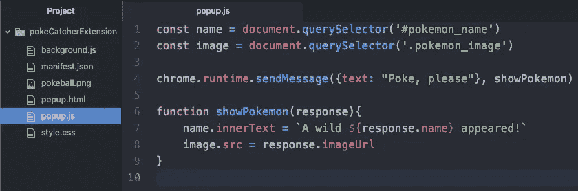*

*…这给了我们一些更合适的东西…*

**

*干得好。*

# *抓住他们！*

*至此，我们已经完成了所有的基础工作。扩展已经启动并运行。你可以一整天都碰到随机的口袋妖怪。但是如果没有*捕捉*的话，口袋妖怪捕捉扩展会是什么样的呢？*

*在这一节中，我们将使用我们扩展的`localStorage`来存储我们在野外遇到的口袋妖怪。*

*首先，让我们在我们的 HTML 中写一个`Catch!` 按钮。*

**

*移动到`popup.js`并编写一个脚本，当你点击新制作的`Catch!`按钮时，将当前的口袋妖怪存储在`localStorage`中…*

**

*如果我们点击按钮，野生口袋妖怪将保存到本地存储，屏幕上的文字将改变，以反映捕捉！*

*更妙的是，那个口袋妖怪跑不掉了。本地存储跨网页持续存在。即使你访问每个新页面都会遇到新的口袋妖怪，你的`localStorage`也会保持不变，直到被篡改。*

*下面是我们的`popup.js` 完整的样子…*

**

*当您打开弹出窗口时，您应该会看到…*

**

*按那个按钮！*

**

*通过检查弹出菜单来检查您的`localStorage`。*

**

*重新加载页面，运行到一个新的口袋妖怪，并看到你的 butterfree 坚持！*

**

*现在，点击“接住”！又来了。*

**

*克罗伊斯特是你的了！*

*这种数据持久性开启了一个充满机遇的世界。我们可以有一百万种选择。我们可以开始在我们的浏览器中构建口袋妖怪…口袋妖怪足够强大。*

*但现在，让我们只是添加一些肉汁，然后就到此为止。以下是我们应该添加到口袋妖怪捕捉扩展中的剩余功能:*

*   *我希望所有的口袋妖怪都有等级。(`background.js`)*
*   *我想看看我现在的口袋妖怪。(`popup.js`)*

## *生成级别*

*让我们从在后台脚本中生成 1 到 100 之间的等级开始。*

**

*我们可以使用完全相同的公式来生成随机数。*

*如果你想知道为什么我们在后台脚本中生成这些信息——我们这样做是为了防止每次打开弹出窗口时口袋妖怪的等级发生变化。*

*从后台接收的所有信息都是固定的，直到加载新的页面。否则，我们将能够停留在同一页面上，重复打开和关闭我们的弹出窗口，直到出现 100 级。不好。*

*有了新的关卡信息，我们的后台脚本相当于这样…*

**

*信息就在那里。现在我们需要展示它。在我们的`popup.html`中，在 h2 标题下添加一个 span 标签。*

**

*我们将改变这个跨度的内部文本，以反映口袋妖怪的水平。我们在我们的`popup.js` 文件中这样做。*

**

*在我们的`popup.js` *:* 的每个部分都添加了一个新的行:在页面顶部添加了一个新的`const`，在我们的`showPokemon` 函数中添加了一行来创建 span 的文本，并在我们的`localStorage` *函数中设置了一个新值。**

*您的弹出窗口现在应该呈现以下内容:*

**

*非常好。现在是我们项目的最后一步:展示我们目前的口袋妖怪。*

# *显示我储存的口袋妖怪*

*我们将这样解决这个问题:*

*   *在我们的 HTML 中添加一个新按钮。*
*   *在按钮下面添加一个隐藏区域，保存当前戳的信息。*
*   *在`popup.js` 中写一个函数，当我们点击按钮时，这个函数显示我们的戳。*

*我们从`popup.html`开始吧……*

**

*我们创建了一个`<button>`、容器`<div>`、`<h3>`和``。我们给了容器 div 一个`hide`类，我们需要在 CSS 中创建它。*

**

*我们还创建了`show`类。*

*我们现在需要指示我们的扩展在新按钮被按下时在隐藏和显示当前口袋妖怪容器之间切换。我们将在我们的`popup.js` 中使用这组新的函数和常数来完成这项工作。*

**

*注意:`(!!localStorage.pokemon)`条件仅仅检查口袋妖怪是否被存储。*

*将这段代码添加到我们的`popup.js`文件的其余部分，我们得到如下结果:*

**

*就是这样！是时候庆祝一下你的劳动成果了:*

# *结论*

*如果你能走到这一步，我为你鼓掌。我希望通过本教程的学习，您对未来的项目有了更多的想法。*

*在两篇文章中，我们学习了如何在弹出窗口、背景和网页之间进行交流。我们从扩展窗口中的 API 获取并显示信息。我们用`localStorage`来暂时保存我们的口袋妖怪遭遇。我认为这是一个很好的开始。*

*如果你需要一点鼓励，这里有一些有趣的想法供你参考:*

*   *尝试制作一个`localStorage` Pokedex，记录你在野外遇到的每一个口袋妖怪。*
*   *如果你想做大，试着通过创建你自己的 API 并在你浏览时发布给它来永久保存你的口袋妖怪遭遇——`localStorage`在你退出 Chrome 时会丢失它的信息，所以你的口袋妖怪很可能会在当前格式中消失。*

*就我而言，我目前正在开发一个扩展，让你在浏览网页的时候可以很容易地看到和理解网站的隐私政策。它叫做数据信任。睁大你的眼睛！*

*非常感谢阅读。随时检查这个项目的 [GitHub 回购](https://github.com/SwanHub/pokemonCatchingExtension)。*

*快乐编码，*

*杰克逊*