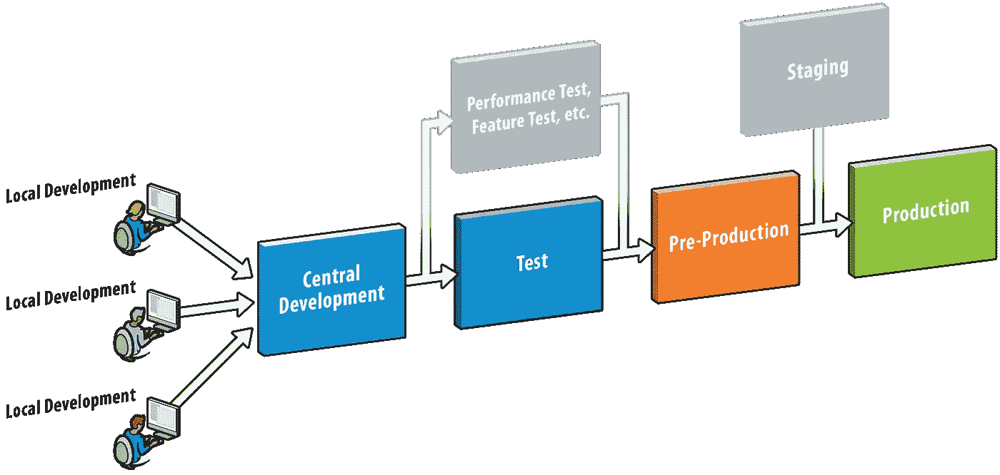
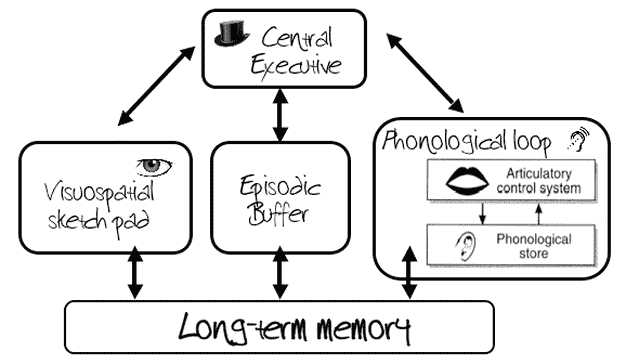
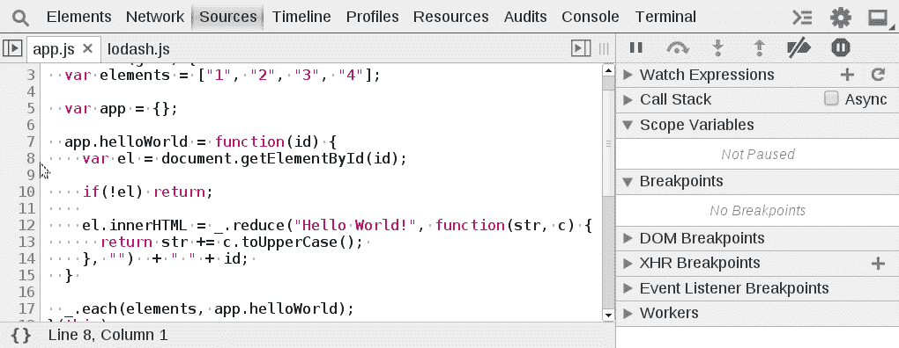

# “如果你能，抓住我”——调试指南

> 原文：<https://betterprogramming.pub/catch-me-if-you-can-a-guide-to-debugging-f4af08f6724d>

## 一个简短的，激励性的指南来调试你的可怕的生产问题

瑞安·昆塔尔在 [Unsplash](https://unsplash.com?utm_source=medium&utm_medium=referral) 上拍摄的照片

你的任务是找到一个在生产系统中出现的错误。

你已经盯着键盘看了几个小时，心里越来越怀疑自己是否适合软件工程职业；你一片空白。

你觉得自己像个骗子，一个冒牌货。

放松点。你不是这里的冒名顶替者，而是臭虫。

多年来，它一直愉快地扮演着系统中正常运转的一部分，但现在你要去寻找这个假货、这个欺诈、这个冒名顶替者，，而你不会屈服。

那么你从哪里开始呢？

# 重现问题

最起码，你需要能够解决问题并自信地重现它。一次又一次。

没有这个非常简单的步骤，你就不能测试你引入的改变是否产生了任何影响，你不能从系统中暴露出重要的线索，你甚至不能最终向其他人证明问题已经解决。

# 在您可以控制的环境中重现问题

这样就可以重现问题了？这是一个好的开始。但是，如果您只能在生产中重现问题，那么您在缩小问题来源的方法上就会受到一些限制。

希望您处于这样一种情况，您的组织有一个类似于生产的试运行、UAT、预生产或测试环境。

利用你的优势，试着重现你的问题。这将打开许多方法，您可以使用这些方法来获得更多的可见性和对您的问题的控制，您在生产中没有这种奢侈，或者至少没有能够快速做到这一点的奢侈。

这里有一些例子:

*   提高应用程序的日志记录级别。
*   应用程序的远程调试。
*   能够在常规质量检查之外发布应用程序代码的修改，以快速进行试验性更改。(我觉得这个应该只在紧急需要的时候行使，任何乱七八糟的东西你都要经常收拾。)
*   暂停或终止相邻进程，以确定事件流。

# 了解系统

每当你发现一个你不能立即解决的问题，用一个你认为你知道的系统，你需要面对事实。你并不像你想象的那样了解这个系统。

照片由来自[佩克斯](https://www.pexels.com/photo/man-in-white-shirt-using-macbook-pro-52608/?utm_content=attributionCopyText&utm_medium=referral&utm_source=pexels)的[蒂姆·高](https://www.pexels.com/@punttim?utm_content=attributionCopyText&utm_medium=referral&utm_source=pexels)拍摄

退一步，试着在高层次上引出系统。逐渐地、持续地把注意力集中在你正在处理的特定场景中最有可能成为罪魁祸首的部分。

# 简化问题

就拿你正在处理的问题来说，不要直接专注于解决问题，试着减少复杂性和你头脑中要记住的活动部分的数量。

我们是脆弱、多肉的生物，只有有限的储存和处理信息的能力[。让问题更容易消化。](https://onlinelibrary.wiley.com/doi/abs/10.1002/acp.2350020209)

在一个生产系统中，通过简单的不可辩驳的测试，消除那些不可能导致功能障碍的组件和行为。

最终，你会剩下一个更小更简单的问题去解决和理解。如果你继续这样做，你最终会找到解决办法的。

# 虫子不会自己消失！

哦，请不要陷入这种常见的逻辑谬误:“我可以在 20 分钟前重现它，我没有改变任何东西，但它似乎已经消失了。说不定就一去不复返了！”

如果有人发现了一个 bug，而你没有做出任何改变，并且在某些时候你不能重现它，那么它将再次发生。

# 隔离更改

如果您为了验证一个理论或引入一个潜在的修正而进行了更改，如果该更改没有效果，您应该立即回滚该更改。

不要在无效的变更上增加一个变更。你引入的一些东西一开始可能没有效果，但是如果你增加更多的变化，你最终会有一个更复杂、更混乱的问题需要解决。

更糟糕的是，你可能会错误地将一些行为上的变化归因于你引入的一个不相关的变化。不要这样做！隔离您的更改，并测试每个更改。

# 橡皮鸭调试

虽然有时会有这种感觉，但在一个你无法解决的问题上寻求帮助绝对没有什么不好意思的。

练习[橡皮鸭调试](https://medium.com/@elinkelink/rubber-ducky-debugging-the-new-buddy-system-5887f6766eb0):向另一个人解释你当前的问题，甚至是一个无生命的物体，让你集中思想，重新集中注意力。

有时候你还没有解决问题的原因恰恰是因为你专注于问题太久了，你掉进了兔子洞。

# 记录下你已经尝试过的一切

在高风险的复杂场景中，很容易忘记你已经为解决问题做了什么。你可能会在不知不觉中回到过去，重蹈覆辙。简单地记录下你到目前为止所做的每一件事，并继续下去。

你可能会想，“我什么都试过了，还是卡住了！”

你真的没有。将会有**一些事情**可以被做来强调你的问题的原因是什么。

你可能离问题太近了。你自己可能永远也想不出解决办法。但是你必须完全接受，可以做一些事情来突出问题是什么。你还没找到，你的工作就是找到它。

不要放弃。

# 学习新的调试技术

调试不仅仅是设置断点和期望最好的结果。有很多技术需要学习。一种值得注意的技术(尽管还有许多其他的)是使用**条件断点**:

[http://bl ittle . github . io/chrome-dev-tools/sources/conditional-breakpoints . html](http://blittle.github.io/chrome-dev-tools/sources/conditional-breakpoints.html)

与断点一样，您可以使程序暂停执行，但使用条件断点时，这只有在满足特定条件时才会发生。

这可以在追踪难以捉摸的错误时节省大量时间，因为当程序冻结时，您知道它是在您认为很重要的情况下发生的。

# 并不总是有明确的方法来解决这个问题

有时候你必须有创意。

# 最重要的是，定期休息

解决一个棘手的产品 bug 可能会很艰难，甚至会耗费精力。

出去走走，喝杯饮料，离开你的办公桌。现在就做吧。

有时候，让你的潜意识掌控方向盘，做一些离线处理，而你用其他事情分散注意力，会让世界变得不同。

如果你幸运的话，你可能会到达那个神奇的时刻…

# 你已经解决了！但这还没有结束。

## 你确定你已经解决了吗？

测试并重新测试您的修复。恢复到原始配置，并运行您的复制步骤。确认错误存在。应用您的更改，并再次运行复制步骤。确认臭虫已经走了。

再做一次。

## …你现在真的真的确定吗？

在经历了所有的痛苦和折磨之后，很容易忘记非常简单的确认步骤。不要给自己造成更多的心痛；在宣布问题已经解决之前，要对你的解决方案有信心。

## …哦，你现在绝对应该写一些测试

在产品中发现一个 bug 只意味着你的应用程序测试套件的一件事:它不够好，因为这个 bug 没有被及时发现。

利用现在的机会写一些测试来练习那个领域的代码，这样别人就不会再经历你刚刚经历的痛苦了。

…至少在另一个错误出现之前是这样！

希望你喜欢这个，它是有用的。

感谢阅读😁！