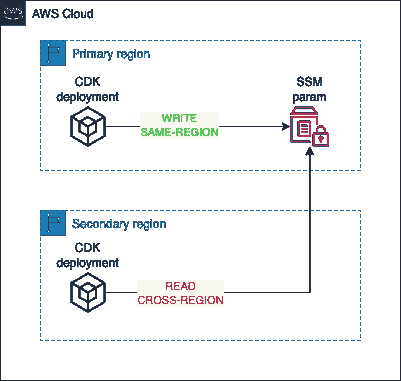

# 如何使用 CDK 自动气象站跨地区共享数据

> 原文：<https://betterprogramming.pub/cdk-and-the-sharing-of-cross-region-data-955925685e57>

## CDK 与跨区域数据共享

照片由[杰弗里·布鲁姆](https://unsplash.com/@jeffreyblum?utm_source=medium&utm_medium=referral)在 [Unsplash](https://unsplash.com?utm_source=medium&utm_medium=referral) 上拍摄

在构建跨区域部署 AWS 资源的 CDK 应用程序时，一个典型的挑战是如何以灵活可靠的方式共享信息。

例如，下图显示了跨区域部署期间的典型流程:

跨区域部署

您可能会尝试使用普通的 SSM 参数来编写:

和 SSM 参数查找:

这在单区域部署中非常好，但是在跨区域设置中就不行了，因为查找机制没有提供任何指定目标区域的方法。

底线，写机制还可以但是读需要改进支持跨区读。

# 提议的解决方案

我想到的克服这一限制的解决方案是实现一个 CDK 结构，用于以跨区域的方式读取 SSM 参数值:

这个框架实现基于两个可用的 CDK 结构:

*   [AwsCustomResource](https://docs.aws.amazon.com/cdk/api/v2/docs/aws-cdk-lib.custom_resources.AwsCustomResource.html) ，这是一个高级 API，简化了 CloudFormation 定制资源的实现，包括底层 Lambda 函数的实现
*   AwsSdkCall ，它是对 AWS 服务的单独调用的包装器

在这种情况下，`AwsCustomResource`管理定制资源的生命周期，而它的实现基于`AwsSdkCall`作为`SSM.GetParameter` API 的包装器。

使用这个构造非常简单，如下所示:

只需注意 region 参数，您可以在其中指定该参数所在的区域。

这样，您可以很容易地跨区域读取 SSM 参数值。