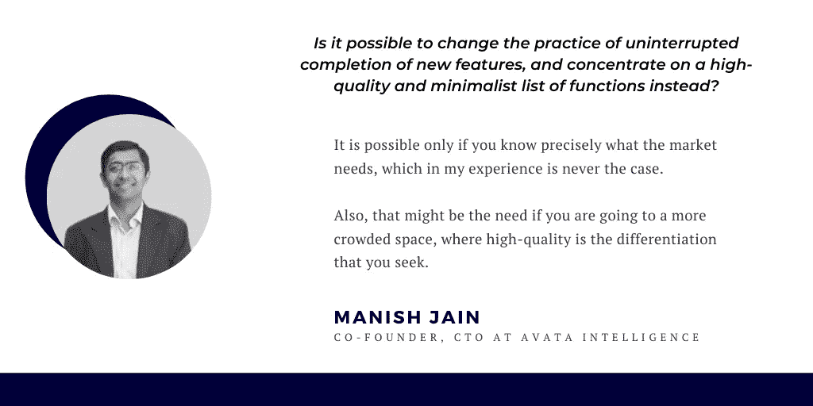
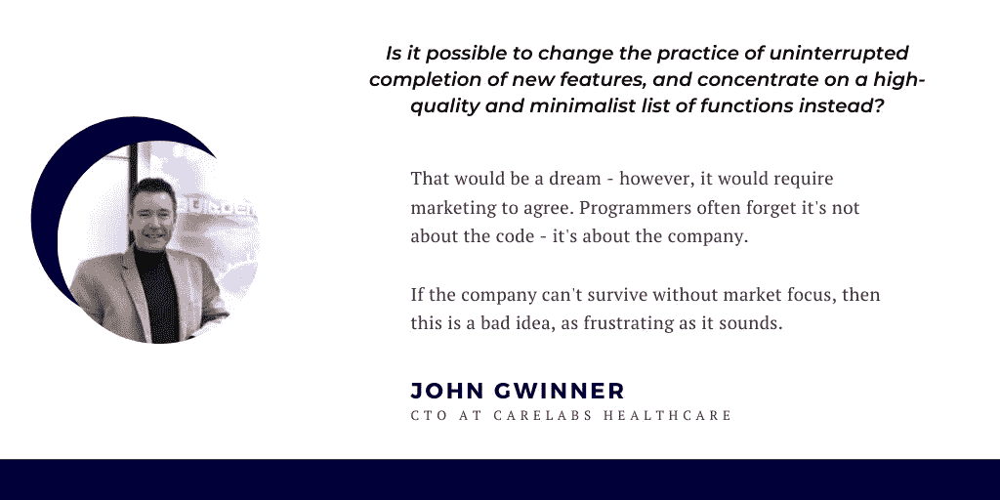

# CEO vs CTO:什么是技术债，在创业公司里谁负责？

> 原文：<https://betterprogramming.pub/ceo-vs-cto-who-should-be-responsible-for-technical-debt-a5fb6f3adccc>

## 大多数公司面临的内部冲突

# 介绍

隐喻性的技术债务概念已经成为商业环境中的时髦词汇。这个概念是最著名的科技公司的首席技术官辞职的最常见原因之一。

为了正确理解技术债务现象，我们需要使用债务的经济学定义。

# 什么是债务？

那么，哪一个更好呢:用自己的钱买东西还是使用信用卡，从而产生债务？当然，不负债、不向银行支付利息似乎更安全。然而，如果你想进行更有意义的投资，你需要突破预算。那一刻，你需要做出正确的决定。投资值得吗？如果是积极的，那么你可以产生债务，解决你的问题，并在最近的将来偿还债务。

技术债务也是如此。你的目标是生产某种产品。您快速部署它，包括所有必要的特性，结果就准备好了。

然而，代码库中的模块结构令人困惑。这就是一切的开始。

# 问题是如何处理这个烂摊子？

清理模块结构，移除碎片，需要几天时间。

所以，也许你不应该浪费额外的时间。如果工作人员将有一个新的任务来增加一些功能，你可以使产品对用户更有吸引力。

我们是应该将这个特性添加到现有的、不清楚的代码中，浪费五天时间，还是先清除代码，浪费五天时间，只是为了能够适当地添加新特性？

几乎每个 CTO 都会坚持这样一个事实，即首先清理结构是至关重要的。

然而，时间就是金钱。通常一个公司需要尽快完成工作。猜猜高层会做出什么决定？(考虑到他们最初的目标是增长利润)。

一点不错！在大多数情况下，他们希望工作人员在五天内完成新功能，而不是八天。

另一方面，我们必须明白整个公司都在还债。该公司通过在五天内发布产品来偿还债务，而不是八天。在那之后，管理层制定了一个在不久的将来部署新功能的计划。

此时，代码的模块化结构会出现更多的问题。现在，添加新功能需要六天时间才能解决问题。

# 神圣的圆圈

我们又面临老问题了。公司必须再次做出决定。浪费点时间清码？还是只是瞬间增加一个功能？

技术债增长。也许我们可以通过尽快实现我们的产品来支付它？也许吧。

事实是，与最终修复整个结构所浪费的资源相比，早期部署带来的短期收益微不足道。

如果我们一开始就投入额外的几天，情况会完全不同。

# CTO vs. CEO:真相在中间

我是一名首席执行官，当然，我的动机是创造利润。但是，我肯定想做长跑。我意识到公司不仅仅是一个企业。这是一个专业团队，他们应该有一个合适的环境来完成他们的工作。

这就是为什么我想更好地研究这个问题，并问其他 CTO 几个问题。以下是好心同意帮助我的科技摇滚明星:

1.  Hempchain 首席执行官/首席技术官 Mark Anthony Morris 。
2.  [马尼什·贾恩](https://www.linkedin.com/in/avata-manish-jain/)，Avata Intelligence 联合创始人兼首席技术官。
3.  [care labs health care 的首席技术官 John Gwinner](https://www.linkedin.com/in/johngwinner/) 。

# 以下是我从这些采访中得到的结果

## ***1。你如何在你的业务需求和开发团队的能力之间找到平衡？最大的问题是什么？***

> “外包。保持客户的关注和产品质量。”— [马克·安东尼·莫里斯](https://www.linkedin.com/in/markmorrissupergeek/)，Hempchain 首席执行官/首席技术官
> 
> 当我们面临这个问题时，往往是因为业务需求相互冲突。
> 
> 为了让客户满意，他们希望对定制功能说“是”(即更多开发)。然后，业务需求是拥有多个客户和更少的部署时间(即平台式 COTS 解决方案)。
> 
> 当我们面对这些问题时，是关于讨论焦点、短期与中期需求，然后做出决定。
> 
> 最大的问题是不确定性——我们不知道会有多少客户，也不知道一个客户的快乐对现金流有多重要，这就产生了压力和冲突。— [Manish Jain](https://www.linkedin.com/in/avata-manish-jain/) ，Avata Intelligence 联合创始人兼首席技术官
> 
> 企业通常认为开发很容易。有人问:“你终于做完了吗？”我问他们做这件事需要多长时间。“我做不到”。我问他们为什么认为可以估算出来。他们终于考虑周到了。—[care labs health care 的首席技术官 John Gwinner](https://www.linkedin.com/in/johngwinner/)

## *2。快速发布一个新特性而没有足够重视它在整体架构中的集成，这值得吗？在什么情况下可以做到这一点？*

> 在我看来，为了演示/MVP 的目的，快速发布一个新功能是值得的，只是为了将客户添加到业务的管道中。如果整体设计合理分布，使用正确的微服务/无服务器组件，人们也可以不太关注集成。
> 
> 否则，如果企业依赖于一两个客户的幸福，你就要根据他们的需求来做事。— [Manish Jain](https://www.linkedin.com/in/avata-manish-jain/) ，Avata Intelligence 联合创始人兼首席技术官
> 
> 很少几次。你要么会打破一些东西，要么需要更多的返工，这可能是破坏性的。然而，如果对数据模型没有任何影响，或者它是独立的，并且让用户满意，那么就去做吧！
> 
> 一切都是为了用户。—[care labs health care 的首席技术官 John Gwinner](https://www.linkedin.com/in/johngwinner/)

## *3。有时候产品部署的事实真的比它的质量更重要吗？为什么？*

> 从来没有。垃圾会毁了你。你必须痴迷于客户，只提供质量或不提供任何东西。— [马克·安东尼·莫里斯](https://www.linkedin.com/in/markmorrissupergeek/)，汉普钦首席执行官/首席技术官
> 
> 是的，如果整体设计合理分布，使用正确的微服务/无服务器组件。— [Manish Jain](https://www.linkedin.com/in/avata-manish-jain/) ，Avata Intelligence 联合创始人兼首席技术官
> 
> 很少——但可能是为了证明概念。—[care labs health care 的首席技术官 John Gwinner](https://www.linkedin.com/in/johngwinner/)

## *4。如果公司已经将任务设定在准确的时间完成，但开发人员警告截止日期太快，那么谁应该为低质量的产品负责？*

> 这种情况永远不应该发生，这是一个注定要失败和病态的公司的症状——解决这一问题的根本原因，无论是更换管理层还是所用的系统和流程。— [马克·安东尼·莫里斯](https://www.linkedin.com/in/markmorrissupergeek/)，汉普钦首席执行官/首席技术官
> 
> 作为首席技术官，我在开发和管理方面都有自己的视野。我认为责任在我，因为我是唯一一个需要理解双方的人。— [Manish Jain](https://www.linkedin.com/in/avata-manish-jain/) ，Avata Intelligence 联合创始人兼首席技术官
> 
> 管理。然而，开发者经常受到指责。—[care labs health care 的首席技术官 John Gwinner](https://www.linkedin.com/in/johngwinner/)

## *5。有没有可能改变不间断完成新功能的做法，转而专注于高质量和极简的功能列表？*

> 是的，先进的 CI/CD 管道和产品团队可以通过先进的集成人工智能代理推动连续的功能流并促进结果，这些代理控制元素的传输、接收、质量、有效性和效率，无论是页面布局、颜色、内容、逻辑，还是客户体验和公司目标的任何其他功能或非功能方面。—[hemp chain 首席执行官/首席技术官 Mark Anthony Morris](https://www.linkedin.com/in/markmorrissupergeek/)

# 收到这些答案后，我想做出我的结论

首先，我们可以看到问题是绝对自然的。
公司希望有更多的客户来生存。没人知道明天会有多少客户来。这就是为什么抓住更多的功能是自然的。

结果，整个团队确保一切顺利进行的时间减少了。

而且，公司希望善待每一个客户，因为你永远不知道什么最让用户满意。这就是为什么你试图做客户想要的一切。最短时间内的每一个愚蠢的功能。

我认为公司必须从一开始就建立合作伙伴关系。如果你是一家初创公司，你失去的东西会更少。这时，试着向每一个客户解释，有时候你知道得更清楚。仅仅因为这是你的工作。你会看到，这是绝对可以的。

## 快但不要太快

快速发展是好事。尝试快速实现新功能，尤其是演示版或测试版。客户必须意识到它还不完美。

之后你会有一段时间做稳定版。这是一个如何在市场需求和技术可能性之间找到平衡的好主意。

此外，你必须开发一个合适的产品愿景。因为做软件永远是为了满足用户需求，赢得市场。

## 没有万能的答案

第三个问题最矛盾。答案对一个人来说是显而易见的，但在一般情况下并不明显。在我看来，在这一点上，一个人必须依靠自己的经验。

由于我的第四个问题也有点挑衅，我得到了非常不同的答案。然而，我的结论很简单。如果你发现有什么不对劲，那就想办法解决。你的工作必须做得完美。如果结果不好——双方都必须解决问题。最坏的情况是管理层因为有指责的权力而指责开发者。

# 摘要

作为一家企业，你必须以客户为导向。而且，你还要盈利。努力实现你的客户想要的一切。尽量快点做。然而，确保你有足够的时间让你的产品可持续发展，不要害怕向用户解释当你真正需要的时候你需要额外的时间。

最后，自然一点。记住，客户非常重要。但是你的工作也很重要。公司很重要，但每个员工也很重要。

如果你记住这一点，就更容易在每个人的需求之间找到平衡。

去吧，祝你好运！