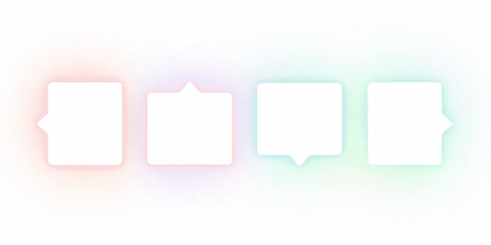
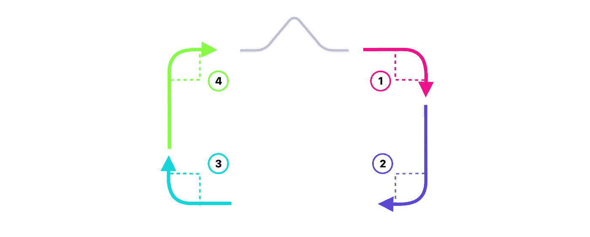
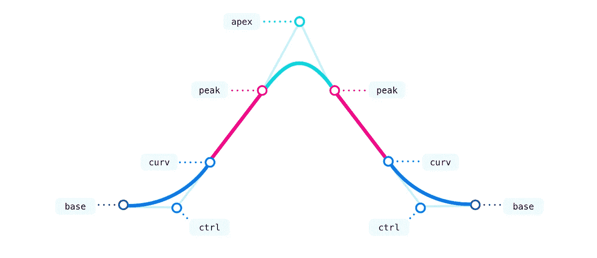
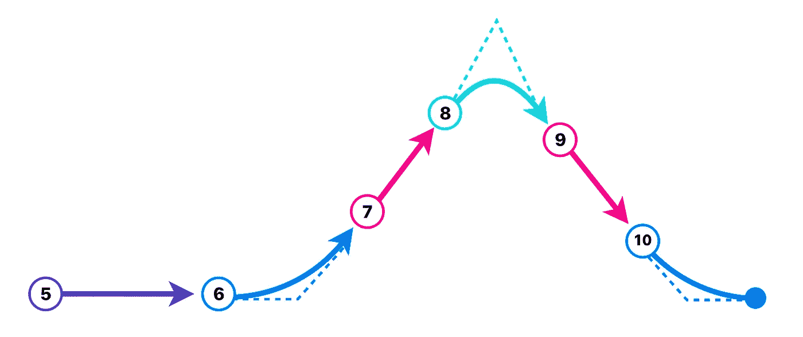
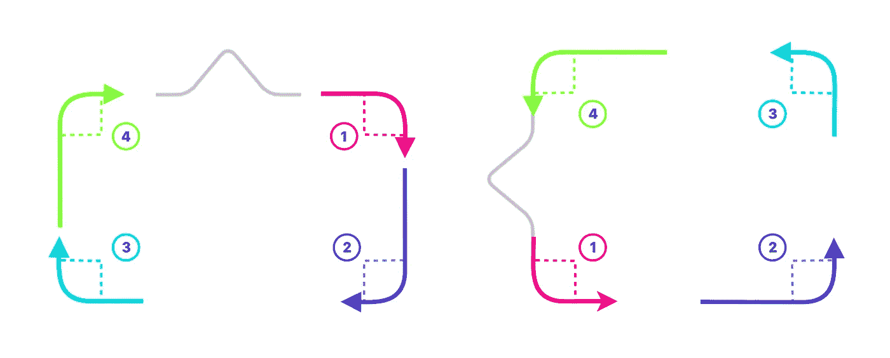
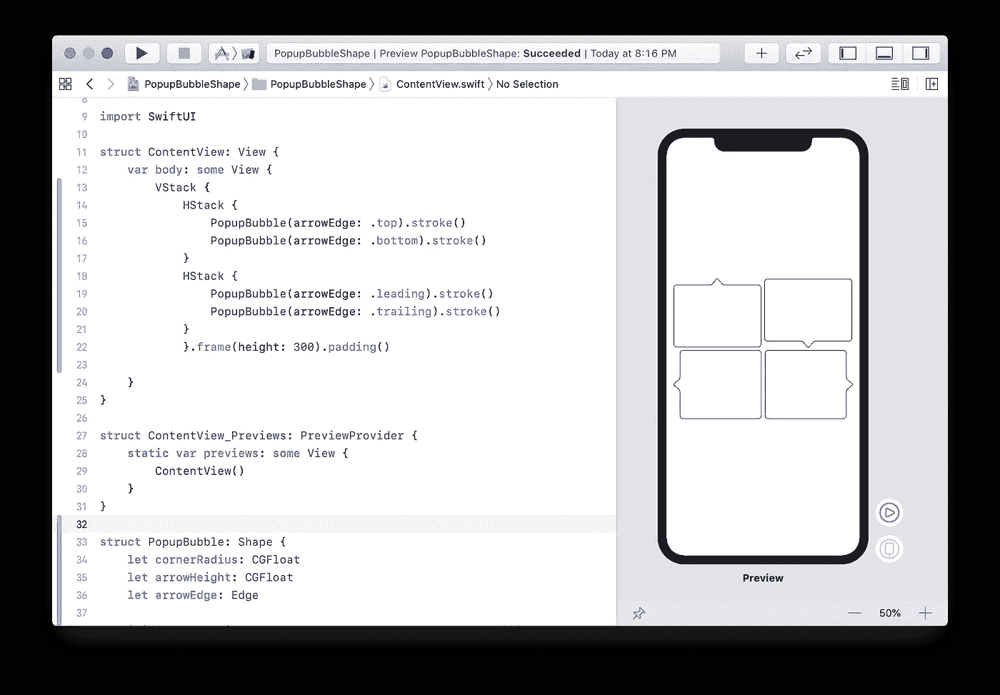

# SwiftUI 中的 cgaffinite 变换、圆弧和四次曲线

> 原文：<https://betterprogramming.pub/cgaffinetransforms-arcs-and-quad-curves-in-swiftui-41e1dbfe6161>

## 让创建自定义形状不那么令人生畏

我最近发现自己需要一个可定制的弹出气泡，可以指向上、下、左或右。看起来相对简单的事情最终变成了一个大难题。单独画矩形的圆角是绝对痛苦的。因为我可能不是第一个尝试这样做的人，所以我决定分享这个关于绘制弹出气泡的教程——希望能让一些读者省心。

# 入门指南

让我们声明一个名为`PopupBubble`的形状，并添加一些可定制的属性。

几乎所有前进的东西都在我们的`path(in rect:)`函数中。为了启动这个函数，我们将设置一些变量。前两个，`rect` 和`fit(CGPoint)` *，*将在本教程稍后相关。我们还为箭头大小创建了一个属性。请注意，用于计算箭头宽度的权重可以根据您的喜好进行调整。我发现 811/2000 的比例最符合我想要达到的外观。

我们将首先绘制圆角矩形来开始我们的路径。这将在四个弧段中完成。下面显示了我们正在绘制的弧的顺序以及它们相应的开始和结束角度。

虚线在弧的中心点相交。

*看起来像顺时针方向的圆弧* ***并不是 SwiftUI 中的*** *一条。*

如果你正从上述角度思考，不知道它到底有什么意义——省省力气吧。它们只有在翻转 Y 坐标平面并减去 90 度(0.5*pi 弧度)时才有意义。由于我们稍后将调换飞机，我选择让角度保持原样。

现在我们可以开始绘制我们的路径。请务必将我们绘制的任何`*C*GPoint`包含在我们的 fit 函数中。

现在我们的圆角矩形完成了，让我们继续画箭头。

# 画箭头

我们首先需要的是一些权重，可以应用到箭头的高度和宽度来计算箭头的路径。这样，箭头的形状将在不同的箭头高度上保持一致。下面是我使用的权重，以及描述这些权重将调整的点的图表。

我们的箭头路径中的每个重量都是通过简单地插入不同的重量来计算的，直到它看起来像我想要的那样。

现在，让我们继续绘制线段。下图显示了我们将要绘制的不同部分。如您所见，步骤 6、8 和 10 是四次曲线(控制点用虚线表示)。剩余的线段是简单的线段。第十步，完成我们的路径。

这就完成了一个指向顶部边缘的弹出气泡。最难的部分完成了！现在，让我们修改这个泡泡，这样我们也可以选择其他的边。

# 创建动态箭头边缘

不要为每条边绘制新的弹出气泡，让我们简单地调整进入每个气泡路径的变量，然后应用给定特定边的变换。

为了保持形状的角和箭头的纵横比，我们需要绘制一个箭头在前沿的弹出气泡。为此，我们将翻转输入`rect`的原点和大小。让我们更新我们的`rect`变量和`fit(CGPoint)`函数来转置这些值。回到我们的`path(in rect:)`函数的顶部，在我们声明路径之前，在我们的属性末尾添加以下内容:

改变我们的路径`rect`需要改变我们的弧线角度。下图显示了每一步的顺序和角度方向的变化。

正如你在上面看到的，我们的第一个角度现在看起来像我们之前的第三个角度在相反的方向移动。我们的第二个角度看起来像我们之前的第二个角度在相反的方向移动。让我们更新我们的 arc 变量来反映这些变化。

此时，您应该能够显示一个弹出气泡形状，其箭头位于前缘或顶部边缘。

# 最后的步骤

如果`arrowEdge`设置为`.trailing`或`*.bottom*`，让我们通过添加一些简单的变换来翻转弹出气泡的方向来完成我们的形状。用下面的代码替换我们函数的最后一行:

这就完成了我们的定制形状！让我们更新我们的`ContentView`来看看它的运行情况:

我希望你喜欢这个教程！