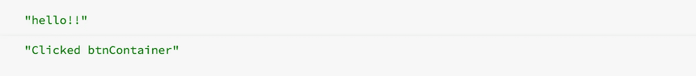
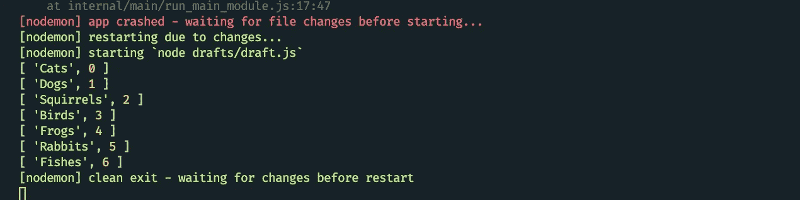

# JavaScript 中的责任链

> 原文：<https://betterprogramming.pub/chain-of-responsibility-in-javascript-21942601ed9c>

## 运行一系列功能

由[卡利·戴克斯特拉](https://unsplash.com/@kaleyloved?utm_source=unsplash&utm_medium=referral&utm_content=creditCopyText)在 [Unsplash](https://unsplash.com/) 拍摄的照片。

了解设计模式在软件行业至关重要，因为它们已经被证明可以解决商业应用中的实际问题。例如，发布/订阅是在 [DOM](https://dom.spec.whatwg.org/) 中广泛使用的一种常见模式。命令模式在 [Redux](https://redux.js.org/introduction/getting-started) 中使用，Redux 因其独特、健壮、简单的管理应用程序状态的能力而在短时间内蓬勃发展，并且具有很强的可伸缩性。

设计模式的有趣之处在于，它们不是万能的解决方案。在不同的情况下，一些设计模式可能比其他模式更有效，这取决于开发人员决定何时以及如何在他们的应用程序中最有效地使用它们。

在本文中，我们将通过实现一个责任链设计模式并涵盖一些用例来回顾它。

责任链(COR)是一种允许多个对象发送、接收和处理某些请求的模式。这些对象(仅仅是函数)不依赖于前一个或下一个请求的实现细节，并且可以决定在执行期间以那种方式做什么。它们提供了一些直观的有用能力。这些能力包括决定中止或继续链，构建中间件管道，等等。

下面是 DOM 中使用的模式的一个例子:

当您单击该按钮时，将调用附加到该按钮的侦听器。当函数结束时，“请求”被传递(或*冒泡*)给它的父函数:

它可以通过调用`e.stopPropagation()`来决定阻止它继续(或冒泡)到它的父节点:

没有真正的“官方”或正确的方法来实现这种模式。只要这些功能能够以可控和可预测的方式一个接一个地连接起来，你就处于良好的状态。不过，一般来说，有两个主要角色可以定义它:

1.  处理程序—确定处理请求的接口。它还处理链中链接在一起的请求。
2.  客户端—向链中的处理程序发起请求。

下面是取自[要点](https://gist.github.com/drenther/f05534658c3cb8c3d1f266a536bd1fd6)的模式的变体:

当`add`函数返回`this`时，出现该链:

这意味着它可以根据我们的需要被重新调用，因为实例在调用结束时再次被返回:

如何中断或继续该链的责任被赋予每个`add`功能块。在我们的例子中，我们有一个`add`方法，它以一种方式对其值求和:

在`add`方法内部发生的事情可以是字面上的*任何事情*，并且它不必依赖于其函数范围之外的任何事情。例如，我们可以利用 API 请求链，链中的每个请求都可以使用自己的逻辑计算新的总和，并将前一个总和的结果传递给链中有兴趣使用它的下一个函数。

假设我们在一个场景中，从我们想象的仓库中出售宠物。我们需要对我们仓库中所有在售的宠物进行汇总，这样我们就可以确定，由于全州范围内的紧急居家订单，我们是否需要比平时更早地重新进货。我们这样做是因为我们预计在接下来的几个月里，像狗和猫这样的普通宠物的销量将会激增:

我们的扩展`CumulativeSum`实现了相同的目标，但是它现在允许我们定制*如何*确定下一个总和的行为。

下面，我们有一个保存总和的`PetSum`类。它将有自己的`add`方法，通过调用它的`add`方法来启动任何`CumulativeSum`(这将调用链接在它之后的所有请求链)。如果您还记得本文开头的话，术语“处理程序”就是我们下面的`PetSum`:

这里有一个例子，其中创建了四个`CumulativeSums`并将它们链接在一起，每个代表一个不同的动物物种，因为我们的仓库有多个物种:

它们中的每一个都有自己计算物种总数的方式，甚至选择什么都不做:

要得到总数，需要做的就是在其中一个实例上调用`add`方法:

看到这有多简单了吗？

我们可以从中间的一个实例开始请求链。例如，我们可以只从狗开始，忘记猫(记住`catsStorage`是第一个请求，但是我们可以只从`dogsStorage`开始，并从那里继续请求链):

当我们想要随时关闭一个或另一个开关时，这是很有用的，例如当客户预约在某一天(例如 3 月 23 日下午 1-2 点)购买我们所有的松鼠时:

如果你熟悉[链表](https://www.geeksforgeeks.org/data-structures/linked-list/)的数据结构，你可能会意识到它们惊人的相似。他们就是！你可以用链表做的任何操作也可以在我们的例子中完成。我们可以遍历链中的每个函数——包括向后——也可以在每个函数上附加类似于`prev`(对于 previous)属性的东西:

结果是:

# 真实世界的场景

1.  咖啡机——咖啡机可以用 COR 模式编程，其中链中的每个请求/处理程序定义一个单独的成分添加到机器中。流程与我们今天制作咖啡的方式非常相似，我们可以随时停止添加配料，或者选择继续添加浓缩咖啡、牛奶、杏仁屑等配料。
2.  ATM 机—当选择以 20 美元的钞票提取 100 美元时，机器会分发 5 张 20 美元的钞票，直到达到要求的金额。这就是手术结束的时间。
3.  transformers——在一些定制的 AST 中使用一系列的 transformer/parser(我在写这篇文章的时候刚刚想到这一点，所以这不是一个完整的经过实战测试或优化的代码，但是我运行了代码，它工作得很好):

结果是:

在我们所有的 transformer 函数中，我们调用`next`回调，这是我们创建的一个函数，用于调用链中的下一个函数。

我们可以选择在函数中的任何时候不继续这个链。例如，如果`textAlign`不是一个对象(对象在 DOM 元素中是无效的)，我们可以在调用`handleAlign`函数之前停止:

# 结论

本文到此结束！我希望你发现这是有价值的。以后多多关照！