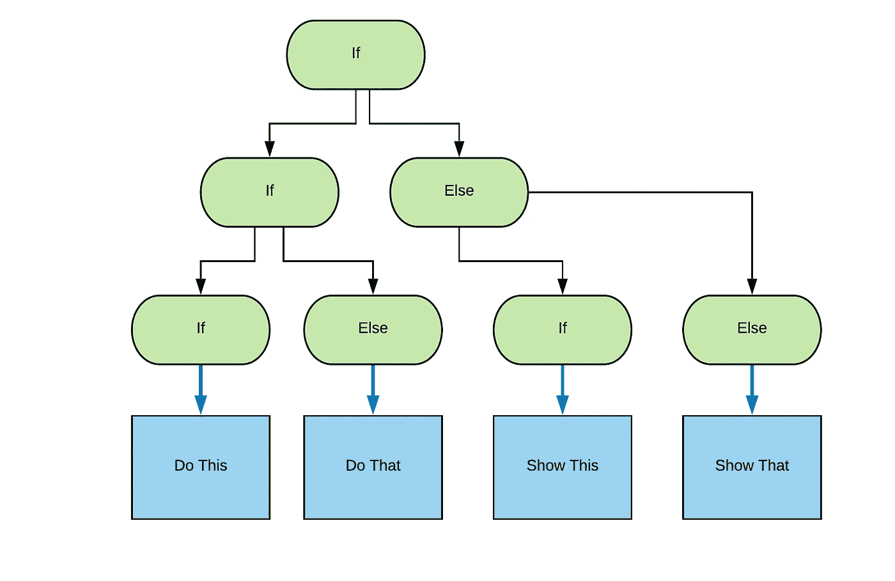
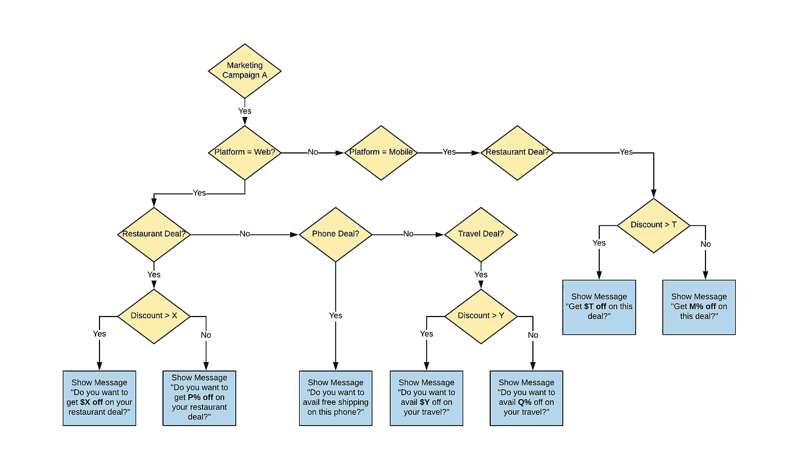
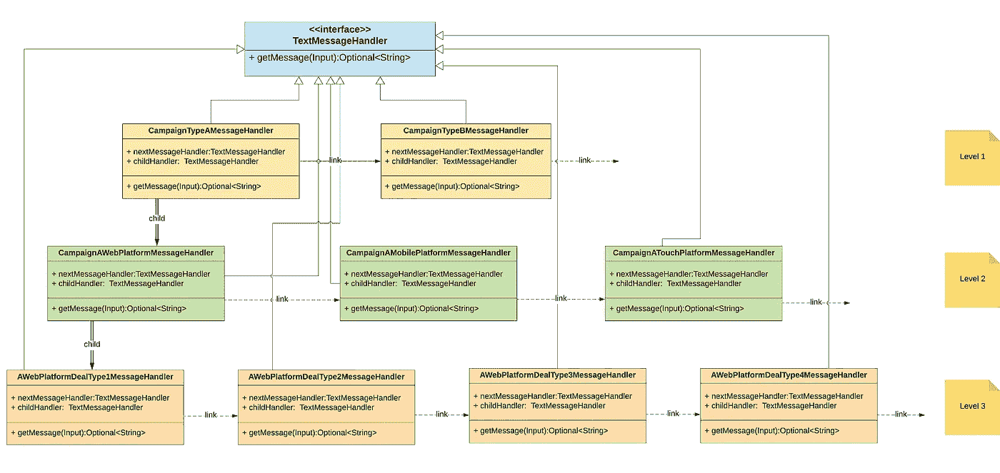
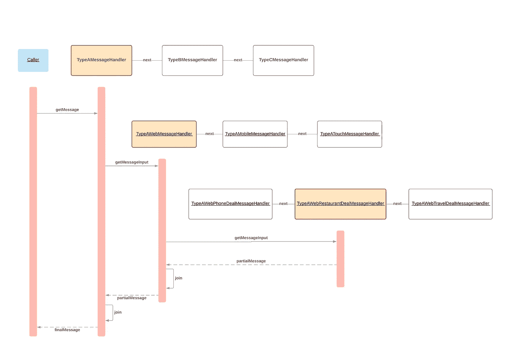
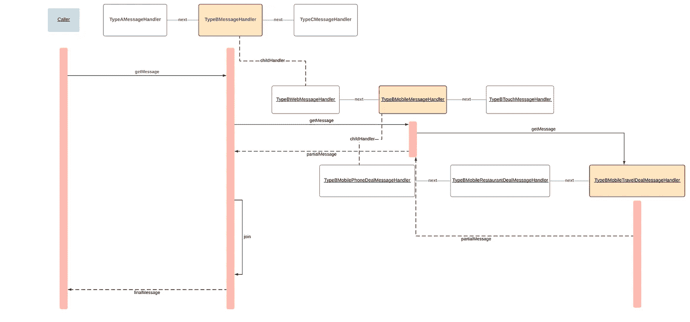

# 救援的责任链

> 原文：<https://betterprogramming.pub/chain-of-responsibility-to-the-rescue-2288471c783b>

## 在 OO 代码中避免嵌套 if-else 语句

供图— [Unsplash](https://unsplash.com/photos/zlerWtnneUE)

作为程序员，我们经常需要编写条件句或它们的组合。

例如:

*   *如果条件 A 被满足，那么做一些事情*
*   *如果满足条件 A 和条件 B，则执行其他操作*
*   *如果满足条件 A 且满足条件 C，执行一些不同的动作*

看着眼熟？我们都多次看到过类似上述的产品需求。下图从更一般的意义上说明了这一点:

绿色方框显示条件句，而蓝色方框显示结束动作

考虑到开发人员总是处于赶时间的压力之下，我们最终可能会做出妥协(大多是无意的)来完成工作。

我们可能想把上面的代码块写成这样:

虽然这可能会起作用并快速解决手头的问题，但扩展它可能不太容易。(此外，测试并确保覆盖所有分支可能并不容易。)

if-then-else 中任何新的嵌套条件或更多的逻辑操作符都会很快使开发、测试和维护变成一场噩梦。即使对于一个三级嵌套的条件块，也很难说代码在如此多的分支下会可靠地工作。

添加空支票、空白输入等。这可能很快变得难以控制。

# 最近的挑战

最近，我有机会开发一个产品特性，我遇到了与上面类似的情况。

要求是根据此图中描述的各种条件向最终用户显示不同的文本消息:

上图显示了条件的嵌套以及它给一种营销活动带来的复杂性。

随着更多营销活动的加入，这将变得更加复杂。

# 解决方案——幼稚的方法

简单的解决方案与上面的代码片段一致:

只关注代码的关键。为简洁起见，省略了其他细节

## 赞成的意见

*   快速实施。
*   如果嵌套最多限制在两到三层，效果会很好。

## 骗局

*   违反 [*开闭原则*](https://en.wikipedia.org/wiki/Open%E2%80%93closed_principle) :任何新的嵌套或对等条件都需要更改上面的代码片段。
*   违反了 [*单一责任原则*](https://en.wikipedia.org/wiki/Single_responsibility_principle) :类/方法做了不止一件事，需要更改的原因不止一个。例如:新活动类型、新交易类型或消息模式等。
*   违反*关注点分离*:位于同一位置的所有关注点不允许有机扩展。
*   很难维护，需要仔细地观察以确保所有的代码分支都经过测试。

显然，我们需要做得更好。

# 解答—带开关盒

可以使用`switch` case 对上面的代码进行改进。

# 赞成的意见

*   如果使用可切换变量，代码的组织会稍微好一点。
*   每一个功能的改变都只有一个原因。

# 骗局

*   随着案例数量的增加，很难保持代码的完整性。(`Deal Types`更频繁地映射到各种垂直领域，过多的 switch-case 语句会使功能变得混乱。
*   Switch 语句是反面向对象的，尤其是在不属于该类的数据上执行 switch 时。
*   代码仍然是紧密耦合的，因为每个功能仍然知道太多关于其子功能的信息(例如，web 平台知道交易类型，因此任何新的交易类型通常都需要更改 web 和移动平台功能。)

# 解决方案——分级责任链

在探索解决这个问题的方法时，我偶然发现了古老的责任链(COR)模式。

COR 通常不需要一个中央指挥器来演奏条件音乐。

> *责任链是* `*if ... else if ... else if ....... else ... endif*` *习语的面向对象版本，其优点是条件-动作块可以在运行时动态重新安排和重新配置。*
> 
> ***—维基百科***

这肯定是接近我正在寻找的。COR 模式非常适用于同一级别的条件句。

然而，仔细观察上面的图表可以发现，这个用例有一个层次结构。这意味着需要多级 COR。

类名说明了这个概念。

我们从一个接口`TextMessageHandler` 开始，它接受计算要显示的消息所需的特定输入。输入是包含与活动`type`、`platform`、`dealType`等相关的所有信息的任何对象。

是时候写点代码了。让我们将 COR 应用到各个层面:

## *级别 1:活动类型处理程序*

## 级别 2:平台类型处理程序

让我们来看看活动类型 A (Web 平台)的第 2 级处理程序的示例。

可以根据平台参数为移动消息编写类似的处理程序类:

## 第 3 级:交易类型处理者

活动类型 A、网络平台和交易类型的第 3 级处理程序示例:餐馆。

让我们看看上述消息处理程序的不同组合如何帮助我们为所需的活动-平台-交易组合构建正确的消息。

*   活动类型:A
*   平台:Web
*   交易类型:餐厅

使用的类被突出显示。注意每一层的链接。

*   活动类型:B
*   平台:移动
*   交易类型:旅行

两个示例都显示了使用`next` 和`child`指针来提取显示给客户端的消息，从而遍历`MessageHandler` 层次结构。

## 赞成的意见

*   没有杂乱的代码来实现多级 if-then-else。
*   在不干扰现有结构的情况下，可以轻松添加任意数量的级别。向一个级别添加更多的处理程序很简单(经典 COR)。
*   每一层都有助于整体的局部构建(在上面的例子中 `if`是一个字符串消息)。这可以通过水平和垂直传播的公共上下文来完成，或者通过将每个级别的结果传播到父级来完成。
*   没有刚性耦合，因为链接可以很容易地改变。父子关系可以颠倒来达到不同的目的。

## 骗局

*   可能的阶级扩散。
*   如果同一级别的类的行为差别不大，那么应该探索代码重用的机会。

# 结论

探索更多符合 OO 的模式来解决日常问题总是值得的。如果众所周知的模式不能直接解决手头的问题，请寻找:

*   如果可能的话，组合模式。
*   扩充现有的众所周知的测试模式(如上述情况)。

# 资源

*   *设计模式:可复用的面向对象软件的元素——GoF*
*   [*责任链*](https://en.wikipedia.org/wiki/Chain-of-responsibility_pattern)
*   [*开启关闭原理*](https://en.wikipedia.org/wiki/Open%E2%80%93closed_principle)
*   [*单一责任原则*](https://en.wikipedia.org/wiki/Single_responsibility_principle)
*   此处使用的代码清单—[https://gist.github.com/techmoksha](https://gist.github.com/techmoksha)