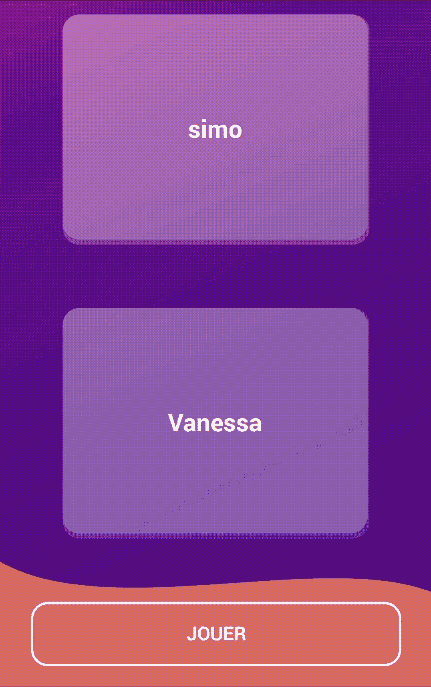

# 用 Jetpack 合成链接动画

> 原文：<https://betterprogramming.pub/chaining-animations-with-jetpack-compose-b4ff6e2e047d>

## 了解如何运行顺序和并行动画


由[迈赫迪·梅瑟罗](https://unsplash.com/@messrro?utm_source=medium&utm_medium=referral)在 [Unsplash](https://unsplash.com?utm_source=medium&utm_medium=referral) 上拍摄的照片

当涉及到单独运行动画时，谷歌提供了全面的文档。当谈到链接几个动画时——不管它们是连续的还是并行的——我一直在努力寻找合适的资源。

直到我偶然看到这个视频，它准确地总结了我一直在寻找的东西:

这个视频解释了如何利用协程来链接你的动画。这是我完成洗牌动画所缺少的部分。我会制作两张卡片的动画，它们会来回平移，同时缩小比例，直到它们都达到中间点。

自己看看最后的效果:



让我们来看看实现这种无序播放效果的不同动画。

# 洗牌效应

如果你仔细看动画，我们可以把它分成一组动画。实际上有 3 组动画，有时包含一组动画:

1.  开篇:从 1%小幅下调至 0.9%
2.  核心:三个持续时间相同的平行动画，比例缓慢下降，直到达到 0.8%。类似地，不透明度从 1 减少到 0.4%。最后，我们以更快的速度重复五次同样的来回翻译。
3.  结尾:我们隐藏一张卡片，而另一张不透明度重置为 1。所选卡片的偏移量设置为两张卡片之间高度的 70%。最后，经过一小段时间的延迟后，卡片会自动回到屏幕的顶部，而刻度会恢复正常。

所有这些动画既按顺序运行，也同时运行。它们可以表示如下:


既然我们已经说明了动画应该如何表现，让我们看看如何利用协程来包装它们。

# 用协程链接动画

Jetpack Compose 使用协程让您链接几个动画。无论它们是顺序的还是同时的，您都可以创建尽可能多的协程来产生想要的效果。

我们将从构建洗牌动画的框架开始。因为它包括顺序和并行动画，我们将需要创建几个协程以及一些用于同时方面的`coroutineScope`。

骨架应该是这样的:

这个框架通过将动画分割成协程的子集来引导动画。

至于动画本身，Jetpack Compose 公开了一个可从协程上下文调用的`animate` suspend 方法。

```
suspend fun animate(
    initialValue: Float,
    targetValue: Float,
    initialVelocity: Float = 0f,
    animationSpec: AnimationSpec<Float> = *spring*(),
    block: (value: Float, velocity: Float) -> Unit
)
```

作为一个例子，让我们从输入动画开始。我们想把我们的卡片从 1 缩小到 0.9。

我们可以从保存一个缩放比例并在`animate`方法中更新它的值开始。

```
var scale by *remember* **{** *mutableStateOf*(1f) **}***LaunchedEffect*(key1 = Unit) **{** animate(1f, 0.9f) **{** value: Float, _: Float **->** scale = value
    **}
}**
```

然后我们可以将这个值应用于我们的两个卡组件。

```
*PlayerCard*(
    modifier = Modifier
        .*scale*(scale),
    // Other parameters
)
```

`animate`函数将使用默认的`spring`效果对刻度值进行插值。您可以通过覆盖`animationSpec`属性来改变这种效果。

# 来回翻译

动画的这一部分值得拥有自己的部分。作为免责声明，我想强调的是，我并不是在鼓吹我是如何处理这种转变的。原因在于它缺乏可伸缩性，就像预感到一定有更好的方法一样。我鼓励你分享你的选择，以进一步提高这部动画的整体质量。

话虽如此，我的方法是有效的。我首先检索我想翻译的位置，叫做`finalOffset`。在我的例子中，由于卡片交换，这个值等于卡片的高度和它们之间的填充。

我记得这个值来自使用`onGloballyPositioned` 方法组合的第二张卡。

```
val density = *LocalDensity*.current
val padding = 30.dpvar finalOffset by *remember* **{** *mutableStateOf*(0f) **}***PlayerCard*(
    modifier = Modifier
        .padding(top = padding * 2)
        .*onGloballyPositioned* **{** finalOffset = *with*(density) **{** it.size.height + padding.*toPx*() * 2
            **}
        }
**        // Other properties
)
```

运行动画时，我们需要存储插值偏移。最后，平移会产生用动画偏移插值的最终偏移。我们对第二张卡的这个值取反，使其向相反方向平移。

```
var offset by *remember* **{** *mutableStateOf*(0f) **}**
val translation = finalOffset * offset*PlayerCard*(
    modifier = Modifier
        .*graphicsLayer*(
            translationY = translation
        ),
    // Other parameters
)*PlayerCard*(
    modifier = Modifier
        .*graphicsLayer*(
            translationY = -translation
        ),
    // Other parameters
)
```

至于`offset`的计算，我们将使用与`scale`相同的机制。我们需要应用两个连续的动画，其中偏移从 0 到 1，然后从 1 到 0 来模拟一个来回。为了总结这一点，我们重复这个循环多次(在这个例子中是五次)。

```
*launch* **{** *repeat*(5) **{
**        animate(0f, 1f) **{** value: Float, _: Float **->** offset = value
        **}** animate(1f, 0f) **{** value: Float, _: Float **->** offset = value
        **}
    }
}**
```

# 结束动画

对于其余的动画，我们将应用相同的逻辑，但在不同的属性。让我们从存储它们开始:

```
var scale by *remember* **{** *mutableStateOf*(1f) **}** var firstCardAlpha by *remember* **{** *mutableStateOf*(1f) **}** var secondCardAlpha by *remember* **{** *mutableStateOf*(1f) **}** var offset by *remember* **{** *mutableStateOf*(0f) **}**
```

不过，有一件重要的事情需要提及。因为我们同时操作可组合对象的不同属性，所以我们不能再依赖直接的`Modifier`属性，比如`scale`、`alpha`和`offset`。你需要使用`Modifier`的`graphicsLayer`属性。

```
*PlayerCard*(
    modifier = Modifier
        .*graphicsLayer*(
            alpha = firstCardAlpha,
            scaleX = scale,
            scaleY = scale,
            translationY = translation
        ),
    // Other parameters
)*PlayerCard*(
    modifier = Modifier
        .*graphicsLayer*(
            alpha = secondCardAlpha,
            scaleX = scale,
            scaleY = scale,
            translationY = -translation
        ),
    // Other parameters
)
```

完整的动画块应该倾向于这样:

您可能会得到稍微不同的结果，因为它应该与您的用例相匹配——更不用说我隐藏了一些与本文无关的业务逻辑。

链接动画导致利用协程和改变可组合的内在属性。不要犹豫，用复杂的动画为你的用户创造惊人的用户体验。通过这个洗牌动画，用户理解了隐藏在背后的随机性。

我非常希望这篇文章能让你更容易使用 Jetpack Compose 制作连锁动画。编码快乐！