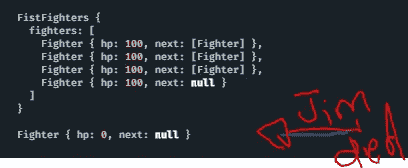

# JavaScript 中的链接模式

> 原文：<https://betterprogramming.pub/chaining-patterns-in-javascript-df05e3030ee7>

## 锁住你的成功之路

来自 Pexels 的马体·米罗什尼琴科的照片

作为开发人员，编写好的代码是我们的责任。这意味着编写既高效又可读的代码。但是有时我们会遇到一些障碍，当为了更好地执行而牺牲可读性时，我们必须决定使用哪种代码更好，反之亦然。

这篇文章将介绍 JavaScript 中不同的链接模式，我希望在编写链接操作时，这篇文章能对你有所帮助。

# 方法链接

在 JavaScript 中，方法链接是指从一个对象到另一个对象调用方法，而不创建中间变量。换句话说，它是我们指示程序执行的多个方法调用的单个语句。

Jquery 是充分利用其语义的一个很好的例子，因为它能够在高效封装 DOM APIs 的同时将命令链接在一起。它使用清晰简洁的语法:

这是一个单一语句的示例。在一行代码中，它在一次执行中完成了所有这些操作:

1.  查询 id 为`main`的 DOM 元素
2.  将背景颜色更改为`red`
3.  将高度改为`200px`
4.  将文本对齐改为`center`
5.  将宽度改为`500px`

另一个流行的 JavaScript 库， [expressjs](https://expressjs.com) 利用方法链接为开发人员提供了一个简单而健壮的 API。

以下是取自他们的[错误处理](https://expressjs.com/en/guide/error-handling.html)页面的一个示例:

逻辑隐藏在实现中，并返回`this`以允许方法链接继续:

[代码块编写器](https://github.com/dsherret/code-block-writer)使得用方法链接 api 编写代码变得容易:

# 构建器模式

构建器模式本质上使用方法链接来实现它的目标。根据定义，构建器是一个[创造性的](https://en.wikipedia.org/wiki/Creational_pattern)设计模式，让你以一步一步的方式构建复杂的对象，有效地简化过程。

听起来很像描述方法链的方式，不是吗？

如果我们要创建一个`Chicken`类，它的方法是构造它的所有身体部分，我们可以使用生成器来构造一只完整的鸡:

如果我们不使用构建器，代码可能会变得重复，消费者不清楚他们是否返回值，这迫使他们寻找一些文档:

如果您以前从未使用过构建器，请看看下面的例子，看看您是否能发现它为我们提供的好处:

> *无建造者*

> *与建造者*

通过使用构建器，我们节省了多行代码，但是我们也对消费者隐藏了实现细节。隐藏实现是这里最重要的。

这是上面代码片段中构建器的实现(是的，我知道它很长，但是请继续听下去):

从这一点来看，作为开发人员，我们的工作是创建*高效和可读的代码*。

是的，我们没有构建器的例子在技术上更短，但是它是可重用的吗？我们将能够与那些能像我们一样容易读懂代码的人一起工作(我们写了代码)。

这两个问题的答案都是否定的。当我们共享我们的代码时(或者甚至当我们试图重用我们的代码时)，我们可以很容易地拿起构建器并重用它，而不是像以前那样。这是因为如果我们试图重用先前的代码，我们必须复制并粘贴代码。

当我们复制和粘贴时，我们会产生重复的代码。当代码变得重复时，我们必须对 api 进行双倍的修改。当我们不得不做两三次不必要的修改时，我们的代码就变得*不可维护*。builder 模式是一个简单但功能强大的模式，可以一次性解决所有这些问题！

# 责任链模式

责任链(COR)是一种允许多个对象发送、接收和处理某些请求的模式。这些对象(仅仅是函数)既不依赖于前一个请求的实现细节，也不依赖于下一个请求的实现细节，并且可以决定在运行它的执行时做什么。它们也可以中止整个链，或者决定让请求继续到链中的下一个对象(或函数)。

下面是 DOM 中使用的模式的一个例子:

只要功能能够以可控和可预测的方式一个接一个地链接起来，就没有真正的“官方”或正确的方法来实现这种模式。

ExpressJS 在它们的路由器中也使用这种模式来将中间件处理程序从一个处理程序传递到下一个处理程序:

但是如果你想知道处理程序是如何通过`next()`调用相互链接的，它的工作方式与[链表](https://en.wikipedia.org/wiki/Linked_list)数据结构的工作方式完全一样。

在实践中没有实现这种模式的正确方法，但是这里有一个将处理程序链接在一起的例子:

# 可选链接

访问嵌套对象是一个危险的操作，因为如果我们的代码不处理值为空的情况，或者仅仅是它的原型不是从对象原型继承的，我们可能会被抛出一个`TypeError`，这会使我们的程序崩溃。

我的意思是:

如果我们试图在`items`被意外设置为非类似对象的数据类型(如`null`值)时访问`buckets.red.items[1]`，我们会得到如下令人不快的结果:

JavaScript 提供了一种更简单的方法，称为可选链接，它简化了通过连接的对象访问值，这些对象在某个时候可能会变成`null`或对象之外的任何东西:

# 承诺链

通过将承诺链接在一起，您可以编写异步代码，其中您的每个函数都将被承诺(字面上)及时接收它们的数据:

# 结论

本帖到此结束！我希望你发现这是有价值的，并期待在未来更多！