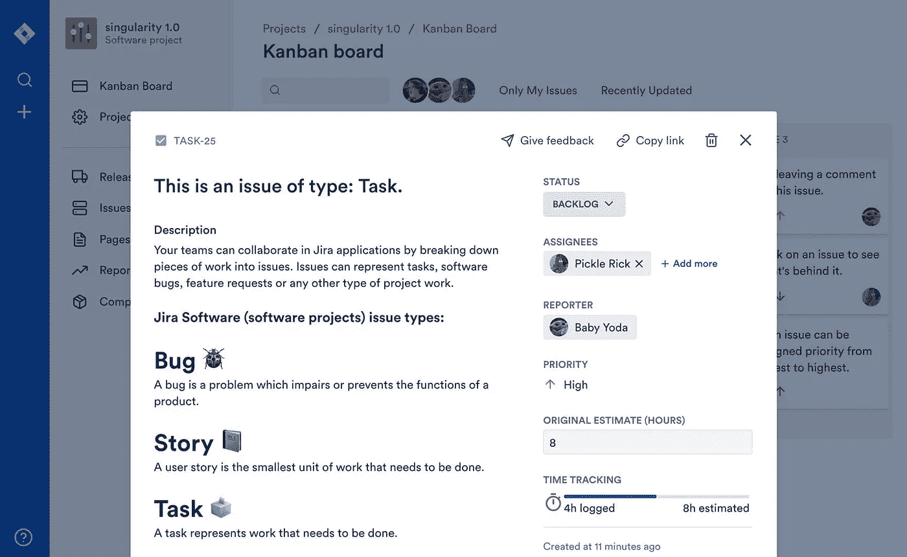
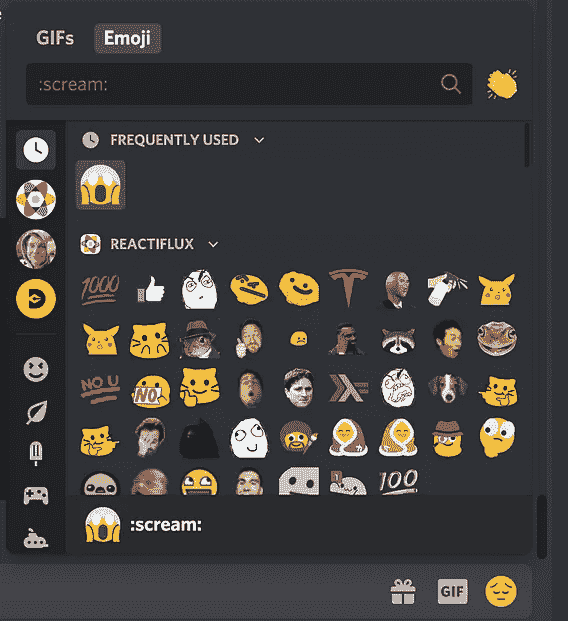
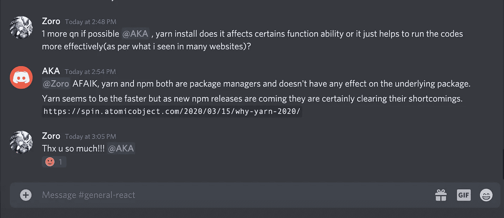
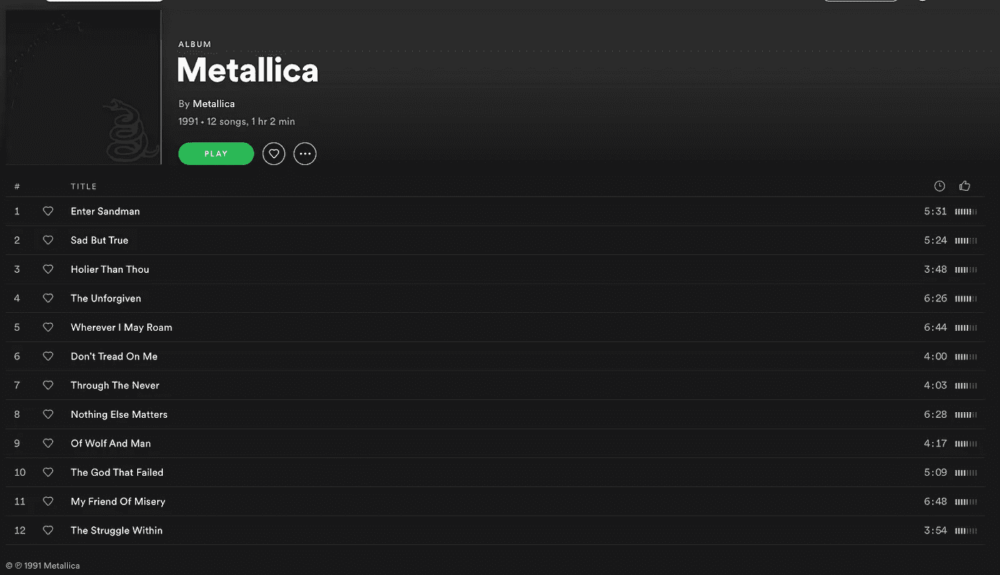
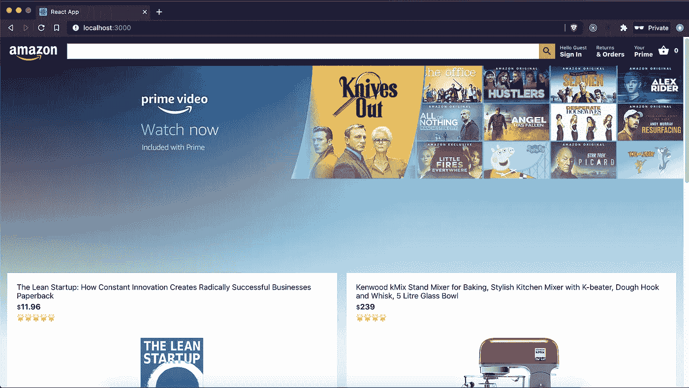
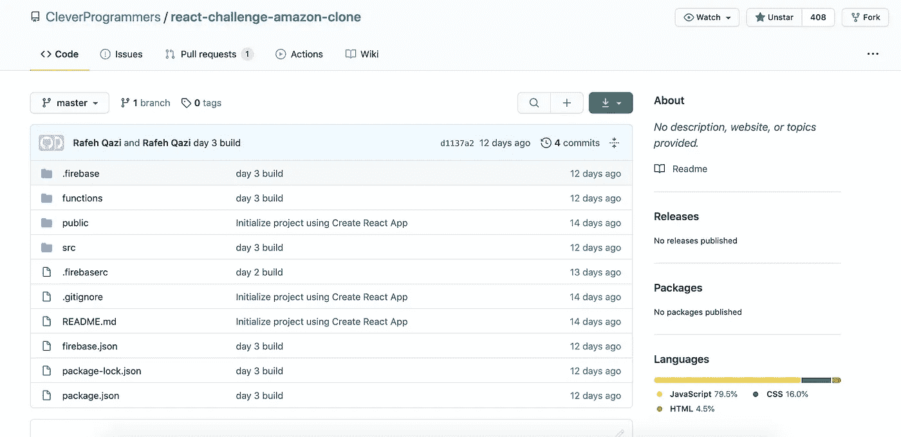
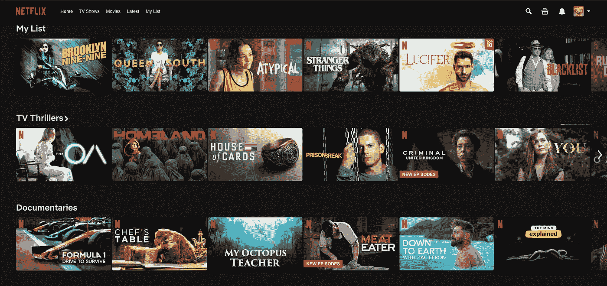
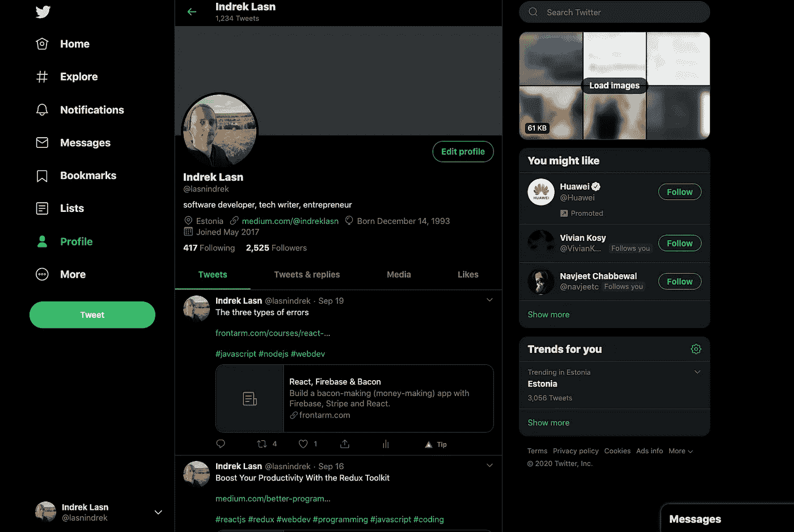

# 通过构建这些前端挑战来挑战自己

> 原文：<https://betterprogramming.pub/challenge-yourself-by-building-these-front-end-challenges-50a5d15a01d2>

## 您今天就可以开始解决的前端问题列表

在 [Unsplash](https://unsplash.com?utm_source=medium&utm_medium=referral) 上拍摄的 [ThisisEngineering RAEng](https://unsplash.com/@thisisengineering?utm_source=medium&utm_medium=referral)

有很多方法可以让你变得优秀并擅长编程。然而，作为一名开发人员，最有效的成长方法之一就是投入尽可能多的时间。

有一种说法是，为了成为某方面的大师，一个人必须投入 10，000 个小时的练习。

用这篇文章作为灵感的来源。从下面的列表中选择一个项目并开始编码！只要你完成了工作，并实际构建了它，你使用哪种技术或工具并不重要。

事不宜迟，这里列出了您今天就可以开始解决的前端挑战。

# 吉拉的复制品

吉拉是由 Atlassian 开发的专有问题跟踪产品，允许 bug 跟踪和敏捷项目管理。这个产品的名字是对 *Gojira* 的缩写，在日语中是哥斯拉的意思。

吉拉——来源: [GitHub](https://github.com/oldboyxx/jira_clone)

## 以下是你将通过构建吉拉克隆体学到的东西

*   **拖放(DnD) API 如何为浏览器工作** —每个吉拉板都有一组看板，您可以根据任务进度拖放任务。
*   **如何安排用户角色和访问权限逻辑** —每个看板都有关联的成员。成员可能有不同的访问级别。

例如，项目经理可能有读、写和编辑权限，而客户可能只有读权限。客户可以看到正在进行和已经完成的工作，但是他们不能改变团队当前正在进行的工作。

*   **HTML 和 CSS**——如何从语义上构建和设计应用程序是任何人都可以掌握的技能。

# 使用表情符号的不和谐聊天

Discord 是朋友们在闲逛或玩视频游戏时联系的一种有趣方式。Discord 专门处理聊天频道中用户之间的文本、图像、视频和音频通信。

每个 Discord 频道都有可供用户选择的表情符号。**你的挑战是构建包含表情符号的聊天部分。如果你愿意，你可以构建整个 Discord 克隆体。**

## 下面是你将通过构建一个不和谐聊天克隆体学到的东西

*   **如何在聊天中使用和利用网络套接字**。每一个现代的网络聊天应用程序都在以某种方式使用 WebSockets。

WebSocket 是一种计算机通信协议，通过单一 TCP 连接提供全双工通信通道。简而言之，服务器和前端客户端是同步的。

*   **如何使用** [**电子**](https://www.electronjs.org/) **构建跨平台的桌面应用。**目前版本的 Discord 是用电子建造的。

# Beatbox 应用程序

Beatbox 应用程序根据您当前按下的键播放不同的声音。你可以只用键盘弹奏一首曲子。

试试吧—来源: [GitHub](https://github.com/CleverProgrammers/beatboxapp-live)

## 通过构建 Beatbox 应用程序，您将学到以下内容

*   为了刺激声音，你需要熟悉**网络音频 API 如何工作**。
*   **处理 JavaScript 键盘事件**。你必须弄清楚按的是什么键，弹的是什么曲子。

Web Audio API 为控制 Web 上的音频提供了一个功能强大的通用系统，允许开发人员选择音频源、为音频添加效果、创建音频可视化效果、应用空间效果(如平移)等等— [*Mozilla 开发者文档*](https://developer.mozilla.org/en-US/docs/Web/API/Web_Audio_API)

这里是 Github 上 beatbox 应用程序的一个版本。

# Spotify 专辑区

你可以在 Spotify 上播放和上传歌曲。Spotify 有一个部分，你可以根据专辑浏览音乐和艺术家。这是我最喜欢的专辑之一。

金属乐队(1991)专辑

## 以下是你将通过构建 Spotify 克隆版学到的东西

*   如何通过 API 获取数据并显示相关艺术家的正确专辑。谢天谢地，Spotify 有一个你可以免费使用的 API——[这是 API 文档链接](https://developer.spotify.com/documentation/web-api/)。
*   您可以将应用程序构建为 web 或桌面应用程序，选择权在您。这两个应用程序都需要了解如何在页面上布局元素以及如何恰当地设计样式。

# 亚马逊克隆

当亚马逊开始的时候，他们只是一个小小的电子商务网站，只出售书籍。截至 2020 年，他们是电子商务领域的巨头。

从小处着手，慢慢来，出于学习目的复制每个特性。不要试图复制亚马逊的业务，而是尝试建立一个类似的学习网站。

本质上，Amazon 是一个大型数据库，在搜索时，它会返回数据库中正确的商品。当然，亚马逊远不止这些，但这是一个非常简单的例子。

亚马逊克隆— [Github](https://github.com/CleverProgrammers/react-challenge-amazon-clone?ref=HackerTabExtension)

## 下面是你将通过构建一个亚马逊克隆体学到的东西

*   **设置一个 MySQL 或 PostgreSQL，并有能力在数据库中存储项目** — 你需要在数据库中存储项目，然后从它查询项目。
*   **启用搜索功能** —用户登陆你的网站，搜索关键词，你需要返回相应的条目。你会怎么做？
*   HTML 和 CSS——每个网站都使用前面提到的两种技术。它们被用于从非常复杂的网站，如网飞或亚马逊，到非常简单的初学者项目。

如果你觉得有用，这里有一个我在 GitHub 上找到的简单的亚马逊克隆:

来源: [GitHub](https://github.com/CleverProgrammers/react-challenge-amazon-clone?ref=HackerTabExtension)

# 网飞的复制品

网飞是观看电视剧、电影和纪录片的热门选择。他们彻底改变了我们观看节目的方式。事实证明，在任何地方和任何设备上观看是一个令人信服的论点。

网飞主屏幕—来源:[网飞](http://netflix.com)

## 以下是你将通过构建网飞克隆体学到的东西

*   [视频和音频 API](https://developer.mozilla.org/en-US/docs/Learn/JavaScript/Client-side_web_APIs/Video_and_audio_APIs)——网飞的核心是流媒体服务。每个流媒体服务都在某种程度上涉及到视频或音频。
*   使用 HTML 和 CSS。
*   **可选**:如何从 API 取电影电视剧。这里是 API 和文档。

# 推特的复制品

Twitter 是一个流行的讨论平台，从政治到音乐到编程。Twitter 上有很多小众社区。

许多人也更喜欢使用 Twitter 来联系他们的观众。

我的推特个人资料页面——来源:[推特](https://twitter.com/lasnindrek)

## 下面是你将通过构建一个 Twitter 克隆体学到的东西

*   **在数据库中存储推文**——建立关系数据库(MySQL)还是非关系数据库(MongoDB)——由你决定。
*   **角色管理逻辑** —每个用户都有一个只有他们可以编辑但其他人可以查看的简档。
*   **HTML 和 CSS** 用于布局相关的东西。

这是我之前发现的一个[推特克隆](https://github.com/CleverProgrammers/twitter-clone)的例子。

# 结论

寻找更多的编码想法？永远不要耗尽编码的想法，永远不要。 [**在这里获取权限，来一堆被我挑战的前端。**](https://gumroad.com/l/IuqKc)

感谢阅读！我希望你能为你的下一个项目找到灵感。编码快乐！