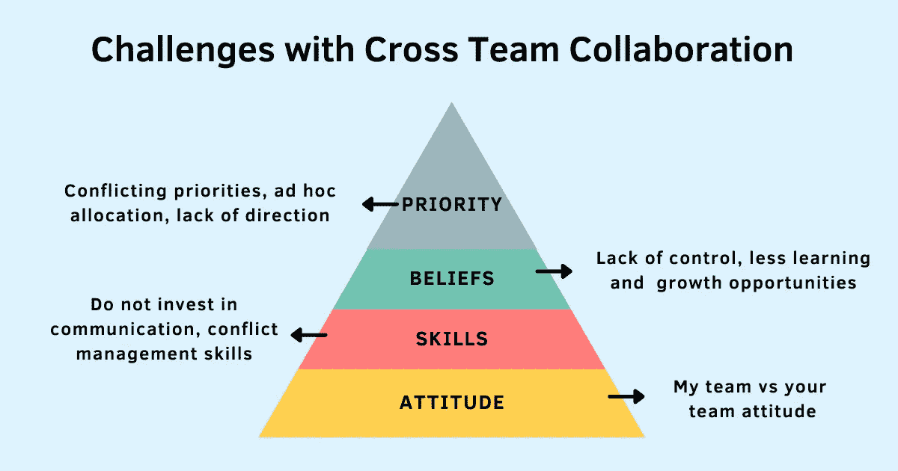

# 跨职能协作面临的挑战及应对措施

> 原文：<https://betterprogramming.pub/challenges-with-cross-functional-collaboration-and-what-to-do-about-it-8be14916d7ad>

## 克服这些障碍，实现团队间的有效协作

鸣谢:作者

在快速发展、不断变化、充满活力的工作环境中，有效协作的能力不是必需的，而是一种超能力。

从开发小型产品的初级开发人员到领导大型工程团队，再到担任领导角色提供指导，我有机会体验、观察和制定有效的跨团队协作策略。

不管我在哪里工作，和谁一起工作，同样的挑战一次又一次地出现。当跨团队协作时，沟通、协调、可见性、执行速度和[决策](https://www.techtello.com/avoid-making-bad-decisions/)总是一团糟。

跨团队协作时的这些差距归结为四大问题:

# **1。态度**

当人们被要求跨越团队界限时，团队合作的概念及其明显的优点就被打破了。即使是那些与自己的团队成员有效合作的人，也很难与团队以外的人重复这些行为。

团队合作的好处是有限的，因为员工们以“我的团队”对“你的团队”的态度形成了严格的团队界限。

对自己团队的优越感加上对其他团队所做工作的了解不足，导致在与自己职能团队以外的人打交道时产生抵触情绪。

为了保护自己团队的[目标](https://www.techtello.com/goal-setting/)，经理们对其他团队和职能部门的要求表现出抵触。为团队制定明确的目标并没有错。当他们把自己团队的目标看得太重，其他事情都是次要的时候，问题就出现了。这种行为渗透到他们团队的无意识偏见中，并影响他们的思考和决策。

当经理拒绝与其他团队合作时，团队成员也会采取这种态度:

“这不是我的特色。你的团队应该负责构建它。”

“我并没有报名参加这次整合。如果我们接受这一点，将会影响我的时间表。”

管理者能做些什么来改变这种态度呢？

*   观察他们自己对其他团队和职能部门的要求的反应，以及他们是否无意识地向自己的团队传达了错误的信息。
*   将团队目标与公司级目标联系起来。经常讨论和重复它们，让员工学会超越团队界限。
*   鼓励每个人做出符合组织更大利益的决策，而不仅仅是他们的团队。
*   创造机会了解其他团队及其工作。

> “作为经理，你工作的第一大部分是确保你的团队知道成功是什么样的，并关心如何实现它。”—朱莉·卓

# **2。技能**

技术团队专注于建立技术专长。营销团队练习技巧来构思一个引人注目的故事。设计团队依靠他们的创造力，销售团队致力于完善他们的销售技巧。

不可否认，这些技能很重要。你必须实践它们，才能在你的工作领域做到最好。但是过分专注于强化这些技能会让人们忽视其他技能的重要性，而这些技能对他们的成功也是必不可少的。它低估了学习良好沟通的重要性，知道如何[解决冲突](https://www.techtello.com/managing-conflict/)，或者做什么来疏通自己和他人。

当员工不学习这些重要的技能时，合作就会破裂。每次发生冲突时，经理都需要介入，因为团队中的人不知道如何处理分歧。越来越多的时间花在证明别人是错的上，而越来越少的时间花在努力把事情做好并取得进步上。缺乏主动沟通会导致团队之间的可见性问题和不一致。员工变得不愿意改变并避免改变，因为改变会导致冲突，而冲突被认为是不好的。

管理者能做些什么来培养这些技能呢？

*   设置为什么这些技能很重要的背景。让人们了解他们成功之旅的基本要素。公开谈论当人们缺乏这些基本技能时出现的问题。
*   通过[有效授权](https://techtello.com/how-to-delegate-work-effectively/)为他们的团队创造实践这些技能的机会，并指导他们提高和发展这些技能。
*   他们需要提出问题，而不是在问题出现时进行干预和解决，从而在组织中建立批判性思维技能。

# **3。信念**

信仰不仅塑造了人类的思维，也决定了他们的行为方式。每个人都明白，制造任何产品或做任何有意义的事情都需要协作。然而，当涉及到参与协作时，人们不愿意自己动手。认为别人不会像他们一样好、一样善解人意、一样精明或一样聪明的想法让他们想要避免和他们打交道。他们更愿意做独立的部分，让其他人来负责将他们的部分整合到更大的拼图中。

毕竟，与他人合作确实需要他们走出自己的舒适区。与他人有效合作不是一件容易的事情。人们来自不同的背景、经历和愿望，学会与他们共事而不是与他们作对是一项实际技能。他们宁愿避免与他们打交道，而不是培养技能。

多年来，协作也赢得了一个坏名声。对交付速度的关注使人们认为他们必须在质量上妥协。他们还担心在决策过程中没有发言权，没有学习机会，或者他们将被要求充当刽子手，而不是所有者。对过程和结果缺乏控制的感觉也会扼杀与他人合作的动力和愿望。

管理者可以做些什么来更新这些信念？

*   让人们在协作中承担更大的责任，这需要他们拓展和培养新的技能。
*   让他们成为决策过程的一部分，帮助他们看到[的大局](https://www.techtello.com/goals-big-picture-thinking-or-nitty-gritty/)。
*   蔻驰鼓励他们超越分配给他们的职责。
*   向他们展示协作如何成为培养领导技能、拓展人脉和了解业务其他方面的绝佳机会。
*   将他们的心态从避免冲突转变为将健康的分歧视为创新和创造的一种方式。

> “如果你给员工更多的自由，而不是制定流程来阻止他们行使自己的判断，他们会做出更好的决定，也更容易让他们承担责任。”—雷德·哈斯汀斯

# **4。优先级**

尽管花了几个月的时间进行规划和调整优先级，但是当团队真正开始实施时，真正的优先级问题就出现了。功能目标优先于具有共同目标的项目，优先级随着时间的推移而改变，为新的承诺腾出空间，一些冲突的优先级没有得到解决。

通常情况下，领导层缺乏一致会增加团队之间的困惑、[沮丧、](https://www.techtello.com/frustration-at-work/)、竞争和冲突。如果没有明确的方向感，每个团队都以自己的优先感为主导，并以此来推动团队内部以及与他人合作时的决策。

当不同的团队使用不同的罗盘来定义和衡量成功时，协作就会变得一团糟。在重要的项目上找到合适的人会有延迟，因为他们忙于其他任务。随着新的优先事项的出现，人们不得不停止正在进行的工作，为新的优先事项让路。人们被临时分配到项目中，而不是根据他们的成长和机会做出有意识的决定。

管理者可以做些什么来克服这些挑战？

*   停止假设，开始寻求清晰。
*   与整个组织的经理和领导一起解决冲突，并为他们的团队提供清晰的方向感。
*   [授权他们的团队](https://www.techtello.com/building-accountability-at-work/)提出问题并寻求一致，而不是参与盲目执行或指责游戏。
*   接受他们所处的现实。关键不在于建立一个没有冲突的环境。那是不现实的，也是无益的。他们需要学习的是充分利用每一种情况。

> “挑战不是消除冲突，而是转变冲突。这是为了改变我们处理分歧的方式。”——罗杰·费希尔

管理者和领导者不要因为缺乏协作而感到沮丧，而是需要质疑他们自己的实践和他们所做的工作，以便在他们的组织中实现有效的团队协作。只有通过指导人们超越团队界限，帮助他们建立沟通和冲突管理技能，给他们明确的方向感，并为他们提供学习和成长的机会，他们才能鼓励持久的合作。

# 摘要

1.  当领导者和管理者不投资于在他们的团队和他们的组织中建立正确的实践时，跨团队的有效协作就会中断。
2.  管理者需要跨团队和职能部门，根据共同的目标来调整他们的团队，而不是创建妨碍有效协作的严格的团队界限。
3.  帮助他们的团队看到建立沟通、冲突管理和其他重要技能的价值是实现有效协作的重要一步。通过让他们的团队建立这些技能，经理可以帮助他们的团队将精力投入到建设性的行动中，而不是浪费在责备游戏和其他破坏性的行为中。
4.  通过表现出对团队成员的信任，赋予他们更高层次的责任，并帮助他们建立领导技能，管理者可以帮助他们的团队克服与他人合作时带来的阻力和不适。
5.  最后，通过调整优先级并使他们的团队能够充分利用每种情况，他们可以鼓励持久的合作。

在[推特](https://twitter.com/techtello)上关注我，了解更多故事。

*这个故事最初发表于*[*【https://www.techtello.com】*](https://www.techtello.com/cross-functional-collaboration/)*。*