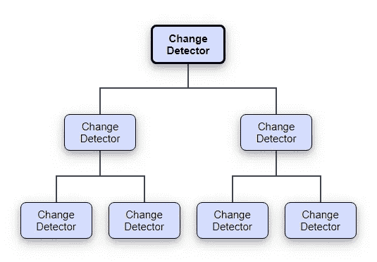

# 什么是角度变化检测？

> 原文：<https://betterprogramming.pub/change-detection-in-angular-6fb68ca19c95>

## 变化检测是 Angular 在应用程序或组件的状态发生变化时决定执行何种操作的策略


组件状态的改变可以由用户交互触发，如点击按钮、改变输入值或 HTTP 请求等。

例如，如果我们有一个组件如下…

```
import { Component } from "@angular/core";@Component({selector: "app-root",template: `Title: {{title}}<button (click)="changeTitle()">Change title</button>`,styleUrls: ["./app.component.css"]})export class AppComponent {title = "CodeSandbox";changeTitle(){this.title = "I am the new title."}}
```

…我们可以看到，当用户通过单击 Change Title 按钮与应用程序交互时，组件的 Title 属性被更改。

Angular 中的每个组件都配有一个变化检测器，用于跟踪状态的变化。

众所周知，Angular 应用程序是一个组件树。因此，对于树中的每个组件，我们都有一个在应用程序启动时创建的相关变更检测器。

所以我们最终得到了一个变化检测器树。



当其中一个组件的状态发生变化时，无论它在树中的什么位置，都会触发整个树的变化检测过程。发生这种情况是因为 Angular 扫描从顶部组件节点开始的变化，一直到树的底部叶子。

因此，随着应用程序规模的增加，这种检查可能会导致性能下降。但是我们有办法定制变化检测策略。

# 优化变更检测策略

一种优化的方法是告诉 Angular，只有当组件的输入发生变化时，才在组件上运行变化检测。

现在，如果我们想让这个组件只在它的输入属性改变时才改变，我们只需要通过将它的`changeDetection`属性设置为`ChangeDetectionStrategy.OnPush`来改变变化检测策略。

`changeDetection`属性的默认值是`ChangeDetectionStrategy.Default`。

在下面的组件中，我们将组件装饰器的`changeDetection`属性改为`ChangeDetectionStrategy.OnPush`。

```
import { **Component**, **Input**, **ChangeDetectionStrategy** } from "@angular/core";import { **IAlert** } from "./alert.model";@**Component**({
***selector****:* "app-alert",
***template***: `<div class="alert" [ngClass]="alert.type">{{ alert.message }}</div>`,
***styles***:[
`.alert{
position: relative;
padding: .75rem 1.25rem;
margin-bottom: 1rem;
border: 1px solid transparent;
border-radius: .25rem;
},.success {
color: #155724;
background-color: #d4edda;
border-color: #c3e6cb;
},.error {
color: #721c24;
background-color: #f8d7da;
border-color: #f5c6cb;
}`],***changeDetection***: ChangeDetectionStrategy.OnPush
})export class **AlertComponent** {
@Input() alert: IAlert;
}export interface IAlert {
type: string;
message: string;
}
```

将`changeDetection`更改为`ChangeDetectionStrategy.OnPush`时，仅当该组件的一个输入属性发生变化时，才会运行变化检测周期。更改树的其他组件不会触发该组件的更改检测器。

**注:** Angular 使用`Zone.js library` 检测变化并运行变化检测循环。

在以下最常见的情况下，区域会自动告诉 Angular 发生了变化:

发生 DOM 事件(例如，点击、更改等。)

HTTP 请求被解析

定时器被触发(例如，设置超时、设置间隔)