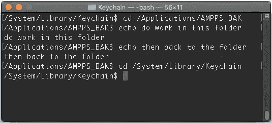
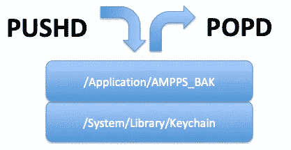
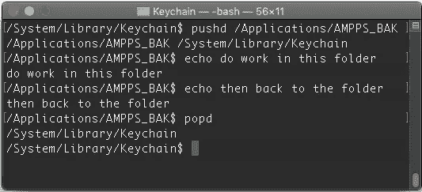
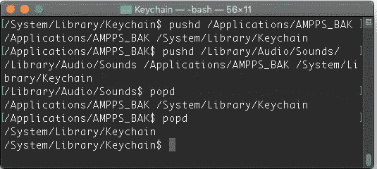
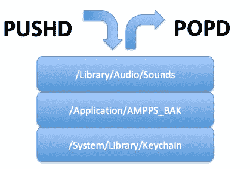
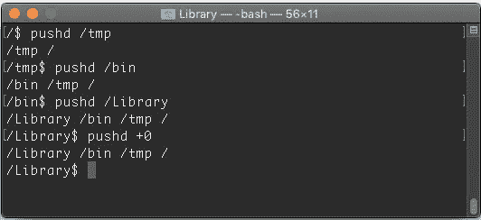
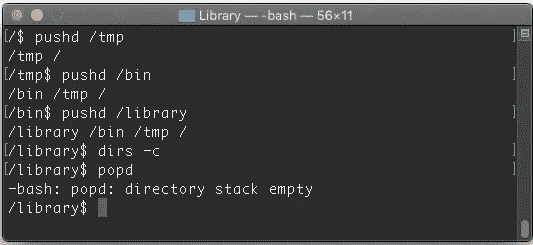

# 在终端中用 pushd 和 popd 优雅地改变目录

> 原文：<https://betterprogramming.pub/change-directory-elegantly-with-pushd-and-popd-in-terminal-8e865f89fc9d>

## `An alternative to cd`


图片由[莱卡笔记本](https://unsplash.com/@laikanotebooks)上 [Unsplash](https://unsplash.com/photos/l24Db2ApdFM)

在 Linux/Unix 终端中，当我们想要切换目录时，我们使用命令`cd`(更改目录)，如下所示。


上面的例子显示某人从`/System/Library/Keychain`变成了`/Applications/AMPPS_BAK`。

在`/Applications/AMPPS_BAK`中完成所有我们需要做的事情后，如果我们想切换回之前的目录(`/System/Library/Keychain`)，我们需要`cd`并再次输入完整的目录名。像这样:

```
cd /System/Library/Keychain
```



如果您记得目录名或者可以在屏幕上看到它，这就可以了。否则，您需要向上滚动并检查名称。

# pushd 和 popd 前来救援

pushd 和 popd 像堆栈一样工作，通过*按下*和*弹出*目录来记住你之前在哪里——使用后进先出的方法。



你需要做的就是把`cd`换成`pushd`。

```
pushd /Applications/AMPP_BAK
```

一旦你完成了，只需输入`popd`。

```
popd
```



然后它会回到它之前的目录。你将不再需要记住以前的目录名。

# 如果你有两个以上的目录呢？

该命令不仅限于两个目录。下面，我将用三个目录对此进行测试。



## 堆栈信息

如果你真的注意了，你会注意到在每一个`pushd`之后都有一个打印输出。这显示了存储在堆栈中的目录。

如果您从上一次执行`pushd`的地方开始，并且想知道堆栈中的目录堆栈，您可以使用下面的命令

```
dirs -v
```

或者

```
pushd +0
```

这个`pushd +#`请求恢复上一个`pushd`目录，它实际上就是您所在的目录。



**注意:**你可以尝试`pushd +1`或任何数字，直到目录数减去你堆栈中的目录数。你也可以尝试`pushd -1`或任何数字或者`popd +1`或`pop -1`，你可以用它们来清除你的堆栈中的某个目录。

## 清除所有的堆栈目录怎么样？

你可以使用下面的命令。然后你会把它们全部清除。

```
dirs -c
```



# 结论

和`pushd`和`popd`玩得开心。这要归功于 [bennykhoo99](https://medium.com/u/33ae5ea6b074?source=post_page-----8e865f89fc9d--------------------------------) ，很多年前他第一次向我展示了这个命令。

感谢阅读。