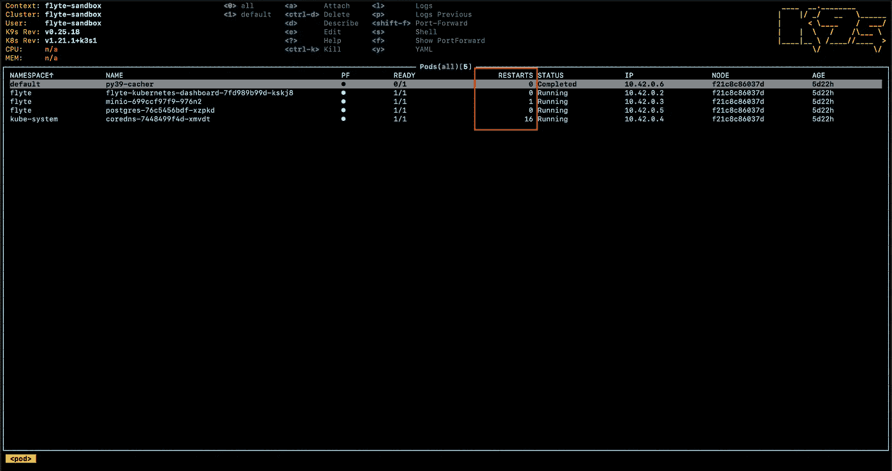
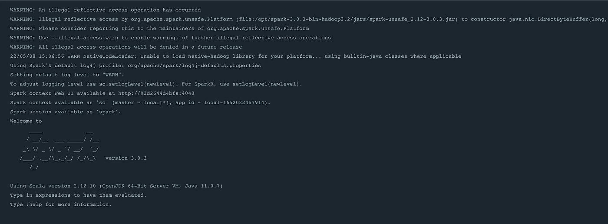

# 如何修复在苹果 M1 上失败的 Spark 机器学习和数据转换作业

> 原文：<https://betterprogramming.pub/change-one-line-of-code-to-make-your-spark-jobs-work-again-12f492bc2b07>

## 更改一行代码，让您的 Spark 工作再次工作


照片由[马克西姆·霍普曼](https://unsplash.com/@nampoh?utm_source=medium&utm_medium=referral)在 [Unsplash](https://unsplash.com?utm_source=medium&utm_medium=referral) 拍摄

经过十多年为 iPhone、iPad 和 Apple Watch 创造和测试行业领先的芯片，苹果为 Macbooks 推出了苹果 M1 芯片。M1 芯片处理器具有“世界上最快的低功耗硅 CPU 内核、世界上最好的每瓦 CPU 性能、世界上最快的个人电脑集成显卡以及突破性的苹果神经引擎机器学习性能”，提供“高达 3.5 倍的 CPU 性能、高达 6 倍的 GPU 性能和高达 15 倍的机器学习速度，同时使电池寿命延长高达 2 倍”

尽管这些数字听起来很神奇，但当我意识到我作为数据工程师或科学家使用的大多数软件都不再工作时，还是有点令人震惊。这种担忧加剧了，因为我不再有选择购买采用英特尔处理器的 MacBook 笔记本电脑的权利。

我将带您进行一次冒险，弄清楚我是如何注意到我的 Spark 作业不再工作的，以及我是如何只需更改一行代码就能让它们再次工作的。

# **一切正常，除了火花**

先说说我平时用的软件吧。我是一名数据工程师，使用 Docker、Kubernetes、Airflow 和 Spark 来设置她的环境。

开发 Docker 和 Kubernetes 的公司通过实现一个新的命令`buildx`在苹果 M1 芯片上安装 Docker，实现了快速转变，在这个命令中，您可以使用多平台支持来构建映像。

```
docker buildx build --platform linux/amd64,linux/arm64 .
```

不幸的是，即使你可以为苹果 M1 芯片下载 Docker 和 Kubernetes，这也不能保证图像会运行，因为我在调查我的工作时很快就发现了这一点。我在运行 k9s 时观察到了奇怪的行为，k9s 是 Kubernetes 的命令行，它帮助我管理集群。您将看到一个类似于此屏幕截图的屏幕。

查看标有“重启”的红圈栏



图片作者。

在该列中，任何大于 0 或 1 的数字通常表示图像构建不正确或存在一些错误。当我工作的时候，我会看到这个数字增加到 300 多，而且这只是与 Spark 服务器或 Hadoop 生态系统有关的 pod。

# **为什么 Spark 是问题？**

Spark 支持大型数据集的交互式分析，并提供 Java、Scala、Python 和 r 的高级 API。spark API 可用于编写新的应用程序，或使用预建的库来解决机器学习中的常见问题，如聚类分析或分类。

Spark 需要 Java，特别是 Java 8 或 11。我用 brew 下载了 Java:

```
brew install openjdk@8
```

它安装了 Oracle 的 Java 发行版。而且 Oracle 的发行版直到 Java 17 才支持 ARM64。我需要找到一种方法来解决这个问题，这就是我发现阿苏尔的时候。

# 手动安装正确的 Java 版本

我之前提到过，Oracle 的发行版目前不支持 ARM64，直到 Java 17。一旦我明白了这一点，我就找到了一个支持 ARM64 的 Java 版本。Azul 是为 ARM64 提供 java 8 和 11 的公司之一。这是安装程序。

默认安装文件夹是

```
/Library/Java/JavaVirtualMachines/<zulu_folder>/Contents/Home
```

其中 zulu_folder 是您下载的 Azul 包的名称。

运行以下命令，确保安装正确:

```
java -version
```

## 通过 Dockerfile 安装正确的 Java 版本

不幸的是，我用来下载 spark 的映像还不支持 ARM64(参见 Bitnami 的这个 [backlog 项目)，所以我必须创建自己的 Dockerfile 并构建它。](https://github.com/bitnami/charts/issues/7305)

我从支持 ARM64 的 Azul 映像开始，然后添加了额外的 Spark 和 Hadoop jar 文件包。

*这个 Dockerfile 的灵感来源于*[https://data chef . co/blog/run-spark-applications-on-AWS-fargate/](https://datachef.co/blog/run-spark-applications-on-aws-fargate/)。

首先，我使用新的 docker 特性`buildx`构建文件，并使用-t 将其标记为 spark

```
docker buildx build --platform linux/arm64 -t spark:latest .
```

然后运行火花图像

```
docker run spark:latest
```

为了得到这个漂亮的屏幕



作者截图

现在，我们又开始做生意了。

# 结论

这解决了我在构建 spark 服务器时遇到的问题。这只是许多 docker 文件中的一个，所以我还有一些构建工作要做。但我希望你现在能够检查你的大数据集的数据质量，运行这些转换作业，或者使用苹果 M1 芯片的新功能运行你的机器学习模型。

感谢您的阅读，我们下次再见！

[1][https://www.apple.com/newsroom/2020/11/apple-unleashes-m1/](https://www.apple.com/newsroom/2020/11/apple-unleashes-m1/)