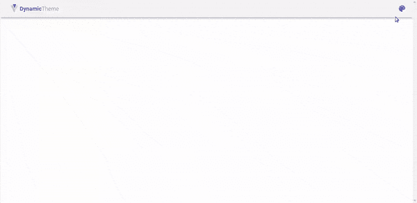

# 在 Vuetify.js 中动态更改应用程序的主题

> 原文：<https://betterprogramming.pub/changing-application-theme-dynamically-in-vuetify-js-c01d640699c4>

## 构建和更改主题，以适应应用程序的不同用途


Lukasz Szmigiel 在 [Unsplash](https://unsplash.com?utm_source=medium&utm_medium=referral) 上拍摄的照片。

[vue 化](https://vuetifyjs.com/en/)是 [Vue.js](https://vuejs.org/) 的材料设计组件框架。它提供了很多特性，包括在应用程序中有问题地改变主题颜色的能力。让用户能够改变主题是一个很好的定制功能，可以让他们的应用程序更加个性化。

在本文中，我们将创建一个 Vuetify web 应用程序，它可以在运行时在主题之间动态变化，也可以在暗模式和亮模式之间切换。

首先，我们将创建一个新的 Vue.js 应用程序。我们可以通过终端上的 Vue CLI 实现这一点:

```
vue create dynamic-theme
```

完成后，我们将 Vuetify 添加到新创建的应用程序中，方法是将当前目录更改为我们的应用程序文件夹，并运行以下命令:

```
vue add vuetify
```

现在我们可以在开发模式下运行我们的应用程序了:

```
yarn serve
```

使用您选择的 IDE 打开应用程序文件夹，并在名为`ThemeChangerMenu.vue`的`src/components`文件夹中创建一个新的 Vue 组件。这个组件将只是一个标准的 Vuetify 菜单，将持有我们的主题选择和黑暗模式开关。所有的主题改变逻辑也将包含在这个组件中。

让我们从添加`v-menu`组件到我们的模板开始。我们将使用一个带图标的按钮来打开菜单，并在一个`v-card`组件中显示我们的主题选项:

让我们添加一个开关，在黑暗和光明模式之间切换。为此，我们用`v-model`指令将开关绑定到`$vuetify.theme.dark`变量，这将创建一个与变量的双向绑定:

为了显示和测试我们的菜单，将`ThemeChangerMenu.vue`导入到`App.vue`并将其放在`v-app-bar`组件中:

我们现在应该有一个功能性的黑暗模式开关:



好吧！我们现在可以继续下一部分，这是启用不同的预定义主题选择之间的切换。创建一个名为`themes`的新数据属性，它包含一个主题数组:

正如您在上面的代码片段中看到的，我们存储了一个对象数组，每个对象都有一个名称和颜色定义，用于主题的深色和浅色变体。然后我们把它们显示在菜单上:

我们现在唯一缺少的是`setTheme`方法，在这里我们将放置我们的主题改变逻辑:

当从菜单中选择一个主题时，我们关闭菜单，然后迭代地为浅色和深色变体设置主题颜色。我们还保存了主题的名称，这将让我们知道当前选择了哪个主题。

现在我们的主题转换器功能齐全:


好了，这篇文章就到这里。您将在这个[库](https://github.com/eyuelberga/vuetify-dynamic-theme)中找到源代码。此外，请查看 GitHub 上的演示[。请在评论区分享你的意见或建议。](https://eyuelberga.github.io/vuetify-dynamic-theme/)