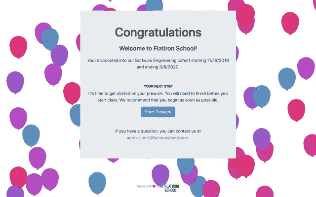
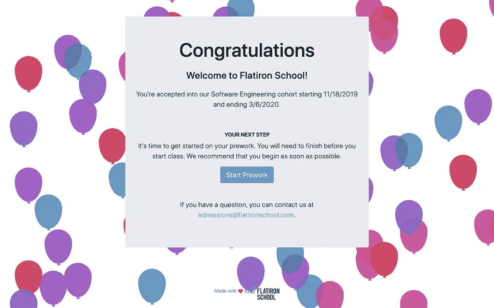

# 改变齿轮:我如何决定学习编程和改变我的生活

> 原文：<https://betterprogramming.pub/changing-gears-how-i-decided-to-study-programming-and-change-my-life-db404a5e272c>

## 我成为初级工程师的旅程

自 2013 年以来，我一直在技术领域与开发人员合作，但每当他们谈论编程时，我就觉得自己突然来到了一个不同的星球，那里的人说着其他语言。我不知道他们在说什么。

具有讽刺意味的是，因为我组织了多个开发者大会，包括纽约市的[droid con](https://www.nyc.droidcon.com/)和 T2 的【droidcon SF】，等等。

想象一下这种情况——您刚刚组织了一次成功的开发者大会，现在正在会议派对上享受一些受之无愧的饮料。你正在和一些演讲者就与代码无关的事情进行愉快的交谈。然后其他人加入并提出一个会议讨论，整个小组深入讨论这个主题，从英语转换到代码讨论。

你在那里微笑着，努力让自己看起来不那么格格不入。似曾相识？

我一直在想，学习一些代码只是为了更好地了解它的全部，这是很好的，但我从未想过要完全转向成为一名开发人员。我为什么要让自己退步，重新开始呢？我永远也赶不上那些已经做了 10 多年的人。

此外，坦率地说，这是缺乏容易接近的榜样。我认识一些女性开发人员，但由于她们中的大多数都是我会议上的发言人，我从来没有把自己和她们联系在一起。他们在光年之外。我从未想过我可以像他们一样——直到我在一次聚会上遇到了像我这样的人。

在参加编码训练营并成为一名全栈工程师之前，她是一名记者。我和她聊了聊当时的情况，并对她的经历很感兴趣。突然间，成为一名软件工程师似乎成为可能。那我该做吗？

我花了几周时间思考这个问题，并提出了支持这个观点的理由:

1.  通过了解编程，我在科技行业会感觉更舒服，因为这一切都围绕着代码。我不会再觉得自己是个局外人了。
2.  这是一条更直接的职业道路，世界各地都有很多工作机会。他们的工资也很高，这没什么不好。
3.  如果随着时间的推移，这是我想做的事情，那么探索类似 scrum master，engineering manager，product manager，或者 developer advocate 这样的工作会更容易。
4.  我的个人座右铭在这里很有帮助——后悔你做过的事比后悔你没做过的事要好。我觉得如果我没有迈出这一步，我以后会后悔的。
5.  总而言之，从各方面考虑，这只会让我的生活和事业变得更好。我没有什么可损失的(从长远来看，损失的收入会得到补偿)。

# 所以决定已经做出了——我该如何开始学习编程？

我喜欢在线课程——但不是这类课程。我认为最好是亲自学习，能够向真人提问，而不是通过信使。而且，这样更好玩！

我知道熨斗学校已经有几年了，我知道他们有免费的训练营预备课程。它从 HTML 和 CSS 开始，然后进入 JavaScript 和 Ruby。大约在同一时间，我接到熨斗的电话，邀请我去做一个介绍。我愿意这么做吗？当然可以！

如果可能的话，一定要进行定位。这是了解这个地方的样子和了解人们的好方法。此外，你可以了解一些网上还没有的信息，比如他们有一个快速通道周末。这是一个免费的周末课程，可以快速跟踪你的训练营准备工作，看看你是否喜欢编码。我抓住了这个机会，在 10 月 26-27 日学习了 Ruby 的基础知识。周末有一个代码挑战，如果你通过了那个代码挑战，你就不用做技术面试了。

我通过了代码挑战，并接到通知，我被 11 月 18 日开始的下一批录取了。太刺激了！

我有三周的时间做课前准备，但那是另一回事了。

附注:我参加编码训练营已经三周半了，目前为止我很喜欢。天天盼，编程技术突飞猛进。关于编码训练营，你有什么想知道的吗？让我知道！

感谢阅读！