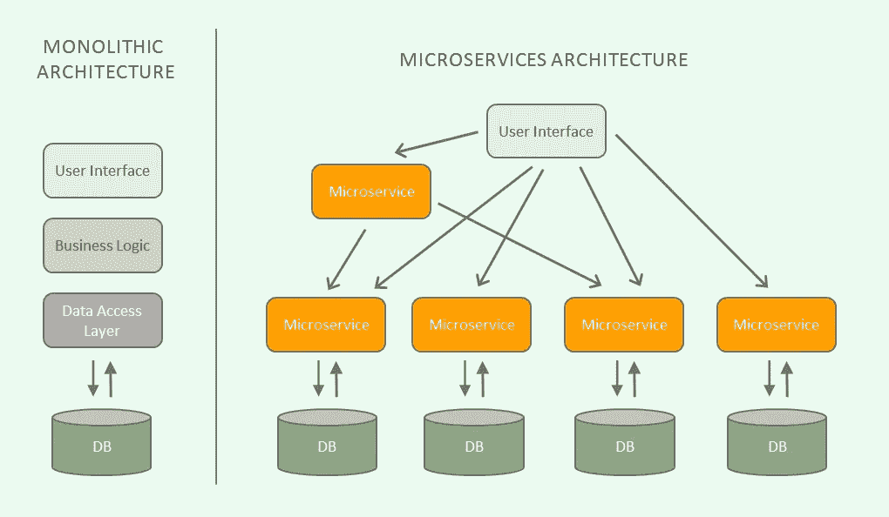
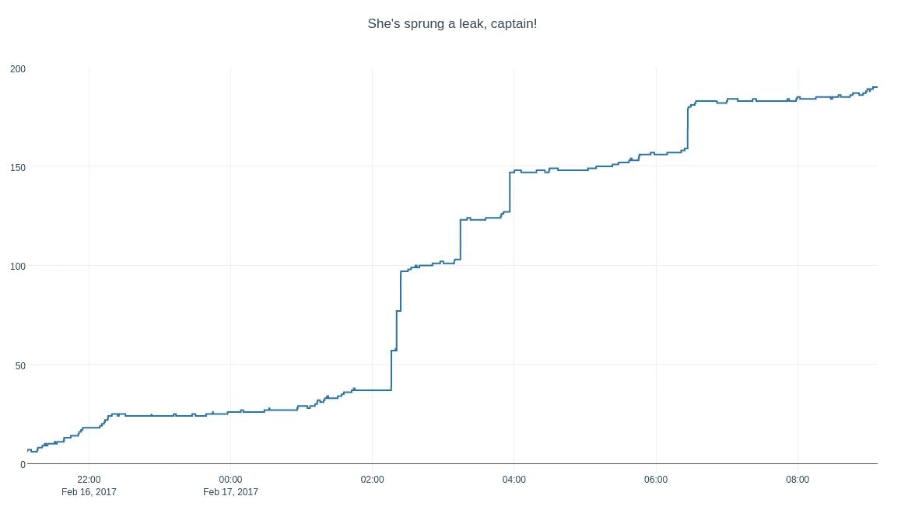
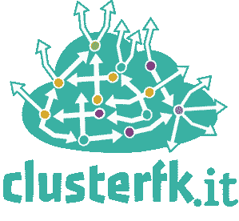

# 混沌工程:混沌测试你的 HTTP 微服务

> 原文：<https://betterprogramming.pub/chaos-engineering-chaos-testing-your-http-micro-services-acc99d145515>

## 失败中的成功和失败中的成功


网飞的[混沌猴](https://medium.com/netflix-techblog/tagged/chaos-monkey)主要负责普及[混沌工程](https://en.wikipedia.org/wiki/Chaos_engineering)的概念。

TLDR:如果微服务所依赖的服务以某种方式出现故障(而你没有处理好)，那么你的微服务很容易出现意外故障。使用“混沌代理”对你的 HTTP 微服务进行故障测试。

这是我之前做的一个:

[](https://github.com/clusterfk/chaos-proxy) [## cluster fk/混沌代理

### ClusterF** Chaos 代理是一个不可靠的 HTTP 代理，您可以依赖它；一个为混沌测试设计的轻量级工具…

github.com](https://github.com/clusterfk/chaos-proxy) 

# 混沌工程——它是什么？

混沌工程是一个伟大的想法——建立一个自动化的解决方案/工具，随机尝试以某种方式破坏一个系统；最终了解系统在这种情况下的行为。然后，您可以使用新获得的知识来寻找方法，使系统在将来的这些故障条件下具有更强的容错能力。

# 什么是混沌代理？

混沌代理是一种你的微服务可以连接的服务。

它将流量路由到真正的目的地微服务，并通过代理将响应返回给微服务，但这种方式非常不可靠。

通过代理，请求会以意想不到的方式随机延迟和/或随机失败——所有这些都是为了帮助您了解微服务如何响应这些不同的失败条件。

# 为什么会有人想要一个不可靠的 HTTP 代理？

一切终将失败。一切。

接受它，拥抱失败。为失败设计。*在失败中成功。*

微服务经常通过 REST 和 HTTP 与其他服务通信。当微服务所依赖的服务不可避免地以某种不可预测的方式失败时，您的微服务如何应对？



承蒙:[https://blog.algorithmia.com/introduction-to-microservices/](https://blog.algorithmia.com/introduction-to-microservices/)

如果微服务所依赖的服务发生故障 *(* )，并且您没有考虑到故障或者定义您的服务应该如何运行 *)* ，那么您的微服务很容易出现意外故障。

# 这为什么有用？

最近我在调查一个微服务中的 JDBC 连接泄漏。

随着现代框架将 JDBC 操作抽象化，连接泄漏现在不应该真的发生，但是唉，连接泄漏确实发生了。



提供:[https://jsherz . com/leak/memory/connection/database/graphing/plotly/python/Linux/2017/02/16/finding-connection-leak . html](https://jsherz.com/leak/memory/connection/database/graphing/plotly/python/linux/2017/02/16/finding-connection-leak.html)

我想评估微服务(A)对它所依赖的另一个微服务(B)的故障和延迟的恢复能力。

我需要一种方法来模拟微服务“B”中的周期性故障和延迟，同时在本地对微服务“A”执行请求和自动回归测试。

我可以在远程环境中访问微服务“B ”,但由于各种限制，我无法在本地运行“B”来尝试修改它以发出故障。

我真的找不到轻量级的、相当容易设置的、能实现我希望实现的东西。

经过一番折腾之后， [ClusterFk 混沌代理](https://github.com/clusterfk/chaos-proxy)的第一次迭代诞生了！

多亏了 ClusterFk Chaos Proxy，我才能够识别出，如果微服务‘B’的响应有足够的延迟，微服务‘A’中的 JDBC 连接就会堆积起来，只要 HTTP 请求处于活动状态，就会一直存在——即使 JDBC 事务实际上早就提交了。

已知原因后，这为该问题提供了一系列可能的解决方案(以及通过混沌代理测试其有效性的简单方法)，例如:

*   对从“A”到“B”的请求实施受控超时。
*   实现 JDBC 连接的超时并返回连接池。
*   使处理元素异步，以便请求线程更快地退出。

# **ClusterFk 混沌代理**



[https://github.com/clusterfk/chaos-proxy](https://github.com/clusterfk/chaos-proxy)

前提很简单:

*   配置本地运行的被测服务指向混沌代理，配置混沌代理指向真正运行的依赖目的地服务。
*   打开ClusterFk 混沌代理，配置一个“混沌策略”。
*   使用你的微服务(向它开火)。
*   观察世界燃烧(通过监控日志或通过应用程序行为)。
*   可选—从混乱中学习并实施更改，以提高您的微服务的弹性。
*   重复一遍。

在第一次把混沌代理放在一起的时候，我并没有真正意识到混沌代理的概念，但是我决定完成第一次迭代。

# **入门**

ClusterFk 混沌代理在 [DockerHub](https://hub.docker.com/r/andymacdonald/clusterf-chaos-proxy) 上。要简单安装:

```
docker pull andymacdonald/clusterf-chaos-proxy
```

然后用目的地服务细节配置一个`docker-compose`文件——例如，如果您的‘B’服务运行于`[http://10.0.0.231:8098](http://10.0.0.231:8098:)` [:](http://10.0.0.231:8098:)

```
version: "3.7"
services:
  user-service-chaos-proxy:
    image: andymacdonald/clusterf-chaos-proxy
    environment:
      JAVA_OPTS: "-Dchaos.strategy=RANDOM_HAVOC -Ddestination.hostProtocolAndPort=http://10.0.0.231:8098"
    ports:
      - "8080:8080"
```

根据项目的 README.md **:** 配置混沌策略

```
**NO_CHAOS** - Request is simply passed through**DELAY_RESPONSE** - Requests are delayed but successful (configurable delay)**INTERNAL_SERVER_ERROR** - Requests return with 500 INTERNAL SERVER ERROR**BAD_REQUEST** - Requests return with 400 BAD REQUEST**RANDOM_HAVOC** - Requests generally succeed, but randomly fail with random HTTP status codes and random delays
```

然后干脆:`docker-compose up`

一旦应用程序启动，您就可以将您想要测试的微服务指向您的 ClusterFk Chaos Proxy 实例(而不是真正的目标服务)。然后启动微服务，开始测试和使用它。

根据您选择的策略，代理将根据您发送给它的请求来影响策略。

可能最有用的策略是`RANDOM_HAVOC`和`DELAY_RESPONSE`——但是你仍然会发现其他策略也很有用。

将来会添加更多的功能和更多的可配置选项！

# 建议

如果你能对这个项目给出一些反馈，如果你觉得有用，我将不胜感激。

# 感谢阅读！😃

希望您喜欢这篇文章以及对混沌代理概念的介绍。

虽然我在这里使用了我自己的项目，但是这个概念实现起来非常简单。请随意接受我的项目，叉它或只是做你自己的实现！