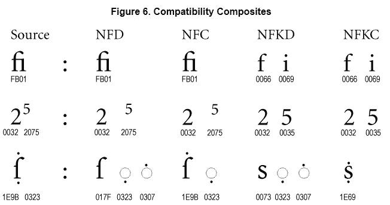
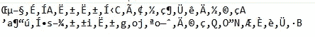

# 字符编码，第 3 部分，共 3 部分—使用 Unicode 时遇到的问题

> 原文：<https://betterprogramming.pub/character-encoding-part-3-of-2-gotchas-while-working-with-unicode-9f5ec272351d>

## 一个错误在编程中是很常见的，对吗？

我们完了！(摄影:兰迪·欧)

所以在我发表了最初的两篇字符编码文章([第一部分](https://medium.com/better-programming/character-encodings-the-pain-that-wont-go-away-part-1-2-non-unicode-dee7650fb6bf)和[第二部分](https://medium.com/better-programming/character-encodings-the-pain-that-wont-go-away-part-2-2-unicode-4f13a0d2d42d)这里)后，几个朋友插话说我遗漏了故事的一个重要部分。Unicode 边缘案例和陷阱！他们是对的。虽然使用这种东西表面上很简单，但现实世界充满了惊喜。

这是一个比我自己的个人使用更深入文本技术用法的话题，所以我将依赖许多资源和比我更熟悉文本和字符编码的人。

开始吧，不分先后。

# 比较组合字符和预先组合的字符不是一个好主意(除非你规范化)

Unicode 允许组合字符(例如给字母添加重音符号)。它还将包含预先组合的字符(带有重音符号的字母已经作为单个字符附加)。它们看起来完全一样，Unicode 认为它们在语义上是相同的。这些东西占用不同的代码点，如果你天真地用字节来比较字符串，你会得到错误的答案。

一个字符上也可以有多个重音符号——符号的顺序通常对字符的显示无关紧要，但比较字节的笨计算机会看出不同。所有这些都不好。

因为 Unicode 认为这种情况在语义上是等价的，所以它提供了一种规范化字符串的方法，这样任何字符串都可以与相似的规范化字符串进行比较，并产生**一致的**结果。

标准化形式的例子，NFD，NFC，NFKD，NFKC。来源: [Unicode](http://unicode.org/reports/tr15/#Canonical_Composites_Figure)

正式来说，有四种形式:分解的 NFD-标准规范形式，合成的 NFC-标准规范形式，以及 NFKD 和 NFKC 是规范形式(k)兼容性版本。兼容性版本将把下标和连字等特征分离出来，并把它们当作单独的字符。

在大多数情况下，使用四种规范化形式中的哪一种来比较字符串并不重要，只要两个字符串使用相同的规范化。这些操作是等幂的，所以确保您使用的规范化是正确的不会有什么坏处。当系统对标准化做出矛盾的假设时，各种各样的混乱都会发生。

我发现了一些问题:

*   在某些范围没有被正确标准化的情况下，OSX 使用自己的标准化风格。iconv 工具专门为此提供了 UTF-8-mac 编码。这里有些[细节](https://metacpan.org/pod/Encode::UTF8Mac)。
*   对于串联来说，标准化可能不稳定。规格化(X+Y)是*而不是*与规格化(X) +规格化(Y)不一定相同。所以调用规范化时要小心。幸运的是，这个过程是幂等的，所以多次运行它只需要一些计算。[细节](http://unicode.org/reports/tr15/#Concatenation)。
*   规范化为复合形式(NFC/NFKC)有时可能会使字符串更长！这是因为出于兼容性原因，Unicode 将 3.1 版声明为“复合版本”。不鼓励新的组合，那些确实存在的组合可能会采用一个组合字符，并将其分解为 3.1 加一个组合字符。

# Unicode 几乎可以编码任何东西——包括 Mojibake

Mojibake 是指计算机使用错误的编码将字节转换为人类可读的字符。这意味着 mojibake 虽然从人类的角度来看是无意义的，但实际上是由某种语言中的有效字符组成的，尽管顺序毫无用处。

一些例子 mojibake

这意味着，如果有人获取一个传入的流，使用错误的编码对其进行解释，然后将其代码转换为 Unicode — **Unicode 会欣然接受字符序列并按原样存储它们。**由于检测遗留编码方案可能有些容易出错，并且不是每个人都了解文本编码的细微之处，这导致了损坏的不正确 Unicode 将进入数据集的情况。

幸运的是，有人发明了一种方法来解决这些问题。Robyn Speer 创建了一个名为 ftfy 的 [python 库，它使用许多试探法来猜测某些字符序列何时看起来不适合上下文，并试图纠正它们。如果你正在做大量的文本工作，并且不确定数据的质量，这将非常有用。](https://github.com/LuminosoInsight/python-ftfy)

我强烈推荐看一下[评论良好的源代码](https://github.com/LuminosoInsight/python-ftfy/blob/master/ftfy/badness.py)，看看它是如何平衡各种考虑的，比如有可能存在有意的数学等式和表情符号的“眼睛状/鼻子状”符号，而不是“真正的 mojibake”

感谢 Igor 指出有一个包可以修复这种特殊的边缘情况。我不怎么接触文字，也没有意识到。

# Unicode 的字符串长度很奇怪

从概念上讲，字符串的长度是字符串中的字符数。除了因为 UTF-8 是可变宽度的，UTF-16 有代理对，Unicode 有组合字符本身不是独立的字符，你不能简单地计算字节块来得到字符串的长度。只不过这是传统字符串长度计算的数量。

除非您特别使用正确的支持 Unicode 的长度函数，否则您可能会得到奇怪的答案。例如，JavaScript 在内部使用 UTF-16，但是它可以[给出有趣的长度结果，因为它是如何计算](https://dmitripavlutin.com/what-every-javascript-developer-should-know-about-unicode/#33-string-length)的。它将单个代理项对字符计为两个字符，而不是一个。你甚至不能指望规范化来最小化字符串的字节长度，因为如上所述，规范化有时会使字符串具有更长的代码单元序列！

一般来说，一旦你进入 Unicode，字符串长度充其量是一个模糊的概念。你可能会想避开它。

# 当心损坏的 Unicode 实现，它们就在那里

当开发人员考虑实现 Unicode 时，第一条建议很简单:**不要**。请改用现有的库。所以很少会遇到不可靠的 Unicode 实现。

然后，还有 MySQL…

由于 MySQL 长期以来保持的快速但不一定正确的传统，它在 2002 年改变了最初的“utf8”(基于 T4 RFC 2279 中的 6 字节 UTF-8)编码，使其最大为 3 字节。UTF-8 ( [RFC 3629](https://tools.ietf.org/html/rfc3629) )最多可以有四个字节，这意味着基本多语言平面(BMP)之外的几乎所有东西都将出错。

目前，在 MySQL 8 中，UTF-8 仍然被声明为“[utfmb 3](https://dev.mysql.com/doc/refman/8.0/en/charset-unicode-sets.html)的别名”。用四个字节工作的 UTF-8 的正确形式叫做 [**utfmb4**](https://dev.mysql.com/doc/refman/8.0/en/charset-unicode-sets.html) **。这就是你应该使用的。出于向后兼容的原因，这种情况可能永远不会改变。**

关于整个 MySQL(和 MariaDB) UTF-8 疯狂的更多细节可以在这里找到。

# 同样，确保“UTF-8”标签确实是 UTF-8

[Oracle 同样有非直观的字符编码参数](https://docs.oracle.com/database/121/SQLRF/ap_standard_sql015.htm#SQLRF55539)，与 Unicode 6.2 兼容的 UTF-8 被称为“AL32UTF8”，而他们的“UTF8”实际上是与 Unicode 3.0 兼容的，符合 CESU-8。CESU-8 是 UTF-8 的变体，它使用两个 3 字节序列来模拟 UTF-16 代理对，以访问更高的字符平面。这类似于 MySQL 最初兼容的 6 字节 UTF-8。

Java 也有一个“[修改的 UTF-8](https://en.wikipedia.org/wiki/UTF-8#Modified_UTF-8) ”，它的行为有点像 CESU-8，但是围绕空字符有一些不同的逻辑。它还支持标准的 UTF-8。通常情况下，你可以正常使用 UTF-8，但修改后的 UTF-8 在某些情况下会让你措手不及。

# 有时，即使是使用良好的库也会有 bug

Unicode 中存在许多不同类型的脚本，但世界上绝大多数使用非常小的子集，这一事实导致即使在非常大的软件公司的库中也存在有趣的错误。

一个例子就是影响 iOS 的[角色死亡](https://manishearth.github.io/blog/2018/02/15/picking-apart-the-crashing-ios-string/)[。在这种情况下，Unicode 本身很好，但是它使用印度文字。这些文字有一些独特的规则来组合字符和音调符号，以代表某些辅音-元音。这导致字体渲染引擎出现问题，从而导致崩溃。不管是哪种情况，特定的字符序列都会导致各处的 iPhones 崩溃，直到错误被修复。](https://www.unicode.org/mail-arch/unicode-ml/y2018-m02/0103.html)

# 性格检测会以奇怪的方式背叛你

还记得在第 1 部分中，我展示了字符检测是如何被愚弄的吗，尤其是在短字符串上？在研究这个的时候，我发现了一个很好的例子，维基百科上有一个很搞笑的页面叫做“[布什隐瞒了事实](https://en.wikipedia.org/wiki/Bush_hid_the_facts)”这是指字符集检测以某种方式获取记事本中的文本，将其检测为中文，并将其转换为无意义的 Unicode。

总的来说，Windows 很早就支持 Unicode，可以追溯到 USC-2(它早于 UTF-16，但不支持代理对，因此只能表示 BMP 字符)。围绕 UCS-2/UTF-16 构建的悠久历史意味着围绕 UTF-8 会有一些古怪。

# 记住你仍然需要正确的字体

Unicode 对字形进行编码，但是通过使用字形向用户显示字形的最后一步是另外一个问题。您可以指定想要显示的任意数量的字符，但是如果您的最终用户没有该字体，或者有一些奇怪的坏字体，他们仍然不会看到您发送给他们的内容。

如今，系统很好地拥有足够的字体选择，能够呈现大多数文本。主要问题是当新角色加入时——通常是表情符号。这就是为什么虽然一个新的表情符号可能会在 Unicode 标准上声明，但它可能需要一段时间才能进入你的手机。需要用新的字形更新字体。

# Twitter 上 FakeUnicode 的超级道具

直到最近我才熟悉 Unicode，我问这个很棒的 Twitter 帐户是否有什么有趣的问题，天哪，我得到了一堆！我将在这里总结，但你真的应该检查线程，因为我不能真正做到公正，而不只是复制粘贴整个事情。

*   [在密码中使用表情符号会导致奇怪的行为，获得相同符号的顺序已经改变](https://twitter.com/FakeUnicode/status/1189366901270568960)。
*   按代码单元(字节)排序通常不是一个好主意(Unicode 特别建议您使用 Unicode 定义的排序算法)。代理范围在 BMP 中，有些字符与其他字符相距很远。
*   在某些语言中，从大写转换到小写是不可逆的操作。
*   Unicode 明确规定不能用 0 填充代码点(它规定代码点必须是唯一的，有效地排除了前导零)一些程序不关心这些“过长的编码”——vim 就是这样一个程序。
*   不管怎样…这…是:

外面有更多的疯狂。我很确定。但是这个列表已经够长了，我可以忍受至少一个月不去想 Unicode。所以我要在这里结束它！

# 额外阅读

很难找到关于 Unicode 的这些不寻常的特性的文档。但是除了我在正文中已经链接过的，这里还有一些:

 [## 全球化抓住了你——玛奇朵

### 我正在为三月份的下一次 Unicode 会议准备一个演示，并且一直在考虑做一个关于…

www.macchiato.com](http://www.macchiato.com/unicode/globalization-gotchas)  [## Unicode 的黑暗角落

### 我假设，如果你在互联网上阅读书呆子的博客，你知道 Unicode 是什么。最重要的是…

eev.ee](https://eev.ee/blog/2015/09/12/dark-corners-of-unicode/)  [## 每个程序员都应该知道的关于 Unicode 的一些问题

### 编辑描述

nukep.github.io](https://nukep.github.io/progblog/2015/02/26/some-gotchas-about-unicode-that-every-programmer-should-know.html#characters-that-appear-the-same-might-not-test-equal) 

# 谢了？

我全心全意地责怪这两个人促使我开始写第三篇文章。都是你的错。

 [## TJ·墨菲

### TJ 墨菲的最新推文(@teej_m)。数据呆子。之前的@imgur、@minted、@minomonsters、@zynga。我做了一个…

twitter.com](https://twitter.com/teej_m)  [## 伊戈尔·布里格迪尔

### Igor Brigadir 的最新推文(@IgorBrigadir)。PhD @insight_centre @ucddublin。机器学习，自然…

twitter.com](https://twitter.com/igorbrigadir)