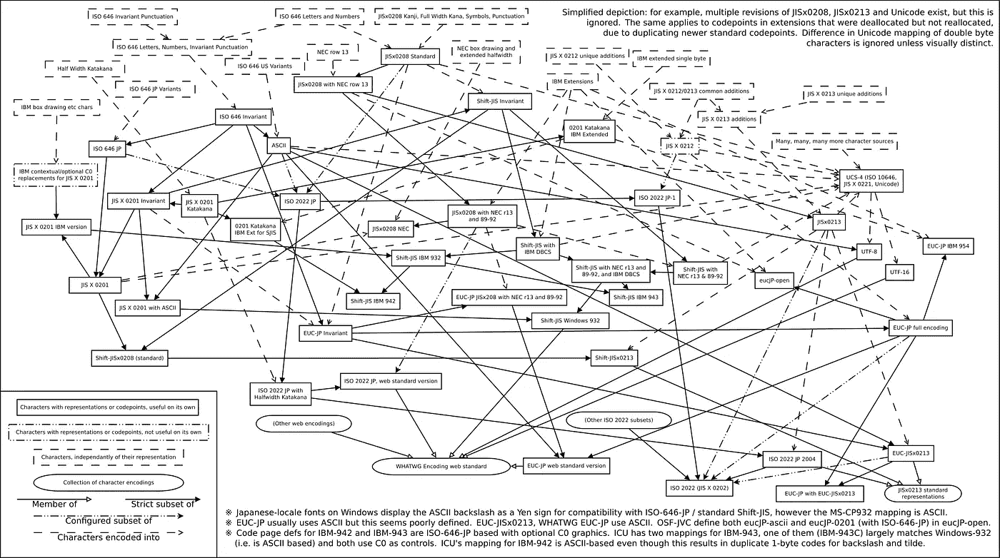
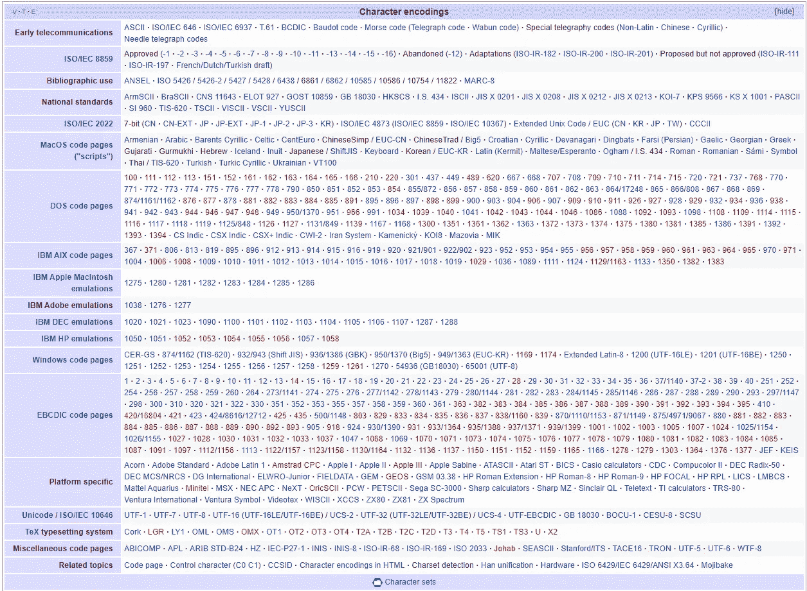
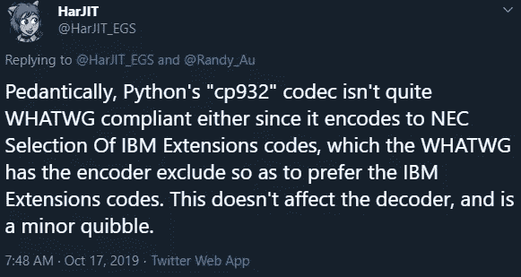

# 字符编码——挥之不去的痛，第 1/3 部分:非 Unicode

> 原文：<https://betterprogramming.pub/character-encodings-the-pain-that-wont-go-away-part-1-2-non-unicode-dee7650fb6bf>

## 我们是如何走到这一步的，我们又是如何走出这一步的，以及如何应对


让我们凝视疯狂。(摄影:兰迪·欧)

即使在工程师中，字符编码的细节通常也是一个令人困惑的谜。对于数据科学家来说，这更是一个谜。让我们学一点东西，为在我们的数据集中处理它做准备。

字符编码，即字母和符号在计算机上的表示，是一个永远不会消失的问题；只能减轻痛苦。原因很简单——只要人类不能阅读二进制而需要阅读字符，就总是需要将比特和字节转换成符合语言和计算限制的字符。

这个问题之所以成为巨大的痛苦，是因为它已经在**存在了一个多世纪。莫尔斯电码是一种非常原始的字符编码形式，然而在处理其他国家和语言时，电报代码也存在类似的混乱。这么长的历史意味着，随着技术的发展，这个问题有足够的时间积累黑客攻击、边缘案例和冲突的标准。**

# TL；作为数据科学家，你需要知道的关于文本编码的事实

在我们深入讨论之前，让我们先了解一下您需要了解的关于字符编码的最重要的事实。

1.  “纯文本”是虚构的；它不存在。
2.  一切都以某种方式编码，包括“纯文本”
3.  猜测编码将*而不是*在*所有*情况下都有效。
4.  我们现在有 Unicode 了。用那个。其他都是遗留支持。

当我们回顾我们是如何走到这一步的历史，以及稍微探究一下引擎盖下的情况时，这些事实将是有意义的。

# “纯文本”是一个谎言——一切都被编码了

当人们想到“纯文本”时，他们通常会想到 ASCII，这是 128 个字符的 7 位编码，大多数现代字符编码都可以追溯到这种编码。问题是几乎没有最终用户系统真正使用直接的 ASCII 了。即使是在美国中部购买的普通 Windows 7 机器也将使用代码页 1525——你可能知道它是“Latin-1”——而不是直接的 ASCII。在内部，Windows 使用 UTF-16 并推荐新的应用程序也使用它。

> "新的 Windows 应用程序应该使用 UTF-16 作为他们的内部数据表示."— [Win32 Unicode 文档](https://docs.microsoft.com/en-us/windows/win32/intl/unicode)

你的文字处理器自动插入到你的文本中的那些卷曲的“智能引号”?你的欧洲朋友使用的音调符号？垃圾邮件中出现的间距奇怪的“全角”文本？长破折号？这些在 ASCII 中都不存在，这意味着如果你必须处理这些文本，你需要知道它们是如何被编码的，才能正确理解它们。

# 研究编码的历史对我们没有帮助

对许多事情来说，了解历史和背景，了解事物是如何和为什么被创造出来的，通常有助于理解为什么会做出某些看似武断的决定。可悲的是，字符编码的情况是**而不是**。



PC 上的 Shift_JIS 变量和相关编码之间的关系，包括交集和其他子集。来源:[维基百科](https://en.wikipedia.org/wiki/Shift_JIS)

从根本上来说，导致今天存在的数百个代码页和编码的任意人类决策链没有一个共同的线索，让您可以将它们全部联系到一个易于记忆的叙述中。

编码通常是根据当地环境创建的。有一个需要被满足，也许是向后兼容另一个系统。互操作性在优先级列表中处于较低的位置。

所以理解编码的历史将让你记住奇怪的细节，比如 UTF-7 编码(这不是官方的 Unicode 标准！)的存在主要是因为[传统的电子邮件服务器只允许 7 位 ASCII 码](https://en.wikipedia.org/wiki/Unicode_and_email#Unicode_support_in_message_bodies)，这比把所有东西都转换成 base64 更容易。尽管如此，没有任何历史课能让你完全理解那场噩梦，那就是除了死记硬背之外的极移-JIS 日语编码标准的许多变体。

# 最终的解决方案是 Unicode，其他一切都是脆弱的、定制的

我们将在本系列的第二部分[中介绍 Unicode，但是现在，可以说 Unicode 标准的创建是为了将用于书写语言的每一个符号都放在一个框架中，以避免困扰代码页的冲突。](https://medium.com/better-programming/character-encodings-the-pain-that-wont-go-away-part-2-2-unicode-4f13a0d2d42d)

Unicode 通过在二进制位和显示的字符之间添加一个抽象层来实现这一点。现在每个角色都被分配了一个唯一的**代码点**——你可能以前见过的“U+0041”数字。代码点**不**要求(也不打算)是字符的实际二进制数。

通过将所有内容映射到一个名称空间，它可以防止竞争的编码意外地指向同一个内容。旧的编码系统缺乏这种抽象，所以人们对不同的事物使用相同的序列。这个缺陷正是这篇文章存在的原因。

在 Unicode 下，各种字符编码格式用于定义二进制如何映射到 Unicode 码位。UTF 代表“Unicode 转换格式”，这就是为什么 UTF-8、UTF-16 和 UTF-32 都作为独立的事物存在，并对 Unicode 标准进行编码。对于不需要全部字符支持的系统，也存在 Unicode 的子集。



维基百科的字符编码列表

# 什么是代码页以及如何处理它们

代码页是一个位序列(一个代码单元)到一个特定字符(一段具有语义的文本)的直接 1:1 映射。这是一个查找表——计算机看到一个位序列，查找它，并向用户显示适当的字符。简单。

ASCII 的早期迭代是用 7 位定义的，因为当时只需要 128 个二进制序列就可以包含所有的英文字母、数字、符号和控制字符。在 ASCII 码中，没有*先验*的理由说明“A”是 0x41。当他们排列所有他们想要的符号时，事情就是这样解决的。

由于那时计算机已经在 CPU 中使用 8 位字节，工程师们很快意识到还有整整 128 个额外的值可以使用。当系统设计者开始使用一个字节的第八位来表示额外的 128 个字符时，事情开始变得疯狂。这最初是在没有任何标准化的情况下完成的，因为不同国家的本地供应商为他们的本地客户做了一些工作。

最终，事情会被标准化(通过 ISO/T4 IEC 8859 标准或类似的标准)。但是厂商们仍然会出于他们自己的原因**创造他们自己的标准变体(例如，微软的 cp-932 和 x-mac-japanese 基于日语文本的移位 JIS 编码)。**

请记住，所有这些都发生在 70 年代到 90 年代，远在互联网连接一切之前。一台计算机与另一家厂商的另一台计算机共享数据的机会已经相当低了，尤其是跨语言的。忽略不兼容的问题更容易。

尘埃落定，一些标准达成一致后，“代码页”的概念就产生了。对于每个代码页，较低的 128 个值保持与 ASCII 相同，而对较高的 128 个值的不同选择都有自己的代码页名称。如今， [CP-1252/Windows-1252](https://en.wikipedia.org/wiki/Windows-1252) 是 Windows 上拉丁文字的标准代码页，CP-932 是微软 Windows 的日语代码页，等等。


将 mojibake 日文文本误读为 Latin-1 的示例

最终的结果是，除非字符集被明确声明，否则计算机需要猜测使用的是什么编码。如果猜测是错误的，您将得到[moji bake](https://en.wikipedia.org/wiki/Mojibake)——无法理解的错误字符垃圾，没有任何语义意义。

# 双/三字节字符集，可变宽度字符集是一个东西

一直以来，我只讨论了 8 位大小的代码页。对于少于 256 个符号的许多欧洲语言来说，这些都很好。但是使用汉字的亚洲语言，如中文、日文和韩文，可以使用数万个字符。所以，他们只需要更多的比特来表示一切。

解决方案是使用两个字节(65，536 个可能的映射)，有时甚至是三个字节(1677 万)来表示您想要显示的所有内容。这创造了大量的“空间”来将更多的符号映射到数字，但它变得更加资源低效。例如，如果您主要使用位于映射的第一个字节区域中的 ASCII 字符，那么您会有许多全为零的额外字节。

由于 20 世纪 80 年代和 90 年代没有人愿意花钱存储/传输大量的零，可变宽度编码被创造出来，只在需要时才尝试使用两三个字节。

由此，您可以得到各种编码标准，这些标准都属于 [ISO/IEC 2022](https://en.wikipedia.org/wiki/ISO/IEC_2022) 标准，这些标准定义了一系列转义序列，让各国为自己的语言设定自己的国家标准。我们由此得到 [GB 2312](https://en.wikipedia.org/wiki/GB_2312) 、 [JIS X 0201](https://en.wikipedia.org/wiki/JIS_X_0201) 、 [KS X 1001](https://en.wikipedia.org/wiki/KS_X_1001) ，以此类推。供应商将实现这些标准，并经常在其上添加他们自己独特的味道，只是为了让生活更有趣。

# 字符集检测充其量只是一种有根据的猜测

所以，如果有有限数量的代码页，并且语言不同，那么一定有一种方法可以让算法找出正在使用的编码，对吗？

太好了。但也不尽然。

世界上有一些图书馆，在那里，非常了解字符编码和国际字符集的人编写代码来判断一个字节流是俄语、中文还是希腊语。

ICU(Unicode 国际组件)组提供了一组用于国际化的 Java 和 C 库。提供的组件之一是[字符集检测器](http://userguide.icu-project.org/conversion/detection)。

Mozilla 还创建了一个“[通用字符集检测器](https://www-archive.mozilla.org/projects/intl/universalcharsetdetection)，用于处理浏览器中使用的字符集的检测。上面的链接是一篇有趣的文章，因为它使用统计分析和某些字符集的属性来计算给定文本片段是某种编码的可能性。这包括使用中文/日文/韩文表意文字分布的统计文本分析来帮助确定正在使用的编码。

因为它是一种统计方法，字符集检测在处理较大的数据样本时效果更好。这就是为什么对于非常短的文本，比如 tweets，编码检测会变得不可靠。如果推文使用非正式语言和俚语，可能偏离用于构建检测器的基本语料库数据，这种情况尤其如此。

由于检测不能保证有效，**我们应该总是努力发送带有明确定义的字符集的数据。当我们有编码不明确的数据时，我们也应该非常怀疑和谨慎。**

## 使用 Python 3 的一些例子

Python 3 在内部将字符串存储为 Unicode 格式——它们有一个单独的 byte()类型，可以存储字符串的实际二进制编码实例。因此，在下面的例子中，我可以将一个给定的字符串强制转换成各种编码，并通过内置的字符集检测器运行它。让我们看看会发生什么。

```
#Example using Python 3, Pure ASCIIIn : import chardet #character detection library
In : s = 'A sample sentence' #uses only ASCII charactersIn : chardet.detect(s.encode('cp1252'))
Out: {'encoding': '**ascii**', 'confidence': 1.0, 'language': ''}In : chardet.detect(s.encode('cp932'))
Out: {'encoding': '**ascii**', 'confidence': 1.0, 'language': ''}#Most older encodings show as ASCII because their lower 128 values are ASCII and only differ > 128In : chardet.detect(s.encode('utf8'))
Out: {'encoding': '**ascii**', 'confidence': 1.0, 'language': ''}
#UTF-8 is ASCII backwards compatible and looks like ASCII in this situationIn : chardet.detect(s.encode('utf16'))
Out: {'encoding': 'UTF-16', 'confidence': 1.0, 'language': ''}
#UTF-16 uses 2-bytes per character, so it is definitely not ASCII compatible
```

注意，因为句子是用纯 ASCII 写的，所以检测器(正确地)调用字符串 ASCII。它没有命中任何非 ASCII 字符来告诉它，否则。但我真正的编码方案可能是 cp1252 (Windows Latin-1)、cp932 (Windows shift-jis)，甚至是 UTF-8(设计为向后兼容 ASCII)。**实际上，通过天真地工作，检测器将给出字符串的正确答案，但它可能不是整个文本的正确答案。**

如果我构建了一个数据管道，它没有预料到这些替代编码，没有编写适当的测试来捕获无效字符串，并且有人使用不同的计算机和不同的默认编码方案向我发送数据，那么一旦有非 ASCII 字符进入，所有东西都会爆炸，除非我虔诚地对所有东西运行编码检测。即使我不断地运行编码检测，我也需要确保所有不同的字符串都能在我的后端得到正确的处理。

让我们来看一个非 ASCII 字符串。

```
In : u = u'サンプルです（笑） =D' #actual Japanese text w/ some ASCII
In : u.encode('**cp932**')
Out: b'\x83T\x83\x93\x83v\x83\x8b\x82\xc5\x82\xb7\x81i\x8f\xce\x81j =D'In : u.encode('utf8').hex()
Out: 'e382b5e383b3e38397e383abe381a7e38199efbc88e7ac91efbc89203d44'
In : chardet.detect(u.encode('**utf-8**'))
Out: {'encoding': '**utf-8**', 'confidence': 0.99, 'language': ''}In : u.encode('utf16').hex()
Out: 'fffeb530f330d730eb306730593008ff117b09ff20003d004400'
#Notice how UTF-16 is shorter than UTF-8 for storing CJK textIn : u.encode('**utf7**')
Out: b'+MLUw8zDXMOswZzBZ/wh7Ef8J **=D**'
In : chardet.detect(u.encode('**utf-7**'))
Out: {'encoding': '**ascii**', 'confidence': 1.0, 'language': ''}
# UTF-7 isn't part of the official unicode standard! It's sometimes used for sending Unicode encoded text through emailIn : u.encode('**iso2022_jp**')
Out: b'\x1b$B%5%s%W%k$G$9!J>P!K\x1b(B **=D**'
In : chardet.detect(u.encode('**iso2022_jp**'))
Out: {'encoding': '**ISO-2022-JP**', 'confidence': 0.99, 'language': 'Japanese'}
# ISO2022 is a standard that defines multi-byte encoding schemes, so versions exist for many East Asian languagesIn : chardet.detect(u.encode('**shift-jis**'))
Out: {'encoding': '**SHIFT_JIS**', 'confidence': 0.99, 'language': 'Japanese'}
In : chardet.detect(u.encode('**cp932**'))
Out: {'encoding': '**SHIFT_JIS**', 'confidence': 0.99, 'language': 'Japanese'}
# Shift-JIS and cp932 have a complicated relationship where they are essentially the same, but have a handful of characters that are different
```

当我们处理非 ASCII 文本时，事情变得更加有趣。请注意，UTF-7 编码被检测为 ASCII！这是因为它被设计为通过 7 位纯 ASCII 系统发送(就像电子邮件服务器一样，由于 [RFC 2822](https://tools.ietf.org/html/rfc2822.html) 是基本的电子邮件 RFC，并且它也假设只有 7 位文本)。

此外，请注意，它检测到来自 cp932 的一些文本是移位 JIS。多年来，多家厂商和标准机构推出了许多不同风格的后向兼容性的 JIS。对于这个特殊的字符串，它与两者都兼容，检测器选择了一个。标准在某些字符上不一致，检测器在遇到它们之前不会真正知道。

注意，每一次，库都超级自信(0.99 或 1)它是正确的。因为他们得到的是没有任何背景的小片段，所以他们没有理由不这样想。不要被虚假的安全感所迷惑。

# 字符集检测器可能有 bug！

希望您能理解不同语言的不断变化(有时是竞争)的标准造就了一个非常复杂的世界。通常，除非你有使用特定语言的经验，否则很难区分不同的编码变体。我偶尔和日本人一起工作，但不理解其中的任何细微差别。



来源:[推特](https://twitter.com/HarJIT_EGS/status/1184798318242742272)

这种问题空间为虫子提供了肥沃的土壤。编写探测器的工程师可能只是没有意识到一个微妙或边缘的情况。或者出于某种原因，他们更喜欢一种竞争标准。或者他们是对的，而你的数据源给出了错误编码的输出。

这意味着你会遇到这样的情况，你认为你要疯了，因为一个不应该发生的编码错误突然出现了。在这种情况下，**你可能实际上做的每件事都是正确的**，但有一个错误在你的外部。

不要仅仅因为这些库已经存在了很多年，而且它们是开源的，就认为这些错误已经被发现了。这些编码交互中的一些是如此罕见和特定于系统，你可能是少数几个会遇到它们的人之一。

# 使用字符集检测，但要保护自己

希望上述内容能让您对字符集检测在实际检测“真正的”编码时有多不可靠有所了解。这并不是说您不应该依赖这些库——它们给出的答案将允许您的代码解析手头的字符串(希望转换成 Unicode，这样操作会安全得多)。在复杂的环境中，给定任意短的文本片段，输出是任何人都可以做到的最好结果。

相反，这意味着你需要安装护栏。

最重要的防护措施是**消除对一个子字符串运行字符集检测将告诉您整个字符串的字符集的假设**。不同的子字符串可能会产生不同的结果。理想情况下，您希望同时对整个文本进行检测，以获得最佳结果。如果你必须逐段检测字符串，确保对每一个字符串都这样做，没有假设。

这也意味着你需要变得多疑，并且比你原先认为的更频繁地运行检测器。任何时候字符串脱离您的控制，您都应该测试。

最后，当你处理未知编码时，**你必须愿意接受有时候 mojibake 会发生。**所以你应该提前做一点计划，在代码中留出一些空间，以便以各种方式纠正(或至少捕捉)错误。

# 那么什么是最佳实践呢？

## 使用 Unicode，咄

当前的最佳实践是在整个系统中使用 Unicode，只在您的代码和其他人的代码之间的接口处进行编码。UTF-8 可能是理想的，除非您有很强的理由使用 UTF-16(如果您主要使用东亚语言，主要是为了存储效率)。UTF 编码是以这样一种方式编码的，他们不太可能与其他任何东西混淆。因此，它们非常健壮，事实上它们可以编码一切。

像 Python 这样的语言会用 Unicode 存储字符串，当你读入数据时，你只需要在最开始处理解码/编码字符串，当你发送数据时，你只需要在最后处理解码/编码字符串。实际上，现在使用的任何现代语言都有处理 Unicode 的机制(但它可能与原生字符串库是分开的，所以要小心)。

跳到[第 2 部分](https://medium.com/better-programming/character-encodings-the-pain-that-wont-go-away-part-2-2-unicode-4f13a0d2d42d)讨论 Unicode。

## 如果我不得不使用传统编码怎么办？

我很抱歉。

帮每个人一个忙，清楚地记录事情，对输入的文本有什么假设，输出的是什么。除非明确地写在某个地方，否则这种东西会令人沮丧。

如上所述，写得很有防御性。试着理解你将要接触的系统的范围。如果它是一个封闭的内部世界，你可以更容易地控制支持什么编码。如果你处理的是完全开放的互联网，当所有的替代方法都用尽时，你可能不得不强制编码并丢弃出错的字符。

在不进行主要代码重构的情况下，保留一些声明/强制特定编码的方法也是一个好主意。有时你只是知道*先验*编码是什么，你应该优先于检测器。其他时候，检测器会失败，您必须进行覆盖。现在在你的代码中留出空间将会为你以后省去麻烦。

# 参考资料和进一步阅读

其他更聪明的人已经为工程师做了编码问题的概述。绝对值得一看。他们都选择报道他们认为最重要的事情，有很多重叠，但也有很多不同的观点。

*   [https://www . joelonsoftware . com/2003/10/08/the-absolute-minimum-every-software-developer-absolute-positive-must-know-on-unicode-and-character-sets-no-excuses/](https://www.joelonsoftware.com/2003/10/08/the-absolute-minimum-every-software-developer-absolutely-positively-must-know-about-unicode-and-character-sets-no-excuses/)
*   [https://engineering . cerner . com/blog/the-plain-text-is-a-lie/](https://engineering.cerner.com/blog/the-plain-text-is-a-lie/)
*   [https://danielmiessler.com/study/encoding/](https://danielmiessler.com/study/encoding/)

无尽的维基百科页面，因为标准只是…

*   [https://en.wikipedia.org/wiki/Code_page](https://en.wikipedia.org/wiki/Code_page)
*   [https://en.wikipedia.org/wiki/Charset_detection](https://en.wikipedia.org/wiki/Charset_detection)
*   [https://en.wikipedia.org/wiki/DBCS](https://en.wikipedia.org/wiki/DBCS)
*   [https://en.wikipedia.org/wiki/Variable-width_encoding](https://en.wikipedia.org/wiki/Variable-width_encoding)
*   [https://en.wikipedia.org/wiki/ISO/IEC_646](https://en.wikipedia.org/wiki/ISO/IEC_646)—早期的字符编码标准之一
*   [https://en.wikipedia.org/wiki/ISO/IEC_2022](https://en.wikipedia.org/wiki/ISO/IEC_2022)—DBCS/可变宽度字符集的标准，特别是用于指示从哪个字符平面绘制字符。有状态，这会导致搜索/随机读取问题。
*   https://en.wikipedia.org/wiki/Universal_Coded_Character_Set—UCS 标准实质上已经变成了 Unicode。