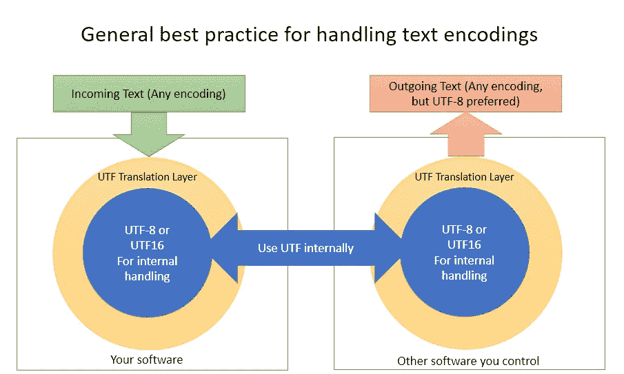
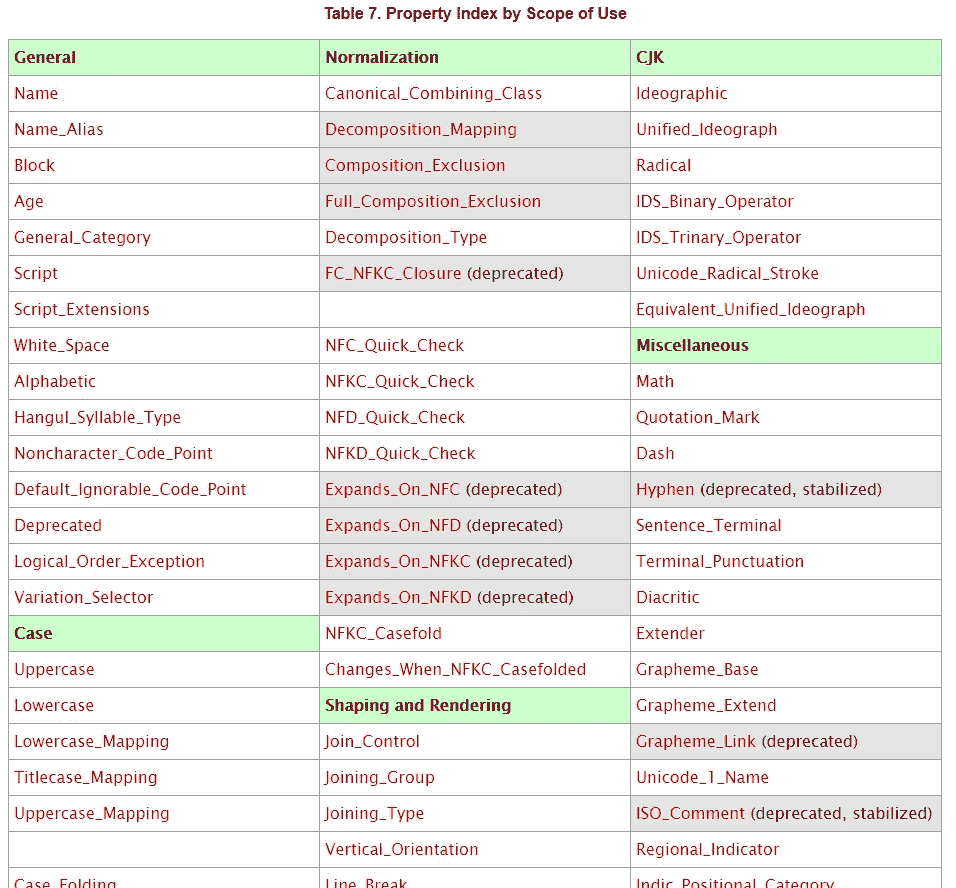
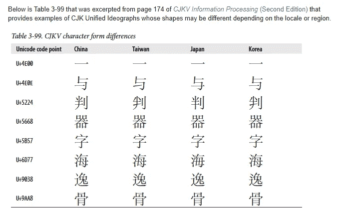
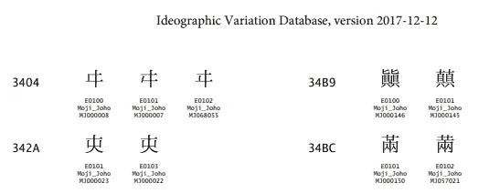

# 字符编码——挥之不去的痛，第 2/3 部分:Unicode

> 原文：<https://betterprogramming.pub/character-encodings-the-pain-that-wont-go-away-part-2-2-unicode-4f13a0d2d42d>

## 这应该能拯救我们所有人，但这仅仅是我们目前最好的办法

黑暗中有一道光…对吗？(摄影:兰迪·欧)

[*字符编码系列的第 1 部分在这里有。*](https://medium.com/better-programming/character-encodings-the-pain-that-wont-go-away-part-1-2-non-unicode-dee7650fb6bf)

在我开始撰写本文之前，我并不知道 Unicode 的起源始于 20 世纪 80 年代，Unicode Consortium 于 1991 年 1 月正式合并，[于当年晚些时候发布了第一个标准](https://unicode.org/history/publicationdates.html)。就像字符编码的历史问题有几十年的历史一样，当前的解决方案也有几十年的工作。意思是，很复杂。

在写这篇文章的时候，我很难确定一个数据科学家需要了解 Unicode 的哪些知识才能有效地工作。虽然该标准非常技术性、深奥和复杂，但它在过去几十年中已经被业界如此完善和广泛采用，以至于大多数硬东西对用户来说都是透明的。令人惊讶的是，我们被允许如此理所当然。

# 作为一名数据科学家，您需要了解 Unicode 的哪些知识

1.  Unicode 通常能够毫无问题地存储您可能遇到的任何字符。
2.  截至 Unicode 13.0(草稿，截至本文撰写时)，[标准中有 143，859 个字符](https://www.unicode.org/versions/Unicode13.0.0/)。
3.  Unicode 定义了一组 1，114，112 个码位，从 0x0 到 0x10FFFF，可以映射到字符。其中绝大部分当前未被使用，并被保留以供将来使用。
4.  排序、正则表达式等操作。也是在 Unicode 标准中定义的，所以一切通常都是行为良好的，即使是像从右到左的语言等。我们不需要担心它！
5.  最佳实践是获取任何传入的文本，将其转换为 UTF 格式(通常是 UTF-8 或 UTF-16)，并以该格式执行所有常规操作。
6.  当将传入文本转换为 Unicode 时，请尝试确定它的编码。字符集检测器本质上不可能是完美的。([参见第 1 部分](https://medium.com/better-programming/character-encodings-the-pain-that-wont-go-away-part-1-2-non-unicode-dee7650fb6bf))
7.  只有在输出用于系统的数据时，才应该考虑转换为非 Unicode 编码。即便如此，99%的情况下还是输出到 UTF-8 比较好。

通常，如果你想处理文本输入，你应该做一些这样的事情

对于任何只需要“处理”Unicode 数据的人来说，这已经足够了。对于一个如此复杂的标准来说，它少得惊人。

# 但是如果我们真的想更好地理解 Unicode，有什么好理解的呢？

很多！虽然我们可能都知道 Unicode 是“适用于我们应该使用的所有语言的标准”，但它是一个庞大的标准，包含许多非常有趣的部分和有用的概念。大致了解它的工作原理将使您更好地理解如何处理文本数据。

先来偷看一下高层结构和争议点！

# Unicode 通过增加抽象层解决了字符编码冲突的问题

像许多工程问题一样，增加一个抽象层可以使困难的问题更容易解决。这就是 Unicode 的实际作用。

回想一下，像 ASCII 这样的传统字符编码是特定字母的二进制序列的严格定义。在 ASCII 中，0x41 是大写的“a”。对于 8 位，只有 256 个潜在的数字来分配字符，并且前 128 个已经由 ASCII 定义。所以每个代码页对不同的字符重复使用相同的数字。

Unicode 在一个字符的二进制表示和人类想要显示给其他人的实际字符之间放置了多个抽象层。

## 第 1 层和第 2 层:存在独立于编码的抽象字符，我们对进入标准的字符进行编码

Unicode 试图定义具有语义值的最小书写单位的编码。在欧洲语言中，这通常意味着字母和标点符号。对于东亚语言，这可能包括数千个标识字符。其他语言，如阿拉伯语，可能有更复杂的书写规则，如省略某些元音或组合字符。

这些角色是抽象的，就像柏拉图式的理想。我们需要把它们变成现实。

Unicode 字符可能具有的(部分)潜在属性表

这个抽象层之所以存在，是因为需要有“什么是应该用 Unicode 编码的字符？”当一个书写单位被纳入标准时，该抽象字符被编码，并被赋予一个名称和 [**码点**](http://www.unicode.org/glossary/#code_point) **。**编码点以十六进制编码的 U+####格式表示。U+0041 被分配给“拉丁大写字母 A”，这是“A”的抽象概念，而不是你在屏幕上看到的字体。

该字符也被输入到 UCD、 [Unicode 字符数据库](https://unicode.org/ucd/)，并被赋予各种 [**属性**](http://unicode.org/reports/tr44/#Property_Index) 。属性是 Unicode 工作如此顺畅的一个重要原因——它们表示诸如“小写”、“数值”等属性，表示字符是否应该排序，甚至表示双向算法应该如何处理字符的信息(L-to-R 或 R-to-L 文本显示)。

## 编码字符被分成 17 个平面

Unicode 被组织成 17 个“[平面](https://en.wikipedia.org/wiki/Plane_(Unicode)#Overview)，每个平面有 64k 个代码点。绝大多数目前未被使用。

*   平面 0:基本多语言计划，BMP —常用字符。
*   平面 1:补充多语言平面，SMP——不常见的非表意字符。历史或不常见的文字、符号等。表情符号和表情符号生活在这里！
*   平面 2:补充表意平面，SIP——不常用表意字符。
*   平面 3:第三代表意文字计划，TIP — [提议](https://unicode.org/roadmaps/tip/)用于 Unicode 13.0(仍未发布)。将涵盖 BMP 或 SIP 中未涵盖的 CJK 表意文字，包括许多历史字符。
*   平面 4–13:目前未分配，保留供将来使用。
*   飞机 14:辅助专用飞机(SSP)。
*   15，16 号飞机:私人使用。

平面上的 64k 代码点恰好使用代码点的最后四个十六进制数字进行编码，因此平面实际上是前面的一个额外数字，从 0 到 f。这就是为什么 BMP 通常只显示为 U+####，前面省略了 0，而 SMP 将是 U+1####，依此类推。

在每个平面内，数字块被分配给不同的语言或分组，以便共享相似主题的事物；例如“希腊语”或“表情符号”被分组在一起。

## 第 3 层和第 4 层:字符在计算机中表示，并转换成比特

Unicode 定义了[字符编码方案](http://www.unicode.org/glossary/#character_encoding_scheme.)，如 UTF-8、UTF-16 和 UTF-32。这些规则定义了计算机如何使用特定的位序列(也称为代码单元)来指示所使用的 Unicode 字符。

有多种方式对相同的码点进行编码；例如 UTF-16、UTF-32、GB 18030 等。有些是由统一码联盟(UTF-8，16，32)定义的，有些是由其他标准团体定义的。所有这些方案都编码相同的 Unicode 码位，因此(通常)可以在彼此之间自由转换。

这一部分被分成两层的原因是因为在 UTF 层之下，有另一个抽象层将编码字符转换成实际的位和字节。这是因为[字节序](https://en.wikipedia.org/wiki/Endianness)还是一个东西，不同的计算机架构会以不同的顺序写相同的位序列。当你交流数据时，需要考虑到这一点。

# UTF 8 岁、16 岁和 32 岁是怎么回事？

UTF 名字后面的数字代表该格式工作的*代码单元*的大小。代码单元是单个字符可以使用的最小大小(以位为单位)。

UTF-8 使用 8 位块来表示 Unicode。显然，八位中只有 256 个值，所以它有办法扩展到使用两个、三个甚至四个字节来表示它需要的任何字符。它还具有非常独特的向后兼容 ASCII 的特性(因为 UTF-8 阅读器将读取 ASCII，反之则不行)，因为用于编码切换到多字节的字节被分配给 ASCII 标准之外的字节。

类似地，UTF-16 用两个字节的块来表示事物。因此，如果它需要进入 Unicode 的一部分，而仅用两个字节是无法访问的，它将使用第二个块，总共四个字节来访问它。由于历史原因，许多操作系统在内部的不同地方使用 UTF-16，因为 Unicode 最初是一种 16 位编码格式(后来他们意识到他们需要更多的空间来覆盖 CJK 字符，不得不扩展)。

另外，UTF-16 有字节序。所以你可以有 UTF-16LE(小端序)和 UTF-16BE(大端序)。如果名称中没有指定字节顺序，字符串可以用 [BOM(字节顺序标记)](https://en.wikipedia.org/wiki/Byte_order_mark)来指定。字符串开头的 0xFE 0xFF 表示小端，0xFF 0xFE 表示大端。

UTF-32 用四个字节来表示事物。但是它可以覆盖整个 Unicode 标准，而不需要 UTF 8 和 16 使用的任何可变宽度方案。对于许多用例来说，这是非常浪费的(大部分 32 位空间都是 0，因为大多数平面都没有使用)，所以它几乎没有用处。但它仍然可用。

## UTF 表单是自动同步的

UTF 编码形式很有趣，因为它们不使用转义序列来表示切换到编码方案的不同区域，并且很容易识别字符边界。这是对由 [ISO/IEC 2022](https://en.wikipedia.org/wiki/ISO/IEC_2022) 引起的问题的直接反应，ISO/定义了转义序列来表示代码页内的切换字符集，并且通常用于 CJK 语言。

我们不想要转义序列，因为它会使字符串有状态。你需要阅读所有的东西，以确保你能抓住转义字符，理解每个后续字符是什么。这给搜索、连接文本等带来了巨大的问题。因为您必须扫描整个字符串才能找到所有的转义字符。

## 无论你在做什么，只要使用 UTF 格式

总的来说，大多数在互联网上交流的东西都使用 UTF-8。如果你处理的是 ASCII 文本，它就很简洁，互联网上的很多文本都是这样。如果您碰巧使用的是 CJK 语言，那么使用 UTF-16 可能会获得更好的文件大小。几乎没有理由使用 UTF-32。

# ISO/IEC 10646，另一个“Unicode”标准

令人困惑的是，Unicode Consortium 与 ISO 标准机构相协调，所以有相应的 ISO 标准。由 ISO/IEC 10646 定义的通用编码字符集与 Unicode 保持同步。人们经常交替使用这两个术语。但是，虽然这两者共享相同的字符映射，但它们之间存在巨大的差异。

ISO/IEC 10646 定义了通用字符集。它是独立于 Unicode 开始的，但是两者已经成为协调的同一件事。您有时会看到对较老的 UCS-2(两个代表两个字节)的引用，对于 plane 0 BMP，它的行为本质上类似于 UTF-16。然而，UCS-2 不能访问 BMP 之外的内容。现在已经过时了。

相反，当前的标准是 UCS-4(四字节),本质上相当于 UTF-32，但没有额外的 Unicode 语义，这使 Unicode 变得很棒。像泥浆一样清澈，对吗？

最终，两者之间的区别是:Unicode 标准是*而不是*只是字符到数字的巨大映射。它还包括与排序(排序)和正则表达式相关的算法，以及编码(UTF-8 等。)、安全(欺骗等。)，还有很多其他的东西。

同时，ISO 标准*是*主要只是一个巨大的字符到数字的映射。ISO/IEC 10646 不包括 Unicode 的各种属性和算法来处理编码和排序顺序之类的事情。因此，理论上，有些东西可以兼容 ISO/IEC 10646，但不能兼容 Unicode，因为它没有实现所有额外的东西。

# 表情符号

表情符号最近在互联网上风靡一时。不过，我仍然对老式表情符号情有独钟。

> (ノ｀Д´)ノ彡┻━┻

如你所知，[表情符号最初是日本手机使用的专有文本扩展](https://en.wikipedia.org/wiki/Emoji#History)。然后它们被采用到 Unicode 中(从 Unicode 1.0 中的 79 开始)，因为 Unicode 努力包含人们广泛使用的文本，这为日本手机之外的系统能够使用它们打开了大门(假设字体支持字符)。

随着时间的推移，新的表情符号被添加到 Unicode 标准中。你(对，就是你！)可以尝试[提交一个新表情符号的提案](http://unicode.org/emoji/proposals.html)，如果你很有动力的话。提出并证明一个角色值得被纳入标准需要*大量的工作，但也许有人已经足够专注于此。*

# Unicode 并不完美的地方

Unicode 在绝大多数情况下都能正常工作，以至于您很少需要过多考虑它。但是如果你足够多的使用跨语言的文本，你会发现有些地方并不完美。

## 稳定政策是一把双刃剑

Unicode 在不断发展。为了防止局势完全混乱，他们有一套[稳定政策](https://unicode.org/policies/stability_policy.html)。比如:被编码的字符永远不会被移动，名字永远不会被改变，组合/分解的规范化等等。

虽然这样做是为了让 Unicode 保持向后兼容，但这也意味着某些种类的错误或失误，即使事后来看，也永远无法修复。你可以在[规范化常见问题解答](https://unicode.org/faq/normalization.html)中找到例子；例如“*阿拉伯字符的规范排序不是错误的吗？”一个更好的标准化方法可能是可行的，但是由于稳定性政策，现在不能改变。*

## 存在旧字符和预先组合的字符

Unicode 有一种组合字符的方法。可以拿 *e* (U+0065)加一个“组合锐音”(U+0301)来造 *é。*也可以用 *é* (U+00E9)，称为“预组合字符”。预先组合的字符被放入 Unicode 标准中，以便与不完全兼容 Unicode 的系统(和字体)一起工作。如果软件不能由碎片组成字符，它可能能够使用预先组成的一个来代替。

关于预组合字符的一件很酷的事情是，它们被认为等同于组合字符。U+0065 U+0301 等于 U+00E9。它们应该呈现相同的内容，各种排序/搜索算法应该对它们一视同仁。这是通过 Unicode 中指定的规范化算法来完成的。

构图也是允许我们拥有 [Zalgo 文本](https://en.wikipedia.org/wiki/Combining_character#Zalgo_text)的特性。t͉̥̯͙͒̆ͣ̍̑e̜̭͚͎̱̐͊̃ͥͪ͜ẋ̯̬͍̠̱́̊̔͡t̛̲͇͍͇̖͓̙̱̝̮ͦ̈́ͨͭt̢̟͙̫̱͉̙̻̔̉̈́̓͂ỏ̡̖̺̳̘̮̪̱͉̄̆ͥ̒̐̌̑ͅm̶̽ͭ̓a̛͍͈ͣ͗k̨̟̺̥̝͇̣ͫ̌e̜̳̣̟̫͖͊̈́ͣ̓͒͌ͭy̵o̬̰͚͍͘u͍͍̲̮ṛ̫͔̆͌̈ͥ̃̓ͬ͊́̽ͤ҉ë̴͓̠̎ͥͮyͤ̌̃̀ẻ͇̬̰͗͑ͭ͠s̠̗̼͈͎͉̉̓͌̌̅̚͟b̟̼̞̦̣̜̾ͅl̤̲̖̫̭̈́̒̂̅́e̱͍e͍̟̹͉ͦ̒͂̊̿͘ͅd͋͛͌͗͢.͇̆̔͐去咨询一个 Zalgo 文本生成器，如果你想惹恼你的朋友，结交新的敌人。

Unicode 还包括一些传统字符，如 U+FB00、ff、两个连在一起的 f 字符。在某些语言中，这被视为单个字符，但 Unicode 通常会将其视为两个字符，因为连字是一个字体/表示问题。但是它包含了这个字符，这样遗留代码页可以顺利地在 Unicode 之间来回转换。

## 私人使用区(PUA)

有两个完整的平面(15 和 16)，所以 128k 字符，加上平面 0 BMP (U+E000-U+F8FF)中的 6400 区域，被指定为“私人使用区域”这些字符是 Unicode consortium 声明永远不会分配给这些范围的字符。相反，它是让用户来定义角色，并且完全由用户之间的协议来定义[。事实上，如果你要创造你自己的角色，任意选择一个 PUA 代码点，并说服很多人使用那个字符作为代码点，你可以！](http://www.unicode.org/faq/private_use.html)

PUA 最常见的用途是在 CJK 语言中定义 Unicode 标准之外的额外字符。第二类人通常是学者，他们需要不受支持的语言的特殊字符。这些可能是遗产或历史人物，或特定的变体。有时，这样的字符最终会进入 Unicode 标准。在此之前，它们由标准机构、组织和字体制造商之间的协议编码。其他可能永远无法转换成 Unicode 的文字和特殊字符也可以使用 PUA。

但是因为所有的事情都是通过用户之间的协议来完成的，而且 Unicode 协会明确表示他们不提供任何机制让用户在标准内达成一致，**冲突可能会出现**。两个不同的系统可以对不同的字符使用相同的 PUA 码。

令人欣慰的是，因为有一个代码点并没有太大的作用，除非你有一个字体，也有你想要显示的字符，这意味着没有太多的团体在广泛使用 PUA。一些组织已经发布了各种标准和字体。公司也使用各种 PUA 点，比如在他们的软件或操作系统中包含独特的标志和符号。Linux 吉祥物 Tux 以放荡不羁的字体生活在 U+E000 上。

PUA 角色没有任何关联的属性，因此它会影响角色与显示/搜索/排序等内容的交互方式。

无论如何，虽然很少遇到这些角色，但偶尔你会碰到他们。现在你知道为什么你有奇怪的字符，如果没有安装特定的字体就不能正确显示。

## 汉统一

This is perhaps the messiest and most confusing part of Unicode. Languages like Chinese, Japanese, Korean, and Vietnamese use Han ideographs in their writing systems due to the influence China has had on the region historically. For example, the character 人 is used in all three languages and generally carries the same meaning.

多年来，通过各种语言改革和自然的语言变化，汉字获得了多种形式或不同的含义。在汉语中，mainland China 使用的是[简体字](https://en.wikipedia.org/wiki/Simplified_Chinese_characters)，而台湾和其他一些地方继续使用[繁体字](https://en.wikipedia.org/wiki/Traditional_Chinese_characters)。日语有旧的和新的形式，它们共享一些简化，但不是全部。朝鲜文汉字在很大程度上类似于繁体字，但它们可以有自己的细微差别。一种语言创造了新的汉字，而另一种语言却没有使用。

有些差异就像一个“发现差异”的游戏来源: [Adobe](https://blogs.adobe.com/CCJKType/2012/01/genuine-han-unification.html)

因此，我们有许多语言(甚至方言)在概念上共享一组表意字符，但在一些字符的具体细节上可能有重大分歧。一种语言的旧形式可能在另一种语言中使用，或者一个字符在不同的媒体或历史时期可能有略微不同的表达，但保留相同的含义。对于一种语言来说，排版上的微小差异在另一种语言中可能是更有意义的差异。由于该地区悠久的地缘政治历史，它可能变得相当政治化。

与此同时，汉字已经占用了 Unicode 中大量的空间，因此不希望将每一个微小的差异都作为一个单独的代码点。所以 Unicode 坚持对“抽象”字符进行编码的原则，将小的字体差异视为表示上的怪癖，将字符合并到它们认为合适的一个代码点中，并将其他字符分开。

Unicode 对这个复杂的“[汉统一](https://en.wikipedia.org/wiki/Han_unification)”的处理一直存在争议。它必须区分某些字符在某种程度上是否“足够不同”,以作为一个单独的代码点。该标准在三维模型下工作，其中他们试图包括语义不同的事物(x 轴)，或者具有不同抽象形状的事物(y 轴)，但是最小化仅仅字体不同的事物(z 轴)。y 和 z 的区别是棘手的。你可以查看 Unicode 标准的[第 18 章，了解更多相关信息。](http://www.unicode.org/versions/Unicode12.1.0/ch18.pdf)

最终结果是，Unicode 将一个给定字符书写方式的许多细微差别视为字体问题，而不是语义问题。对于简体-繁体对，它们具有在语义上将它们链接在一起的属性。这样做的好处是，它将汉字概念化为跨所有语言共享，因此，如果您在一种语言中查找一个字符，它将允许您指示一个代码点来标识多种语言中的一个字符。

但它也将区域差异视为字体问题，这意味着如果您在同一个文档中混合了中文、日文、韩文甚至越南语，您将无法显示正确的字形，除非您专门切换到该语言的正确区域字体——这一事实与 Unicode 允许每种语言在单个文档中使用(可能使用单一字体)的目标背道而驰。

让事情变得更加复杂的是，究竟哪些字符被认为是足够不同的，值得纳入该标准，这有点不一致。关于主题的[维基百科页面已经足够令人费解了。](https://en.wikipedia.org/wiki/Han_unification#Rationale_and_controversy)

IVD 的一部分显示了一些变化

目前， [Unicode 技术标准#35](https://www.unicode.org/reports/tr37/) 已经创建了一种用表意文字变体数据库(IVD)指定特定变体字形的方法。IVD 是一个表意变体序列(IVS，一个字符后跟一个范围为 U+E0100 到 U+E01EF 的变体选择器)的注册表，它选择一个不同于正常的字形。

这里还有一个比我更了解汉族统一的人的帖子:

# 幸运的是，我们很少需要考虑这些事情

作为主要处理数据的人，我们通常不需要处理那么多文本(除非你对自然语言处理、光学字符识别或类似领域感兴趣)。所以我们经常可以依靠我们的库来处理这个问题，天真地使用我们的字符串，继续前进。直到我们不得不直接分析文本…

所以，现在，当你开始在舒适的“纯文本”网络上工作，并开始处理来自全球各地的文本时，对等待你的复杂性有一个概述是很好的。

# 感兴趣的读者可以进一步阅读

虽然我已经在正文中放了大量的链接，但这里还有更多东西要戳。

*   [完整的 Unicode 12.0 标准](https://www.unicode.org/versions/Unicode12.0.0/UnicodeStandard-12.0.pdf) —警告，已经超过 1000 页了。
*   [到 BMP 以及更远的地方](https://www.unicode.org/notes/tn23/) —这个演示始于 2005 年，解释了 Unicode 的许多基础知识。多(全？)由于 Unicode 的稳定性保证，它仍然是相关的。
*   https://www.unicode.org/standard/tutorial-info.html[—Unicode 标准的教程/指南/演示。有些真的很深入。](https://www.unicode.org/standard/tutorial-info.html)
*   [Normalization forms](http://www.unicode.org/reports/tr15/) — How Unicode will decompose/recompose text to determine the equivalence of characters. For example, here’s [人](https://www.unicode.org/cgi-bin/GetUnihanData.pl?codepoint=%E4%BA%BA).
*   [Unihan 数据库查找工具](https://www.unicode.org/charts/unihan.html) —您可以在其中搜索 han 字符以查找详细信息。
*   [https://en . Wikipedia . org/wiki/Plane _(Unicode)](https://en.wikipedia.org/wiki/Plane_(Unicode))
*   [https://en . Wikipedia . org/wiki/Comparison _ of _ Unicode _ encodings](https://en.wikipedia.org/wiki/Comparison_of_Unicode_encodings)
*   [https://www . quora . com/Is-Han-Unification-consided-a-failure-Why-Is-it-so-difficult-Han-characters](https://www.quora.com/Is-Han-Unification-considered-a-failure-Why-is-it-so-difficult-to-unify-Han-characters)
*   https://en.wikipedia.org/wiki/UTF-EBCDIC——一个对 EBCDIC 友好的 UTF！满足您的大型机需求。