# 模拟器(Android)和模拟器(iOS)的 Charles 设置

> 原文：<https://betterprogramming.pub/charles-setup-for-emulator-android-simulator-ios-94d3e21598f1>

## 诊断您的移动应用的网络流量

图片由[嘘奈杜](https://unsplash.com/@hush52)在 [Unsplash](https://unsplash.com/photos/yo01Z-9HQAw) 上拍摄

为物理设备和仿真器或模拟器设置 [Charles](https://www.charlesproxy.com/) 有时并不完全相同。使用仿真器或模拟器有时很方便，因为您不需要带着真实的设备进行测试。

万一你不知道[查尔斯](https://www.charlesproxy.com/)是什么，它是一个网络代理工具。换句话说，它可以用来拦截网络连接(在我们的例子中，来自设备)，以允许查看、重定向、修改和调试。它对于本地服务器测试也非常有用。

我经常忘记其中一个平台，所以我记录了 iOS 和 Android，以便为两者提供一站式的参考。

# 在启动仿真器或模拟器之前

最好是在启动模拟器之前确保 Charles 已经启动。我不确定这是否总是必要的，但这是一个好的步骤。

# Android 模拟器

以前连接 Android 模拟器都是通过命令行完成的。今天好像不再管用了。目前使用的方法是匹配实际设备的功能。

但在此之前，你必须确保你的模拟器启动连接到互联网。有时这是不可能的，由于我不知道的原因。因此，解决这个问题的方法是根据下面的博客。(仅在您的仿真器无法连接到互联网时使用。)

 [## 让 Android 模拟器连接到互联网

### 你曾经因为你的 Android 模拟器不能连接到互联网而感到沮丧吗？放弃了尝试，只是用…

medium.com](https://medium.com/@elye.project/making-android-emulator-connect-to-internet-e7b622a00f09) 

## 设置代理 IP

通过互联网连接启动模拟器后，您需要找到本地 IP 地址。在 Charles 中通过查找*帮助→本地 IP 地址*来完成此操作。

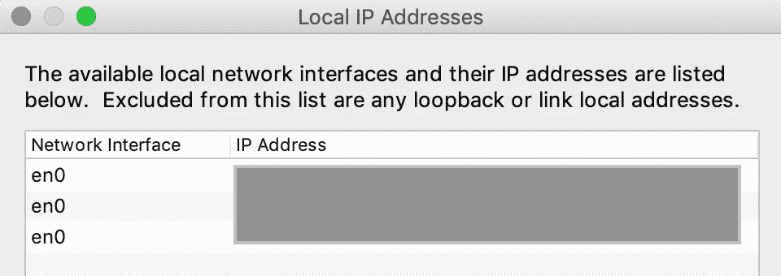

之后，在你的模拟器中，进入 Wifi 设置，长按`AndroidWifi`，在这里你将进入`Modify network`设置。

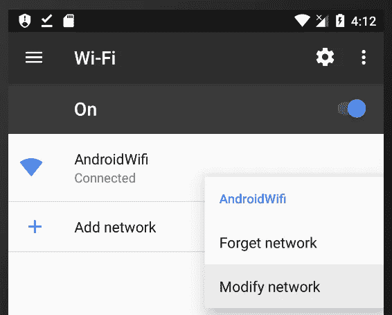

在*修改*中，点击`Advanced options`展开对话框。然后，在`Proxy host`和`Proxy port`中输入 IP 地址(通常是 8888)。然后，点击*保存*。

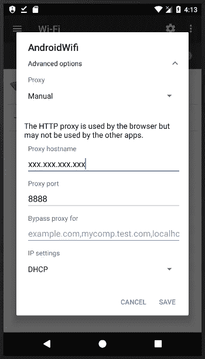

## 证书安装

有时(事实上，大多数时候)，我们需要安装认证来查看安全网络。为此，请访问 Chrome 浏览器和`chls.pro/ssl`的地址。

如果 Charles 已经连接上，您应该会收到下载或替换您的证书的询问。

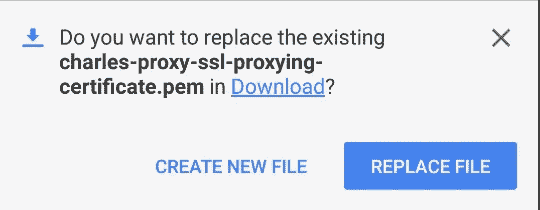

下载完成后，会要求您安装它。之后，你可以用任何你喜欢的名字保存它。

请注意，您的设备至少需要有一个“pin”安全设置才能做到这一点。如果没有，系统会提示您在那里进行设置。

## Android SDK API 30 更新(Android 11)

安装程序中对 Android SDK API 30 的新要求如下。

 [## 为 Android SDK API 30 及以上版本设置 Charles 代理

### 在 Android 11 上安装 Charles CA Cert 的额外步骤

medium.com](https://medium.com/mobile-app-development-publication/setup-charles-proxy-for-android-sdk-api-30-onwards-2e3eab4231aa) 

## 解决纷争

如果您无法连接到 Charles，请尝试以下方法:

*   在使用 Charles 设置代理之前，请确保您的设备已接入互联网。
*   关闭蜂窝网络，只打开设备的 Wifi 网络。
*   检查查尔斯的`macOS Proxy`设置是否为`OFF`。您可以通过查看 Charles 的*代理→ macOS 代理*进行检查。(注意这一步和 iOS 相反。)
*   检查您是否有过期的证书。如果你既过期又没过期，那就不行。你必须删除过期的。要进行检查，请转至*设置→安全→加密和凭证→可信凭证→用户(选项卡)*

# iOS 模拟器

在 iOS 中，模拟器代理的设置不同于实际设备，并且更简单。您不需要显式键入代理地址，让 Charles 为您完成。

## 将 Charles 连接到模拟器

启动模拟器后，在 Charles 中，进入*帮助→ SSL 代理→在 iOS 模拟器中安装 Charles 根证书*。

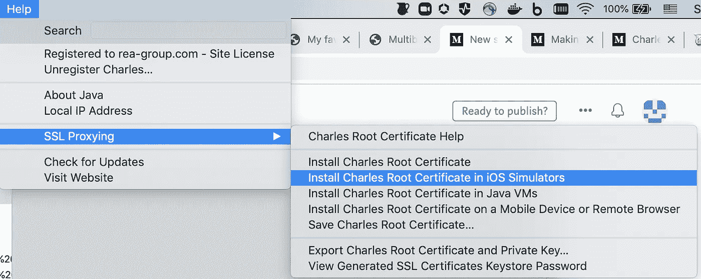

之后，你会得到下面的:

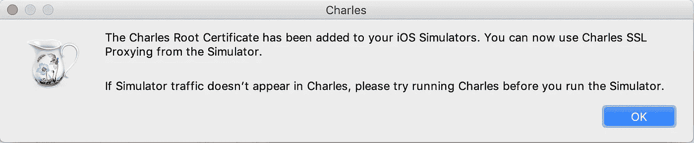

下一步很重要，把`ON`变成你的`macOS Proxy`。这可以通过 Charles *代理→ macOS 代理来实现。*

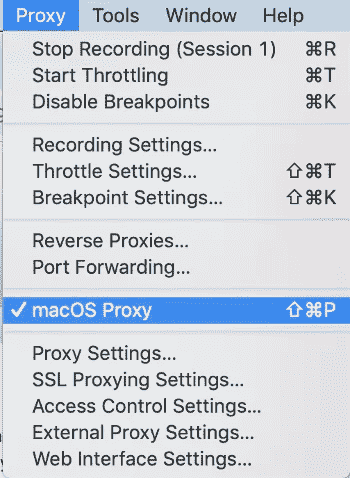

## 证书安装

有时(事实上，大多数时候)，我们需要安装认证来查看安全网络。前往 Safari 浏览器和`chls.pro/ssl`的地址。

如果 Charles 已经连接上了，您应该得到如下的下载配置文件的请求。允许它。

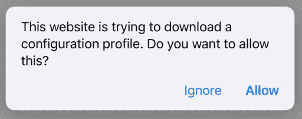

然后，您会收到以下消息:

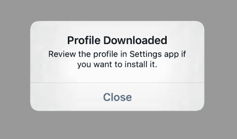

之后，进入你的模拟器的*设置→常规→配置*，你会得到类似下图的东西。点击它。

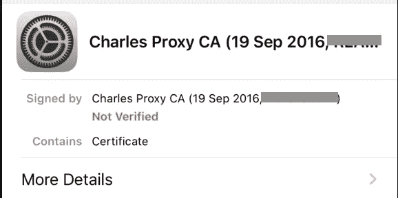

之后，点击安装。您将设置如下内容。

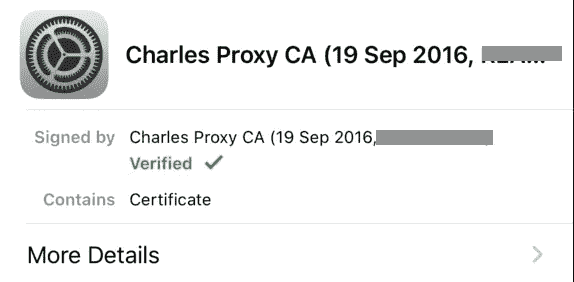

这一步之后，还有一步要走。

进入*设置→常规→关于→证书信任设置*。然后查找您刚刚安装的证书并打开它

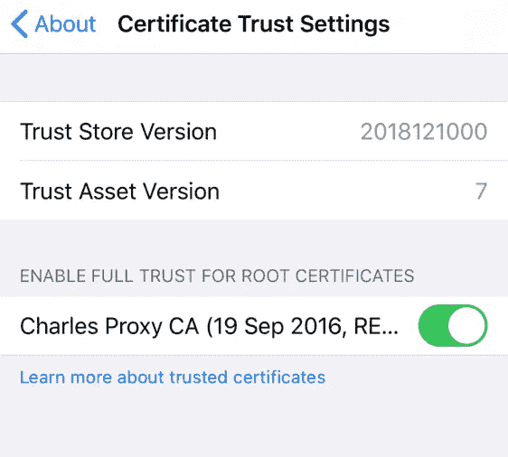

就是这样。

## 解决纷争

如果您无法联系到 Charles，请尝试以下方法:

*   在使用 Charles 设置代理之前，请确保您的设备已接入互联网。
*   检查查尔斯的`macOS Proxy`设置是否为`ON`。你可以通过查理斯*代理→ macOS 代理*来检查。(注意这一步和安卓相反)

注意:如果在使用 Charles 后，你发现你的电脑不能访问互联网，一定要检查 Charles 的`macOS Proxy`设置是*而不是* `ON`。你可以在 Charles *Proxy → macOS Proxy* 中查看。

感谢阅读。