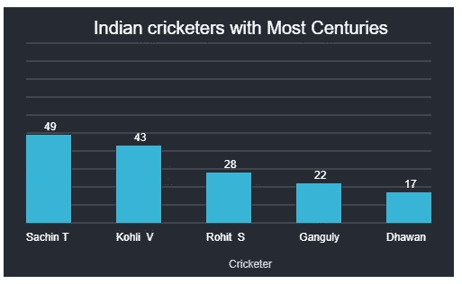
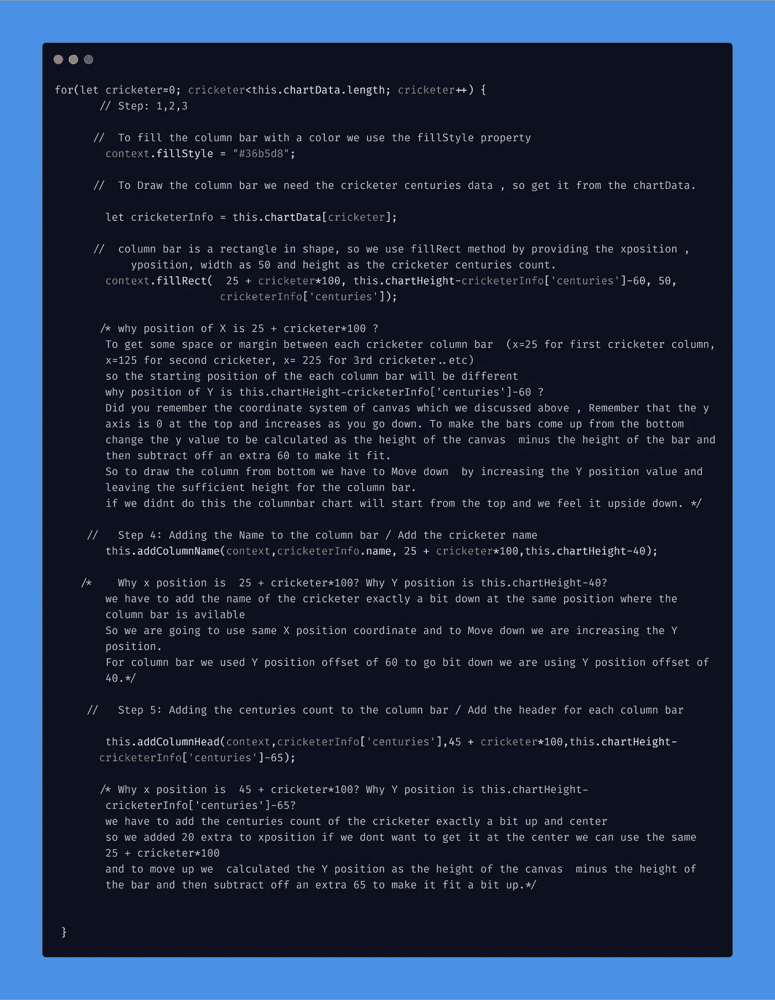
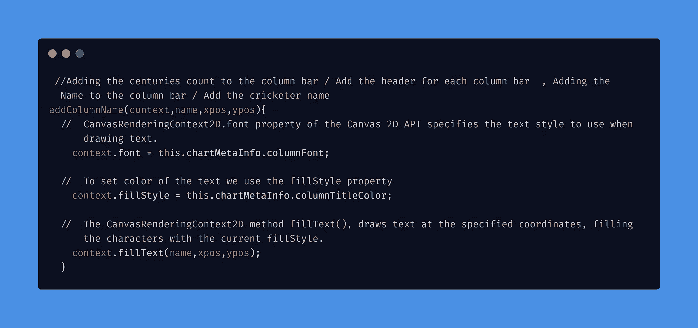
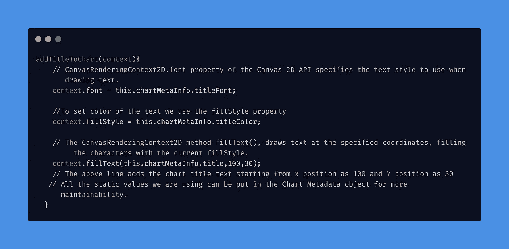
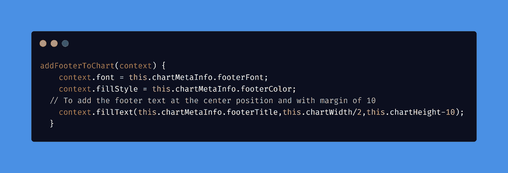

# 不使用库在 Angular 中构建图表

> 原文：<https://betterprogramming.pub/charting-with-angular-without-using-any-library-709f5451f34a>

## 没有依赖关系的图表



# 我们要创造什么？

我们将使用 Angular 和[画布 API](https://developer.mozilla.org/en-US/docs/Web/API/Canvas_API) 创建一个图表。我们不打算使用外部图表库。

上面的图表包含了几个世纪以来得分最多的印度板球运动员的信息。我们在上面使用/显示的数据仅仅是为了教程的目的，我们的板球运动员可能在你读这篇文章的时候得分更多。

让我们开始吧。

# 导入项目

[](https://github.com/Ravitejavv/columnChart) [## ravite javv/柱形图

### 此项目是使用 Angular CLI 版本 7.3.8 生成的。为开发服务器运行 ng serve。导航到…

github.com](https://github.com/Ravitejavv/columnChart) 

# **实施计划**

我们将使用两个组件来完成此应用程序:

1.  App 组件。
2.  图表组件。

app 组件主要用于创建图表数据和图表元数据。

元数据包含有关图表标题、颜色、字体、背景等信息。与图表样式和所需的其他元信息相关。

图表组件包含使用应用程序组件提供的数据绘制图表的逻辑，并使用元数据设置图表的样式。

# 决赛成绩


为了得到上面的图表，我们将执行以下步骤。

1.  我们需要一个宽度为 50px，高度为每个板球运动员的世纪计数的栏。
2.  列栏应该有颜色。
3.  每个栏之间应该有空白。
4.  每一栏的底部都应该有板球运动员的名字。
5.  每一栏应该在栏的顶部显示板球运动员的世纪计数。
6.  图表的标题。
7.  图表的页脚文本。
8.  背景中的水平线代表风格。

在实施这些步骤之前，我们应该了解 canvas…

# 什么是画布？

Canvas 是一个 HTML 元素。使用画布和 JavaScript，我们能够绘制形状和创建动画。

画布 API 包含 CanvasRenderingContext2D 接口。该接口为绘制形状、文本和图像提供了 2D 渲染上下文。

CanvasRenderingContext2D 包含用于绘制矩形、文本、路径和图像的属性和方法。CanvasRenderingContext2D 可以进行线条样式、文本样式、填充、渐变和图案等样式设置。

```
<canvas id=”barchart” width=”500" height=”500"> </canvas>
```

上面的代码定义了 canvas 元素，赋予它 500px 的宽度和 500px 的高度。如果未指定宽度或高度，则使用默认宽度 300 像素和默认高度 150 像素。

```
const canvas = <HTMLCanvasElement>document.getElementById('barchart');const context = canvas.getContext('2d');
```

为了在画布上绘制一些东西，我们需要访问渲染上下文
(CanvasRenderingContext2D)。`<canvas>`元素有一个名为`getContext()`的方法。

`getContext()`将上下文的类型作为参数。对于 2D 图形，我们通过“`2d`”。

使用上下文及其绘图方法、属性返回渲染上下文，我们可以用它们来创建形状和动画，具有更好的样式。

请看下面呈现上下文的属性和方法的用法。

```
context.fillStyle='#262a33';
context.fillRect(0,0,500,500);
```

`CanvasRenderingContext2D.fillStyle`是画布 2D API 的属性。使用`fillStyle`，我们可以给形状添加/填充颜色。

`fillRect()`方法绘制一个颜色填充的矩形，其起点在(0，0)，大小由宽度和高度指定。形状内部填充的颜色由当前的`fillStyle`属性决定。

`fillRect`方法有四个参数，x 位置、y 位置、宽度和高度。默认情况下，画布坐标系从左上角开始。(X: 0，Y: 0)

*   向右移动增加 X 位置。
*   向下移动增加 Y 位置。
*   向左移动减少 X 位置。
*   向上移动会减少 Y 位置。

以上`fillRect`方法取 x 位置= 0，Y 位置= 0，
宽度= 500px，高度= 500px。

因此，矩形形状从左上角(0，0)开始，绘制宽 500px、高 500px 的矩形形状，用颜色#262a33 填充。

当我们对画布及其绘图环境有了一些基本的了解后，我们就可以开始开发我们的应用程序来实现最终的结果了。

# 准备数据和元数据

## 应用程序组件

## 将数据和元数据传递给子组件

## 图表组件(读取数据和设置绘图上下文)

当我们完成了数据、元数据和绘图上下文后，我们可以开始实施步骤以获得最终的图表。

# 步骤 1–5:绘制条形图方法



# 第六步:图表应该有一个标题



# 步骤 7:向图表添加页脚文本



# 第八步:在背景中添加水平线作为样式


# 决赛成绩

