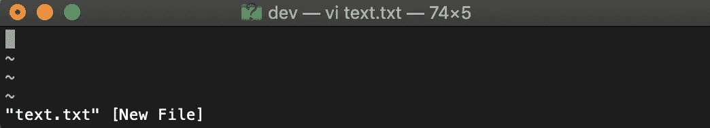
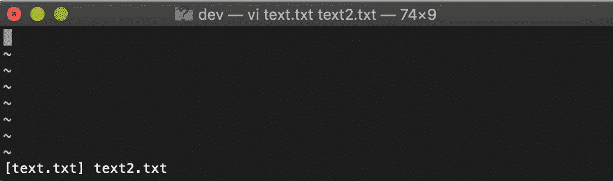

# 赶走你的恶魔

> 原文：<https://betterprogramming.pub/chase-your-vim-demons-away-4405168effc8>

我希望揭开围绕 vim 文本编辑器使用的恐惧。在这篇文章中，我将与你分享我使用 vim 文本编辑器时最常用的命令，让我的生活变得更加简单。Vim 实际上是一个最适合我们这些懒人的工具。完成一项手术的方法不止一种。

我在编程界的第一个职位是在一家令人惊叹的初创公司，它给了我一个为期两周的入职计划的启动，这是一个学习所有我需要的小工具的绝佳机会，以便有效地完成我的工作和日常任务。其中一个培训机会是一整天的时间来探索和学习 **vim 文本编辑器**的来龙去脉。作为一名刚从 uni 毕业的学生，我认为这是每个开发人员在日常工作中使用的工具。

最近，我发现我的一些同事害怕 **vim 文本编辑器**——仅仅是因为他们不知道如何退出它。甚至栈溢出也有一个关于它的[帖子](https://stackoverflow.blog/2017/05/23/stack-overflow-helping-one-million-developers-exit-vim/)。但事实上，我认为害怕 vim 是一种耻辱，也可能是一种损失。实际上，拥有这种技能已经成为我编程生涯中的第二天性。我真的相信，在使用几次方便的[小抄](http://www.atmos.albany.edu/daes/atmclasses/atm350/vi_cheat_sheet.pdf)后，它会成为你肌肉记忆的一部分。所以去吧，☺

## 第一件事:不要害怕— **如何退出 vim 文本编辑器？**

*   保存您的更改并退出？如此简单—依次按下冒号、w、q 键，产生— `**:wq**`或`**:ZZ**`
*   需要退出文件而不保存更改吗？— `**:q!**`

Vim 有两种已知的模式:命令和插入。在命令模式下，你可以搜索、浏览文件或任何不写文本的东西。在插入模式下，您键入的任何内容都将被添加到文件中。

创建新文件？毫不费力！输入你的终端`vim text.txt`。如果您希望查看或编辑一个已经存在的文件，您应该使用相同的命令。

创建一个新文件后，您会立即进入 vim 的命令模式。

vim 创建的新文件

## 使用 vim 在文件中导航

正如我前面提到的，使用 vim 完成每个操作的方法不止一种。选择最适合自己的，就看你自己了。

在现有文件中导航可以通过键盘上的箭头键来完成，大多数现代版本的 vim 都支持这一点，或者如果您希望将手指放在它们的 home 键上，即`**a-s-d-f**`和`**h-j-k-l**`。

`**l**`和`**h**`分别代表右和左。直觉对吗？这些键绑定了左右四个导航键。

*   `**l**`将光标向右移动。
*   `**h**`将光标向左移动。
*   `**k**`将光标向上移动。
*   `**j**`将光标向下移动。

如果你在一个巨大的文本文件中导航，你不想一遍又一遍地按下`**k**` 或`**j**`

*   按下`**gg**`将光标移动到文件的第一行。
*   按下`**G**`将光标移动到文件的最后一行。(⇧+g)

## 在线内移动光标

你不会想要重复按下`**l**`键来到达一行的末尾，对吗？

*   使用`**$**`键将光标移动到行尾。

移动到一行的开头也是一样，使用`**0**`键。

现在你已经学会了如何一次移动一个字符，以及如何导航到每一行的开头和结尾，这很酷，但是如何在单词之间导航呢？

## 浏览文件的快捷方式

*   按下`**w**`向前移动一个单词。(w 代表单词)
*   按下`**b**`向后移动一个单词。(b 代表背面)

# 希望编辑该文件吗？

只需点击`**i**`进入插入模式，当您完成编辑时，总是使用 Esc 键退出插入模式，主要是为了避免错误地键入无关紧要的字符。

## 替换单词

导航至您希望替换的单词，按`**c**`，然后按`**w**`。这代表改变世界。键入要替换的单词。

## 删除文件中的文本

使用`**d**`键和`**w**`键可以用一个命令删除一个单词，这两个键合起来代表*删除单词。*

*   要删除一整行，使用`**dd**`

对于专业人士来说，一个很酷的技巧是选择一次删除多少行，比如说，我想删除我文本中接下来的 3 行。

*   按下`**3**`然后按下`**dd**`为我们完成工作。如此简单！

如果您犯了任何错误，无论是在命令模式还是在插入模式，vim 都有撤销和重做的现代便利，确保您可以将文件恢复到您想要的状态。

撤消和重做命令将通过以下方式完成

*   使用`**u**`键撤销。
*   使用`**ctrl+r**`进行重做。

# 更强大的命令

## 使用 vim 查看和编辑多个文件

通过使用 vim 命令和文件列表，可以在选项卡中查看和编辑多个文件

`**vim text.txt text2.txt**`

## 使用 vim 导航多个文件

通过`**:wnext**`或`**:wprev**`移动到前一个文件，保存当前更改并移动到下一个文件。

如果您希望查看您当前在文件列表中的位置，输入`**:args**`，当前正在编辑的文件将出现在括号中。

在 vim 中还有很多我没有提到的选项，比如搜索、复制、剪切和粘贴。你可以在这个信息丰富的教程[这里](https://developer.ibm.com/tutorials/au-unixtips2/)找到这些。

我希望你学会了你将要使用的下一个最好的工具，并且喜欢赶走你的 vim 恶魔。

祝你好运！