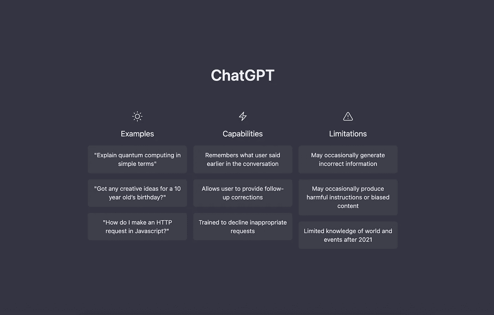
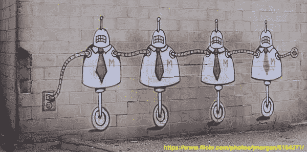

# ChatGPT 将改变软件工程——但不是以你希望的方式

> 原文：<https://betterprogramming.pub/chatgpt-will-change-software-engineering-but-not-in-the-way-youre-hoping-2d7dfbc3c6c0>

## 对于那些适应的人来说，未来是光明的

[来源](https://chat.openai.com/chat)

我总是怀疑媒体上关于人工智能和人工智能发展的言论，无论是社会媒体还是主流媒体。随着过去十年的大肆宣传，许多人都是如此。

虽然我在应用人工智能和人工智能模型方面没有很深的背景，但我比大多数人更了解这项技术的基本原理。对这一领域的技术和数学成就的欣赏是为什么我觉得许多说法有点(如果不是完全)过分夸大了。

所以当我在过去的一天里开始看到关于 ChatGPT 的评论时，我觉得这些又是一种夸张。由于我有一个为 Dall-E 2 开设的 OpenAI 帐户，我想我也可以尝试一下 ChatGPT，亲自体验一下它的“神奇之处”。

我讨厌承认我愤世嫉俗的“惊讶”很快消散为真正的惊讶。ChatGPT 真的是一件不可思议的事情，它提供了未来软件工程的一瞥，但不是以我认为一些人所想的方式。

事实上，对一些人来说，生产率的提高将是如此之大，他们实际上将会失业。

# 但是首先 Dall-E 2…

我在 Dall-E 2 上看过的一个 [YouTube 视频](https://www.youtube.com/watch?v=oqamdXxdfSA)从一个设计师和艺术家的角度展示了它如何改变他们的工作方式。总结是，它不会取代设计师或艺术家。

相反，它将成为一个辅助工具，可以提高生产力，并可以帮助充当用户的虚拟缪斯。

看完这个之后，我需要亲自体验一下 Dall-E 2，我想看看这个视频是否过度宣传了这项技术。我承认，一旦我获准进入，那是令人印象深刻的。

与此同时，我可以看到从我提供的输入中产生的图像并不接近我的想象，我可以欣赏视频中提出的观点，即它不会取代设计师和艺术家，但可以帮助他们。

即使有了这次经历，我也不能完全理解这项技术如何改变艺术家或设计师的工作方式。我从未在任何艺术或设计领域工作过，所以我对它们是如何工作的一无所知。我与 Dall-E 2 互动的方式是一个非常做作的用例，因为我只是用它来生成基于叙事的场景。

# ChatGPT 和对话式软件开发

在使用 Dall-E 2 的时候，我立即想知道 OpenAI 团队是否正在为软件开发做类似的事情。我想体验像 Dall-E 2 这样基于人工智能的工具，但在一个用例中，我对它很熟悉。

在这个最新的 ChatGPT 版本中，他们显然是这样做的，我会直截了当地说，这真的会改变我们作为软件开发人员的工作方式，并且，对于一些人来说，这可能是他们软件开发生涯结束的开始。

第一次使用时，我只是做了我在网上看到的人们做的事情——问 ChatGPT 一些关于软件开发的问题，比如构建一个众所周知的算法，或者问它一些关于代码的问题。

这样做的结果令人印象深刻，但是作为一个有经验的软件工程师，我可能会同样快地写出解决方案，并且对它们的正确性更有信心。驱动所有人工智能工具的主要算法是基于模式的，而不是基于理性或逻辑的，所以在实现中肯定会有错误。

对于我的下一次尝试，我选择从一个不同的角度接近它。我目前正在用 Flutter 开发一个简单的笔记应用程序，我想看看如何用 ChatGPT 来做这件事。我问了一个问题“我如何在 Flutter 中构建一个简单的笔记应用程序？”。我假设因为 OpenAI APIs 是有速率限制的，所以它只做了应用程序的一半，但它所做的是一个基本笔记应用程序的良好开端。最重要的是，它为我完成了一些基本任务-

1.  关于我的应用程序的基本启动架构的建议。
2.  为我的应用程序建议样板代码。
3.  为我的班级建议名字。

这里的价值并不大，我也不指望它会很大。所有这些都是我自己可以做的，但是它确实节省了我很多时间。最重要的是，我可以继续与 ChatGPT“聊天”,并能够让它构建更多的特性，并进一步优化生成的代码。这就像让一个有点笨的人类助手为我做无聊的编码。

除了这些基本任务之外，比如针对设计师的 Dall-E 2，与它的交互给了我灵感，让我想到了笔记应用程序的其他部分，这是我还没有考虑到的。扮演虚拟缪斯的力量不应该被低估。这个概念是如此强大，一个曾经在 IBM 工作的老同事告诉我，他第一天收到一个泰迪熊，并被告知“这是 Ted，他是一个很棒的问题解决者。

如果你遇到一个问题，告诉 Ted，如果之后你还没有解决，向别人寻求帮助。".这不是拐弯抹角地试图告诉一个新手不要打扰别人。这给我们上了重要的一课，有时当我们叙述和描述我们的问题时，解决方案有时会变得显而易见。ChatGPT 是类固醇上的 Ted！

# 一瞥软件开发的未来和存在性问题“我会被需要吗”？

仅仅是这种最初的互动就显示出了未来的美好前景。我开始看到一个人工智能模型如何实际上为我的日常工作流程提供更重要的积极价值，而不仅仅是编写简单的比较 if 语句(这是我在 Github Co-pilot 上让人们向我展示的“惊人”事情之一)。

这就引出了一个问题，我认为未来还会需要软件开发人员吗？“肯定”这个简短的答案并不令人惊讶。这个答案令人沮丧的延伸是，这些工具的价格将是入门级和低级软件开发人员的工作。

在软件开发社区中，不断有关于 Google、StackOverflow 和“复制粘贴”如何编写大多数人的代码的笑话。正如老习语所说，每个笑话都有一定的道理。我知道对于一部分人来说，从互联网上复制和粘贴代码是他们的日常工作。

像 NPM 的“左垫”这样臭名昭著的事件表明，许多人经常选择外包基本思维。这样做的危险不在于行为本身，而在于原因。会有很多人这样做，因为这样可以节省时间。也会有很多做的，因为不知道怎么做。正是后者需要担心人工智能的这些最新进展。

随着人工智能的进步，最基本的编程任务，如创建样板类、实现算法、构建简单的 web 表单、进行简单的数据处理等。将越来越多地由计算机辅助。目前，这些任务中的一些是耗时的，公司将雇用入门级或更低水平的软件开发人员来做这项工作。这必然会改变。

随着像 ChatGPT 这样的工具取得的快速进步，没有技术经验的人，像商业分析师或设计师，将自己完成这项工作。像 ide、SDK 和编译器这样的支持工具将会发展到这样一个程度，它们将会被隐藏起来，并且将会更加类似于 Excel，在 Excel 中，任何人都可以通过很少的培训，只需要他们现有的业务领域知识就可以立即上手。

假设这种未来不可避免地来临，那么技术人员将何去何从？随着基本的重复性动作越来越多地由人工智能执行，剩下的工作将是高度技术化和环境特定的。这些问题将超出基于模式的人工智能的能力范围，因为这项工作的独特性质需要更多地依赖逻辑和理性思维。

举个例子，我日常工作中的大部分工作都不是样板文件。它是理解业务需求，然后找出一种方法来使用多个不相关的系统，以可靠和可伸缩的方式实现业务需求。

我的日常工作要求我了解网络、分布式系统和数据层技术，并利用这些技术为我经常需要研究和定义的业务问题构建解决方案。我很少在日常工作中使用谷歌或 StackOverflow，因为我处理的大多数问题都过于定制，没有现成的解决方案。

# 如何证明自己的未来？

关于这个问题最有趣的事情是，我不认为它与 10 年前 Dall-E 和 ChatGPT 之类的东西出现在我的雷达上之前我会告诉别人的事情有多大变化。这个建议的核心是两个主要原则-

1.  花时间去理解人们和他们面临的问题。
2.  如果你打算花时间做一些技术上的事情，理解基本原理，并且很好地理解它们。

对于第二个原则，如果你是软件开发新手，确保你了解你的主要工具——计算机。当我说“计算机”时，我指的是关于它们的一切——移动电话、个人电脑、服务器、操作系统、浏览器、网络、软件架构、分布式算法等等。你不需要对每件事都有百科全书般的知识，但你至少需要意识到不同的方面。一个很好的测试是——如果有人问你“当你在浏览器中输入 google.com 时会发生什么？”你的回答是更[像这个](https://github.com/Tyrrrz/interview-questions/blob/master/!-%20General/What%20happens%20when%20you%20type%20google.com%20in%20your%20browser.md)还是更[像这个](https://github.com/alex/what-happens-when)？

如果你是后者，你没什么好担心的。如果你的答案看起来更像前者，那就努力让自己回到后者，因为 ChatGPT 和它的伙伴们正在争夺你的工作。

如果你已经在软件开发领域工作了几年，这同样适用于新人。了解更多您日常使用的工具永远都不晚。但是，如果这不是你的优势所在，如果你的优势在于你的沟通技巧和与人合作，那么专注于事情的这一面。

在人的问题和技术问题的交叉点上，总是需要人。无代码社区的爆炸性增长就是证明。伟大的业务分析师和伟大的项目经理永远都是需要的。我强调“伟大”是因为已经有很多平庸的商业分析师和平庸的项目经理，他们已经奋斗了几十年。

# 对于那些适应的人来说，未来是光明的

ChatGPT 和其他任何可能在不久的将来到来的工具对于软件开发都是非常积极的。有些处于软件开发技能谱低端的人需要找到一个不同的角色。

如果这些开发人员愿意提高技能，将会有更大和更高回报的机会出现。这些技术将极大地提高知识渊博的软件开发人员的工作效率。

人工智能软件开发人员来了，他们会抢走你的工作，谢天谢地，那份工作很无聊，你会找到更有趣的工作。

