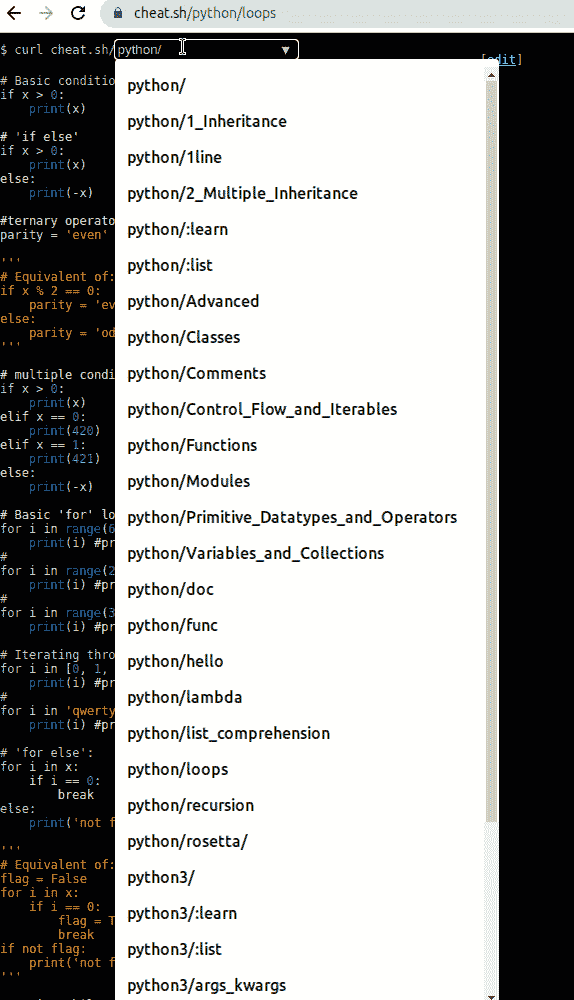
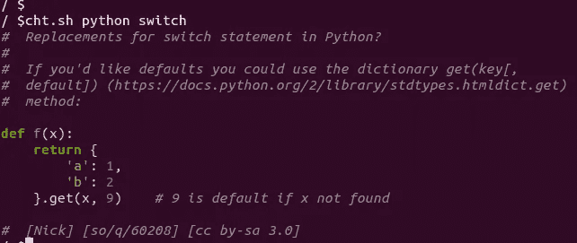
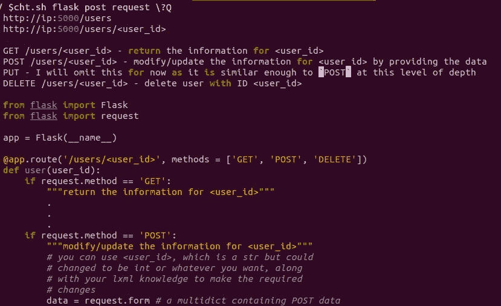
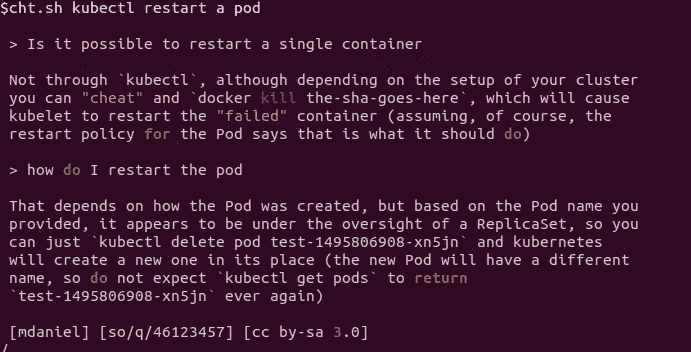
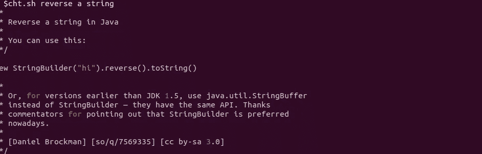
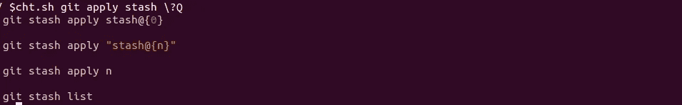
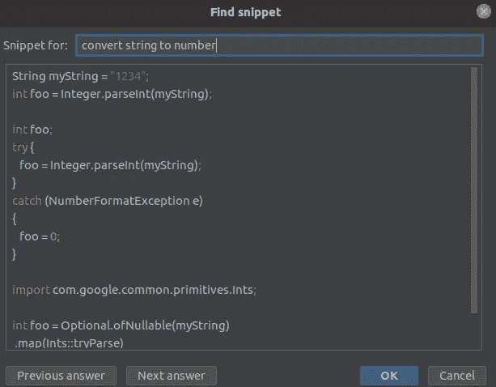
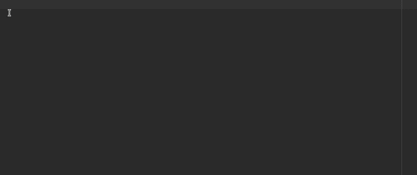

# Cheat . sh——终极多语言备忘单

> 原文：<https://betterprogramming.pub/cheat-sh-the-ultimate-multi-language-cheat-sheet-8e97c16407aa>

## 介绍 cheat.sh，一个强大的语法和代码片段搜索引擎


由[塞巴斯蒂安·坎乔克](https://unsplash.com/@meindrittesauge?utm_source=medium&utm_medium=referral)在 [Unsplash](https://unsplash.com?utm_source=medium&utm_medium=referral) 上拍摄的照片

存在如此多的编程语言，以至于不可能记住所有的语法。如果你有一个支持多种语言的终极备忘单不是很好吗？这样，你就不会因为太多的谷歌搜索而分心，你会直奔主题。这样的工具已经存在了，它叫做 cheat.sh。

在本文中，我们将介绍 cheat.sh 的最佳特性。

我们开始吧！

# 关于 Cheat.sh 及其工作原理

Cheat.sh 是一个社区支持的备忘单，目前支持 58 种编程语言。

## 它是如何工作的？

很简单:你输入一个查询，然后 cheat.sh 返回所选编程语言的结果。

不仅限于简单的语法问题，比如“如何编写 for 循环”。它的功能更多—它为常见问题提供了现成的解决方案。例如，如果您想在 Python 中反转一个字符串，它会向您显示完整的代码片段。对最初的结果不满意？没问题，它返回多个答案，所以你可以继续下一个。

## 引擎盖下是什么？

Cheat.sh 使用来自记录良好的公共备忘单库和信息源的数据，如 [StackOverflow](https://stackoverflow.com/) 、 [Learnxinyminutes](https://github.com/adambard/learnxinyminutes-docs) 等。

# 主要功能演示

Cheat.sh 可以有多种用法。展示其特性的最佳方式是通过一些例子。

## 在浏览器中使用它

最简单的使用方法是在你的浏览器中，不需要安装任何东西。只需输入这个 [URL](https://cheat.sh/) 就可以访问它。

选择一种语言，键入查询或选择现有语言。请注意，有些选项是作为教程使用的——它们可以教你继承、循环等主题。通过例子:



cheat.sh 上 Python 的浏览选项

*虽然这个选项很方便，因为它不需要任何安装，但它不如其他选项强大。我建议在您的机器上安装该工具，以便充分利用它。*

## 在本地安装

要在 Ubuntu 上安装 cheat.sh，请在终端中键入:

```
$ curl https://cht.sh/:cht.sh > ~/bin/cht.sh
$ chmod +x ~/bin/cht.sh
```

注意`lwrap`和`xsel`也是必须的。如果没有这些库，请运行以下命令:

```
$ sudo apt-get install rlwrap xsel
```

现在你已经准备好了！

命令前缀是`ch.sh`。

让我们尝试一些 Python 的基本语法问题:



在 Python 中搜索 switch 语句

评论是有价值的，但是不需要怎么办？用`\?Q` 选项关闭它们。

让我们运行一个与 Flask 框架相关的查询:



搜索 Flask post 请求

云话题呢？是的，它们是受支持的！

例如，让我们搜索`kubectl`:



搜索 kubectl 操作

你通常会对一种特定的语言进行查询吗？然后您可以使用`-- shell language`选项设置上下文。它将自动搜索所选语言的结果:

```
$ cht.sh --shell java
```



搜索 Java 查询

您还可以检查版本控制工具的语法，如 Git:



搜索 Git 查询

cheat.sh 的另一个巧妙之处是**隐身模式**。

这意味着你可以毫无察觉地使用 cheat.sh。你不需要键盘。你可以用鼠标选择一些文本，就这样！

该模式可通过`stealth Q`选项激活:


使用隐形模式

*不过我发现你需要快一点，不然 cheat.sh 会搜索表达式的部分。从单词的开头开始突出显示是个好主意。*

## 将它用作 IDE 插件

Cheat.sh 可以作为 ide 的插件安装，像 IntelliJ，Visual Studio Code，Emacs，Sublime，Vim。

我经常使用 IntelliJ，所以我从市场上安装了[插件](https://plugins.jetbrains.com/plugin/11942-cheat-sh-code-snippets)。

要打开查询窗口，按`Alt + P`:



使用 cheat.sh 插件

另一种查找代码片段的方法是编写一个查询，选择它，然后按`Alt + C + S`:



为 java 代码片段使用 cheat.sh 插件

如果工具找不到任何结果，您将得到一个`404`错误代码。我建议您尝试简短而不复杂的查询。

# 结论

在这篇文章中，你熟悉了 cheat.sh 的主要特性。我更喜欢通过终端来使用它。以我的经验来看，这是如何获得最大收益的。

这对于解决简单的编码任务和快速找到语法是很实用的。

访问[官方指南](https://github.com/chubin/cheat.sh#usage)了解所有选项和支持的语言。

我希望你喜欢这个。感谢您的阅读，下次再见！