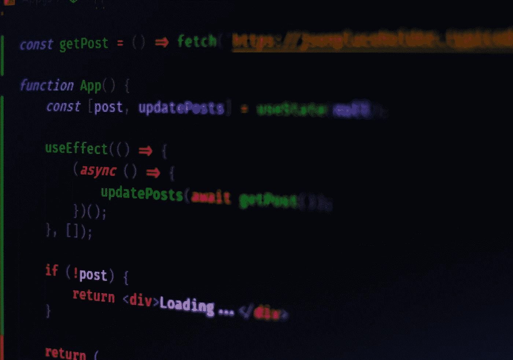

# 如何检查您的 JavaScript 包是否支持浏览器

> 原文：<https://betterprogramming.pub/check-your-javascript-bundles-for-browser-support-d769c1fca4c>

## 不要向使用旧浏览器的用户发送损坏的代码



费伦茨·阿尔马西在 [Unsplash](https://unsplash.com?utm_source=medium&utm_medium=referral) 上的照片

Internet Explorer 即将消失，每个人都欢欣鼓舞。自动浏览器和操作系统更新让用户保持最新状态。然而，总会有用户使用不支持某些功能的浏览器访问您的网站。这取决于你的用户群。如果你的一些客户是企业公司，可能会有很多用户因为某些原因不得不使用 IE11 或者一个非常老的 Mozilla Firefox。

甚至一些相对现代的浏览器也不支持所有最新的 JavaScript 特性。虽然谷歌 Chrome 通常是新 JavaScript 功能的早期采用者，但 Mozilla Firefox 和苹果 Safari 并不总是跟上谷歌 Chrome 的步伐。

尽管如此，支持 IE11 通常比支持其他流行的浏览器更困难。看看这篇文章，当你的 Angular 应用程序在 IE11 中不工作时，如何修复它:

[](https://medium.com/better-programming/how-to-fix-your-angular-app-when-its-not-working-in-ie11-eb24cb6d9920) [## 如何在 IE11 中修复不工作的 Angular 应用程序

### 使用聚合填充支持新功能

medium.com](https://medium.com/better-programming/how-to-fix-your-angular-app-when-its-not-working-in-ie11-eb24cb6d9920) 

要点:如果你想支持广泛的浏览器，包括 IE11 这样的老歌，那么你需要在你的应用程序中包含 polyfills，并确保浏览器支持你提供给用户的 JavaScript 文件。

# IE11 事件

最近，我们偶然发现了一个问题，我们的应用程序根本不能在 IE11 中启动。问题很快就被发现了:一些代码没有像预期的那样传输，所以用户会下载包含箭头函数的 JavaScript 代码，IE11 根本不支持。然而，检查你的网站旧浏览器的兼容性是一件麻烦的事情。如果你没有 Windows 电脑，那么你最好使用 BrowserStack 或 LambdaTest 这样的服务。然而，这通常非常缓慢和麻烦。

在将代码部署到生产环境之前发现这些问题的解决方案是在部署之前运行自动化的端到端测试。端到端测试模拟真实的用户场景，这允许您快速发现错误。有一些流行的测试框架，比如 [Cypress](https://www.cypress.io/) 。然而，这些测试的执行可能会花费一些时间，并且与单元测试相比，这些测试可能会更加复杂和难以维护。尽管如此，至少进行一些端到端的测试会给应用程序作为一个整体工作带来一些信心。

自动化浏览器测试的问题是，尽管许多框架和测试运行者支持最新版本的 Chrome 和 Firefox，但 IE11 等旧浏览器通常得不到很好的支持(例如，量角器)或根本不支持(例如，Cypress)。这意味着在所有常用的浏览器上运行自动化测试通常是不可行的。

# 让我们验证一下我们的包在旧浏览器中也能工作

一位同事有一个好主意，那就是采用另一种方法，这种方法实现起来更快，并且至少提供了一些安全性，即应用程序代码也可以在较旧的浏览器中工作。想法是在我们的持续集成管道中放置另一个检查，在产品构建之后检查生成的包。这将在代码部署到生产环境之前发现类似上面提到的 arrow 函数问题。

当然，这种简单的检查不能提供与手工或自动化测试相同的有效性。尽管如此，这个简单的检查可以防止开发人员在没有自己检查的情况下发布完全损坏的代码。

CI/CD 管道的基本步骤如下所示:

1.  运行构建(例如，对于 Angular，您可以使用`ng build --prod`)。
2.  检查生成的包是否有问题。如果存在错误，则 CI 作业应标记为失败，并且不能继续执行后续步骤，如部署。
3.  继续接下来的步骤(例如，部署)。

我们找到了一个名为 [ES Check](https://github.com/yowainwright/es-check) 的便利库。它可以作为开发专用的依赖项与 npm 一起安装，但也可以使用 [npx](https://github.com/npm/npx) 直接调用。您只需要将它指向您的包的目录，并告诉它您想要支持哪个版本的 ECMAScript(读:JavaScript)(例如，ES5)。这个过程不会超过几秒钟。以下是直接摘自项目文档的解释性摘录:

> “在现代 JavaScript 版本中，文件被捆绑在一起，因此它们可以在浏览器中以优化的方式提供。开发人员认为，未来的 JavaScript——像 ES8 一样——将由 Babel 这样的工具适当地转换(从未来的 JavaScript 变为当前的 JavaScript)。有时会出现文件无法传输的问题。到目前为止，还没有有效的方法来测试未传输的文件。ES Check 就是干这个的。”— [ES 检查](https://github.com/dollarshaveclub/es-check)

# 如何用 ES Check 检查生成的 JavaScript 包

现在我们已经了解了问题，让我们看看如何将 ES 检查纳入 CI 渠道。

下面是一个简化的 GitLab CI 管道:

```
# Run a full build
aot build:
  image: node:12.18.3
  script:
    # install dependencies
    - npm ci
    # run a full, production-ready build (this is a npm script)
    - npm run build:production
    # check es5 bundles for older browsers compatibility
    - **npx es-check es5 ./your-dist-folder/*.js --verbose**
```

成功运行 ES Check 的输出如下所示:

```
ES-Check: Going to check files using version 5ES-Check: checking ./dist/common-es5.036d8a8f1d8ed1b18e05.jsES-Check: checking ./dist/main-es5.9c2c8a661140187e4316.jsES-Check: checking ./dist/modules-login-login-module-ngfactory-es5.91da0ff09285192d7330.jsES-Check: checking ./dist/modules-user-profile-user-profile-module-ngfactory-es5.68f5a6161704cb750f93.jsES-Check: checking ./dist/polyfills-es5.e3f8b2d4d82eeaed59a0.jsES-Check: checking ./dist/runtime-es5.934c3283cc8c6d77c916.jsES-Check: there were no ES version matching errors!  🎉
```

如果有问题，ES Check 将导致您的 CI 作业失败，这将阻止您发布在旧浏览器中根本不工作的代码。

## 更新:为 GitHub 项目引入 es-check-action

最近，我创建了`[es-check-action](https://github.com/marketplace/actions/es-check-action)`，一个简单且可配置的 GitHub 动作来自动化这个过程。操作是单独的任务，您可以组合这些任务来创建作业和自定义您的工作流。您可以创建自己的操作，或者使用和定制 GitHub 社区共享的操作。这个 GitHub 动作根据 es 的指定版本检查 JavaScript 文件。如果指定文件的 ES 版本与 ES 版本参数不匹配，此操作将引发错误。

我计划发布一个通用的 GitHub 动作教程，我将用这个动作作为例子。

# 结论

感谢您阅读这篇关于如何检查浏览器支持的 JavaScript 包的短文。如您所见，很容易将这种快速捆绑检查作为 CI 管道的一部分。然而，这并没有消除对一些适当的自动或手动测试的需要。你如何检查你的网络应用程序的浏览器兼容性？请在评论中告诉我。