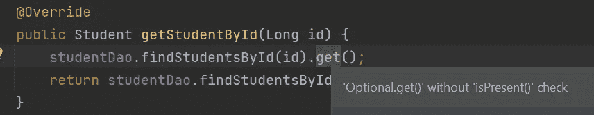
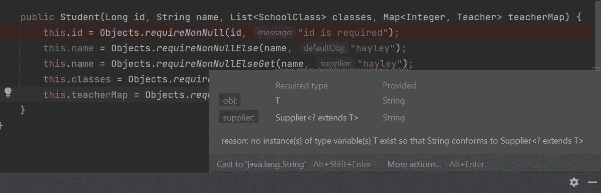
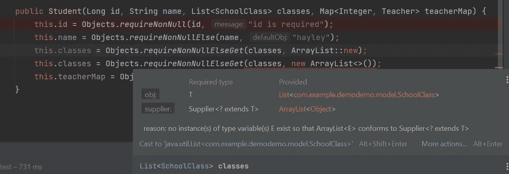
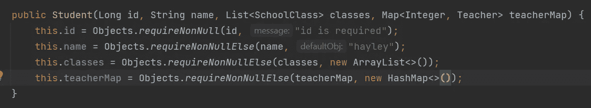
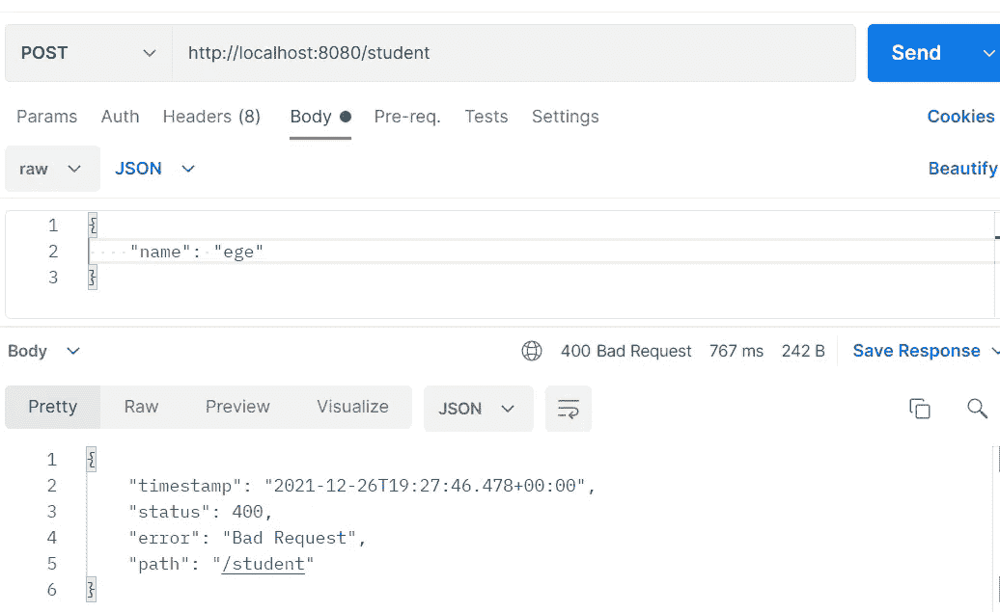

# 在 Java 中检查空值？尽量减少使用“如果，否则”

> 原文：<https://betterprogramming.pub/checking-for-nulls-in-java-minimize-using-if-else-edae27016474>

## 尝试 6 种替代方案


由 [Valentin Lacoste](https://unsplash.com/@valentinlacoste?utm_source=medium&utm_medium=referral) 在 [Unsplash](https://unsplash.com?utm_source=medium&utm_medium=referral) 上拍摄的照片

在本文中，我将尝试给出一些使用的不同类型的空检查或 NPE (NullPointerException)避免技术的例子。

有许多关于这个主题的好文章，但我将试着把重点放在一些来自我自己经历的具体例子上。

请注意，我仍在学习过程中—可能永无止境:)—因此，如果您看到任何错误，请随时告诉我。

# 1.java.util .可选

> 一个容器对象，可能包含也可能不包含非空值。如果存在一个值，`isPresent()`将返回`true`，`get()`将返回该值。

在我目前从事的项目中，最常使用的一个地方是从数据库中检索数据。

假设你有三样东西:

1.  一个叫做`Student.java`的模型类
2.  一个服务接口及其实现:`StudentService.java`和`StudentServiceImpl.java`
3.  一个 DAO 接口及其实现:`StudentDao.java`和`StudentDaoImpl.java`

并且您想要检索具有相关 id 的学生。

## Optional.ofNullable()

> 如果为非空，则返回描述给定值的可选值，否则返回空可选值。

此方法的返回值永远不会为 null。如果为空，返回值将为`Optional.empty()`。这样，如果这个方法的结果被用在别的地方，就没有机会得到 NPE。

## Optional.orElseThrow()

> 如果存在值，则返回该值，否则引发 NoSuchElementException。

在 null 的情况下，如果你想抛出一个异常，你可以使用`orElseThrow()`。

## Optional.orElse()

> 如果有值，则返回该值，否则返回其他。

在 null 的情况下，如果你不想抛出一个异常，但是你想返回一个样本 student 实例，那么可以使用`orElse()`。

```
@Override
public Student getMockStudent(Long id) {
    final var student = Student.*builder*()
            .id(1L)
            .name("ege")
            .build();

    return studentDao.findStudentsById(id).orElse(student);
}
```

## Optional.get()

> 如果存在值，则返回该值，否则引发 NoSuchElementException。

```
@Override
public Student getStudentDirectly(Long id) {
    return studentDao.findStudentsById(id).get();
}
```

在这种情况下，如果您使用 IntelliJ，它会立即给出警告:



基本上是说“首先检查你的学生是否为空，然后继续”。

```
// correct way to do it
@Override
public Student getStudentDirectly(Long id) {
    final var studentOptional = studentDao.findStudentsById(id);
    if(studentOptional.isPresent()){
        // do your stuff here 
    }
}
```

当我确信从我调用的方法中有数据返回时，我通常在单元测试中使用`get()`。但是我不会在实际代码中没有`isPresent()`的情况下使用它，即使我确信不会有 null。

再比如；下面的代码片段试图获取具有相关 id 的学生，如果没有这样的学生，则返回一个默认名称(“Hayley”)。当有学生但没有名字时，传递给`rElse()`的值也会被返回。

```
@Override
public String getStudentName(Long id) {
    return studentDao.findStudentsById(id)
            .map(Student::getName)
            .orElse("Hayley");
}
```

# 2.apache.commons 的实用程序类

*   对于收集实例:`CollectionUtils.isEmpty()`或`CollectionUtils.isEmpty()`
*   对于地图实例:`MapUtils.isEmpty()`或`MapUtils.isNotEmpty()`
*   对于字符串:`StringUtils.isEmpty()`或`StringUtils.isNotEmpty()`

对于列表、映射等，`isEmpty()` 检查集合/映射是否为空或大小为 0。类似地，对于`String`，它检查`String`是否为空或长度为 0。

为了使用`CollectionUtils`和`MapUtils`，需要在`build.gradle`文件中添加以下依赖关系:

```
implementation org.apache.commons:commons-collections4:4.4
```

对于`StringUtils`，您需要:

```
implementation org.apache.commons:commons-lang3:3.0
```

# 3.Objects::流中非空

> 如果提供的引用为非空，则返回`true`，否则返回`false`。

假设您有一个数据流，您将对该数据流执行一些链式操作，但在此之前，您希望过滤掉空值(如果有空值的话)。

```
final var list = Arrays.*asList*(1, 2, null, 3, null, 4);

list.stream()
        .filter(Objects::*nonNull*)
        .forEach(System.*out*::print);
```

结果:`1234`

# 4.要求 java.util.Objects 的非空方法

## requireNonNull()

> 检查指定的对象引用是否不是`null`，如果是，抛出一个定制的`*NullPointerException*`。此方法主要设计用于在具有多个参数的方法和构造函数中进行参数验证。

## requireNonNullElse()

> 如果第一个参数不是`null`，则返回第一个参数，否则返回非`null`的第二个参数。

## requireNonNullElseGet()

> 如果是非`null`则返回第一个参数，否则返回`supplier.get()`的非`null`值。

我最常使用这三者的地方主要是构造函数。

让我们用上面的例子来复习一下。

`requireNonNull on id`:我们是说“这个字段是必填的，所以如果为空；抛出一条“需要身份证”的 NPE 信息。

`requireNonNullElse on name`:我们是说“这个字段是必填的，所以如果为空；不要抛出异常，而是为它设置一个默认值。在我们的例子中，默认值是“hayley”。

`requireNonNullElseGet on classes`:我们是说“这个字段是必填的，所以如果为空；不要抛出异常，而是为它设置一个默认值。。

与`requireNonNullElse`不同的是，这个方法期望`Supplier`作为第二个参数。

因此，我们可以使用带有`requireNonNullElseGet.`的方法引用，这在处理列表、映射、集合时特别有用，如果你想将它们初始化为空列表、映射、集合等。



无供应商的 requireNonNullElseGet



不含供应商的 requireNonNullElseGet



requireNonNullElseGet 替换为 requirenonnullesleeve

让我们看看实际情况:

结果:

```
Student 1 name: hayley
Student 2: Student(id=1, name=ege, classes=[], teacherMap={})
Student 3: Student(id=null, name=null, classes=null, teacherMap=null)
Student 4: Student(id=1, name=ege, classes=[], teacherMap={})
Student 5: Student(id=1, name=ege, classes=[SchoolClass(id=null, name=null, type=null, teacher=null, students=null, extras=null, startDate=null)], teacherMap={})
```

请注意，这些验证只有在调用相关的构造函数时才有效。

再比如；假设你正在从你当前的方法(x)调用一个方法(y ),并且从(y)返回结果，你将在 x 中做其他操作，如果你不检查从 y 返回的结果是否为空，你有可能得到 NPE。

结果是:

```
Students 1: null
Students 2: []
Students 3: [Student(id=1, name=ege, classes=[], teacherMap={}), Student(id=2, name=itir, classes=[], teacherMap={})]
Students 4: [Student(id=1, name=itir, classes=[], teacherMap={}), Student(id=2, name=ege, classes=[], teacherMap={})]
Default student name: hayley
All names:[itir, ege]
```

# 5.龙目岛的建造者。默认

如果你不熟悉龙目岛，我强烈建议你去看看。我个人非常喜欢 Lombok，它让开发人员的生活变得更加轻松:)

假设您有包含 id、名称和类等字段的`Student.java`。您可以在相关字段前使用 put `@Builder.Default`并给它一个默认值。

当这个`Student`类的实例被创建时，它将“classes”作为一个空列表，而不是 null。

```
final var student1 = Student.*builder*().build();
final var student2 = new Student();
final var student3 = Student.*builder*().id(1L).name("ege").build();

System.*out*.println(student1.getClasses());
System.*out*.println(student2.getClasses());
System.*out*.println(student3.getClasses());

System.*out*.println(student1.getName());
System.*out*.println(student2.getName());
System.*out*.println(student3.getName());
```

结果是:

```
[]
[]
[]
hayley
hayley
ege
```

如果您像这样简单地陈述`Student.java`中的字段:

```
private Long id;
private String name;
private List<SchoolClass> classes;
```

结果是:

```
null
null
null
null
null
ege
```

它对我处理列表、地图等特别有用。因为对于我正在从事的当前项目，列表或映射比其他字段更有可能为空。此外，如果在这些列表/映射上执行更多的操作，当它们为空时，很可能得到一个 NPE。

假设您想要获取学生注册的班级名称，并且您没有在“班级”列表中使用`Builder.Default`。

```
final var student1 = Student.*builder*().build();
System.*out*.println(student1.getClasses().stream().map(SchoolClass::getName));
```

抛出 NPE。

# 6.NotNull、NotEmpty、NotBlank 批注

`@NotNull` : *“注释元素不能为空。接受任何类型。⁴*

`@NotEmpty` : *"注释元素不能为 null 或空。支持的类型有 CharSequence、Collection、Map、Array。⁵*

`@NotBlank` : *"带注释的元素不能为空，并且必须包含至少一个非空白字符。接受 char sequence“⁶*

假设你有一个控制器和一个`saveStudent()`方法。当您希望 id、name 和 classes 字段不为 null 或空时，您可以将这些注释放在 Student class 中，如下所示:

```
@NotNull
private Long id;
@NotEmpty
private String name;
@NotEmpty
private List<SchoolClass> classes;
private Map<Integer, Teacher> teacherMap;
```

如果您正在使用 Spring Boot，您可以将这些注释与 API 请求体的`@Validated`注释结合起来，如下所示。

```
@PostMapping()
public void saveStudent(@Validated @RequestBody Student student){
    studentService.saveStudent(student);
}
```

例如，您有这样的请求:



如您所见，您将得到“400”错误，并且在您的应用程序的控制台中，您将看到:

```
DefaultHandlerExceptionResolver : Resolved [org.springframework.web.bind.MethodArgumentNotValidException: Validation failed for argument [0] in public void com.example.demodemo.controller.StudentController.saveStudent(com.example.demodemo.model.Student) with 2 errors: [Field error in object 'student' on field 'classes': rejected value [null]; 
codes [NotEmpty.student.classes,NotEmpty.classes,NotEmpty.java.util.List,NotEmpty]; arguments [org.springframework.context.support.DefaultMessageSourceResolvable: codes [student.classes,classes]; arguments []; default message [classes]]; default message [must not be empty]] [Field error in object 'student' on field 'id': rejected value [null]; 
codes [NotNull.student.id,NotNull.id,NotNull.java.lang.Long,NotNull]; arguments [org.springframework.context.support.DefaultMessageSourceResolvable: codes [student.id,id]; arguments []; default message [id]]; default message [must not be null]] ]
```

如果愿意，您可以捕获这个`MethodArgumentNotValidException`并返回一个自定义错误。

所需的依赖性:

```
implementation 'org.springframework.boot:spring-boot-starter-validation'
```

就我目前所知，就是这样。随着我学习更多的空检查方法，我会尝试更新这个列表。有时候，我仍然需要使用一个很好的旧的“if else”块来进行空值检查，但是我会尽可能地使用这些方法。

希望你喜欢这篇文章。

**参考文献:**

1.  [https://docs . Oracle . com/javase/8/docs/API/Java/util/optional . html](https://docs.oracle.com/javase/8/docs/api/java/util/Optional.html)
2.  [https://docs . Oracle . com/javase/8/docs/API/Java/util/objects . html](https://docs.oracle.com/javase/8/docs/api/java/util/Objects.html)
3.  [https://docs . Oracle . com/javase/9/docs/API/Java/util/objects . html](https://docs.oracle.com/javase/9/docs/api/java/util/Objects.html)
4.  [https://docs . Oracle . com/javaee/7/API/javax/validation/constraints/not null . html](https://docs.oracle.com/javaee/7/api/javax/validation/constraints/NotNull.html)
5.  [https://javaee . github . io/javaee-spec/javadocs/javax/validation/constraints/notempty . html](https://javaee.github.io/javaee-spec/javadocs/javax/validation/constraints/NotEmpty.html)
6.  [https://javaee . github . io/javaee-spec/javadocs/javax/validation/constraints/not blank . html](https://javaee.github.io/javaee-spec/javadocs/javax/validation/constraints/NotBlank.html)
7.  [https://www.baeldung.com/java-avoid-null-check](https://www.baeldung.com/java-avoid-null-check)
8.  [https://projectlombok.org/](https://projectlombok.org/)