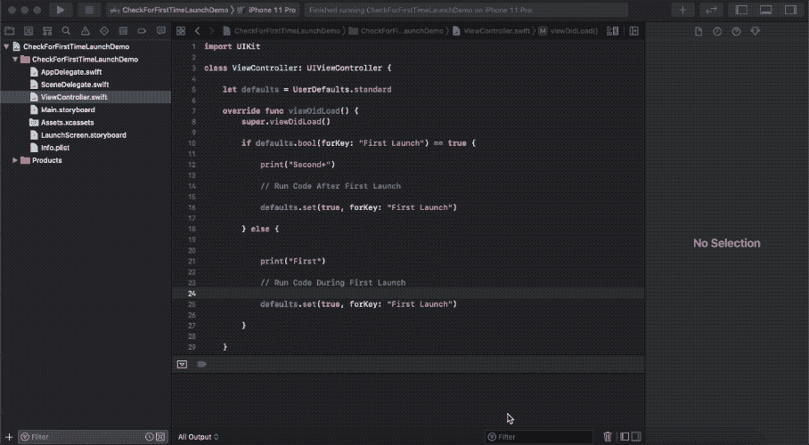
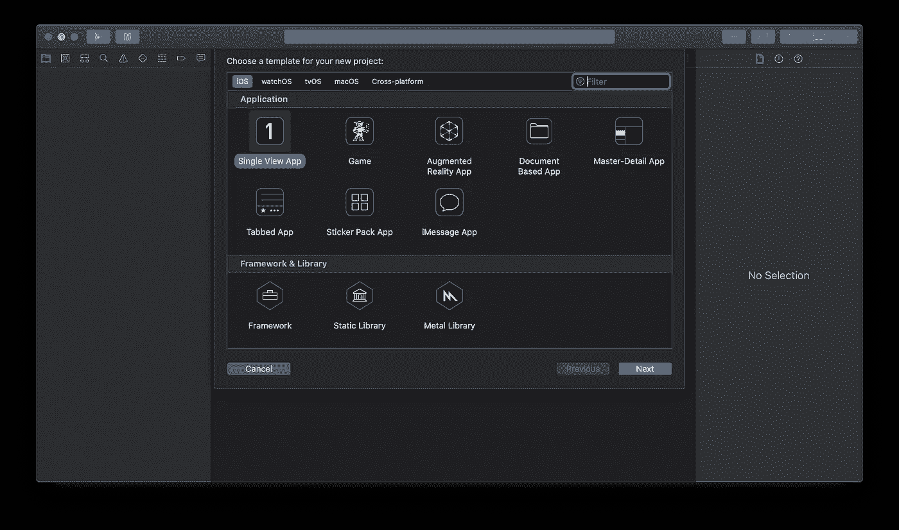
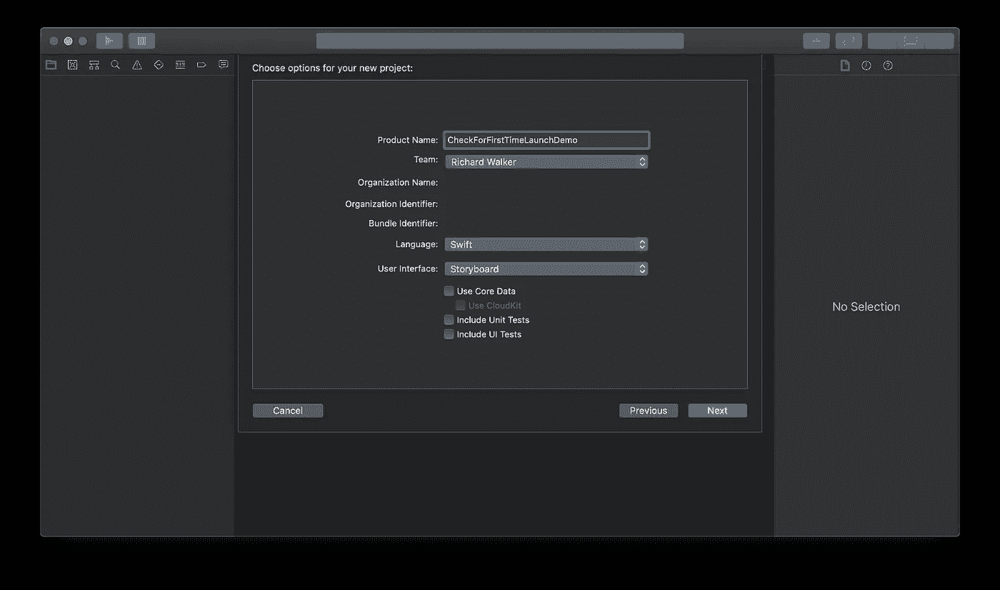
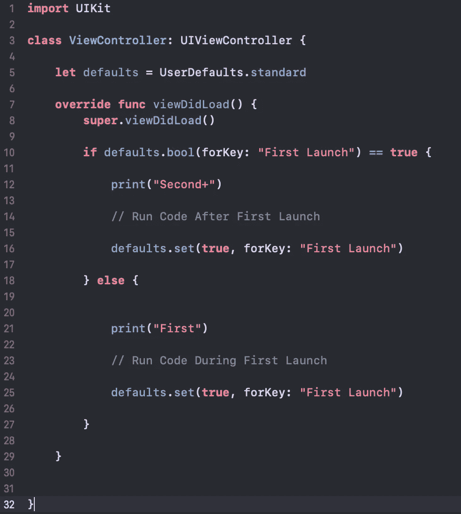

# 检查用户在 Swift 中的首次启动

> 原文：<https://betterprogramming.pub/checking-for-the-users-first-launch-in-swift-df02a1feb472>

## 在第一次启动时运行特定的操作，之后在每次启动时运行不同的操作

首次发射时的“首次”;之后的每次发射都是“秒+”

# 介绍

在你掌握了保存数据的能力之后，无论是使用`iCloud`还是为了安全起见使用`UserDefaults`，你都需要能够加载数据。虽然单击按钮是加载数据的一种简单方式，但您不希望每次用户需要应用程序的最新数据时都单击按钮。

就像我上面说的，你可能会认为使用按钮是加载用户数据的最简单的方式，但是能够检测应用程序的当前会话是否是第一次启动并不像人们想象的那么困难。

# 什么是首次启动检查，它们有什么用处？

对于不同类型的应用程序，能够检查当前应用程序会话是否是第一次启动是非常重要的。最重要的一点是你的应用程序是否需要登录。当用户第一次启动你的应用时，你宁愿让他们去登录页面，而不是你的应用的主页，对吗？然后你需要能够检查这是否是他们第一次使用这个应用程序。

另一个使用它的好时机是，如果你的应用程序要求用户在第一次启动时选择某些设置，那么以后每次启动时你都需要加载这些设置。实现这样的事情最简单的方法是使用一个老的、可信赖的朋友:`UserDefaults`。让我们开始吧。

# 要求

*   Xcode 10
*   Swift 4(及更高版本)

我假设你对`UserDefaults`的工作原理有一点了解，如果你没有，[可以看看我的文章](https://medium.com/better-programming/data-persistence-userdefaults-b8503f93ff14?source=your_stories_page---------------------------)关于它们是如何工作的。在我看来，`UserDefaults`是最有用的框架之一。

# 入门指南

和往常一样，首先要做的是创建一个新的 Xcode 项目。

我们将为本教程选择一个单视图应用程序(完整的项目可以在本文末尾找到)。

为此项目选择单视图应用程序

接下来，随便你给它起什么名字——对于这个项目，我将把它命名为`CheckForFirstTimeLaunchDemo`。

命名为`CheckForFirstTimeLaunchDemo`

点击“下一步”,并将其保存在您记得的地方。现在让我们开始运行一些简单的代码。

# 代码

对于本文，我选择不做任何 UI 工作。我这样做是因为从技术上来说，它不需要任何东西——另外，它可以让人们更好地理解，当你的应用加载时，你不需要像按钮这样的 UI 元素来加载数据。

首先，我们将进入`ViewController.swift`并将光标置于`ViewDidLoad`方法中。完成后，让它看起来像这样:

第 5 行:这只是将变量`defaults`设置为`UserDefaults.standard`。

第 10 行:这是一切的开始。它只是一个`if-statement`，检查键`“First Launch”`是否被设置为`defaults`内部的`true`。现在，如果*是*第一次启动，则键`“First Launch”`不会被设置为任何值，因此 if 语句将输出一个`false`读数。

第 21 行:如果它是假的，在应用程序第一次启动时，它将到达`if-statement`的`else`部分。在这一行下面，你应该放置你想在应用程序第一次启动时运行的代码。第 21 行所做的就是将`“First”`打印到调试区。

第 25 行:这里是大部分神奇的事情发生的地方:一旦应用程序第一次运行，`“First Launch”`没有被设置为任何东西，所以它默认为`false`。但是在第一次发射发生后，我们希望“第一次发射”是`true`，表示第一次发射已经发生。这样，当第 10 行中的`if-statement`再次运行时，`else`部分将不会运行——除非用户删除该应用并重新安装。

第 12 行:这将把`“Second+”`输出到调试区，表示在第一次启动后正在运行的代码。

第 16 行:该行与第 25 行完全相同，但在`if-statement`的不同部分。从技术上讲，我们不需要这个，但它让我感觉更好。

代码到此为止。有点 TL；对这一行的 dr 解释应该是:把你想在第一次启动时运行的代码放在第 21 行和第 25 行之间。在第 12 行和第 16 行之间，把你想运行的任何东西放到之后的每次启动中，你就可以运行了！

# 运行应用程序

你现在要做的就是运行将应用程序部署到 iPhone 模拟器的方案(如果是第一次将应用程序运行到模拟器，可能需要几分钟)。

第一次在模拟器或真实设备上启动应用程序时，调试区域应该显示`“First.”`

之后，进入多任务模式，关闭应用程序。

完成之后，只需在 Xcode 中再次运行该方案(这样您就可以获得调试输出)，现在您应该会看到打印出的`“Second+”`。

运行应用程序两次，以确保一切正常

# 结论

能够检查当前应用的会话是否是第一次启动，这并不是很难实现。有了我们的朋友`UserDefaults`，你可以在短短几分钟内设置你的应用程序，每次打开它时自动加载数据。

能够做到这一点增加了另一层可用性，任何用户都会非常欣赏你的应用程序。现在，他们不必手动获取更新的数据。如果你正在创建一个需要登录的应用程序，这也将大有帮助。

用户界面越简单越好。

# 项目文件

这里是本教程的 [GitHub](https://github.com/ewalk40/CheckForFirstTimeLaunchDemo) 项目的链接。

 [## ewalk 40/checkforfirst timelaunch demo

### 此时您不能执行该操作。您已使用另一个标签页或窗口登录。您已在另一个选项卡中注销，或者…

github.com](https://github.com/ewalk40/CheckForFirstTimeLaunchDemo)