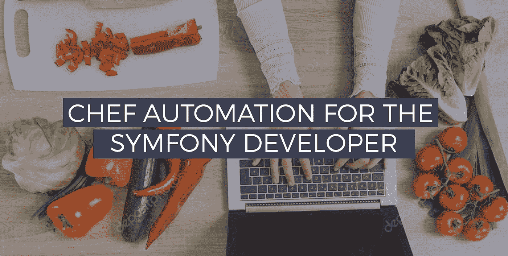
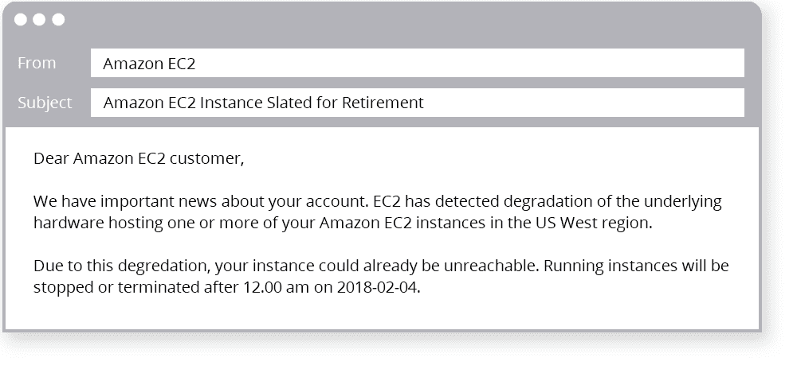
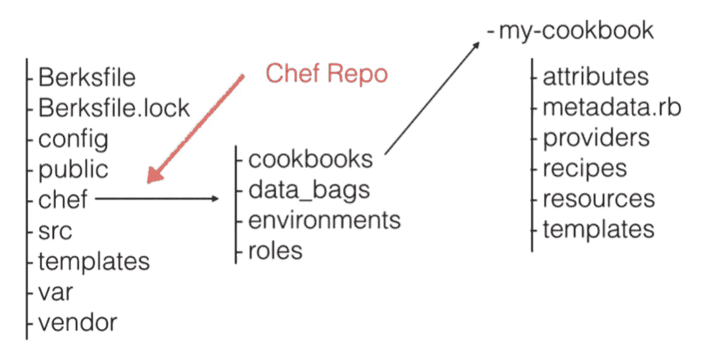

# Symfony 开发人员的厨师自动化

> 原文：<https://betterprogramming.pub/chef-automation-for-the-symfony-developer-9e786328dbd8>

## 面向中小企业和初创企业的厨师自动化介绍

手动构建服务器已经过时了。如今，酷小子们正在实现基础设施的自动化。脸书和 Airbnb 等大公司已经普及了 Chef，但你不需要成为世界 500 强公司才能从中受益。事实上，您可以使用免费版的 Chef 轻松启动几台服务器！

# 弥合差距

这篇文章旨在为中小型企业(SME)和初创公司介绍厨师自动化。这是我多年来在各种 Symfony/PHP 项目中使用该框架的结果。

随着像 Chef 这样的平台使开发人员能够更多地参与到传统上只有“运营”的方面，运营和开发人员之间的差距正在缩小。所以，即使你不打算完全参与 DevOps，我相信更好地理解一个项目的基础设施会帮助你成为一个更好的程序员。它将通过最小化你和 DevOps 之间的来回来改善整个开发过程。

# 使用 Chef 需要学习 Ruby 吗？

Chef 是一个基于 Ruby 的框架，但是如果你不是 Ruby 开发者也不用担心。您将与小代码块——称为资源——进行交互，这类似于 PHP/Symfony 助手函数。Ruby 和 PHP 的语法还有其他相似之处。事实上，Chef 使用的领域特定语言(DSL)是 Ruby 的一个子集，所以大多数时候你只会使用 Chef DSL。

你甚至不会注意到你是在一个 Ruby 环境中！

# 为什么要用大厨？

这是你在学习任何新东西之前需要问自己的真正问题。出现了如此多的新平台、框架和语言，以至于在评估中有选择性和有条理比以往任何时候都更加重要。因此，我并没有对此进行梳理，而是试图探究我认为你应该使用 Chef 的所有理由。

## 环境之间的一致性

如果您只从本文中学到一件事，那就是:Chef 为您提供了所有环境之间的一致性。

`Local = Development = Staging = Production`

你是否厌倦了听到开发人员说“它在我的机器上运行良好”？我也是。没有比这更令人沮丧的了。Chef 可以将您从重复对话中解救出来，因为您将在整个项目中使用一致的环境。这样，无论是在本地还是在开发环境中，bug 都更容易复制。因为它们被发现得更早，它们进入生产的可能性就更小。

## 自动化

Chef 自动化了构建服务器的过程，这种自动化可以帮助您更快地恢复数据。

如果您使用 AWS，您可能会意识到实例(他们对服务器的术语)是可处置的。有时，它们中的一些会失败，你可能会在收件箱中收到一封“Amazon EC2 Instance scheduled for retirement”电子邮件，或者我称之为“AWS 死亡电子邮件”。它基本上是一条消息，说明您的实例将来会因为硬件故障而关闭，由您来替换它。拥有一个良好的数据备份，以及像 Chef 这样的工具，将帮助您在几分钟内轻松重建您的服务器，而不是几个小时或几天。

*臭名昭著的 AWS 死亡邮件*

## 可重用基础设施代码

将基础设施作为代码意味着您的环境可以具有应用程序的某些品质。它可以是可版本化的、可测试的和可重用的。当你的基础设施的代码和你的应用程序的代码存在于同一个 repo 中时，这将帮助团队中的每个人更好地理解整个项目。

# 如何将 Chef 集成到 Symfony 存储库中？

Chef 可以轻松集成到你的 Symfony app 目录结构中，你需要的只是一个可以调用`chef`的目录。例如，在应用程序结构的根。

*带厨师的 Symfony 4 应用示例*

# 厨师基本术语

Chef 自带风味(抱歉)的烹饪灵感术语。以下是在框架中工作时需要牢记的一些最重要的术语:

## 厨师节点

Chef 节点只是一个服务器。Chef 可以管理许多不同的服务器，但大多数时候它们要么是您计算机上的虚拟机，要么是云服务器。

## 厨师工作站

工作站只是您的计算机的另一个术语:您用来管理您的食谱并与 Chef 服务器交互的机器。

## 厨师服务器

厨师服务器是厨师生态系统的控制中心。它是存储菜谱、节点元数据、环境细节等的地方。

## 资源

这是实现特定配置状态的一小段代码(在 Chef DSL 中)。

比如:创建一个有一些特定权限的目录。资源是声明性的，你指定“什么”应该发生，而不是“如何”发生。如果我们把这个比作 PHP，它可以被看作是一个你用一些参数调用的帮助函数。它执行特定的操作，因此您不必担心驱动它的实际过程。

## 秘诀

配方是用于实现特定配置的一组资源。一个配方应该专注于实现一个特定的服务。例如 Apache、PHP 或 MySQL。

## 食谱

烹饪书由许多食谱组成。它为厨师代码提供了结构。它包含其他元素，如属性、模板等。

## 运行列表

运行列表是某些配方/角色的组合列表。它以一定的顺序应用于给定的节点。顺序非常重要，因为运行列表的项目是按照指定的顺序执行的

## 作用

角色允许您将配方直接应用到节点的运行列表。例如，你可以有一个叫做`web-server`的角色，这个角色将包括构建一个 web 服务器所需的所有不同的方法，比如`PHP`、`Apache`等等。

## 属性

属性是我们为菜谱中使用的各种参数设置值或覆盖其他默认值的地方。属性是我们在 Symfony 应用中使用的配置`.yaml`文件。例如，在我们的属性中，我们可以定义默认的目录路径、版本、IP 地址、端口等。

## 数据包

数据包是一个 JSON 格式的容器，其中包含节点间共享的信息。例如，系统用户、密码和 SSL 证书。

## 刀

它是 Chef 提供的与 Chef 服务器通信的命令行工具。包含在厨师 DK 里。

## 伯克大陆架

在 PHP 世界里，我们有 Composer。厨师有 Berkshelf 一个依赖管理器，管理我们项目中社区食谱的实现。

## 大厨超市

这相当于 Packagist，是所有社区食谱的出版地，所以我们可以在我们的 any Chef 项目中使用它们。

## 环境

Chef 中的环境与您可能在任何编程应用程序框架中使用的应用程序环境非常相似。Chef 中的环境允许您将配置数据指向特定的节点。

## 主厨 solo

Chef solo 允许您在不将计算机连接到 Chef 服务器的情况下供应计算机。这是 Chef 配合虚拟化软件使用的首选方式(比如流浪记)。有些人甚至使用 Chef solo 来配置他们的服务器。如果您的基础设施很小，这可能是理想的选择。

# 厨师工作流程简介

既然我们已经熟悉了 Chef 世界中使用的一些术语，那么让我们来看看用于更新节点的基本工作流。此工作流假设您的基础架构中有一个 Chef 服务器。

## 设置您的厨师工作站

Chef 开发工具包(ChefDK)为您提供了与 Chef 服务器交互和开始编写 Chef 代码所需的所有工具。ChefDK 支持所有最重要的操作系统的最新版本:Linux、Mac OS X 和 Windows。每个操作系统都有一个 [ChefDK](https://downloads.chef.io/chefdk) 包，所以很容易安装。

## 将更改推送到 Chef 服务器

为了能够将任何更改应用到您的服务器，您需要首先将这些更改推送到 Chef 服务器。你可以使用小刀命令行工具，但是通常你会使用 [Berkshelf](https://berkshelf.com/) 来上传你的食谱和管理你的食谱依赖。 [Berkshelf](https://berkshelf.com/) 让你以类似于 PHP 世界中应用程序依赖的方式管理你的食谱依赖。这样，您可以定义将在您的 Chef 项目中使用的社区食谱和版本，它也可以用于版本化您自己的食谱。

如果您不使用 Berkshelf 将您的食谱上传到 Chef 服务器，那么您将使用小刀命令行工具。Knife 是您用来与您的 Chef 服务器进行多种不同任务通信的工具。比如说；它将帮助您管理您的节点、数据包、角色和环境。

## 将更改应用到节点

将任何更改上传到 Chef 服务器后，最后一步是将它们应用到您的节点。好消息是这是由厨师自动完成的。这是因为每个 Chef 节点都运行一个名为“Chef client”的代理，该代理经常轮询 Chef 服务器的更改。Chef 客户端通常每 15 分钟执行一次，如果发现需要更新的内容，它会将更改应用到服务器。这个过程被称为厨师运行。在 Chef 成功运行后，节点会根据 cookbook 规范进行更新。

# 你可以和厨师一起做的很酷的事情

## 持续部署

我们最近写了一篇关于[持续集成](https://www.scalablepath.com/blog/continuous-integration/)的好处的文章。如果想法有吸引力，但方法没有吸引力，那么 Chef 可能是一个很好的选择。尤其是在小型项目的开发环境中。这是因为 Chef 使用了一个名为' deploy '的资源，基于 Capistrano，它有几乎相同的回调: **after_restart** 、 **before_migrate** 、 **before_restart** 和 **before_symlink** 。使用这些回调，您可以附加在 Symfony/PHP 部署中使用的所有不同命令:清除缓存、安装供应商、运行测试、迁移和处理资产。

## 调配虚拟机

通常，应用程序依赖于许多不同的服务，例如，web 服务器、电子邮件服务器、数据库、缓存系统、javascript 库等等。配置这些服务需要花费大量的时间和精力。Chef 不仅可以用于供应云服务器，还可以供应本地环境。因此，举例来说，您可以像在 AWS 中一样使用 Chef 来配置虚拟机。这意味着您可以在计算机上拥有与生产服务器几乎相同的配置。

vagger 提供了多个选项来配置虚拟机。Chef 提供了一个名为 Chef Solo 的工具，它非常适合这种情况，因为它允许使用 Chef 供应虚拟机，而不需要 Chef 服务器，因此您可以直接从 repo 运行 cookbooks，而不依赖于 Chef 项目基础架构。

# 结论

让我们首先概括一下使用 Chef 的一些主要好处:

*   通过一致的环境减少应用程序中的错误
*   提高项目基础设施对团队所有成员的可见性
*   自动化创建新环境的过程
*   作为代码的基础设施使其可版本化、可测试和可重用
*   如果您使用 AWS，您必须有备份和经过测试的策略来重建您的服务器。使用像 Chef 这样的工具可以在您的服务器出现故障时节省您的时间(并且您会收到 AWS 的死亡电子邮件)。
*   Chef 允许您免费拥有多达 5 个节点，非常适合小型基础架构。

厨师和流浪者对于你的本地环境是一个很好的组合，可以让你作为一个开发人员更有效率。举个例子，如果你的电脑有一天死机了，你不得不买一台新电脑，你不需要太担心，因为你可以很容易地用 Chef 重建你的本地环境，而不用在这个过程中浪费几天时间。此外，当一个新的开发人员被介绍到项目中时，这也很有帮助。

如果你有兴趣了解更多关于 Chef 的知识，你应该先去 [https://learn.chef.io](https://learn.chef.io/) 他们有一些不错的教程，包括网络研讨会、测验和带有烹饪术语的酷徽章。厨师官方文件非常好，他们做了很好的组织工作。点击这里查看他们的网站: [https://docs.chef.io](https://docs.chef.io/) 。

*要阅读来自可扩展路径团队的更多帖子，请访问我们的* [*博客*](https://www.scalablepath.com/blog/) *。*