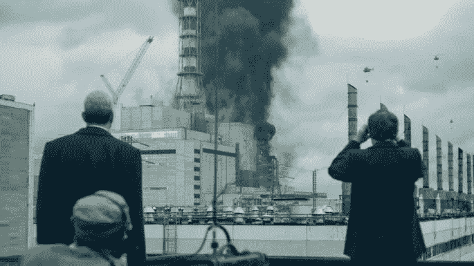
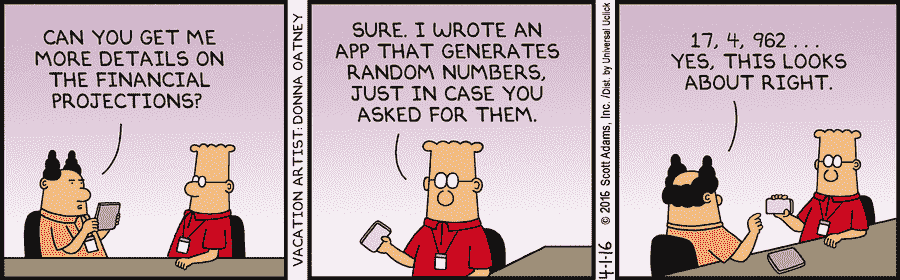

# 切尔诺贝利:技术债务的真实成本

> 原文：<https://betterprogramming.pub/chernobyl-the-true-cost-of-technical-debt-8307e6f4d53c>

## 切尔诺贝利灾难中技术债务与软件开发的比较

天空和 HBO

HBO 的《切尔诺贝利》立刻吸引了我。不仅仅是因为围绕这个著名事件的戏剧或历史，演员杰瑞德·哈里斯(瓦列里·勒加索夫饰)缓解核爆的方式让我着迷。看着他的角色根据当前的假设在精神上设计了一个风险最小的解决方案，结果却遇到了不可预见的问题，这引起了我工程方面的共鸣。

## *剧透警报*

# 技术债务

最重要的是，切尔诺贝利是对技术债务真实成本的严酷提醒。

技术债务，对于那些不在软件世界工作的人来说，是这样一个概念，即在代码中做出的糟糕的设计决策或编写得很差的代码将需要被修复或将导致未来的问题。与切尔诺贝利灾难不同，技术债务通常在软件中是看不见的，但可能会让公司花费数百万美元来修复。驱动技术债务的因素与迷你系列最后一集所描绘的非常相似:由于成本削减(石墨尖端)、人为错误和生产力/业务需求而导致的糟糕设计决策的组合。

出于这个类比的目的，我将使用术语“业务需求”来指代工厂试图达到的生产率目标。

# 成本削减

在切尔诺贝利事件中，技术债务始于控制棒的石墨尖端。控制棒由硼制成，硼有助于减缓核反应堆的反应速度。然而，这些控制棒的尖端实际上是石墨，这增加了反应速率。所以，当工程师通过按下紧急关闭开关来减缓核心的反应速度时，燃料棒被反应堆的尖端卡住了，反应堆爆炸了。

石墨尖端直到最后一集才被发现是压垮骆驼的稻草。在这部迷你剧里，当瓦列里提到石墨尖端时，检察官问道:“为什么是石墨？”瓦列里对此的回答是“因为它更便宜”。

graphite 提示是程序员决定不编写健壮的代码，并且没有考虑未来的工程师将如何与代码交互的物理表现。这是当时苏联用来省钱的捷径，导致了有史以来最严重的灾难之一。

最终，他们没有考虑到切尔诺贝利的工程师会犯多少错误，这些错误会将 4 号核反应堆置于爆炸的境地。

# **人为错误**

最终用户和人为错误

技术债务并不经常出现在软件的日常使用中，就像它没有在切尔诺贝利核反应堆的标准使用中显露出来一样。

更有可能的是，类似于软件，工程师们设计的反应堆可以处理 95%的可能情况。我们经常将这些场景称为用例。

不在那 95%的用例被称为边缘用例。这些是典型的情况，看起来很少，不应该发生，或者是由用户错误而不是系统错误引起的。

然而，由于这些系统的复杂性，你永远无法真正预见每一种可能的情况。预测每个边缘情况是不可能的。

根据这个节目(因为我不是核工程师)，我想没有人会想到有人会先用氙毒化核反应堆，导致它停止运转，然后试图在不把燃料棒放回原处的情况下重新启动它。

然后…更糟糕的是…控制棒的石墨尖端被卡住，导致核反应性增加而不是减少。

完美的工程考虑到了每一个可能的场景，考虑到了每一个可能的人为错误，并确保用户被引导到正确的方向。但是，完美的工程是不存在的。我们做假设，我们关注大多数用例，并被最后期限所推动。尽管如此，如果没有来自上层管理人员的压力，核反应堆永远也不会处于上述位置，以满足生产率配额。

# 业务需求

虽然被戏剧化了，但最后一集描述了导演们幻想因为他们成功测试了 4 号反应堆而被提升。当他们接到电话让测试推迟几个小时时，他们断定这是安全的。

他们得出结论是安全的，是因为他们想通了拖延测试 10 个小时的过程，还是他们想让他们的上级高兴？我不想冒昧地知道，但我可以说我已经看到了满足截止日期或季度预算的需要迫使做出影响短期目标但最终导致长期问题的决策。

为了达到短期目标，如月度配额和季度预测，管理层经常被迫玩弄系统。他们会专注于满足当前的需求，而不考虑以后会发生什么。例如，也许一个工程经理会要求他或她的团队不要包含代码的安全模块，因为它不会影响功能，而且对他们来说看起来不错。即使他们知道这样做是错误的，他们也可能会忍不住这样做。

毕竟他们一旦升职，那就是别人的问题了。

# 你永远有一个工程师

我很喜欢工程师在最后一集的发言。事实是，总有一个好的工程师试图阻止不良行为的发生。他们不担心底线，也不担心对管理层直言不讳，让他们知道他们正在犯错误。这些建议可以被忽略，放入“以后解决”类别(这意味着永远不要)，或者干脆忽略它。

说实话，我们需要感谢每家公司的这些人。

只有这些人坐在我们和从天而降的飞机或我们的银行系统之间。他们对于良好的 QA 和集成测试的训练确保了我们不会死。

# 结论

切尔诺贝利是软件世界中技术债务的具体体现。很难看出技术债务对公司的影响，因为它是无形的。通常，直到开发该系统的最初工程师离开很久之后，它才会被发现。

这并没有减少它的真实性。

这个 HBO 节目道出了我的一个担忧，因为软件已经融入了一切。

随着我们进一步尝试将机器学习和人工智能融入一切，我们的汽车和飞机正在背负什么样的技术债务？

鉴于管理物联网设备的复杂性，工程师不出错的可能性有多大？

我们未能捕捉到哪些边缘案例？紧迫的期限和夸夸其谈的首席执行官如何迫使他们的工程师做出短期决策，以确保他们的代码按时交付？

公司试图假装他们被更高的使命宣言所驱动，但最终，他们被同样的生产率指标所驱动，而这些指标是切尔诺贝利灾难的催化剂。

> “我们说的每一个谎言都会招致真相的亏欠。这笔债迟早是要还的。”辉煌无比的切尔诺贝利。—[@巴迪尔](https://twitter.com/Baddiel) [大卫·巴迪尔](https://medium.com/u/fcc71cae3cda?source=post_page-----8307e6f4d53c--------------------------------)