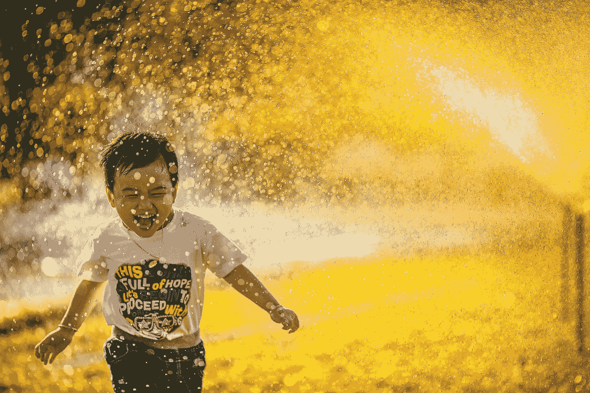

# 选择一天，做你真正喜欢的事情

> 原文：<https://betterprogramming.pub/choose-a-day-and-work-on-what-you-really-enjoy-74424901434d>

## 然后看看这对你的余生是否有意义。暂时忘掉关于金钱和生存模式的一切

米在 [Unsplash](https://unsplash.com/s/photos/happiness?utm_source=unsplash&utm_medium=referral&utm_content=creditCopyText) 上[拍照。](https://unsplash.com/@phammi?utm_source=unsplash&utm_medium=referral&utm_content=creditCopyText)

我通常在早上 5:30 到 6:30 之间醒来。然而，我最近在某一天早上 4:30 醒来——这不是随机醒来。这是因为整整一周我都被一个想法所困:如果我选择一天，不考虑金钱或生存，做我真正喜欢的事情，会怎么样？

所以在周五晚上，我决定在周六做我真正喜欢的事情。做这些事情让我感觉到一种特殊的自由和快乐。

是的，我喜欢的事情之一是写作。我真的喜欢与任何人分享我的想法、知识和信念。我意识到屏幕后面的人可能会被我的文章感动，因此给自己重要的知识，以做出更好的决定，成为更好的人，或者它可以推动他们追逐自己的梦想。

但是让我们回到这首曲子的核心。我建议你试一试。选择一天，在这一整天里，忘记任何负担、恐惧和期望。

我知道你会说什么:“我的朋友，那没有你说的那么容易。”这对我来说也不容易，但是请相信我，我也和你有同样的情况。所以，把你的干扰放在一边，关掉通知、电子邮件、电视和任何吸引你注意力并赢得注意力竞赛的东西。

如果你按照我的指示做了，你现在完全是一个人。是你而不是别人。我选择了一个星期六。我开始写作时，就像一头狮子在开阔的土地上追逐猎物。我喜欢这首曲子的每一个字母，每一个单词，每一个段落。我想象你在阅读这篇文章的时候关注它的每一个细节。我不介意也不记时间。我只是像个精神病患者一样写作。

接下来的要点描述了我理想中的一天。它们是我做了自己真正喜欢的、最享受的事情之后的想法。你也能做到。

# 与时间一起飞翔，用你的手艺做你自己

让自己体验一个人飞翔，来邂逅自己真正的自由。每当你做你喜欢的事情时，你将能够想象你到底是谁，其他的一切都将土崩瓦解。

在这个时间空间下，你不担心时间。你与时间相关的担心将是如何利用它，如何优化它，如何更有成效和明智地使用它。当时间和你在同一架飞机上飞行时，你在做事情。

你没有意识到通过做这些事情，你正在掌握你的手艺。你在引发副作用。你每天都在成为一个更好的自己。尽管困难重重，也要有勇气走得更远。

# 锻炼

我理想的一天中令人惊奇的一部分是在清晨锻炼。我这样做至少 20 分钟。它可以只是步行或跑步。事实上，无论你练习什么，或者你是否将这些练习与其他练习相结合，真正重要的是保持你的身心向前发展。

你可能知道，早上锻炼有很多好处。所以，我利用这些好处，扔掉所有的借口或想法，回到床上，多睡一会儿，等等。

当然，锻炼让我们有能力释放内啡肽，让我们充满力量迎接新的一天。它让你以积极有力的心情开始新的一天。

# 阅读和研究

我最喜欢的第二件事是阅读和研究关于 web 开发、编程、生活、自我提升、黑客或旅行的内容。我非常喜欢阅读有关趋势和解决新世界需求的现代方法的书籍。

所以在我锻炼 20 分钟后，我会放松 10 分钟，然后我打开我的笔记本电脑，我脑海中的第一件事就是:我有没有昨天没有读完的东西？如果没有，我会看看中型仪表板，看看我关注的其他人发表了什么。我挑选最有趣的一篇来读。

这一部分的价值在于，我学到了新的东西，不管这是新的引语，作者的短语，观点，还是他们表达自己的方式。不知何故，这让我觉得充实或者完全空虚，取决于作者在说什么。

我是快速学习的忠实粉丝。快速学习是什么鬼？用我自己的话来说，它意味着从我读到的、看到的、看到的或听到的东西中挑选一小部分，然后以某种方式使用它们。例如，你可以读很多，但如果没有什么能引起你的共鸣，或者你什么都不记，你会忘记你后来读了什么。

我已经忘记了我读过的重要部分。有时候，我甚至记不住一篇文章的标题。所以我草草记下作者的论点或有意义的事情，并向大脑添加新的信息，以提高我的决策技能。

# 编码和编写

在阅读和写笔记差不多 30 分钟后，最令人兴奋的事情之一就来了:编码。编码和写作是我最亲密的朋友。他们给了我所需要的自由，让我提高了我的编程和写作技能。

我可以花一整天做这些事情，而不去想其他任何事情。当你做自己喜欢的事情时，周围的一切都被设置为自动驾驶仪。事情开始完成，看起来很神奇，但事实并非如此。

生活并非如此。我们需要关注心理、精神和生理层面。

# 与我爱的人共度时光

在我看来，和你爱的人在一起真的是最宝贵的时间。生命是短暂的，迟早你会没有机会和他们呆在一起或拥抱他们。所以在劳累一天后，花时间和他们在一起是正确的解毒剂。它是滋润你的灵魂和你身体所需能量的水。

照顾他们，爱他们，给他们希望。他们会给你力量去面对任何事情。做你喜欢的事情并不意味着你会一直感到快乐。我们只是人类，充满情感和感觉。即使做我们喜欢的事情，我们也可能会遇到艰难的时刻和疑虑。

# 将您的结果与平时进行比较

当我说比较你的结果时，我并不是说你应该在做了你喜欢的事情后看到大的结果。我在说你的感受，你的成就。你的人生目标进展如何？平常的一天很可能不会给你的生活增加任何意义。又是浪费的一天。

这些日子的比较将证明，只要你做你真正喜欢的事情，你就能做任何事情。

# 结论

是什么阻止你每天都这样做呢？

原因有很多。我给了他们一个名字:借口。它们阻碍我们做所有我们真正喜欢的事情。所有这些借口和恐惧让我们的生活痛苦不堪。正如 Carl Yung [曾经说过的那样](https://www.goodreads.com/quotes/94226-every-human-life-contains-a-potential-if-that-potential-is)，“每个人的生命都包含一种潜力，如果这种潜力没有实现，那么生命就被浪费了。”

感谢阅读！我真的很感激你宝贵的时间。