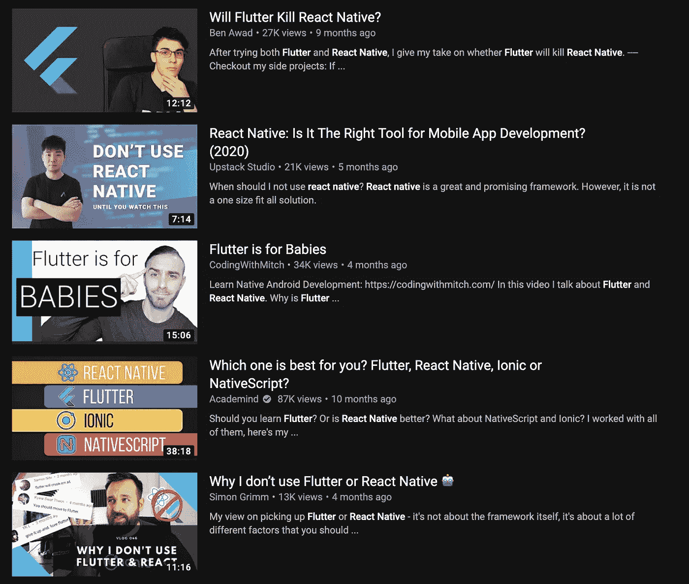

# 为您的下一个项目选择合适的移动应用开发框架

> 原文：<https://betterprogramming.pub/choosing-the-right-mobile-app-development-framework-for-your-next-project-8159c8bbd5bc>

## 根据您的需求和约束比较 Native、React Native 和 Flutter

# 在开始之前

## 这篇文章是写给谁的？

所以你有一个很酷的想法，一个你想开始的新项目，但是你不知道什么样的框架最适合你的需求和你所拥有的资源。

你可能是:

*   想学习移动应用开发的初学者。
*   使用一个移动应用程序开发框架的开发人员想要尝试不同的框架。
*   项目中需要帮助来指导新项目的团队成员。

这篇文章将帮助你们所有人！

## 一个提醒

还有其他框架，如 Xamarin 和 ionic，它们没有 Flutter、React Native 和 Native apps 那么受欢迎和新颖，所以我不会讨论它们。

另外，另一个重要原因是我没有使用这些框架的经验，我在这里分享我从三年移动应用程序开发经验中学到的东西。

# 混合应用还是原生应用？

简单的答案是始终使用本地应用程序(如果可行的话)。

## 好人

没有什么可以击败原生 Android 和原生 iOS 应用程序的性能。没有什么能比得上你通过本地应用程序对手机的控制。

React/React 原生框架的创造者脸书从 React 原生应用程序中重写了他们的整个 messenger 应用程序，因为它击败了原生应用程序的功能。点击此处了解更多信息:

 [## 光速项目:更快、更小、更简单地重写信使

### 我们很高兴开始在 iOS 上推出新版 Messenger。要使 Messenger iOS 应用程序更快、更小…

engineering.fb.com](https://engineering.fb.com/data-infrastructure/messenger/) 

您总是能够轻松地向您的本机应用程序添加复杂的新功能，并且性能将是一流的。

它有一个非常成熟的社区。它的发展已经持续了很长一段时间，并且不断发展和完善。多年来，它已经变得更加强大和高效——所以你可以肯定没有其他移动框架会出现并扼杀本地应用。

## 坏事

**1。**原生应用最大的缺点是所需的技能/资源。正因为如此，它会比混合动力平台贵很多。

Android 应用开发需要学习 Kotlin/Java，iOS 应用开发需要学习 Swift/Objective-C。您还需要一台 Mac 电脑来构建 iOS 应用程序。这就是为什么这么多自学成才的开发者开始使用 Android 而不是 iOS 的原因之一——他们无法使用 mac。

所以，你需要更多的开发者和资源来为 Android 和 iOS 构建和维护应用。

**2。**此外，如果您将来需要将应用程序扩展到 web 或桌面，您将需要单独为它们雇佣或学习技能——现有的代码库对瞄准这些平台毫无帮助。

**3。**降低开发者生产力。与混合平台相比，开发人员要花更长的时间才能在他们工作的特定平台上达到同样的要求。因此，如果你想更快地开发原型，更快地投放市场，原生应用将比混合应用花费更多的精力。

甚至不要问在开发时构建和运行原生应用需要多少开发人员的时间。在某些地方，开发人员确实有更频繁地运行应用程序的坏习惯，这导致了生产力的进一步损失。

甚至不要让我开始修复那些不时出现在 Android 中的奇怪的 Gradle 错误。这些年来，他们已经有了很大的改进，但仍然落后于像 Flutter 和 RN 这样的框架的构建时间。

## 如何在杂交和原生之间选择

*   **了解需求:**如果您的移动应用程序具有复杂的功能，需要您使用智能手机的全部潜力和功能，那么无论如何，为了安全起见，您都必须使用原生应用程序。
*   **了解限制:**如果你有足够的 Android 和 iOS 开发者/资源、足够的时间和预算，那么你总是可以选择原生应用。
*   如果你可以只专注于一个平台，在未来考虑另一个平台，那么你也可以使用原生应用。
*   如果你的应用程序更简单——专注于从不同来源获取和显示数据，接受用户输入，以及类似的事情(数据驱动的应用程序)——那么考虑混合应用程序的选项。你可以节省很多时间和金钱。
*   简而言之，原生应用总是会花费你更多的时间和金钱。但是他们提供的能力、信心和灵活性使你的项目从长远来看是可扩展的使投资物有所值。

因此，如果您知道有一个复杂的特性需要构建，或者如果原生应用程序开发即使对于简单的项目也是可行的，并且您希望享受其强大的功能和可伸缩性，那么就使用原生应用程序开发。

如果您还在阅读，那么您仍然对原生应用程序开发不满意，并希望探索和理解混合应用程序。那么让我们看看最后一个问题。

# 最后一个问题——颤动还是自然反应？

Flutter 和 React Native 作为框架以及它们如何处理移动应用程序开发几乎是对立的。

一个以 web 框架开始，现在已经进入移动领域(React ),而另一个以移动应用程序框架开始，现在正在进入 Web 和其他平台(Flutter)。

这种方法反映在开发人员如何思考、编写和维护这些项目的代码库。

## 拥有正确的心态

没有一个框架比另一个更好，至少目前是这样。

自从 Flutter 出现以来，网上有许多不同的观点，你不应该盲目地追随它们中的任何一个！

Youtube 搜索“颤动或自然反应”的结果

我也不会告诉您应该遵循哪一个，但是您应该了解这些框架提供了什么，它们的优点和缺点是什么，并了解您或您的组织在使它们适应您的项目时可以做出什么样的权衡。您必须根据您的需求和限制来决定哪一个更好。

# 反应自然

React Native 是脸书创建的跨平台移动应用开发框架。

## 好人

**1。热门科技:** Flutter 的弱点是 React Native 的强项。它已经存在一段时间了，所以有一个更大的社区来支持你，几乎所有的 SDK 都提供对 React Native 的支持，包括 AWS。

**2。良好的支持**:你有大量的第三方包和库可以用来做 react 中的大部分事情，这些包和库适用于移动和网络。

**3。有经验的开发人员没有学习曲线:**如果你有在 React 中构建 web 应用的经验，他们可以直接开始使用 React Native 并开始在 React Native 上工作。

## 坏事

**1。对第三方库的依赖:**RN 第三方包也来自开源社区。有时它们维护得很差，一些在生产环境中使用这些包的开发人员造成了很多问题，最终被解雇了(真实的故事)。

**2。UI 元素中的不一致:**您已经为 Android 编写了您的移动应用程序，现在当您在 iOS simulator 中运行相同的应用程序时，您可能会发现不一致的地方，需要您额外注意来修复。

**3。糟糕的向后兼容性:**不幸的是，当您升级 React 原生版本时，很有可能会破坏您现有的运行项目，这是开发人员的噩梦。

**4。与 Flutter 相比性能较差:**React Native 运行在设备顶部的 JavaScript 桥上，而用 C 和 C++开发的 Flutter 编译成设备的原生 ARM 代码，其性能相当于原生应用。

**5。热重装并不完美:**虽然 Flutter 热重装如预期的那样完美地工作，但有时，RN 热重装就是不工作，您需要完全重启应用程序。

# 摆动

Flutter 是 Google 开发的开源跨平台应用开发框架。

## 好人

**1。性能:**没有其他混合应用程序框架能够超越 Flutter 应用程序的性能。使用 Flutter，您将构建出性能最好的应用程序。

**2。开发人员生产力:**Flutter 的旗舰产品之一是“热重新加载”，它可以立即在应用程序中部署代码的更改，从而节省了几个小时的开发和调试时间。

*此外，开发人员不需要在 mac 系统上为 iOS 构建 Flutter 应用程序，他们可以使用 Codemagic 这样的工具在云中为他们构建 iOS 应用程序。*

**3。更快的原型:**这种更快的开发时间也意味着你可以更快地达到目标，更快地投放市场获得用户反馈，更快地改进。

**4。包含电池:** Flutter 框架帮助你最小化对第三方包的依赖。您可以构建应用程序的所有基本功能，而无需安装任何外部包(代码可能会变得有点复杂，但这是可能的)。

**5。平台:**单一代码库可部署到 Android、iOS、web(截止到今天)，并且很快也会部署到桌面应用程序。UI 元素在您运行代码的所有平台上看起来都是一样的。

**6。简单的学习曲线** —是的，这是全新的，但你所要做的就是学习 Dart，并对 Flutter 如何工作有一个基本的了解，这一点点投资将在未来带来巨大的回报。

**7。进行本地应用程序开发的灵活性:**遗憾的是，这也是它最容易被忽视的优势之一。让我们看看这有多神奇。

*   **例如，**您在项目中有一个功能，您需要从用户的设备访问他们的智能手表。到目前为止，你已经使用核心 Flutter 框架构建了所有其他功能，但现在你没有那种支持(想象一下)来访问用户的 Android 或 Apple Watch，你会怎么做？
*   你知道你可以通过原生的 Android 和 iOS SDKs 来完成它们。现在你所要做的就是使用“Flutter Channels”并编写原生的 Android 和 iOS 代码来实现这一功能，而应用程序的其余部分仍然可以作为 Flutter 应用程序完美地工作。因此，对于一个特性，你不必用原生项目来降低整个项目的速度。

**8。惊人的向后兼容性:**如果 flutter 版本在你现有的应用程序中升级，你的应用程序将保持不变，不会出现任何崩溃，遗憾的是，原生应用程序和 React Native 不会出现这种情况。

**9。已经比 React Native 更受欢迎:** Flutter 在市场上是较新的，并且已经成为开发社区中更受欢迎的框架，如 Stackoverflow 调查所示，这表明了一个强大的未来。

## 坏事

**1。这是一项新兴技术——理解这一点很重要:**Flutter 发布才两年左右，很多移动应用的 SDK 仍然没有从官方渠道获得。

例如，AWS 目前还没有对 Flutter 的官方支持。在社区开发的 SDK 的帮助下，您仍然可以让事情正常运行，但是它们可能不会让您对生产充满信心。

AWS (Amplify)最近回复了 Github 上一个 2 年前的活跃线程，他们的团队正在积极努力为 Flutter 带来官方 SDK:

 [## 颤振支持问题#1852 aws-amplify/amplify-js

### 解散 GitHub 是超过 5000 万开发者的家园，他们一起工作来托管和审查代码，管理项目，以及…

github.com](https://github.com/aws-amplify/amplify-js/issues/1852#issuecomment-641560886) 

不断成长的年轻的 Flutter 社区已经创建了许多有用的包，您现在可以使用它们来构建令人惊叹的应用程序。但是你可能要等一些 SDK。

所以，在你决定使用 Flutter 之前，做你的研究，检查你的需求，看看你是否有足够的 SDK 可用。

**2。在多个平台上支持 Flutter 的第三方软件包越来越少:**虽然 Flutter 可以从单个代码库支持多个平台，但是有很多软件包也必须升级才能支持这些平台。

例如，有许多你可以在 Android 和 iOS 中轻松使用的包，但相同的包可能无法在 web 或 macOS 中使用，这阻碍了你充分发挥 Flutter 的潜力。

随着 Flutter 及其社区的发展，这两点将有望消失。

**3。自由和灵活性:**以任何方式编写代码的自由和灵活性被视为 Flutter 的优势，但这种灵活性也为糟糕的决策留下了空间，从长远来看，这可能会使您的项目代码混乱且不可维护。

**4。学习一个新的框架:**对于以前在网络或其他技术领域工作过的人来说，这可能是一个挑战。Flutter 迫使你思考和编写代码的方式是不同的，所以开发人员必须理解和思考不同的风格。它需要你学习一些新的东西，这对一些人来说是一个挑战。

# 在反应原生和颤动之间选择

*   如果你是一个单独的开发人员或者有一个小的开发团队，并且想要更快地构建漂亮的、执行的应用程序，并且你想要在未来发布到 web 和其他桌面平台，那么使用 Flutter。
*   如果你有网络背景，也许你已经有了一个网络应用程序，那么使用 React Native 可以更快地进入市场。

# 结论

*   没有什么能打败原生移动应用程序开发，如果你有资金和时间在原生框架中进行项目，那么这是最好的选择。您可以完全控制和灵活地在未来扩展您的项目。
*   颤振是新的，但它增长迅速，有很大的希望，并已交付其最初的承诺。当你学习它的时候，你和你的团队可能会有点不舒服，但是你会被它的效率和开发者体验所吸引。
*   React Native 已经存在一段时间了。它有巨大的需求和巨大的支持来帮助你实现这些需求。它对 web 开发人员来说几乎没有学习曲线，将帮助您快速构建跨平台的移动应用程序。