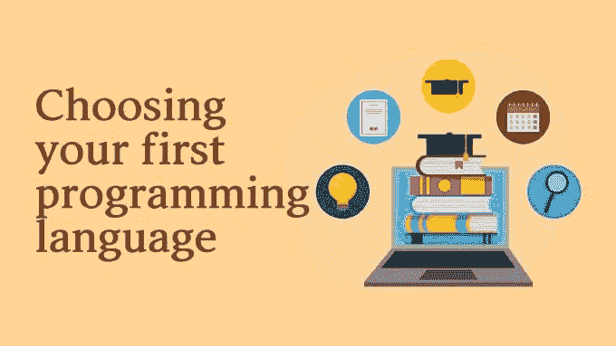
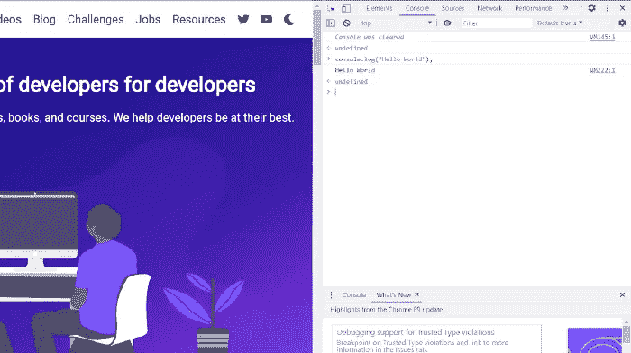

# 选择你的第一门编程语言？从这 5 个中挑选

> 原文：<https://betterprogramming.pub/choosing-your-first-programming-language-pick-from-these-5-c77f45c1a3b1>

## 您可以从流行的编程语言开始您的编码之旅



图片来源:作者

选择我们的第一种编程语言是我们大多数人在编程之旅中迈出第一步时都经历过的一个困境。

你的第一门编程语言成为塑造你对编程本身印象的决定性因素。它可能是说服你继续学习或者完全放弃学习编程的东西。

因此，如果你是一个完全的编程新手，希望涉足这个领域，看看周围的所有热点是什么，那么在选择第一种编程语言时，你必须格外小心。

你学习编程的原因可能是不同的。你可能想把学习编程作为一种爱好或个人项目。或者你可能正在寻找职业转换或副业机会。哪种编程语言应该是你的第一选择也取决于这些原因。

因此，我们为你准备了这份指南，让你在 2021 年最受欢迎的五种编程语言中做出选择。从这种已建立的和正在兴起的语言的混合体中，你将能够找到一种语言，它可以作为你的第一编程语言。

# 计算机编程语言

近年来，尤其是对于自学者来说，Python 已经成为初学者的首选编程语言。

根据分析谷歌搜索编程语言教程的 PyPL index ，Python 以超过 10%的优势挤掉了其他语言。

Python 在初学者中大受欢迎的主要原因是其易于理解的语法。作为一种高级语言，与 Java 和 C 之类的语言相比，Python 的语法更接近我们理解的人类语言。它通过只包含最必要的符号和关键字，消除了我们在其他语言中看到的繁琐和冗长的语法。

例如，Python 中一个简单的 Hello World 函数只需要一行代码。

```
print("Hello World!")
```

而在 C 中要达到同样的效果，我们需要遵循一个有更多代码行的语法。

```
#include <stdio.h>
int main() {
    printf("Hello, World!");
    return 0;
}
```

Python 支持函数式、过程式和面向对象的编程范例。因此，掌握 Python 让学生有能力探索不同的编码方式和解决问题的方法。

学习 Python 也给你更多的自由来决定你将来作为一名程序员要走的路，因为它被用于多种编程领域。

Python 是目前数据科学和机器学习领域的领先语言。它在 web 开发中被用作后端语言。它是一种用于自动化任务的流行脚本语言。

如果您选择 Python 作为您的第一种编程语言，您就有机会在确定您的偏好之前探索不同的编程领域。

围绕 Python 的庞大且快速增长的社区是您首先学习它的另一个原因。有大量的教程、视频、文章和书籍可以帮助你学习。它有一个活跃的社区，愿意帮助 Stack Overflow 和 GitHub 等平台的初学者。

为 Python 语言构建的高级和广泛的库和框架集是另一点，可以让初学者受益。这些库可以简化实现中的复杂细节，使您能够首先专注于学习编程方面，而不是更深入地钻研技术方面的东西。

如果你想学习 Python，有很多免费和付费的资源。以下是我最喜欢的一些:

[2021 年在 Python @ Udemy 完成从零到英雄的 Python boot camp](https://click.linksynergy.com/link?id=A4mR6mRW38Q&offerid=507388.567828&type=2&murl=https%3A%2F%2Fwww.udemy.com%2Fcourse%2Fcomplete-python-bootcamp%2F)

[学编码@ Udacity](https://www.udacity.com/course/intro-to-programming-nanodegree--nd000)

[学习 Python 3 @ CodeCademy](https://www.codecademy.com/learn/learn-python-3)

# Java Script 语言

JavaScript 是网络语言。它是我们今天看到的所有主流浏览器都支持的语言，包括 Chrome 和 Firefox。如果你梦想成为一名全栈开发人员，了解如何用 JavaScript 编程是构建 web 前端所必需的。

这种语言的必要性使得 JavaScript 成为开发人员中最受欢迎的编程语言。如果你选择 JavaScript 作为你的第一编程语言，你的选择不会错的，无论你是把它作为一种爱好来学习还是想成为一名职业。

尽管不像 Python 那么简单，JavaScript 仍然是一种非常容易学习和理解的初学者友好的语言。最棒的是。您可以直接在浏览器上试验 JavaScript 代码，而不必担心 ide 等其他工具。



Chrome 开发工具上的 JS 代码执行示例

如果你希望从事网络开发，学习 JavaScript 就不需要学习第二种语言来构建网站的后端。因为随着几年前 Node.js 的推出，现在你可以使用 JavaScript 开发 web 应用程序的后端和前端。

今天，JavaScript 已经超越了仅仅用于 web 开发的语言。它现在通常用于移动开发和桌面应用程序开发，甚至在数据科学中也有越来越多的应用。

所以学习 JavaScript 不会让你没有选择来塑造你的编程未来。

因为它是 GitHub 上拥有最多资源库的[语言，所以当你在理解某些东西时，你总是可以依靠 JavaScript 社区来提供足够的学习材料和帮助。](https://octoverse.github.com/)

随着令人惊叹的第三方库和框架的出现，用 JavaScript 找到无数编程问题的解决方案变得前所未有的简单。如果你正在学习 JavaScript 的前端开发，你至少需要对 HTML 和 CSS 以及如何用它们设计网站有一个基本的了解。

以下是我学习 JavaScript 的顶级资源，从付费课程到免费课程都有:

【2021 年 JavaScript 全教程:从零到专家！@ Udemy

[完整的 2021 年网络开发训练营](https://click.linksynergy.com/link?id=A4mR6mRW38Q&offerid=507388.1565838&type=2&murl=https%3A%2F%2Fwww.udemy.com%2Fcourse%2Fthe-complete-web-development-bootcamp%2F)

[学习 JavaScript @ CodeCademy](https://www.codecademy.com/learn/introduction-to-javascript)

[JavaScript 算法和数据结构@ freeCodeCamp](https://www.freecodecamp.org/learn/javascript-algorithms-and-data-structures/)

# 红宝石

类似于 Python，Ruby 是一种易于人类阅读的语言。在某些情况下，Ruby 的语法比 Python 本身更易于阅读和理解。但是 Ruby 比 Python 稍微多了一些，增加了一些符号和关键字。

这里有一个用 Python 写的`while`循环。

```
total = 0
for x in range(5):
    print(x)
    total += x
```

这里有一个用 Ruby 写的`while`循环。

```
$total = 0
for i in 0..5
    puts "Value of local variable is #{i}"
    total += i
end
```

因为它是一种以“有趣和高效”为目的而设计的语言，所以即使作为初学者，你也会发现用 Ruby 编码是一项令人兴奋和直观的任务。这在 Ruby 解决问题时类似英语的语法和自然的思考方式中显而易见。

使用 Ruby，您有不止一种方法来解决问题，并且可以自由选择任何您觉得直观的方法。

Ruby 程序将一切都视为对象。这使您可以自由地向每个对象添加独特的属性和动作，而不受任何限制。

随着 Ruby on Rails 框架的引入，Ruby 的受欢迎程度达到了新的高度，并成为 web 开发中常用的语言。Ruby on Rails 是一个全栈的 web 框架，易于使用并且对初学者友好。

尽管 Ruby 不像 Python 和 JavaScript 等语言那样普及，但在过去几年中，Ruby 的受欢迎程度有所上升，在编程社区中有着特殊的需求。

在 Stack Overflow 的最新开发者调查中，Ruby 在开发者中排名第五。Ruby 受到许多创业公司的青睐，以满足他们的编程需求，同时节省资源。

Ruby 也有一个充满活力的开发人员社区，他们愿意张开双臂欢迎初学者并帮助他们。被称为*宝石*的第三方 Ruby 库也在改进和发展，以帮助您轻松完成复杂的编程任务。

由于 Ruby 的受欢迎程度在于 web 开发，学习 Ruby 作为你的第一语言将非常适合那些愿意从事这个特殊编程领域的人。

我不是红宝石专家，所以要求好的红宝石材料。以下是我整理的清单:

[完整的 Ruby on Rails 开发者课程](https://click.linksynergy.com/link?id=A4mR6mRW38Q&offerid=507388.519442&type=2&murl=https%3A%2F%2Fwww.udemy.com%2Fcourse%2Fthe-complete-ruby-on-rails-developer-course%2F)

[学习 Ruby @ CodeCademy](https://www.codecademy.com/learn/learn-ruby)

# 去

Go 是我们的第一编程语言候选列表中最年轻的语言。Go 最初由谷歌开发，于 2010 年向公众推出。现在，在谷歌的支持下，它作为一种开源语言得到了维护。

由于它为开发者提供了一套独特的功能，并链接到 Google，Go 很快成为编程社区中一种流行的语言选择。

Go 结合了不同编程语言的许多有用特性，同时消除了它们的负面因素。例如，Go 支持像 C 一样的静态类型和运行时效率，同时提供可与 Python 媲美的可读性。

这些特性的结合使得 Go 成为初学者的理想编程语言。它的语法简洁明了，没有其他面向对象语言的冗长。这使得围棋的学习曲线变得不那么陡峭。

作为一种在现代构建的、考虑到现代需求的语言，Go 对你的大部分需求都有原生支持，而不需要外部依赖的帮助。当您刚开始编程时，它消除了管理依赖关系的麻烦。

最重要的是，与其他语言不同，Go 优雅地处理了与 goroutines 的并发性。并发性是一个很难的主题，许多初学者很难完全理解，但是 goroutines 将这个主题简化到一个更简单的水平，并帮助程序真正支持并发性。

在栈溢出开发者调查中，Go 在最受欢迎的技术中排名第 12。作为一门仅发展了十多年的新语言，这是一个令人印象深刻的壮举，当然也是它未来进步的标志。

在开发者的同一项调查中，Go 被认为是第三大付费技术。如果你正在学习编程，希望将来能在这个领域有所作为，这对你来说肯定是个好消息。

作为一个年轻且不断发展的社区，Go 语言用户肯定欢迎新人，并愿意在你陷入困境时帮助你。它有很好的文档，会准确地告诉你，只有你需要知道学习。

[Go:完全开发者指南(Golang) @ Udemy](https://click.linksynergy.com/deeplink?id=A4mR6mRW38Q&mid=39197&murl=https%3A%2F%2Fwww.udemy.com%2Fcourse%2Fgo-the-complete-developers-guide%2F)

[学围棋@CodeCademy](https://www.codecademy.com/learn/learn-go)

[学围棋官方教程@ Golang](https://tour.golang.org/welcome/1)

# C/C++

作为低级语言， [C](https://en.wikipedia.org/wiki/C_(programming_language)) 或 [C++](https://en.wikipedia.org/wiki/C%2B%2B) 对于编程新手来说，并不是最容易学习的编程语言。那么，为什么我们在本文中将它们添加到您应该考虑作为首选的编程语言的列表中呢？

因为即使 C/C++语言有一个陡峭的学习曲线，并且有可能让你永远不再编程，学习这两种语言中的任何一种都会让你对编程概念和编程语言如何在基础水平上工作有更深的理解。这将建立一个良好的基础，让你成为这个领域的大师，不像其他任何语言。

C 或 C++也被世界各地的许多大学用作他们的入门编程语言。这证明了 C 和 C++作为初学者语言的重要性，它们迫使学生超越语法和理论，真正理解在引擎盖下发生的事情。

如今，这些语言被用于几乎每个编程领域，包括后端开发、游戏开发、操作系统和浏览器开发。

作为最古老也是最受欢迎的语言之一，C 和它的面向对象的兄弟，C++，有一个庞大的社区愿意在整个学习过程中帮助你，提供丰富的学习材料和对你的问题的支持。

所以如果你愿意在你的第一门编程语言上有更高的目标，C 或 C++将会是你很好的选择。

[c++编程入门——从入门到超越](https://click.linksynergy.com/link?id=A4mR6mRW38Q&offerid=507388.1576854&type=2&murl=https%3A%2F%2Fwww.udemy.com%2Fcourse%2Fbeginning-c-plus-plus-programming%2F)

[C++ @ Udacity](https://www.udacity.com/course/c-plus-plus-nanodegree--nd213)

感谢阅读！