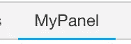

# Chrome 扩展:读取 HTTP 响应对象的主体

> 原文：<https://betterprogramming.pub/chrome-extension-intercepting-and-reading-the-body-of-http-requests-dd9ebdf2348b>

*本文面向对*[*Chrome 扩展如何工作*](https://developer.chrome.com/extensions/getstarted) *有基本了解的人。*

Chrome 扩展生态系统提供了 API，允许我们开箱即用地部分读取和修改请求/响应头。我们有许多利用这些 API 的扩展，如[](https://chrome.google.com/webstore/detail/requestly-redirect-url-mo/mdnleldcmiljblolnjhpnblkcekpdkpa)**， [**篡改 Chrome**](https://chrome.google.com/webstore/detail/tamper-chrome-extension/hifhgpdkfodlpnlmlnmhchnkepplebkb?hl=en) 。**

**然而，当读取 HTTP 请求的主体时，事情变得有点棘手。在这篇文章中，我们将探讨一些方法来实现这一点，同时，我们也将看看与这些方法相关的缺点。**

# **使用内容脚本拦截数据**

**[内容脚本](https://developer.chrome.com/extensions/content_scripts)是在当前网页的上下文中运行的有条件注入的脚本。内容脚本不能访问网页中运行的 JavaScript。相反，它独立运行，并拥有使用标准 JavaScript APIs 读写 DOM 的权限。**

**我们将使用我们的内容脚本在 DOM 中注入一个自定义脚本，并使用它来读取 HTTP 请求的响应体。现在，让我们配置我们的内容脚本。**

**下面是我们的 **manifest.json** 的样子:**

```
{
    "content_scripts": [{
        "js": ["contentScript.js"],
        "run_at": "document_start"
    }]
}
```

**甚至在构建 DOM 之前, **run_at** 字段就告诉扩展在 web 页面中注入内容脚本。现在让我们看看内容脚本的内容:**

```
function interceptData() {
  var xhrOverrideScript = document.createElement('script');
  xhrOverrideScript.type = 'text/javascript';
  xhrOverrideScript.innerHTML = `
  (function() {
    var XHR = XMLHttpRequest.prototype;
    var send = XHR.send;
    var open = XHR.open; XHR.open = function(method, url) {
        this.url = url; // the request url
        return open.apply(this, arguments);
    } XHR.send = function() {
        this.addEventListener('load', function() {
            if (this.url.includes('<url-you-want-to-intercept>')) {
                var dataDOMElement = document.createElement('div');
                dataDOMElement.id = '__interceptedData';
                dataDOMElement.innerText = this.response;
                dataDOMElement.style.height = 0;
                dataDOMElement.style.overflow = 'hidden';
                document.body.appendChild(dataDOMElement);
            }               
        });
        return send.apply(this, arguments);
    };
  })();
  `
  document.head.prepend(xhrOverrideScript);
}function checkForDOM() {
  if (document.body && document.head) {
    interceptData();
  } else {
    requestIdleCallback(checkForDOM);
  }
}requestIdleCallback(checkForDOM);
```

**首先，我们在这里做的是用我们自己的代码通过覆盖它的原型来扩展[**XMLHttpRequest**](https://developer.mozilla.org/en-US/docs/Web/API/XMLHttpRequest)**的 send** 和 **open** 方法。**

**当我们得到请求的响应时， **send** 中的**‘load’**事件监听器被触发。在这个代码示例中，**‘this’**指的是 XHR 的一个特定实例，而 **this.response** 包含该实例的 HTTP 响应。**

**接下来，我们使用“div”元素将响应存储在 DOM 中。此外，请注意，为了避免扰乱网页的样式/内容，我们使用“高度”和“溢出”CSS 属性来隐藏该元素，但同时使用本机 DOM APIs 也是可读的。**

**现在，我们需要将存储的数据传递给扩展。为此，我们使用内容脚本来读取它。这对于不同类型的扩展来说是不可能的，因为只有内容脚本可以访问网页的 DOM。**

**让我们在内容脚本的底部添加一个函数，该函数持续检查数据是否已经附加到隐藏的 DOM 元素中:**

```
function scrapeData() {
    var responseContainingEle = document.getElementById('__interceptedData');
    if (responseContainingEle) {
        var response = JSON.parse(responseContainingEle.innerHTML);
    } else {
        requestIdleCallback(scrapeData);
    }
}requestIdleCallback(scrapeData); 
```

**`requestIdleCallback`是为了确保内容脚本的主线程不会陷入无限循环。**

**差不多就是这样！由于响应数据现在在我们的内容脚本中可用，我们现在可以将它发送到我们的后台脚本，后台脚本又可以将它发送到我们的扩展的任何部分。我们可能希望将数据发送到后台页面的原因是，与后台页面相比，内容脚本对扩展 API 的访问有限。**

## **缺点**

**对于在加载页面或服务器端呈现页面时触发的请求，没有办法做到这一点，因为我们的内容脚本只有在浏览器中开始 DOM 构造时才会启动。**

# **使用 DevTools 扩展拦截数据:**

**一个 [DevTools 扩展](https://developer.chrome.com/extensions/devtools)为我们提供了读取响应数据的现成解决方案。让我们在清单中配置它:**

```
{
    "devtools_page": "devtools.html"
}
```

**如您所见，我们只需要将清单指向我们的 devtools html 页面。现在让我们来看看**devtools.html**的内容:**

```
<script src="devtools.js"></script>
```

****devtools.html**只需要指向 js 文件。让我们看看 **devtools.js** 的样子:**

```
chrome.devtools.panels.create("MyPanel", null, 'panel.html');
```

****devtools.js** 在 Chrome DevTools 中创建一个定制面板，如下所示:**

****

****panel.html**包含将在 DevTools 扩展中显示的 HTML。因为我们的用例不需要任何 HTML，我们只需要一个非常简单的文件:**

```
<html>
    <body>
        <script src="panel.js"></script>
    </body>
</html>
```

**让我们来看看拼图的最后一块，它是 **panel.js:****

```
chrome.devtools.network.onRequestFinished.addListener(request => {
  request.getContent((body) => {
    if (request.request && request.request.url) {
      if (request.request.url.includes('<url-to-intercept>')) {
        chrome.runtime.sendMessage({
            response: body
        });
      }
    }
  });
});
```

**我们使用**chrome . dev tools . network . onrequestfinished . add listener**为网页中的所有请求添加一个监听器。在回调中，我们使用 **request.getContent** API 读取每个请求的响应，并使用**chrome . runtime . sendmessage**将响应发送给扩展的其他部分。**

## **缺点**

**这种方法的缺点是我们必须一直保持 Chrome DevTools 打开，因为 DevTools 扩展只有在 DevTools 打开时才被激活。**

# **结论**

**我们讨论的两种方法都有各自的缺点。第一种方法更复杂，但是当您想要拦截在页面加载后触发的请求时效果更好。另一方面，第二种方法更简单，适用于所有情况，但是需要 DevTools 一直打开。**

**我读到过还有另一种方法可以实现我们的目标，那就是使用[**chrome . debugger**](https://developer.chrome.com/extensions/debugger)**API，但是我还没有验证过。****

****欢迎反馈和批评！此外，如果你在执行或理解上述解决方案时遇到任何困难，请在下面的评论中告诉我。****

****感谢您的阅读！😃****