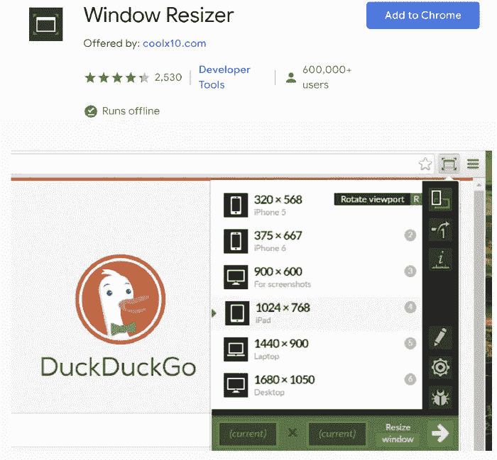
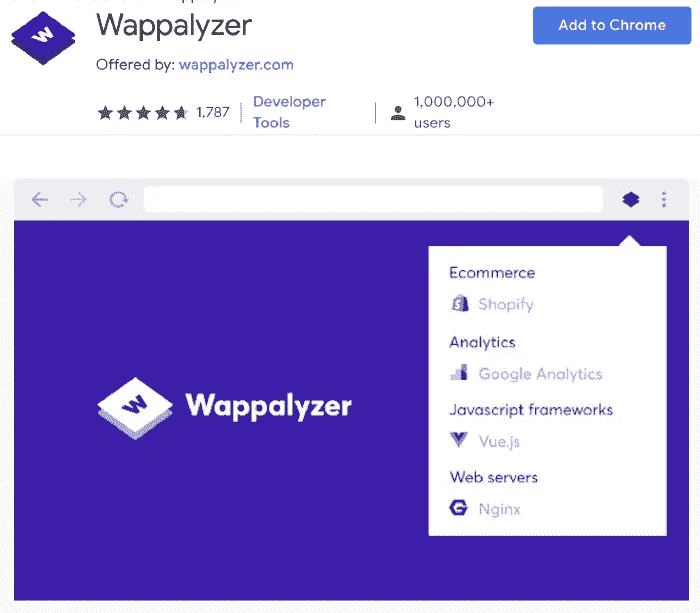
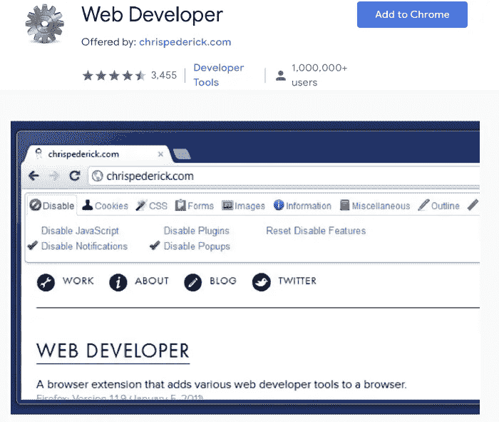
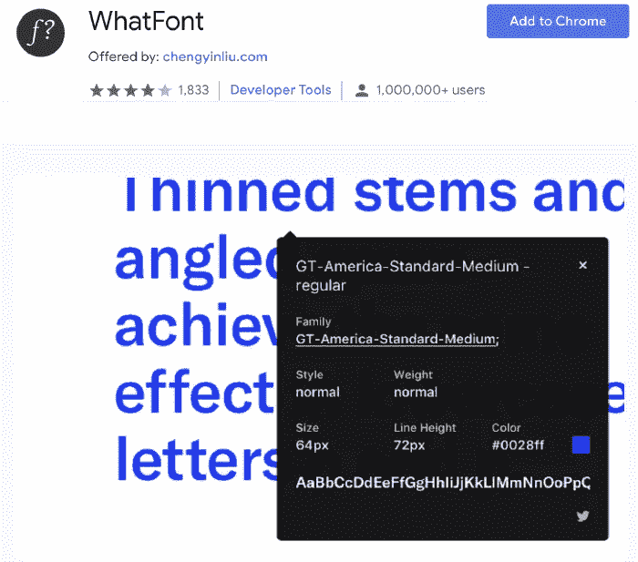
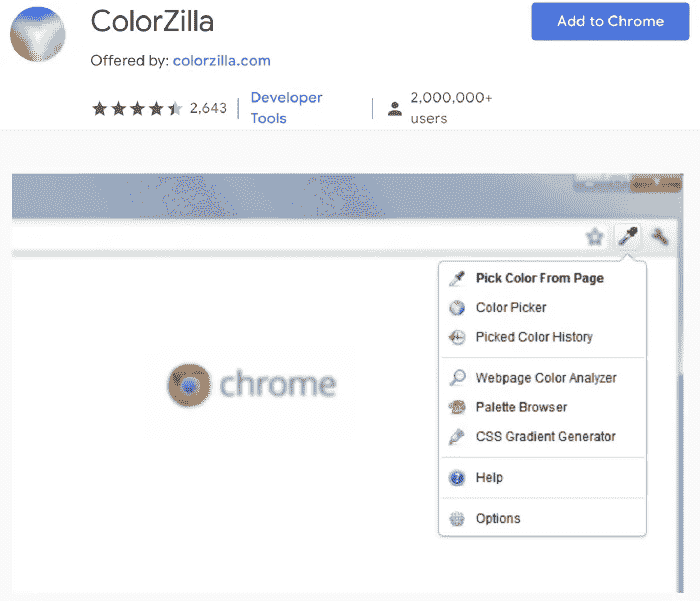
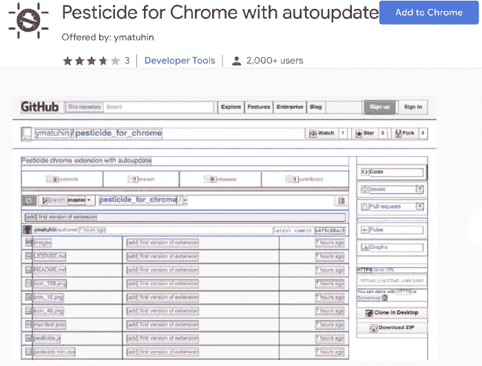

# 2020 年每个网络开发者都必须拥有的 Chrome 扩展

> 原文：<https://betterprogramming.pub/chrome-extensions-every-web-developer-must-have-in-2020-4673e900433e>

## 一些对网络开发者来说最好的 Chrome 扩展

[Zan](https://unsplash.com/@zanilic?utm_source=unsplash&utm_medium=referral&utm_content=creditCopyText) 在 [Unsplash](https://unsplash.com/s/photos/developer?utm_source=unsplash&utm_medium=referral&utm_content=creditCopyText) 上的照片。

作为开发人员，我们每天使用浏览器做各种各样的事情，从谷歌搜索和寻找堆栈溢出问题的解决方案到在 Reddit 上浪费时间。我们还使用它们来测试和运行我们正在开发的应用程序。这就是拥有合适的工作工具至关重要的地方。

在今天的文章中，我将介绍一些我最喜欢的浏览器扩展，以提高我作为 web 开发人员的工作效率。

# Windows Resizer

Chrome 商店中的窗口大小调整器

这个惊人的扩展正如其名字所暗示的那样。它允许你改变屏幕的大小。如果你需要在不同的分辨率和视窗中验证你的网站，这很简单但是非常有用。该扩展附带了一组预定义的选项，但是您可以根据需要对它们进行修改。这最后一个选项比简单地使用 Chrome 开发者工具要好。

 [## 窗口大小调整器

### 调整浏览器窗口大小以模拟不同的屏幕分辨率。

chrome.google.com](https://chrome.google.com/webstore/detail/window-resizer/kkelicaakdanhinjdeammmilcgefonfh) 

# 瓦帕里斯

Chrome 商店中的 Wappalyzer

您是否曾经想知道某个特定站点正在使用哪些技术？对瓦帕里斯不再感到惊奇。[根据 Wappalyzer](https://chrome.google.com/webstore/detail/wappalyzer/gppongmhjkpfnbhagpmjfkannfbllamg?hl=en) 本身:

> “Wappalyzer 不仅仅是一个 CMS 检测器或框架检测器:它揭示了几十个类别中的一千多种技术，如编程语言、分析、营销工具、支付处理器、CRM、CDN 等。”

 [## 瓦帕里斯

### 识别网络技术

chrome.google.com](https://chrome.google.com/webstore/detail/wappalyzer/gppongmhjkpfnbhagpmjfkannfbllamg) 

# Web 开发人员

Chrome 商店中的 Web 开发人员

不要让外表欺骗你。这可能不是有史以来最漂亮的工具栏，但它肯定是强大的。该扩展为您的浏览器添加了一个工具栏，其中包含许多有用的 web 开发功能选项，例如激活/停用脚本、弹出窗口、控制 cookies 的功能或查找构建表单、图像、样式的方法等。

我不再使用这个扩展了，但是在我还不太熟悉 HTML 和 CSS 的时候，它非常有用。

 [## Web 开发人员

### 添加带有各种 web 开发人员工具的工具栏按钮。

chrome.google.com](https://chrome.google.com/webstore/detail/web-developer/bfbameneiokkgbdmiekhjnmfkcnldhhm) 

# 什么字体

Chrome 商店里的什么字体

这个扩展允许你很容易地检查哪些字体和字体属性被应用到网站上的任何文本。当涉及到网站的设计时，字体可以产生巨大的影响，你可以使用这个工具来确保它们都是它们应该有的样子，或者甚至可以获得某个特定网站正在使用的字体的信息，以便你也可以在你的网站上使用它。

 [## 什么字体

### 识别网页字体的最简单方法。

chrome.google.com](https://chrome.google.com/webstore/detail/whatfont/jabopobgcpjmedljpbcaablpmlmfcogm) 

# 色彩奇拉

Chrome 商店里的 ColorZilla

与 WhatFont 类似，ColorZilla 扩展允许您获取网站上任何像素的颜色。此外，它还附带了一些方便的工具，如调色板浏览器和渐变生成器。

这是一个非常有趣的工具。

 [## 色彩奇拉

### 先进的滴管，颜色选择器，梯度发生器和其他丰富多彩的好东西

chrome.google.com](https://chrome.google.com/webstore/detail/colorzilla/bhlhnicpbhignbdhedgjhgdocnmhomnp) 

# 杀虫剂

铬商店里的杀虫剂

*免责声明:这是我不使用或不打算使用的工具。它没有被广泛使用，其评级也不是很大。然而，它过去在 Twitter 上得到大力推荐。*

这个扩展改变了所有元素的 CSS，这样你就可以直观地看到每个元素的边界在哪里。这在调试 CSS 布局问题时至关重要。

你不需要延期。用一些 CSS 就可以轻松实现，所以如果你不想使用这个扩展，可以看看我的文章[验证布局的 CSS 技巧](https://livecodestream.dev/post/2020-06-09-css-tricks-for-validating-layouts/)。

 [## 自动更新的铬杀虫剂

### 这个扩展将杀虫剂 CSS 插入(自动重新加载)到当前页面，概述每个元素。

chrome.google.com](https://chrome.google.com/webstore/detail/pesticide-for-chrome-with/eipbgplchlidkojmppclhkechkhmlefi) 

# 结论

扩展可以让我们的生活变得更容易，正如我今天列举的例子。如果您知道任何其他可以帮助开发人员提高生产力的工具，请留下评论，我可以将它们纳入文章中。

感谢阅读！