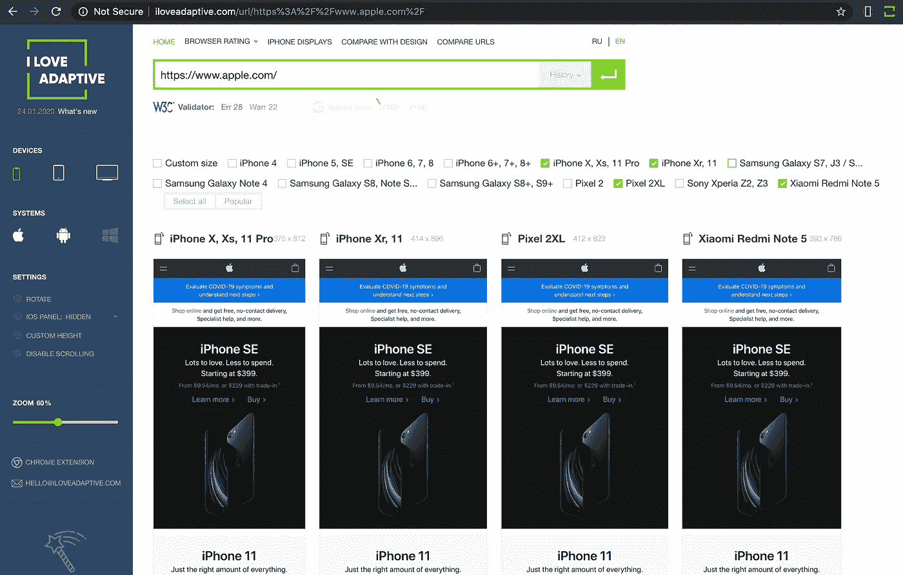
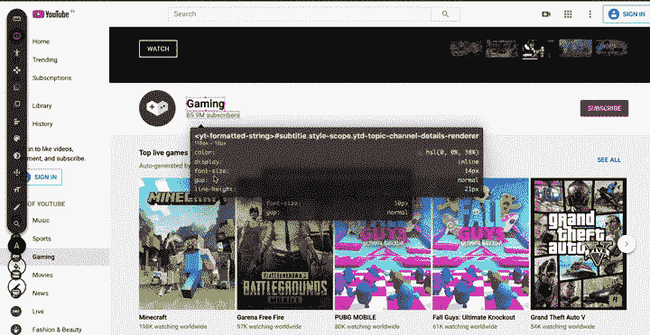
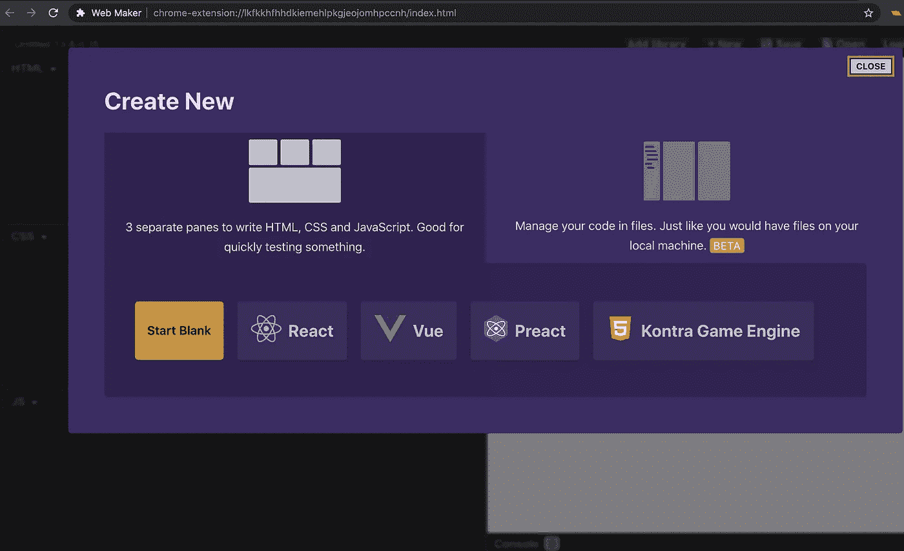
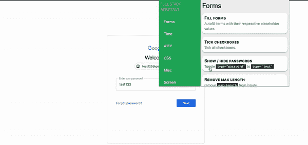
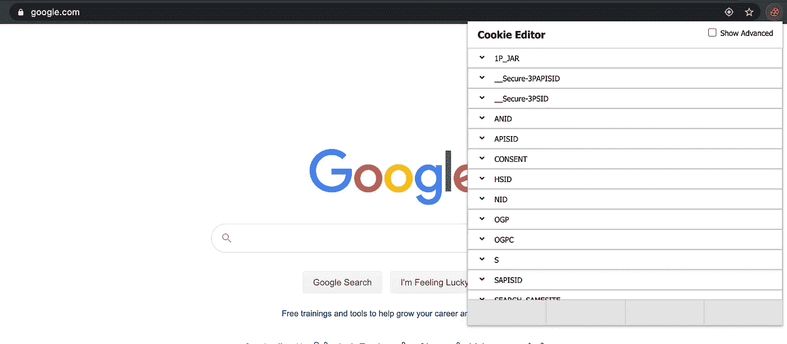
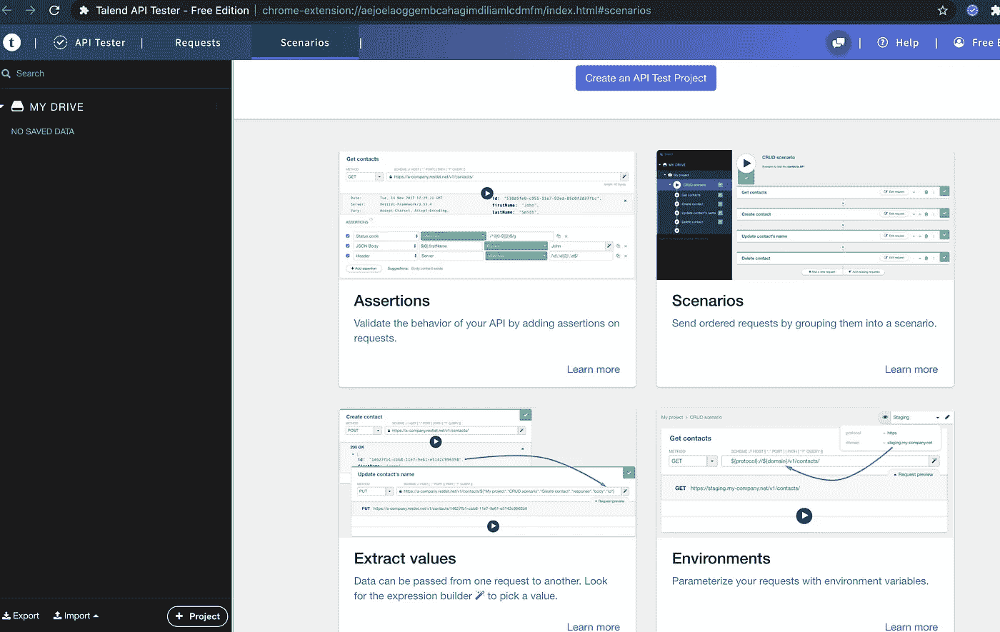
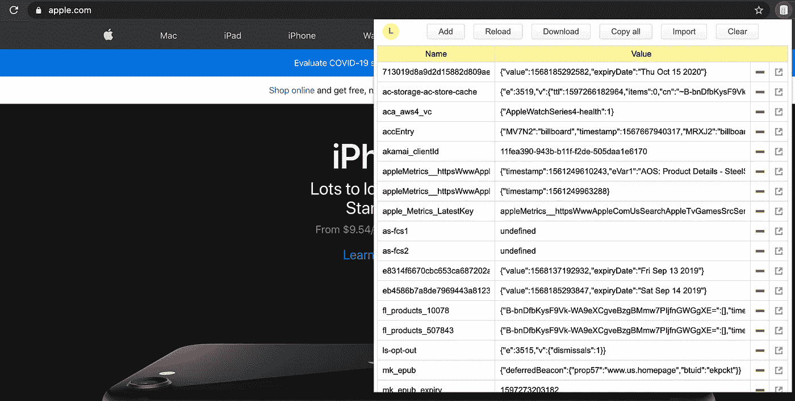

# 提高生产力的 Chrome 扩展

> 原文：<https://betterprogramming.pub/chrome-extensions-to-boost-your-productivity-895c49a3ccdd>

## 开发者必备的 10 个 Chrome 扩展

在 [Unsplash](https://unsplash.com/s/photos/developer?utm_source=unsplash&utm_medium=referral&utm_content=creditCopyText) 上由[Pierre chtel-Innocenti](https://unsplash.com/@chatelp?utm_source=unsplash&utm_medium=referral&utm_content=creditCopyText)拍摄的 BG 照片

在过去的十年里，当任何人想在桌面和移动设备上浏览网页时，谷歌 Chrome 已经成为首选应用。许多人甚至不喜欢在他们的设备上浏览，直到他们安装了 Chrome。也就是说，它也因消耗设备内存甚至降低速度而臭名昭著。但它仍然是最受欢迎的浏览器还有一个原因:支持最新的网络功能和开发工具。

Chrome 是所有开发人员的首选浏览器，因为它拥有庞大的用户群，没有一个开发人员可以忽视它，而且它还在网站甚至移动应用程序的开发阶段提供工具。Chrome Marketplace 也有一些最好的应用程序和扩展，可以在开发和测试期间帮助开发人员添加许多附加功能。在本文中，我们将浏览一个扩展列表，这些扩展可以在开发的不同阶段派上用场。

# 1.什么运行

有多少次你登陆了一个 web 应用程序或网站，并且想知道幕后运行的是什么库或框架？有一些网站可以帮助你做到这一点，但时间对于生产力来说总是至关重要的，所以只需点击一下就能给你所有这些信息的扩展是最好的选择。 [WhatRuns](https://chrome.google.com/webstore/detail/whatruns/cmkdbmfndkfgebldhnkbfhlneefdaaip/related) 正是这么做的。它为您提供了一个全面的信息列表，包括小部件、字体、框架、CDN、分析、web 服务器，甚至它运行的操作系统，您甚至不必离开该选项卡。

WhatRuns 显示网站上使用的库列表[softway.com](http://softway.com)

# 2.页面标尺

尺子有助于日常生活中两个简单而重要的步骤。它帮助你测量你想知道的东西的尺寸，我们经常用它来检查东西是否按照要求正确对齐。[页面标尺](https://chrome.google.com/webstore/detail/page-ruler-redux/giejhjebcalaheckengmchjekofhhmal/related)扩展帮助您在打开的任何网页上执行这些操作。您可以知道您选择的任何部分的尺寸，检查元素的对齐等。

使用页面标尺扩展来测量文章图像的大小。

# 3.我喜欢适应性

响应性不再仅仅是一个有用的特性；是所有网站的必备。Chrome 已经有一个内置的工具来检查你的网站在特定设备上的外观。但是，如果您在检查时想要更多的选项，并且还想同时在多个设备上查看您的站点的外观，该怎么办呢？我爱 adaptive 是实现这一目标的完美工具，你可以在并排观看的同时选择各种设备和屏幕尺寸。安装此扩展后，您可以在访问页面时简单地单击该扩展，它将直接在一个新的选项卡中打开页面，您可以在其中检查响应。

比较 apple.com 在不同屏幕尺寸下的效果。

# 4.VisBug

[VisBug](https://chrome.google.com/webstore/detail/visbug/cdockenadnadldjbbgcallicgledbeoc) 是为 UI 开发者和设计者打造的工具。它帮助你创造奇迹，否则在网站上需要花费数小时的努力来编码和测试。它可以让你检查风格，间距，距离，可达性等。编辑文本，替换图像，挑剔的布局和内容，在任何现场网站，包括你自己的。如果你熟悉 Adobe Sketch，你可以用这个设计工具做很多事情，这是值得花很多时间的。

在[YouTube.com](http://youtube.com)上检查 CSS、可访问性类

# 5.网络制造商

如果您使用过 Codepen，那么您将会知道快速测试您心中的东西是多么容易，而不必经历创建 web 应用程序或运行本地服务器的麻烦。嗯， [Web Maker](https://chrome.google.com/webstore/detail/web-maker/lkfkkhfhhdkiemehlpkgjeojomhpccnh) 做了完全相同的事情，但你不必打开一个 Web 工具，你可以在一个独立的 Chrome 应用程序中测试你的浏览器中的一切。它还允许你为流行的框架创建带有样板代码的应用程序，或者添加流行的库、CDN 等。当你无法上网打开 Codepen 时，这真的很方便，最棒的是，它有一个选项，当你在线时，只需点击一下就可以直接在 Codepen 中打开你的代码。

Web Maker 的 Chrome 扩展 IDE 用于测试代码

# 6.全栈助手

[全栈助手](https://chrome.google.com/webstore/detail/full-stack-assistant-deve/bmhedofbhiihlcfgkligllcjcmepgcnj?hl=en)是列表中我最喜欢的一个，可能也是最不受欢迎的一个。当你第一次读到这个扩展为你做的任务时，可能听起来很傻。但在开发网页甚至浏览网站时，它们会非常方便。它有许多选项可以在表单自动填充、显示/隐藏密码字段、删除输入字段的最大长度、启用禁用的输入、隐藏所有没有 alt 标签的图像等等之间快速切换。

使用 FSA 在隐藏/显示密码字段文本之间切换

# 7.Cookie 编辑器

HTTP cookie 是大多数开发人员用来提供更好的用户体验、维护会话等的东西。在开发网页时编写代码来创建、编辑和删除 cookies 可能并不容易，尤其是对初学者而言。您可能希望多次执行这些操作来测试各种场景，或者有时您甚至希望从另一个设备导入 cookies，或者让用户尝试一些原本需要花费大量精力的事情。 [Cookie 编辑器](https://chrome.google.com/webstore/detail/cookie-editor/hlkenndednhfkekhgcdicdfddnkalmdm)让你探索 Chrome 上不同网站存储的 Cookie，并对它们执行上述所有操作。它是开发和测试网页的理想选择，甚至是为了你的隐私而手动管理 cookies。你所要做的就是点击 cookie 图标，你就可以马上开始管理了。

管理 google.com[上的 cookies】](http://google.com)

# 8.JSON 浏览器真棒

测试 API 是每个开发人员每天都要做的事情，最快的方法当然是在浏览器中。但是在 99%的情况下，API 以 JSON 格式发回响应，这些响应将在浏览器中以纯文本形式显示。Chrome 有许多 JSON viewer 扩展，但这是我最喜欢的一个，因为它的直观特性，如黑暗模式、树和图表视图，以及编辑响应或使用自己的 JSON 的编辑器选项。JSON Viewer Awesome 还允许您禁用特定网站的扩展，如果您不希望 JSON 通过浏览器。

在浏览器中查看和编辑 JSON

# 9.API 测试器

API Tester 是一个工具，可以让你像在 Postman 上一样摆弄你的 API(如果你以前用过的话)。对于那些不知道的人，您可以通过检查它们的响应来测试您的 API，修改头，使用断言进行验证，运行基于条件执行一组 API 的场景，从一个 API 提取值并将它们作为输入提供给另一个 API，以及定义环境变量。还可以创建 API 集合并与其他开发者共享，甚至可以导入 Postman 集合。

# 10.本地存储管理器

与 cookies 一样，浏览器的本地存储被开发人员广泛使用，通常用于在浏览器上本地存储数据。这可以包括像预加载数据这样简单的事情，以使您的网站更快。或者，它甚至可以包括整个表，在这种情况下，即使用户的互联网连接中断，我们也能为用户提供流畅的体验。可以在代码中使用 web APIs 来访问和修改本地存储，但是当您希望在开发过程中多次创建、编辑或删除数据时，这可能是一件非常痛苦的事情。 [LocalStorage Manager](https://chrome.google.com/webstore/detail/localstorage-manager/fkhoimdhngkiicbjobkinobjkoefhkap) 是一个扩展，允许你使用所有本地存储 API，就像任何其他类型的存储一样，还可以执行其他操作，如下载、导入等。您还可以使用该工具管理您访问的任何网站上的本地存储数据。

访问 apple.com 上的本地存储

# 11.去吉拉(奖金)

如果你正在为一个使用 JIRA 管理和跟踪项目进展的组织工作，这是你的扩展。有多少次你打开 JIRA，导航到你的项目页面，只是为了开一张票，即使你知道票的号码，但不知道如何直接打开它。[前往 JIRA 的机票](https://chrome.google.com/webstore/detail/goto-ticket-for-jira%C2%AE/fadmblaffmamblcgglngiggkdmolofhb/related)让您只需输入您的机票号码即可在几秒钟内打开任何 JIRA 机票。你所要做的就是配置你的 JIRA 基本网址一次，你就可以开始了。您可以从任何选项卡打开任何票证，它还会显示您最近查看的五个票证，以便快速访问。

使用 Chrome 扩展打开吉拉门票

嗯，就是这样。我知道有很多有用且很酷的扩展没有出现在这里的列表中，但是考虑到文章的长度，我现在将跳过它们。但是请在评论区留下你认为最有用的扩展。

感谢阅读！