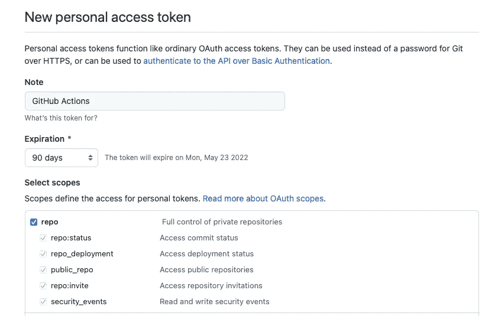
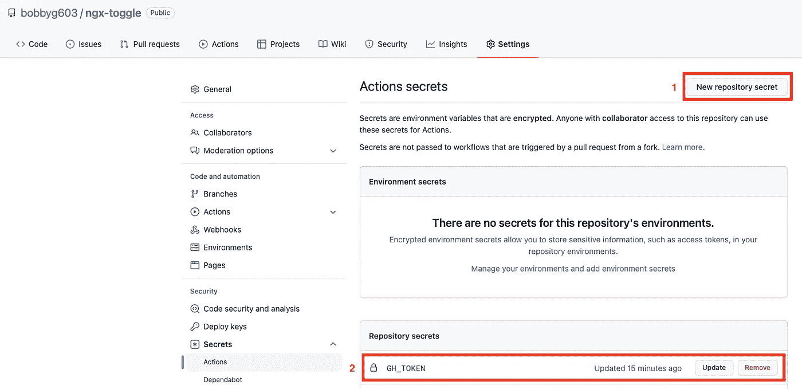
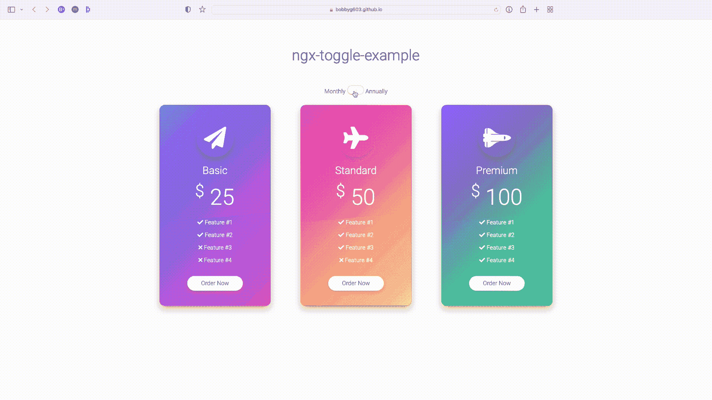

# 面向 Angular 开发者的 CI/CD

> 原文：<https://betterprogramming.pub/ci-cd-for-angular-developers-be9a1485d22b>

## 使用 GitHub 动作自动化您的发布


由涡轮增压的乐高人驱动的 CI/CD 管道(照片由 [Lewis Tse Pui Lung](https://www.shutterstock.com/image-photo/hong-kongmarch-1-lego-mini-characters-261763055) 拍摄)

# 📖定义

> “CI/CD[持续集成和持续交付]是一种通过将自动化引入应用开发阶段来频繁向客户交付应用的方法。”——redhat.com

# 💧弄湿我们的脚

手动发布软件就像在你的余生中每天都踩到口香糖一样有趣。手动发布非常耗时，容易出错，而且非常烦人。现代工具使得发布软件的新版本变得非常容易🥧。

在本文中，我们将概述以下内容:

*   🏊创建 CI/CD 友好的工作流
*   🚴将库发布到 npm
*   🏃将示例部署到 GitHub 页面

对于一个演示了如何用相应的示例应用程序发布 Angular 库的参考实现，请查看 [ngx-toggle](https://github.com/bobbyg603/ngx-toggle) 。

# 🤿潜入水中

创建一个新的角度库只需要几个终端命令。首先，使用 [@angular/cli](https://github.com/angular/angular-cli) 创建一个新项目:

```
ng new ngx-toggle --no-create-application
```

接下来，创建一个新库:

```
ng g library ngx-toggle
```

最后，创建一个示例，以便展示您的库:

```
ng g app ngx-toggle-example
```

有关如何创建角度库的更多信息，请参见官方角度[文档](https://angular.io/guide/creating-libraries)。

# 🏊继续游

一旦您创建了一个库，下一步就是配置您的工作流，以便它能很好地与自动化发布过程配合。

通过在创作提交消息时遵循特定的约定，您可以利用[语义发布](https://github.com/semantic-release/semantic-release)来增加您的包的版本，生成发布说明，并发布到 npm。语义发布依赖于[常规提交](https://www.conventionalcommits.org/en/v1.0.0/#summary)标准来发挥它的魔力。

手动执行常规提交是一项艰巨的任务。相反，让我们使用 [Husky](https://github.com/typicode/husky) 和[commit list](https://github.com/conventional-changelog/commitlint)来拒绝不符合特定标准的提交消息。

我们开始工作吧！首先安装上述软件包:

```
npm i -D husky @commitlint/cli @commitlint/config-conventional
```

在项目的根目录下创建一个`.commitlintrc.js`文件，指示 commitlint 使用`@commitlint/config-conventional`配置和一些稍后会派上用场的规则:

使用 husky 安装 [git 挂钩](https://git-scm.com/docs/githooks),以便在创建新提交时运行 commitlint:

```
npx husky install
```

添加提交消息挂钩，并将新创建的`.husky/commit-msg`文件添加到您的 git repo:

```
npx husky add .husky/commit-msg 'npx --no-install commitlint --edit'
```

给你的项目的`package.json`添加一个`prepare`脚本，这样当新的贡献者克隆你的项目并运行`npm i`时，husky 会安装 git 挂钩；

```
npm pkg set scripts.prepare="husky install"
```

恭喜你。下一次提交时，消息需要加上前缀`chore:`、`fix:`或`feat:`，否则 git 将抛出一个错误。关于创作提交消息时应该选择哪个前缀的更多信息可以在[这里](https://www.conventionalcommits.org/en/v1.0.0/#summary)找到。

# 🚴骑上自行车

旅程的下一段包括设置我们的 CI/CD 管道来构建我们的项目，并运行我们的测试。在本节中，我们将假设您已经构建了一个 Angular 库，并准备发布。如果您还没有准备好发布的库，请随意使用 ngx-toggle ,这样您就可以跟上了。

首先，让我们为持续集成添加一个 GitHub Actions 工作流。将以下代码片段添加到新文件`.github/workflows/ci.yml`:

为了让 GitHub Actions 运行这个工作流，我们需要对我们的 Angular 库做一些修改。添加`build:app`、`build:lib`和`build:ci`脚本，为构建机器提供一种构建库和样本的方法:

```
npm set-script build:app "ng build ngx-toggle-example --configuration=production --base-href=/ngx-toggle/"
npm set-script build:lib "ng build ngx-toggle --configuration=production"
npm set-script build:ci "npm run build:lib && npm run build:app"
```

我们在构建脚本中添加了一个`--base-href=/ngx-toggle/`参数，这样我们就可以部署到 GitHub Pages 用户站点的子目录中(稍后将详细介绍)。

我们还想将回购根目录下的`README.md`文件与库一起分发。让我们安装`copyfiles`并添加一个脚本，以便在每次运行`build:lib`时将`README.md`复制到我们库的`dist`目录中:

```
npm i -D copyfiles && npm set-script postbuild:lib "copyfiles README.md dist/ngx-toggle"
```

接下来，在每个项目的`karma.conf.js`文件中添加一个`ChromeHeadlessCI`浏览器和 customerLaunchers 条目。下面的代码片段应该放在传递给`config.set`的对象的顶层:

```
browsers: [
    'Chrome',
    'ChromeHeadlessCI'
],
customLaunchers: {
    ChromeHeadlessCI: {
        base: 'ChromeHeadless',
        flags: ['--no-sandbox']
    }
},
```

最后，我们需要在`package.json`中创建`test:app` `test:lib`和`test:ci`脚本，这样我们就可以在兼容 GitHub Actions 的浏览器上运行我们的测试，而无需暂停输入或显示进度:

```
npm set-script test:app "ng test ngx-toggle-example --no-watch --no-progress --browsers=ChromeHeadlessCI"
npm set-script test:lib "ng test ngx-toggle --no-watch --no-progress --browsers=ChromeHeadlessCI"
npm set-script test:ci "npm run test:lib && npm run test:app"
```

既然已经创建了这些脚本，那么对于每个到`main`分支的拉请求，都将运行`ci.yml`工作流操作。建议您要求运行 CI 工作流，然后才能将拉请求合并到默认分支。关于描述带有状态检查的分支保护的快速指南，请参见此[文章](https://medium.com/@bobbyg603/github-status-checks-and-branch-protection-made-easy-b70d6d9ffc76)。

# 🏃跑到终点线

这个难题的最后一部分是，每当一个变更被推送到我们的默认分支时，释放我们的库和样本。我们将使用 [semantic-release-cli](https://github.com/semantic-release/cli) 向 [npm](https://www.npmjs.com) 发布我们的包，向 [GitHub Pages](https://pages.github.com) 发布我们的样本。

让我们安装 semantic-release-cli 和一些插件作为开发依赖项:

```
npm i -D semantic-release-cli [@semantic](http://twitter.com/semantic)-release/changelog [@semantic](http://twitter.com/semantic)-release/git
```

运行 semantic-release-cli 启动配置过程:

```
npx semantic-release-cli setup
```

`setup`命令将提示您输入您的凭证，以便配置您的版本。您需要生成一个具有`repo`作用域的 [GitHub 令牌](https://github.com/settings/tokens/new?scopes=repo)。此外，您需要确保您的 [2-FA 设置](https://docs.npmjs.com/about-two-factor-authentication#two-factor-authentication-modes-on-npm)设置为`auth-only`:


语义发布 CLI 的终端输出

为了安全起见，您应该在提示符下输入 npm 密码后更改它。

接下来，在项目的根目录下创建一个`.releaserc`文件，以便我们可以定制语义发布。我们需要指定`pkgRoot`目录，以便`@semantic-release/npm`发布正确的文件列表:

接下来，我们将样本发布到一个 [GitHub Pages 用户站点](https://pages.github.com)的子目录中。您可以为您的用户或组织创建一个 GitHub Pages 站点，方法是创建一个名为`username.github.io`的新 repo，确保将`username`替换为您的用户名或组织名(例如`bobbyg603.github.io`)。

为了发布到您的 GitHub Pages 用户站点，您需要生成一个[范围为`repo`的个人访问令牌](https://docs.github.com/en/authentication/keeping-your-account-and-data-secure/creating-a-personal-access-token)。这个令牌将允许 GitHub Actions 将样本发布到您的`username.github.io`用户站点:



具有回购范围的新个人访问令牌

生成令牌后，添加一个`GH_TOKEN` [存储库密码](https://docs.github.com/en/actions/security-guides/encrypted-secrets#creating-encrypted-secrets-for-a-repository)，这样我们的部署工作流就可以使用个人访问令牌。



添加 GH_TOKEN 存储库机密

我们现在已经拥有了创建我们的`.github/workflows/cd.yml`部署工作流所需的所有部分！该工作流将在每次推送到我们的`main`分支时运行，并将我们库的新版本发布到 [npm](https://www.npmjs.com/package/@bobbyg603/ngx-toggle) ，并将我们的样本复制到我们的 [GitHub Pages 用户站点](https://bobbyg603.github.io/ngx-toggle/):

在**部署下🚀**步骤您需要将`repository-name`、`folder`和`target-folder`的值替换为特定于您的 GitHub 页面 repo 和项目的值。

# 🏁庆祝你的胜利！



恭喜你！

您刚刚为 Angular 应用程序配置了一个真正强大的 CI/CD 管道！为了测试集成，打开并合并一个 pull 请求到`main`分支。

当您打开[拉动请求](https://github.com/bobbyg603/ngx-toggle/pull/1)时，在`ci.yml` [工作流程](https://github.com/bobbyg603/ngx-toggle/runs/5295770975?check_suite_focus=true)成功完成之前，您应该被阻止合并。

合并之后，`cd.yml` [工作流](https://github.com/bobbyg603/ngx-toggle/runs/5295804809?check_suite_focus=true)应该运行，创建[标签](https://github.com/bobbyg603/ngx-toggle/tags)，生成 GitHub [发布](https://github.com/bobbyg603/ngx-toggle/releases/tag/v1.0.1)，更新 [CHANGELOG.md](https://github.com/bobbyg603/ngx-toggle/blob/main/CHANGELOG.md) ，[将](https://github.com/bobbyg603/ngx-toggle/pulls?q=is%3Apr+is%3Aclosed+label%3Areleased)拉请求标记为已发布，[将](https://github.com/bobbyg603/bobbyg603.github.io/commit/02e78c912a1efcc40b9405edc538b44cab5bee5a)示例部署到您的 [GitHub 页面站点](https://bobbyg603.github.io/ngx-toggle)。

```
**Want to Connect?**If you found the information in this tutorial useful please subscribe on [Medium](http://bobbyg603.medium.com), follow me on [Twitter](https://twitter.com/bobbyg603), and/or subscribe to my [YouTube](https://www.youtube.com/c/bobbyg603) channel.
```