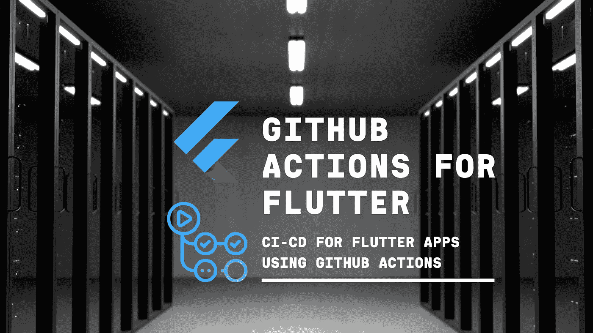
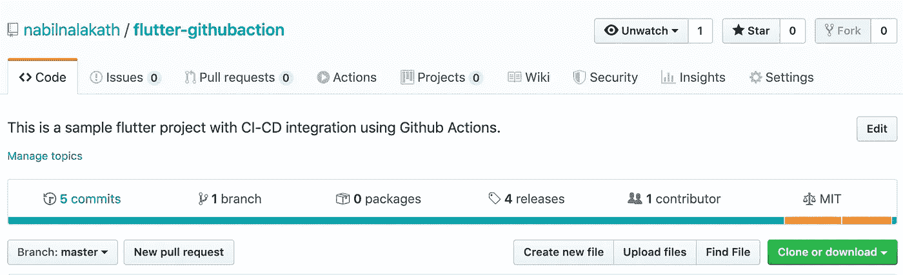
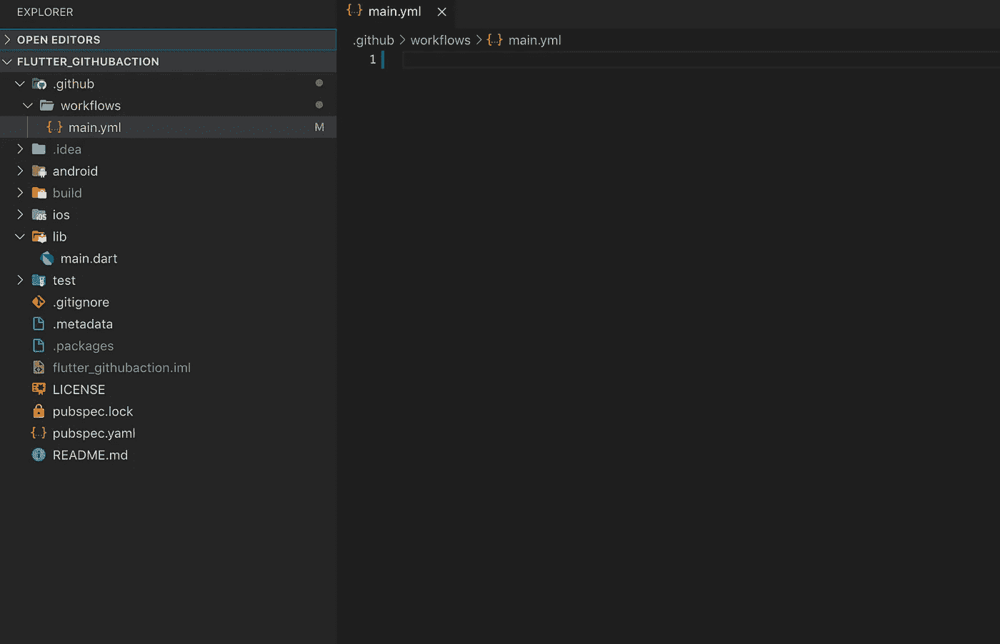
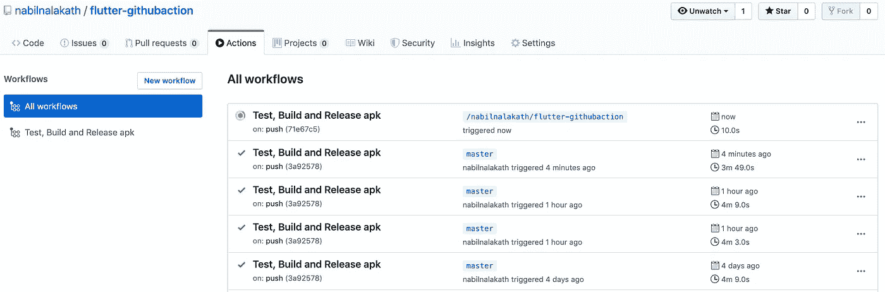
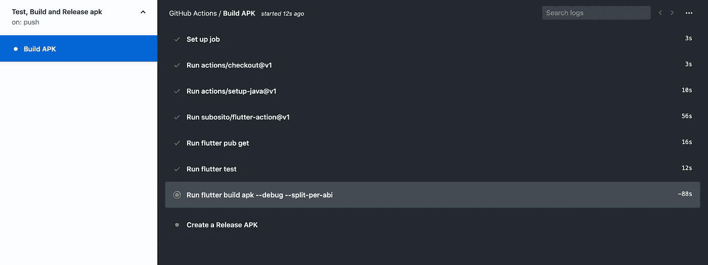
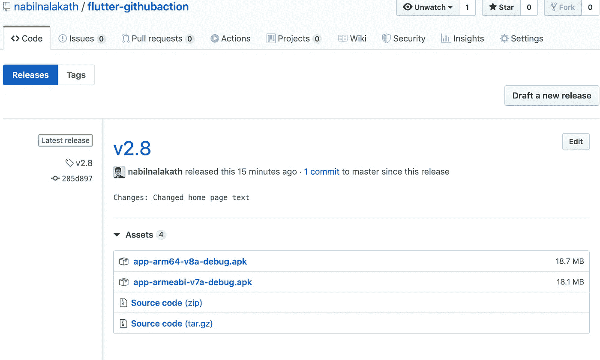

# 使用 GitHub 动作的 Flutter 应用程序的 CI/CD

> 原文：<https://betterprogramming.pub/ci-cd-for-flutter-apps-using-github-actions-b833f8f7aac>

## 该项目在 flutter.io 上为一个 flutter 项目配置 GitHub 操作，以测试、构建和发布一个 APK。

GitHub 对颤振的作用。

> 该项目现已在颤振官网 [***持续部署***](https://flutter.dev/docs/deployment/cd) 版块中精选。

为 GitHub 上的项目添加 CI/CD 工作流的自动化工具 GitHub Actions 目前已推出测试版。(**更新- Github Actions 现已正式退出测试**)

尽管离 11 月 13 日**的公开发布还有一个多月的时间，GitHub marketplace 已经看到了许多帮助几乎所有主要平台的 CI/CD 的行动。**

**在本文中，我们将讨论为一个 [Flutter](https://flutter.dev) 应用程序集成 CI/CD 工作流的各个步骤。**

**注册 GitHub Actions 公测版，如果你还没有注册的话- [这里](https://github.com/features/actions)。**

# **1.创建 GitHub 项目**

**显而易见的第一步是创建一个 GitHub 项目，并将您的 Flutter 项目与资源库连接起来。**

**如果您已经成功完成了 Actions beta 的注册过程，您应该能够在 pull requests 的右侧看到一个新的 *Actions* 选项卡。**

****

**存储库中的“操作”选项卡。**

# ****2。添加工作流文件****

**GitHub 为目前最流行的平台提供了许多预定义的工作流，您也可以在可视化编辑器中定制或创建全新的工作流。**

**但是，在这个项目中，我们将遵循使用工作流命令创建 YAML 文件的手动方法。**

**在您的 Flutter 项目的根文件夹中，创建一个新文件夹`.github`和一个子文件夹`workflows`。这是我们的工作流 YAML 文件将驻留的地方。**

**一个项目可以有多个工作流文件，如构建、发布等。，但是为了简单起见，我们将在这个项目中只使用一个文件。在工作流文件夹中创建一个名为`main.yml`的最终文件。**

****

**创建 GitHub 文件夹并添加工作流文件**

# **3.**写命令****

**我们定义的第一件事是我们希望触发工作流的事件。这可以是任何 GitHub 事件，如 push、pull_request、create 等。，根据您的要求。**

**在这个项目中，我们将使用 push 事件。我们还可以向工作流添加一个名称来标识它。这里是`main.yml.`的完整代码，为了更好地理解，我们将仔细检查每一行及其用法。**

**main.yml**

**`line 1`:当有人将代码推送到我们的 repo 时，我们希望触发我们的工作流。**

**`lines 3–6`:我们正在定义一个在`ubuntu-latest`上运行的作业`Build APK`。每个作业都在虚拟环境的一个新实例中运行。一个作业可以包含一个或多个`steps`。**

**这是我们工作流程的第一步。我们将从我们的存储库中提取源代码，为此，我们将使用一个名为[*check out*](https://github.com/actions/checkout)*的 GitHub 动作。*该操作将您的存储库签出到`$GITHUB_WORKSPACE`，以便您的工作流可以访问存储库的内容。**

**`lines 9-11`:在第二步中，我们将使用另一个 GitHub 动作设置构建 Android 应用程序所需的 Java 环境，名为[*setup-Java*](https://github.com/actions/setup-java)*。***

**`lines 12–14`:这里我们使用 GitHub action [*颤振-action*](https://github.com/marketplace/actions/flutter-action) ，其中设置了一个颤振环境供 actions 使用。**

**`line 15`:获取 Flutter 项目的依赖关系。**

**`line 16`:运行颤振测试。**

**`line 16`:建立 app 的调试 APK。`—- split-per-abi`用于构建多个 APK，避免构建一个胖 APK，其中包含为*所有*目标 ABI 编译的代码**

**`line 17`:使用 GitHub 动作 [*创建发布*](https://github.com/marketplace/actions/create-release) *将 APK 推送到存储库的发布。* 这里，我们在构建和指定`*.apk`之后指定 apk 存放的路径，以确保两个 apk 都被推送到 release。**

**`secrets.TOKEN` 是一个 API 令牌，授予对存储库的访问权。在下一步中，我们将创建一个并将其添加到我们的项目中。**

# **4.添加 GitHub 令牌**

**我们大多数人都会在某个时候创建一个 GitHub 令牌来访问存储库，如果你没有，这个过程非常简单直接。**

*   **转到 GitHub 设置中的[个人访问令牌](https://github.com/settings/tokens)部分。**
*   **生成一个可以访问存储库的新令牌，并复制其值。**
*   **在`<repo url>/settings/secrets`转到项目的存储库设置。在 *Secrets* 选项卡中，从您的工作流文件(本项目中为`TOKEN`)中添加一个具有相同令牌名称的新秘密，并粘贴令牌值。**

****

**在存储库设置中添加新令牌。**

# **5.用标签推送代码**

**一旦我们创建了工作流文件并向我们的项目添加了令牌，我们就可以用 release 标签将代码推送到 GitHub 并触发工作流。**

**在您的本地项目中，提交所有文件，包括`main.yml` 和使用`git tag`命令添加一个新的标签，并将代码与标签一起推送。**

**示例:**

**`git tag v1.0`**

**`git push origin v1.0`**

# **在 GitHub 中查看工作流和发布**

**一旦你推送了代码，你就可以通过`<repo URL>/actions`看到工作流程，通过`<repo URL>/releases`看到发布文件。**

****

**触发的工作流历史记录**

****

**为推送事件执行的工作流命令**

****

**存储库的发布部分中的 apk**

**就是这样。你可以在 [GitHub](https://github.com/nabilnalakath/flutter-githubaction) **上找到该项目的完整源代码。如果你有任何问题，请在评论区发表。****