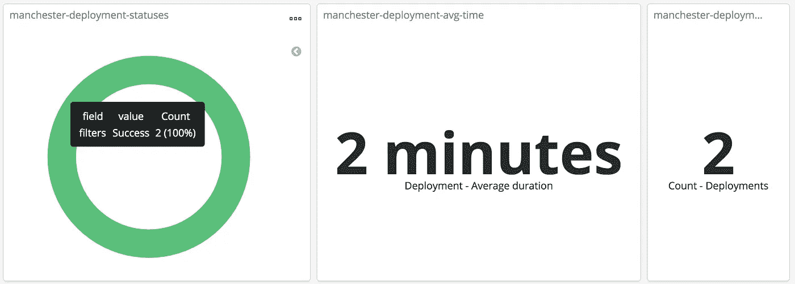

# CI/CD 成功要素

> 原文：<https://betterprogramming.pub/ci-cd-ingredients-for-success-2031cf7ad152>

## 关于*持续集成*和*持续交付*的明显和不太明显的信息


让我们从潘多里诺到日本子弹头列车的管道

*持续集成*和*持续交付* (CI/CD)是任何有价值的软件公司的主要产品。这是一种已经成为行业基础的实践，以至于我们许多人都无法想象没有它的工作。CI/CD 和测试一样基本，也一样有用，但是，我已经看到了各种各样的管道，有好的，有坏的，也有疯狂的。

我从事 CI/CD 系统已经好几年了，在我的时间里，我积累了太多我自己的失败。失败带来了一点智慧和许多白发。

在这篇文章中，我将介绍您的管道应该具备的一些基本功能。我将标记出基本的和奢侈的，然后我们将讨论你的非功能性，即速度、日志和错误处理。

# CI/CD 到底是什么？

在我们进入这篇文章的主体之前，先做一个快速的概述。回到 1997 年的光辉岁月，当绿洲乐队变得强大，穿得像殡仪员一样很酷时，肯特·贝克和罗恩·杰弗里斯推出了极限编程。XP 列出了一系列实践、原则和价值观，他们相信这些将会带来一个更好的软件工程世界。这是一个惊人的变化。

## 第一，CI

虽然 Grady Booch 在 1991 年提出了持续集成，但是是 Kent 和 Ron 推动了它的发展。简而言之，CI 获取所有代码并不断测试。目标？确保团队不会彼此疏远，并将集成问题扼杀在萌芽状态。

## 和 CD

Jez Humble 和 David Farley 推广了连续交付(CD)。这是一个双管齐下的原则:

1.  主干(主分支或 SVN 主干)中的代码应该是可部署的。
2.  这些部署应该完全自动化，不需要任何手动步骤。

## 他们在一起很棒。

就是这样，CI/CD 不断地打包、测试和轻松地将代码部署到生产环境中。这有利于消除集成问题，并通过提高部署频率来降低部署风险。

# 那么，管道应该做什么呢？

很高兴你问了。我在这里介绍的每一个特性都是实现 CI/CD 管道的好处所必需的。我已经尽力做到面面俱到，但还是希望有些变化。

## 试验

这是显而易见的，它应该针对您的代码运行一些测试。想知道你的代码是否有效吗？做些该死的测试。

## 包装

它应该在建造某种可部署的人造物品。同样，显而易见。你打算部署这个，是吗？你需要一件艺术品。

## 安全扫描

这一点引起了一些人的注意，但是在亲自实现了这一点之后，我决定将它放在“必须拥有”的列表中。代码和工件扫描提供了不可或缺的反馈。OWasp 可以扫描你的依赖关系。[成立](https://www.tenable.com/products/tenable-io/container-security)可以扫描你的集装箱。Checkmarx 可以看看你的代码。具体的工具并不重要。重要的是能力。您需要知道 SQL 注入漏洞何时会出现。您的测试可能会通过，但是除非您的代码是安全的，否则它还不能用于生产。


你/tmp 目录下的这个 trojan.ru 文件是什么？

不要将这一责任推卸给运营部门或您的信息安全团队。承认问题，并使用自动化将它可视化。通过在管道中进行安全扫描，您可以生成大量的数据流，这些数据流可以在危机或日常调试中使用。

## 将应用程序部署到所有环境

有人曾经告诉我，除了生产之外，所有的部署*都是自动化的，因为我们不能在生产环境中冒险。他们的部署非常复杂，他们不想冒自动化的“风险”。决定把它留给永远可靠的人类思维。*

不要因为你感到紧张而回避。如果您有一个简单的部署过程，自动化是很容易的。如果你有一个复杂的过程，这是绝对必要的。没有出路:自动化，自动化，自动化。

## 部署后检查

一旦部署完成，您如何知道它正在工作呢？健壮管道的一个关键要素是健全性检查。这可以采取[冒烟测试](https://en.wikipedia.org/wiki/Smoke_testing_(software))的形式或者更严格的形式。您可以向您的 API 发出一个 HTTP 调用，并检查它是否返回了一个`2xx`状态代码。无论如何——不要因为你的应用已经启动就认为你的部署很好。

## 通知


我的部署失败了！！

不管构建是成功还是失败，管道都应该发出通知。这应该发送到您的工程师最常用的媒体。不要堵塞人们的电子邮件收件箱——他们只会制定一个规则，把它们藏在一个随机的文件夹里。推动他们通过即时消息平台(以及任何审计解决方案)，如 Slack 或微软团队(叹息)。

## 有用的错误消息

谈论好的错误消息的最好方式是从一个不清楚的错误消息开始:

```
Error: "nginx-ingress" has no deployed releases
```

这是显而易见的，如果你了解 helm 并且遇到过这个问题，唉，我们的错误信息不应该只针对那些已经知道这个问题的人。应该很容易被大家理解。所以从表面上看，这个信息并不是很清楚，是吗？我部署了我的最后一个版本。我想它已经展开了。如果您运行`helm list`,您会看到类似这样的内容:

```
NAME           REVISION UPDATED                  STATUSnginx-ingress  6        Fri May  3 11:19:45 2019 FAILED
```

错误消息的问题是它没有提供上下文或说明。这是两种完全必要的成分。这意味着什么，有什么影响，你该怎么办？考虑到这些，一个更有用的错误消息是这样的:

```
Your application can not be deployed because it is in a failed state. You can verify this using the helm list command. You should rollback to a previous working revision, using the helm rollback command.
```

这里提供的第一句话指出了根本原因:应用程序处于错误的状态。如果您想亲自验证此问题，它还会提供诊断帮助。语境！

此错误消息的第二部分提供了补救措施的说明。指令就在代码中，而不是遵循一些古老的 confluence 文档。一个好的错误消息可以消除对大量教程和操作指南的需求。它可以消除昂贵的谷歌搜索，并在不会过时的代码中创建活的、响应性的文档。花时间把这些做好是值得的。

## 韵律学

最后一个是度量。了解有多少部署失败了，有多少成功了，构建花了多长时间，瓶颈在哪里，等等，这是很有帮助的。有大量的信息需要你的团队去挖掘和理解。



理解这样的度量标准可以开启真正的团队改进。

这些数据是您团队的生命线——这些度量代表了您团队交付软件变更的能力。如果你能让它浮出水面，你就拥有了一座信息的金矿。