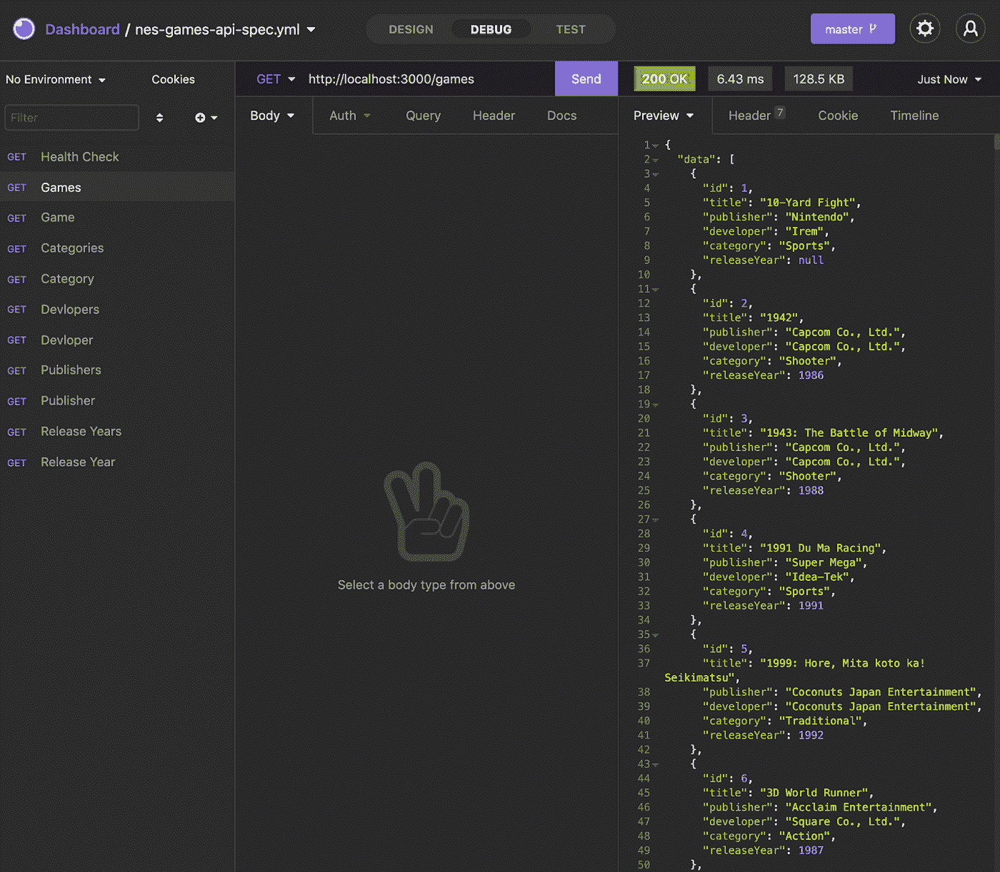
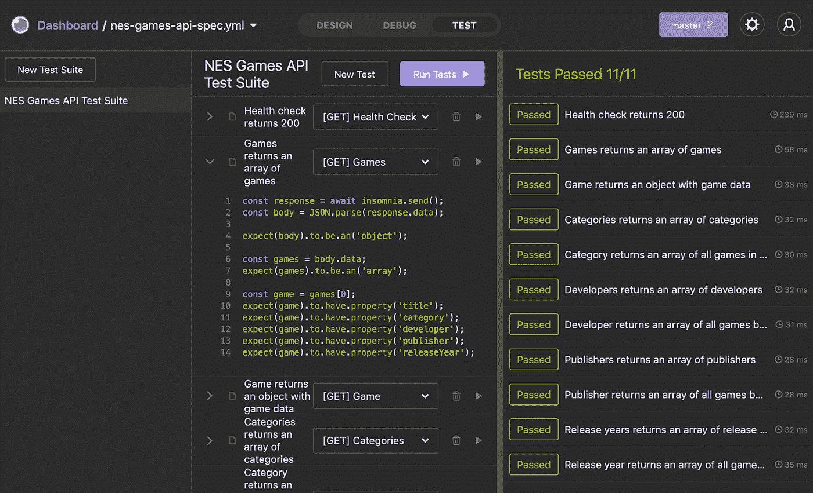
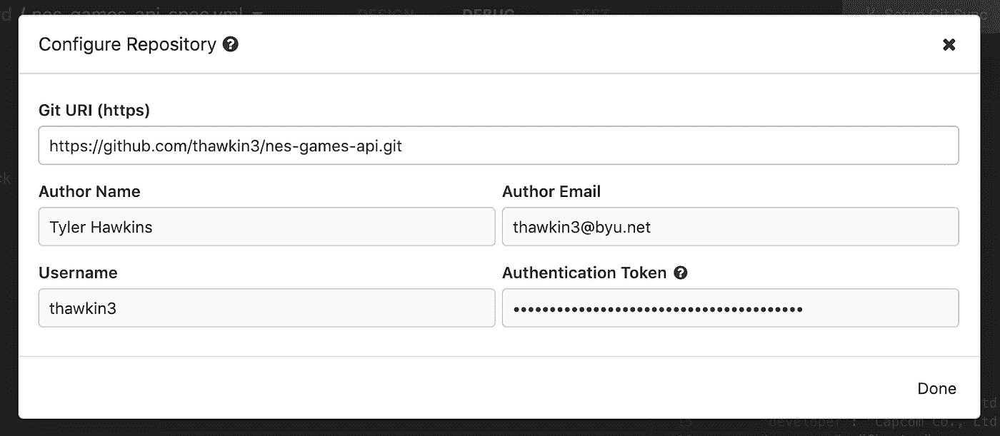
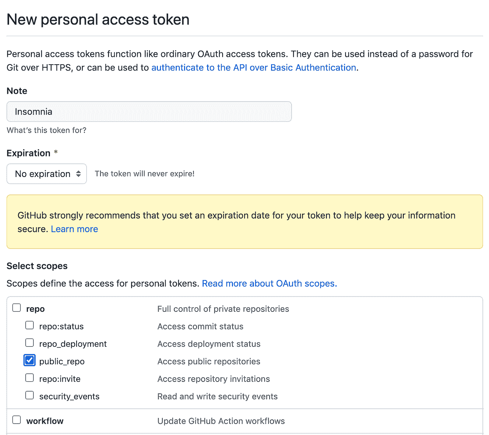
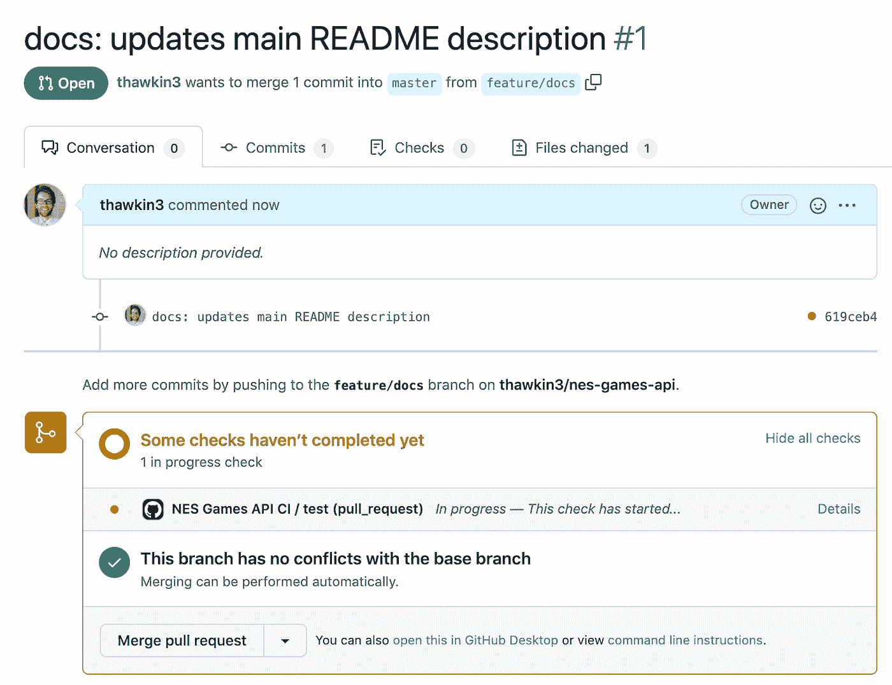
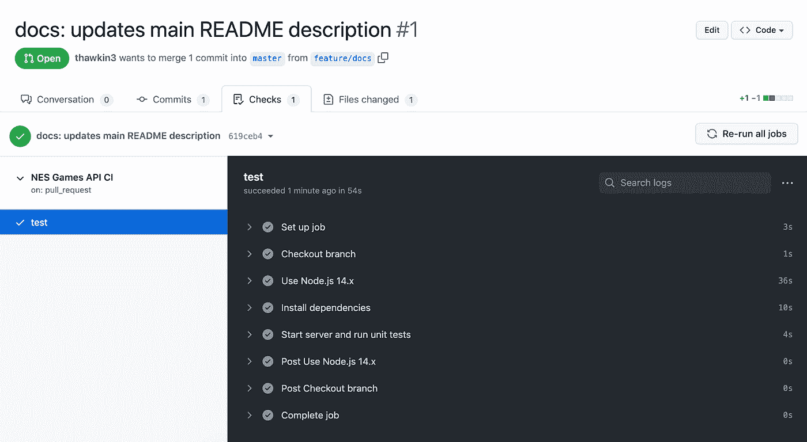
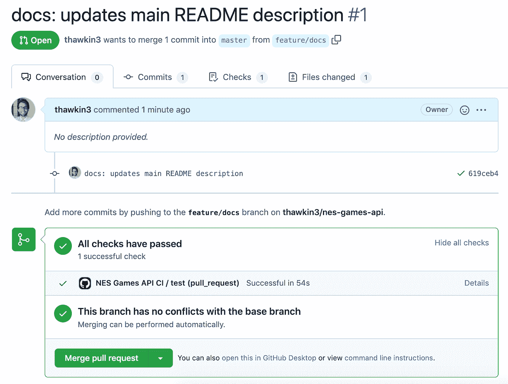
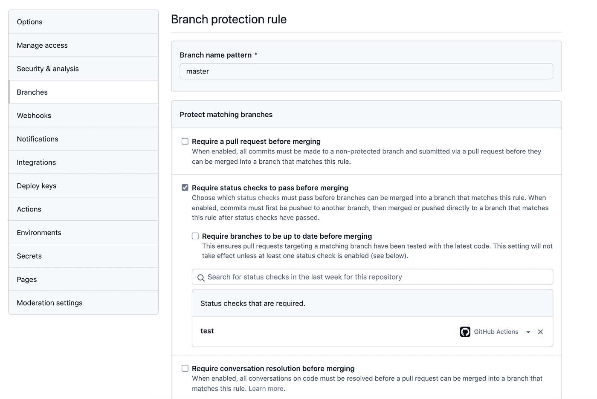

# 具有 Kong 失眠症 CLI 和 GitHub 操作的 API 的 CI

> 原文：<https://betterprogramming.pub/ci-for-apis-with-the-kong-insomnia-cli-and-github-actions-270eba79174d>

## 让我们用 Node.js 创建一个简单的服务器，并使用 Kong 失眠症患者来表达和编写 API 测试


失眠标志

失眠是孔的一款桌面应用，非常适合构建、调试和测试后端 API。虽然专门的手工测试很好，但是将我们的 API 测试包含在我们的持续集成(CI)管道中不是更好吗？有了 Inso，孔失眠的 CLI 工具，我们可以！

Inso 允许你直接从命令行运行你的自动化 API 测试，这意味着用 GitHub Actions 建立一个工作流是轻而易举的。

在本文中，我们将使用 Node.js 和 [Express](https://expressjs.com/) 创建一个简单的服务器，使用 [Kong 失眠症](https://docs.insomnia.rest/)编写 API 测试，然后使用 [Inso](https://docs.insomnia.rest/inso-cli/introduction) 和 [GitHub 操作](https://resources.github.com/devops/tools/automation/actions)在我们的 CI 管道中运行这些测试。

# 演示应用:一个任天堂游戏数据库

我们已经建立了一个游戏数据库，其中包含了所有已经发行的 NES 游戏的信息。该应用程序是一个服务器，它实现了一个 REST API，并带有端点来获取关于游戏、类别、开发者、发行商和发行年份的数据。

你可以在 GitHub 上找到完整的代码。

# 利用孔失眠进行人工测试

在开发 API 时，快速的反馈周期有助于确保您的 API 按照您想要的方式工作，并返回您期望的数据。孔失眠是完美的这种特别测试。

为了开始使用我们的游戏 API，我们在 Kong 失眠症内部创建了一个新的[设计文档](https://docs.insomnia.rest/insomnia/design-documents)。我们将 Design 选项卡中的信息留为空白，转到 Debug 选项卡，开始发出请求。下面，我们对服务器提供的每个 API 端点都有请求。我们可以在 Kong 失眠症内部运行每个请求，并将结果数据显示在 UI 中。



失眠中的 API 请求示例

# 孔失眠写考卷

手动点击我们的 API 端点对于专门的测试和调试来说是非常好的，但是最终我们想要的是一个自动化的测试套件，确保我们的应用程序正确运行。[孔失眠让你在桌面 app 内的测试标签里写测试](https://docs.insomnia.rest/insomnia/unit-testing)。

通过从 Debug 选项卡中选择一个请求来编写测试，然后对服务器返回的数据进行断言。您可以运行单个测试或一整套测试。

正如您在下面看到的，我们已经为我们测试套件中总共 11 个测试的每个 API 端点编写了测试。



失眠中的 API 试验

这些测试(以及我们设计文档中的信息)可以与 Git 同步，并包含在我们的代码报告中。通过这种方式，任何使用 Kong 失眠桌面应用程序的人也可以运行这些请求和测试。

要将 Kong 失眠症与 Git 同步，只需点击应用顶部的“设置 Git 同步”按钮。


在失眠中设置 Git 同步按钮

从那里，您可以提供相关的细节，将 Kong nimbness 与您的项目的 Git repo 联系起来。



把失眠和你的 GitHub repo 联系起来

将 Kong 失眠症患者与您的 Git repo 同步需要一个认证令牌。您可以在 GitHub 的帐户设置中轻松[创建个人访问令牌](https://docs.github.com/en/authentication/keeping-your-account-and-data-secure/creating-a-personal-access-token)。



在 GitHub 中创建个人访问令牌

# 用 Inso 从命令行运行测试

我们现在有了一组请求和一套 Kong 失眠症的测试，帮助我们进行调试和测试。但是我们还没有自动运行这些测试，所以让我们现在就开始吧。这就是孔失眠的 CLI Inso 发挥作用的地方。

Inso 可以作为一个 npm 包安装，所以我们将它作为一个开发依赖项添加到我们的项目:`yarn add --dev insomnia-inso`。

为了简化测试套件的运行，我们在`package.json`文件中创建了一个 npm 脚本。下面的脚本[用 Inso](https://docs.insomnia.rest/inso-cli/cli-command-reference/inso-run-test) : `"test": "inso run test \"NES Games API Test Suite\""`运行我们的测试。这意味着我们可以随时从命令行运行`yarn test`来运行我们的测试。

# 将 Inso 与 GitHub 动作集成

现在是我们到目前为止所设置的一切的高潮:作为持续集成管道的一部分运行我们的自动化测试。我们可以从命令行运行我们的测试，这很好，但是现在，我们不能让它们在任何地方为我们自动运行。我们真的希望我们的测试套件能够在每个新的拉请求上运行。这样做将确保在将新代码合并到主分支之前通过测试。这是最佳的持续集成。

[GitHub 动作](https://docs.github.com/en/actions/automating-builds-and-tests/)允许我们通过使用 YAML 文件来配置任何我们想要的持续集成。我们在其中创建了一个`.github/workflows`目录和一个`unit-tests.yml`文件。该文件全文转载如下:

```
name: NES Games API CI

on:
  push:
    branches:
      - master
  pull_request:
    branches:
      - master

jobs:
  test:
    runs-on: ubuntu-latest
    steps:
      - name: Checkout branch
        uses: actions/checkout@v2

      - name: Use Node.js 14.x
        uses: actions/setup-node@v2
        with:
          node-version: 14.x
          cache: 'yarn'

      - name: Install dependencies
        run: yarn install --frozen-lockfile

      - name: Start server and run unit tests
        run: yarn ci:start-and-test
```

正如您所看到的，我们的工作流检查我们当前的分支，使用节点 v14，安装我们与 yarn 的依赖关系，然后运行一个定制脚本来启动我们的应用服务器并运行 API 测试。每当将代码推送到主分支或针对主分支打开新的拉请求时，都会触发此工作流。

这个`ci:start-and-test`脚本是我们添加到`package.json`文件中的另一个 npm 脚本。使用 npm 包 [wait-on](https://www.npmjs.com/package/wait-on) 和[并发](https://www.npmjs.com/package/concurrently)，我们使用这个脚本来启动我们的服务器，运行 API 测试，然后在测试完成后终止服务器。我们的`package.json`文件中的 npm 脚本的完整列表如下:

```
"scripts": {
  "ci:start-and-test": "concurrently -k -s=first \"yarn start\" \"yarn ci:test\"",
  "ci:test": "wait-on http://localhost:3000 && yarn test",
  "format": "prettier --write .",
  "format-watch": "onchange . -- prettier --write {{changed}}",
  "start": "node index.js",
  "test": "inso run test \"NES Games API Test Suite\""
},
```

现在，我们有了一个非常好的 CI 渠道！

我们可以通过在回购中创建一个小的拉请求来测试一切是否正常。发出拉请求后，我们可以看到 CI 管道正在运行:



针对 GitHub 中的 pull 请求，CI 管道正在运行

如果我们单击“详细信息”按钮查看更多信息，我们可以看到正在运行的工作流的各个步骤:



CI 管道步骤

一旦作业通过，结果将报告回拉请求，如下所示:



CI 管道已通过我们的拉取请求

我们做到了！所有检查都通过了。

为了完整性，我们可以做的最后一件事是要求在 pull 请求被合并之前，所有的检查都要通过 GitHub。我们可以在 GitHub 的 repo 设置中这样做:



在 GitHub 中合并 pull 请求之前，需要通过状态检查

如果你想探索另一个潜在的 CI 设置，Kong 团队也有他们自己的[示例工作流](https://docs.insomnia.rest/inso-cli/continuous-integration/)，你可以使用他们的[设置-inso GitHub 动作](https://github.com/marketplace/actions/setup-inso)将 Inso 安装为 CI 管道中的一部分工作。

# 结论

那么，我们今天完成了什么？其实挺多的！我们已经使用 Node.js 和 Express 创建了一个服务器。我们已经在 Kong Insomnia 内部创建了专门的请求来帮助开发和调试我们的 API。我们已经在 Kong Insomnia 内部编写了测试，并学会了使用 Inso 从命令行运行它们。最后，我们创建了一个包含 GitHub 操作的 CI 管道来运行我们的 API 测试，作为我们的 repo 的每个 pull 请求的一部分。

孔失眠、Inso、GitHub Actions 一起帮助我们满怀信心地开发我们的 app。我们的持续集成渠道为我们随时部署应用做好了准备。成功！

为了更进一步，我们可以将这个工作流程合并到一个更广泛的策略中，用于管理整个 API 开发生命周期——在 Kong 失眠症患者中进行设计和开发，使用 Inso 集成到我们的 CI 管道中进行部署，以及使用像 [Kong Gateway](https://konghq.com/kong/?utm_source=guest&utm_medium=devspotlight&utm_campaign=community) 这样的工具进行管理和维护。

感谢您的阅读，祝您编码愉快！