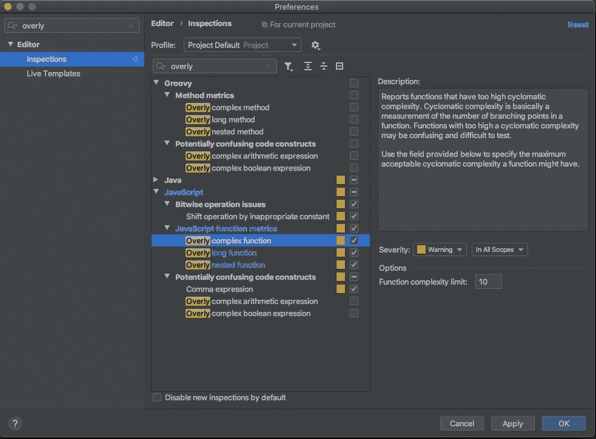
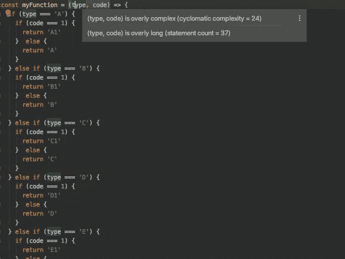
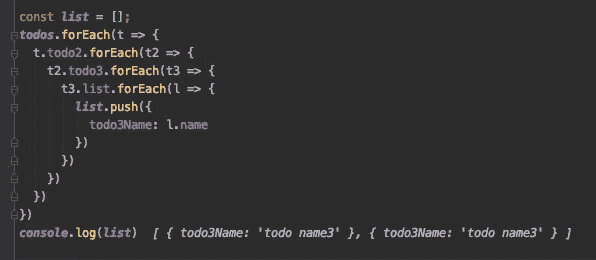
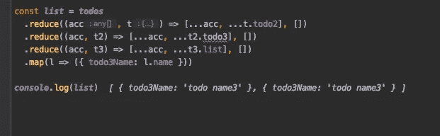
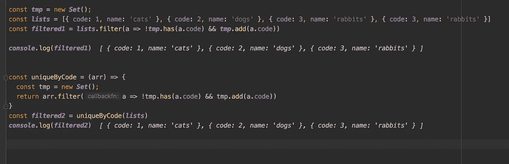
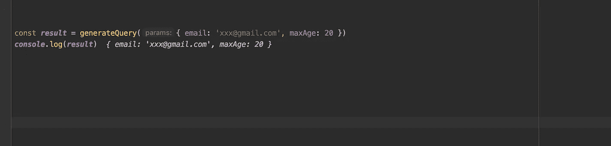
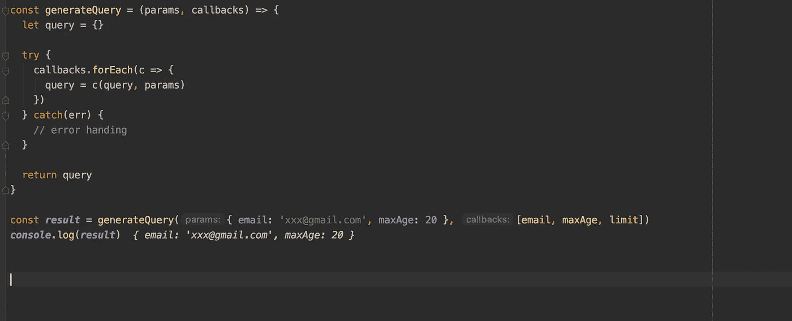
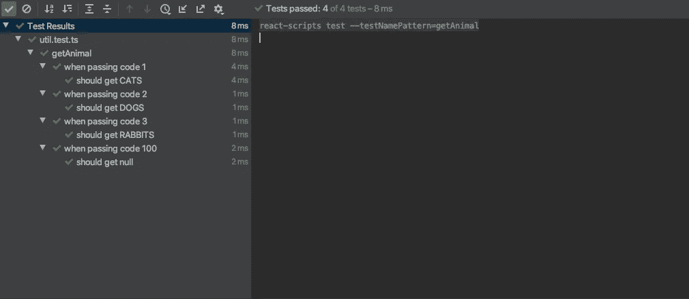

# 写代码时，清晰是王道

> 原文：<https://betterprogramming.pub/clarity-is-king-when-writing-code-752b85101484>

## 好的代码是清晰的代码，而不是聪明的代码


由[大卫·崔维斯](https://unsplash.com/@dtravisphd?utm_source=unsplash&utm_medium=referral&utm_content=creditCopyText)在 [Unsplash](https://unsplash.com/s/photos/clarity?utm_source=unsplash&utm_medium=referral&utm_content=creditCopyText) 拍摄的照片

许多程序员试图编写干净、智能的代码。不过，有时候沉迷于 smart 可能会使代码库更难理解，并且可能需要花费更多的时间来阅读和维护它。

如今在团队合作中，人们开始写*人类代码，*这意味着你在写代码时应该尊重他人，而不是炫耀自己的聪明才智。人们尽量不使用 *clean* 、这个词，因为这暗示着代码是脏的，即使你不是故意的。丹尼尔·欧文在他的文章“[干净的代码，肮脏的代码，人类代码](https://dev.to/d_ir/clean-code-dirty-code-human-code-6nm)中谈到了这一点

我不是说*干净*是坏事。当我在做一个个人项目时，我试图用一种聪明的方式让代码库变得干净。但更重要的是，我使代码库更具可读性和可理解性。

正如鲍勃大叔在他的[干净代码](https://www.goodreads.com/book/show/3735293-clean-code)中所说:

> “总的来说，程序员是相当聪明的人。聪明人有时喜欢通过展示他们的心理杂耍能力来炫耀他们的聪明。毕竟，如果你能可靠地记住`r`是去掉了主机和模式的 URL 的小写版本，那么你一定非常聪明。一个聪明的程序员和一个专业的程序员之间的一个区别是**专业的程序员明白清晰才是王道。专业人士善用他们的能力，编写他人能理解的代码。罗伯特·马丁**

最重要的是用清晰的方式写出别人能理解的代码。其他人不仅是其他人也是你，你将在几个月后重写代码。

在这篇文章中，我不是在谈论人类代码方面很多。相反，我将通过一些例子来强调如何将这一原则应用到您的代码中，并最大限度地减少人们理解它所需的时间。

注意:为了解释一些技巧，我将使用 JavaScript 或 TypeScript。

涵盖的示例:

*   命名
*   评论
*   条件式
*   环
*   功能
*   测试

# 命名

在软件开发中，许多程序员在命名方面有困难。但在我个人看来，重点只是避免歧义，使用具体的词语。

例如:

在这段代码中，您可以预期`fetch`将从服务器获得什么。但是如果将`fetch`函数导出并在其他文件中使用呢？

在其他文件中:

```
**import { fetch } from './utils'**fetch() // fetch ... what? 
```

相反，您可以更具体地命名它:

这是一个非常简单的例子。如果变量或函数在你的代码库中有更大的作用域，使用具体的名字来清楚地说明它们的用途。

我说你应该避免模棱两可。注意像这样的一般动词:

*   制造
*   得到
*   设置
*   开始
*   使生效
*   支票
*   派遣

另一个例子:

```
const xxx = validateForm()
```

在这段代码中，你可以理解`validateForm`正在验证表单，但是你期望返回什么呢？

但是假设你这样写:

```
const xxx = isFormValid()
```

很明显，这个方法将返回`true`或`false`。

如果你这样写，你可以假设这个方法会返回一个数组或者一个表单错误的映射:

```
const xxx = getFormErrors()
```

另一个例子:

```
const token = getToken()
```

如你所见，`getToken`很可能得到一个令牌。但是从哪来的？如果是用异步函数从服务器获取令牌呢？

```
const token = getToken()// use token for something
doSomething(token)
```

这可能会在`doSomething`函数中导致一个未定义的错误，因为在这种情况下，您需要等到`getToken`完成。

```
const token = **await** getToken()// use token for something
doSomething(token)
```

它工作正常。但是`getToken`在这种情况下并不合适，所以您可以将其重命名为:

```
const token = **await** **fetchToken**()// use token for something
doSomething(token)
```

这样，该方法将从某个服务器或其他异步设备获取令牌就更清楚了。

为了解决这些问题，许多聪明的人想出了一个好的例子，但重要的是让人们以简单的方式知道它是为了什么。

# 评论

一般来说，注释的目的是尽可能地帮助人们了解，注释可以使人们更快地理解代码。但是你不必总是在代码上加注释。你需要知道一个没有价值的评论和一个好的评论之间的界限。

## 什么不要评论

如果人们很容易理解它在做什么，你就不需要对代码进行评论。

例如:

你可以理解这个代码很明显是通过查看自身来找到一个学生的，所以不需要放注释。

另一个例子:

这看起来像是一个很好的解释，但是还可以改进。

代码块应该被移动到函数中，你应该放入一个解释它在做什么的名字。一个更加简洁和自我记录的函数名比一个好的注释要好。

## 评论什么

我们已经讨论了什么样的代码不应该注释。接下来，我们将看到应该评论什么。

当代码:

*   有缺陷，比如性能问题
*   可能会导致人们意想不到的行为
*   需要总结，以便人们可以很容易地抓住细节
*   我需要一个解释，为什么在有更好的方法的情况下还要这样写

这些是你在编写代码时得到的有价值的见解。如果没有这些评论，人们可能会认为有一个 bug 或者代码应该被测试或修复，这可能是浪费时间。为了避免这种情况，您应该解释为什么代码以某种方式编写。

重要的是设身处地为别人着想。未雨绸缪，预测人们可能陷入的陷阱。

# 条件式

写代码的时候，我们要处理条件句。大量的 if/else 语句让你停止阅读代码库，陷入一段时间。我相信条件语句越少，代码越易读。

通过使用[圈复杂度](https://en.wikipedia.org/wiki/Cyclomatic_complexity)，你可以计算代码的复杂度。如果代码中使用了大量 if/else、循环或 switch 语句，则计数会很高。通常，计数越高，代码越复杂。

如果您是 IntelliJ 用户，可以在首选项中检查复杂性:



选中“过于复杂的功能”框。

而当你在函数中写了很多 if/else 语句时，它会警告你:



如您所见，这里的圈复杂度很高。

注意:在 VS 代码中，你可以使用一些插件，比如 [CodeMetrics](https://marketplace.visualstudio.com/items?itemName=kisstkondoros.vscode-codemetrics) 。

关键是尽量减少不必要的条件句，尽量减少理解代码的时间。

以下是一些简化和提高条件可读性的技巧:

*   先处理正面案例，而不是负面案例
*   早点回来
*   使用`Array.includes`处理多个案例
*   使用可选链接处理未定义的检查

## 首先处理积极的，而不是消极的

哪个对你来说更有可读性？

```
if (!debug) {
  // do something
} else {
  debugSomething()
}
```

或者

```
if (debug) {
  debugSomething()
} else {
  // do something
}
```

大多数情况下，优先使用正例。但是如果否定的情况是更简单和更仔细的情况，你可以这样写:

```
if (!user) throw new Error('Please sign in first')

// do a lot of things here
// ...
```

## 早点回来

提前返回可以移除嵌套并清理代码，因为您可以在函数的顶部首先处理简单的情况。

例如:

它工作得很好，但是代码有点长而且是嵌套的。如果您添加了 if/else 语句，就很难找出右括号在哪里，调试代码也更困难。

为了让它看起来更干净，我们需要做的是:

*   如果没有日期，抛出一个错误
*   如果日期是今天，返回“今天”
*   如果日期是昨天，返回“昨天”
*   如果日期不在今年，则返回包含年份的日期
*   如果与上述不匹配，返回日期和月份

看起来更好。从一个函数多次返回对于使代码可读来说是非常好的。

## 使用数组处理多个案例。包括

如果有多个条件，可以使用`Array.includes`避免扩展语句。

例如:

考虑到以后可能会在语句中添加其他条件，我们希望像这样重构代码:

有了类型数组，您可以从代码中单独提取条件。

## 使用可选链接处理未定义的检查

[可选链接](https://babeljs.io/docs/en/babel-plugin-proposal-optional-chaining)允许你深入访问嵌套对象，而不用在临时变量中重复赋值结果。通过这样做，您可以减少条件中的多次检查。

注意:如果你想在 JavaScript 中使用一个可选的链接操作符，你需要安装 [Babel 插件](https://babeljs.io/docs/en/plugins/)。在 3.7 以上的 [Typescript 中，无需任何配置即可使用。](https://www.typescriptlang.org/docs/handbook/release-notes/typescript-3-7.html)

例如:

如果您想检查用户是否存在，并避免未定义的错误，您需要编写一个类似上面示例的条件。

但是通过使用可选的链接操作符，代码将是:

这样看起来更好，也更容易维护。`?`可以访问内部的嵌套对象，避免未定义的错误。

你可以在 [TypeScript playground](https://www.typescriptlang.org/play/#code/C4TwDgpgBAqgzhATlAvFA3gWAFBT1AQwBMjEI44BJAOwDMB7AfgC4Md8OoAvASzAGN6RCKzjBEPagHN2+AL44F2HIOpioAVwSJW8JKgxLV63gKHQ0WpIwB0xUuSp0mN04OE4V9NfQA2EG196KQAKN3MASiA) 里玩这个很酷的功能。

# 环

简化循环使你的代码更容易理解。

在实际情况中，您可能会在对象中遇到复杂的嵌套循环。如果你有一个嵌套的对象，并且必须在`todo3`中获得列表名，比如:

例如，你可以这样写:

你会得到列表:



它工作正常。通过用`forEach`循环数组，您可以进入对象内部，当您到达`todo3`时，您将获得列表名称。

但这可以通过使用`reduce`功能来改善:

这也很好。



`reduce`函数允许你通过扩展先前的值来创建一个新的对象或数组。在这种情况下，在第一个 reduce 中，它得到了`todo2` 数组，接下来是`todo3`数组，最后是`todo3`中的一个列表名。

为了避免可读代码的复杂性，移除嵌套循环是必要的。

# 功能

以下是编写函数时要记住的一些提示:

*   使用一个摘要名称来解释它在做什么。
*   为一个目的创建一个函数。
*   函数越小，可读性越强。

## 使用摘要名称来解释它在做什么

当您第一眼看到下面的代码时，您可能会停止阅读并试图弄清楚它在做什么:

那这个呢？

您可能希望有一个函数，通过查看一次就可以删除带有重复代码的对象。

两者都工作得非常好，并且得到相同的结果。



但是第二个更具可读性，有助于解释这个函数在做什么。

另一个例子:

如果我们为它编写函数，代码将是这样的:

好多了。但就个人而言，我喜欢管道操作符的想法，它用于将几个函数链接在一起，以提高函数式编程的可读性。

如果我们在 JavaScript 中使用管道，代码将如下所示:

这无疑提高了可读性和可维护性。通过将`[@babel/plugin-proposal-pipeline-operator](https://babeljs.io/docs/en/babel-plugin-proposal-pipeline-operator)`添加到您的`bebelrc`设置中，可以使用管道操作符。这是一个实验性的插件，但是我在我的真实项目中使用它。

## 为一个目的创建一个函数

现在我们明白了摘要名的重要性。但是，如果您不能为您的函数想出一个好名字，该怎么办呢？

例如:

你可能想知道它应该是`updateUserAndProfile`、`updateUserAndProfileAndNotify`还是别的什么。当你陷入困境时，就是时候将代码分割成更小的部分，因为当代码同时做多件事情时，人们更难理解代码。

当您编写一个更新用户的函数时，代码应该是这样的:

如果您必须同时处理多个任务，请创建一个包装器函数来完成这项工作:

这是一个非常简单的例子，但是在实际开发中有很多这样的例子。要记住的关键思想是后退一步，考虑函数应该做什么，并考虑任何问题，以便它一次只做一项任务。

## 较小的函数可读性更强

当你为一个目的编写一个更小的函数时，代码将更具可读性和可理解性。

例如:

该函数的输出如下:



想象一下，在一个函数中有大量的代码，创建一个查询来搜索一些数据。如果电子邮件查询有问题，您必须检查里面的函数，找到电子邮件的实现，并修复它。在那之后，你必须检查这个改变是否会影响函数中的其他代码。

一般来说，人们一次只能考虑几件事。代码的表达式越大，就越难理解和维护。

所以让我们把代码变得更小:

将巨大的代码分解成小块会使代码更清晰，可读性更好。更重要的是，每一个关注点都与代码的其余部分分离开来，因此您可以轻松地调试和测试它。

如果您还想使它更通用和更具声明性，您可以这样写:

它输出相同的结果。



尽管我建议我们应该让代码变得更小更通用，但是在重构之前，你必须首先考虑为什么要以这种方式编写代码。可能是你同事出于某种原因写的。即使是很多改进，你也想和写它的人谈谈，讨论它好不好。

这都是关于人类代码的东西*。*你可以在《[再见，干净代码](https://overreacted.io/goodbye-clean-code/)》一文中查看更多细节

# 测试

我不是在谈论 TDD 方面，我是在谈论测试在团队开发中的可读性有多重要。

编写测试非常重要，因为:

*   当没有文档存在时，您的团队成员可以通过阅读测试描述轻松地了解细节。
*   你的队友可以理解真正的代码应该如何工作，以及为什么。
*   您的队友可以轻松地添加一个新功能，而不必担心破坏代码。
*   鼓励你的队友添加一个测试。(如果测试代码太大，令人生畏，就会发生破窗！)

这些都是我个人在团队发展中的经验教训。一个好的程序员总是写一个可维护性很强的测试。

以下是编写测试时的一些提示:

*   用简单的英语描述测试的目的(最好是你的母语)。
*   遵循 AAA(安排、行动、断言)模式。
*   使添加测试用例变得容易(表格驱动的测试模式)。

## 用简单的英语描述测试的目的

正如我上面所说的，如果测试是描述性的，人们很容易理解它在做什么。

假设我们有一个这样的实用函数:

并编写一个测试:

这是一个非常简单的例子，所以你大概可以理解它试图做什么。但是如果它变得越来越大，越来越混乱，你就很难理解它。

这对你来说没问题，因为你已经写了这个函数，你知道它的行为。但是测试不仅仅是你的，也是你队友的。

让我们更详细地描述一下:

这看起来有点多余。但这不是重点。通过描述，你让人们知道当代码为 1 时，正确的行为是得到 CATS。

为了在每个上下文中更加清晰，您可以使用上下文块，如下所示:

注意:如果使用 Jest，可以安装 [jest-plugin-context](https://www.npmjs.com/package/jest-plugin-context) 。

这样写，可以把每个块中的具体上下文分开。

## 遵循 AAA 模式

AAA 模式允许您将测试分成三个部分:安排、执行和断言。

**安排**部分是你设置数据或者模拟测试中使用的函数的地方。

**act** 部分是调用测试方法并在需要时捕获输出值的地方。

断言部分是你声明输出的地方。

如果我们将它应用到上面的例子中，代码将是这样的:

这是另一个用酶进行反应测试的例子:

一旦你习惯了这种模式，你就可以更容易地阅读和理解测试。

在 GitHub 上，[javascript-testing-best-practices](https://github.com/goldbergyoni/javascript-testing-best-practices#-%EF%B8%8F-12-structure-tests-by-the-aaa-pattern)是解释 JavaScript 测试的好指南。

## 使添加测试用例变得容易(表格驱动的测试模式)

表驱动测试模式在 [Go](https://golang.org/) 测试中被大量使用。它的优点是能够通过在每个表条目中定义输入和预期结果来覆盖许多测试用例。

下面是 Go 中 [fmt 包的一个例子:](https://golang.org/pkg/fmt/)

输入和预期输出在`flagtests`变量中定义。您所要做的就是遍历它，运行测试，并检查结果。

您可以将此应用于 JavaScript 测试。

例如:

并使其适用于:

测试将通过:



如果你有很多测试用例，这种技术会很有用。

# 结论

我已经通过一些例子介绍了如何使代码易于理解。记住，干净和智能的代码并不总是更好。重要的是退一步问自己，“这已经更干净了，但它是可理解和可读的吗？”或者“对其他队友来说可维护吗？”如果是这样*，*你可以去争取一下。

希望这篇文章对你有很大帮助。

如果您有任何建议、意见和想法，请告诉我。

# 资源

*   [干净代码、脏代码、人为代码](https://dev.to/d_ir/clean-code-dirty-code-human-code-6nm)
*   [再见，干净代码](https://overreacted.io/goodbye-clean-code/)
*   罗伯特·c·马丁的《干净的代码:敏捷软件工艺手册》
*   可读代码的艺术
*   单元测试的原则、实践和模式
*   [javascript 测试最佳实践](https://github.com/goldbergyoni/javascript-testing-best-practices#-%EF%B8%8F-12-structure-tests-by-the-aaa-pattern)
*   [表格驱动测试](https://github.com/golang/go/wiki/TableDrivenTests)