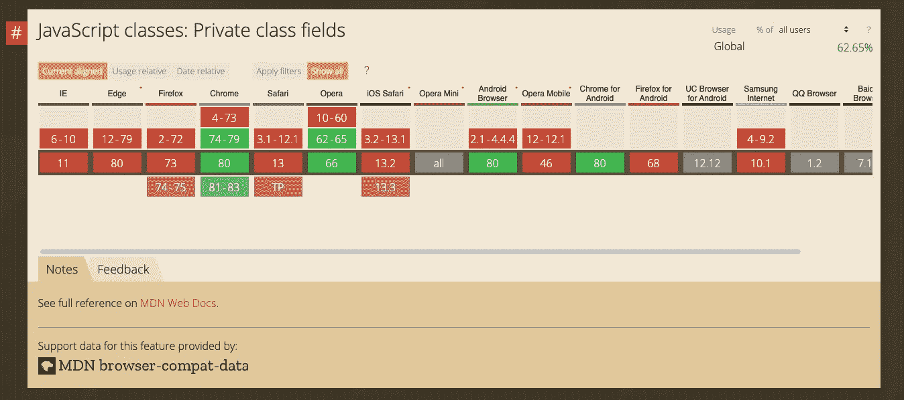

# TypeScript 3.8 中具有私有属性的类

> 原文：<https://betterprogramming.pub/classes-with-private-properties-in-typescript-3-8-9fdb91c26ab1>

## 最后，TypeScript/JavaScript 类中的隐私


塞尔吉奥·索萨在 [Unsplash](https://unsplash.com/s/photos/container-rotterdam?utm_source=unsplash&utm_medium=referral&utm_content=creditCopyText) 上的照片

我感觉这并没有引起很多 JavaScript 开发者的注意，但是有一段时间，我们有可能在我们的 JavaScript 类中使用私有属性(查看下面的*支持*部分)。

在这篇文章中，我想告诉你私有属性在类中是多么有用。由于即将到来的浏览器和工具支持，我们今天就可以开始使用它。

旁注:私有属性和方法是 ECMAScript 规范第三阶段提案的一部分，所以这在未来可能会改变。很可能会加入 ES2019 (ES10)。

# ES2015 之前的类，模块模式

让我们回到 JavaScript 的 ES5 时代。

我们没有任何正式的模块定义。我们聪明地使用了函数(我们也使用了 [RequireJS](https://requirejs.org/) 、 [CommonJS](https://requirejs.org/docs/commonjs.html) 和其他替代方法)。这给了我们创建某种形式的模块的能力。

如果你想使用这个模块，你必须这样使用它。

```
Ford.brand() // “Ford Mustang”
```

但是我们可以利用私有属性和方法。要使它成为公共的，你必须返回你想在模块外使用的所有东西。

许多开发人员已经习惯了这种类型的模块中默认的私有属性和方法。查看 Todd Motto 的帖子，了解关于[模块模式](https://ultimatecourses.com/blog/mastering-the-module-pattern)的更多信息。

# ES2015 课程

ES2015 (ES6)的推出为我们带来了 JavaScript 语言的大规模升级。我对这次升级非常满意，就像我的 JavaScript 开发伙伴一样。

```
class Foo {
  bar = 10
}console.log(new Foo().bar) // 10
```

JavaScript 类的行为大多类似于其他语言中的类。它们非常适合以各种方式重用功能。

比起模块模式，我更喜欢它们，但是我想念我的私有属性…

# 使用具有私有属性的 TypeScript 类

但是我们不用再难过了。私有属性要来 TypeScript 类了！要在 TypeScript 中使用它们，你必须安装 3.8 版本，这是 2 月 20 日发布的版本。

```
npm install typescript
```

> 最后，需要考虑的是您打算让代码在哪里运行。除非针对 ECMAScript 2015 (ES6)或更高版本，否则 TypeScript 当前不支持此功能。
> 
> 这是因为我们的底层实现使用`*WeakMaps*`来加强隐私，并且`WeakMaps`不能以不导致内存泄漏的方式被聚合填充。
> 
> 相比之下，TypeScript 的`private`声明的属性适用于所有目标——甚至 ECMAScript 3！”——[微软开发博客](https://devblogs.microsoft.com/typescript/announcing-typescript-3-8-beta/)

# 如何创建私有类属性

只需在它们前面加上一个`#`。就这么简单！

当您试图从私有属性获取信息时，它会在 TypeScript 中给出一个错误。

```
Property ‘#foo’ is not accessible outside class ‘Foo’ because it has a private identifier.
```

但是我们可以通过公共方法返回它来使它可用。就像 JavaScript 中的所有东西一样。

在 [TypeScript playground](https://www.typescriptlang.org/v2/en/play?ts=3.8.0-beta#code/MYGwhgzhAEBiD29oG8BQ0PQMQDNHQF5oAmABgG51MAjMAJ0OgEZTUqMBzAUwBcF4AFAEoU7TBjq8ArnQB20HgAsAlhAB0uRGIC+qXW2DxZEeCC5qQ8DgNlcA7nETC1tOiID075q0PHT5y2tbB35nbj4nIQ8vMlRfEzMLKxt7R0EhDTx4aOguOjp4OiA) 的类中使用新的私有属性。

# 为什么要设置私有类属性

我使用私有属性的原因是只在本地使用信息。如果你在你的类中做各种各样的计算，但是不需要公开分享，那么就把它变成私有的。

# 浏览器支持

目前支持这些私有属性的浏览器只有 **Chrome** ( > 74)和 **Opera** ( > 66)。



来源:[CanIUse.com](https://caniuse.com/#feat=mdn-javascript_classes_private_class_fields)

如果你想使用 **Node.js** 中的私有属性，你必须至少使用版本 12。 **Babel** 通过[插件](https://babeljs.io/docs/en/babel-plugin-proposal-private-methods)支持私有属性。

如果你想了解更多关于 TypeScript 3.8 中令人敬畏的特性，请查看微软的[开发博客](https://devblogs.microsoft.com/typescript/announcing-typescript-3-8/)。

# 有角的

在 Angular 应用程序中使用私有类属性听起来不错，但是 Angular 团队[并不正式支持 Angular 9.0 中的 TypeScript 3.8](https://github.com/angular/angular/issues/35204) 。他们说我们必须等到 Angular 10。

> 由于[角度 9.1 打字稿 3.8 可用](https://blog.angular.io/version-9-1-of-angular-now-available-typescript-3-8-faster-builds-and-more-eb292f989428)。因此私有属性受到支持👍

但我用 Angular 9 应用程序对 TypeScript 3.8 做了一个小测试，看起来它仍然在运行。所以，我会说试试看。

如果你在 TypeScript 3.8 中使用 Angular 9 有问题，请在评论中告诉我，这样我们就可以更新其他想要尝试的人。

# 结论

正如您所看到的，设置私有类属性非常有用，可以给人一种隐私的感觉。但老实说，我们还处于非常早期的阶段，所以规格可能会有一些变化。

感谢您一路阅读！我希望你和我一样对这个特性充满热情，并从这篇文章中学到了一些新东西。

如果你有任何问题，请在评论中告诉我。

# 从我这里读更多

[](https://medium.com/@devbyrayray/the-number-1-skill-you-need-to-grow-as-a-person-7d1a6f34afb5) [## 作为一名开发人员，你成长所需要的头号技能

### 在任何事情上帮助任何人，这是双赢！

medium.com](https://medium.com/@devbyrayray/the-number-1-skill-you-need-to-grow-as-a-person-7d1a6f34afb5) [](https://medium.com/better-programming/7-lessons-i-learned-while-being-a-developer-for-10-years-c0e3db2c1336) [## 我做了 10 年开发人员后学到的 7 条经验

### 我学到的经验教训有望为你节省时间和压力

medium.com](https://medium.com/better-programming/7-lessons-i-learned-while-being-a-developer-for-10-years-c0e3db2c1336) [](https://medium.com/better-programming/an-introduction-to-typescript-property-decorators-1c9db23b6ca1) [## TypeScript 属性装饰器简介

### 对 TypeScript 装饰器的深入探究

medium.com](https://medium.com/better-programming/an-introduction-to-typescript-property-decorators-1c9db23b6ca1) [](https://medium.com/better-programming/5-reasons-why-you-should-write-technical-blog-posts-as-developer-30cd349ece60) [## 作为开发人员，你应该写技术博客的 5 个理由

### 撰写技术博客文章如何在开发人员职业生涯的早期帮助你

medium.com](https://medium.com/better-programming/5-reasons-why-you-should-write-technical-blog-posts-as-developer-30cd349ece60) [](https://medium.com/better-programming/7-steps-to-dockerize-your-angular-9-app-with-nginx-915f0f5acac) [## 使用 Nginx 对 Angular 9 应用程序进行分类的 7 个步骤

### 在 Docker 环境中设置 Angular 9 应用程序，并立即进行部署

medium.com](https://medium.com/better-programming/7-steps-to-dockerize-your-angular-9-app-with-nginx-915f0f5acac)