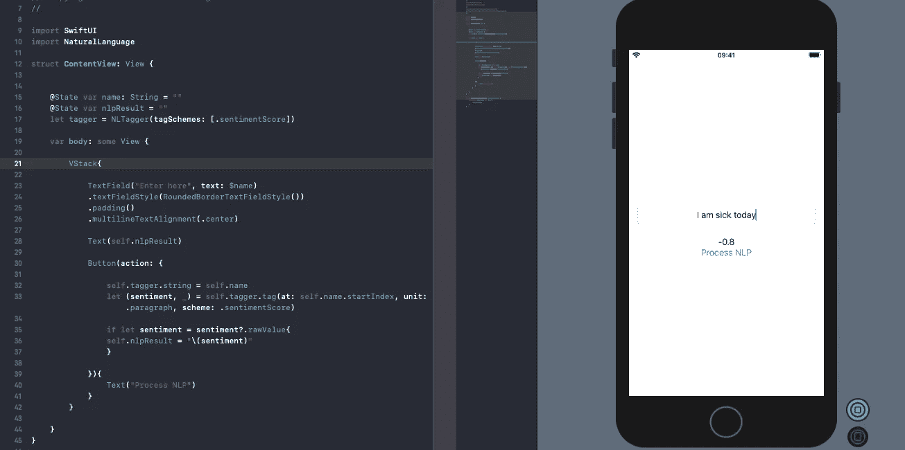
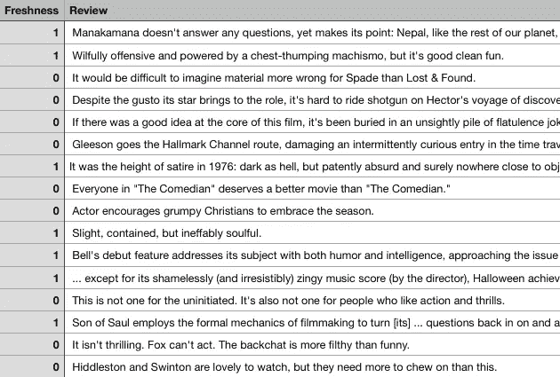
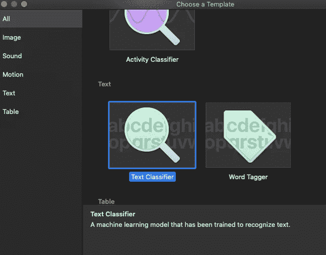
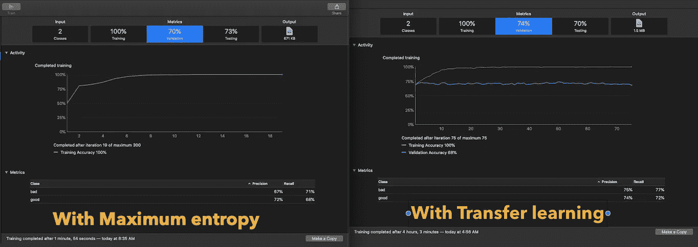
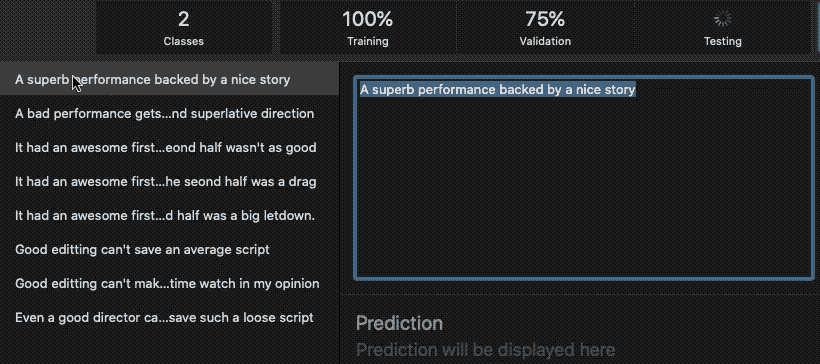
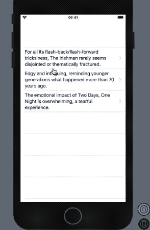

# 用自然语言框架、核心 ML 和 SwiftUI 对电影评论进行分类

> 原文：<https://betterprogramming.pub/classifying-movie-reviews-with-natural-language-framework-12dfe2fc3308>

## 在烂番茄数据集上探索苹果新的内置情感分析和自然语言处理的文本分类


由[菲利克斯·穆纳拉姆](https://unsplash.com/@felixmooneeram?utm_source=medium&utm_medium=referral)在 [Unsplash](https://unsplash.com?utm_source=medium&utm_medium=referral) 拍摄的照片

苹果在 [WWDC 2019](https://developer.apple.com/videos/play/wwdc2019/232/) 期间展示了自然语言处理领域的一些良好进展。他们增强了文本分类和单词标注，这是自然语言处理的两大支柱。

在本文中，我们将只讨论文本分类方面的进步，它将输入文本分类到一组预定义的类标签中。

今年，苹果公司引入了用于文本分类器模型训练的迁移学习技术。迁移学习关注文本整体语境的语义，能够找出同一单词在文本不同部分有不同含义的情况。

虽然最先进的迁移学习更适合语义分析，但它确实比最大熵算法需要更长的训练时间。

苹果今年还引入了内置的情绪分析。使用 NLP 框架，现在你得到一个范围在-1 到 1 之间的分数，表示情感的程度。

下面是一个示例代码，展示了 NLP 的内置情感分析如何预测字符串中的情感得分:

```
import NaturalLanguagetagger.string = textlet (sentiment, _) = tagger.tag(at: text.startIndex, unit: .paragraph, scheme: .sentimentScore)print(sentiment.rawValue)
```

内置的情绪分析非常准确，如下图所示:



带有 NLP 情感分析的 SwiftUI 预览示例

在接下来的章节中，我们将使用[烂番茄数据集](https://datapane.com/datasets/mA2pj74/)通过 Create ML 创建一个文本分类器核心 ML 模型，并将其部署在我们的自然语言框架中。

## 行动（或活动、袭击）计划

*   将 CSV 数据集转换为训练测试文件夹。
*   使用 Create ML 训练数据集。
*   用 SwiftUI 在自然语言框架中部署核心 ML 模型。

# 转换我们的数据集

我们的数据集是一个 CSV 文件，如下所示:



以下 python 脚本用于将 CSV 拆分为训练和测试数据文件夹:

```
import os
import pandas as pddf = pd.read_csv("rotten_tomatoes_reviews.csv", nrows=50000)
df.columns = ["freshness", "review"]
# Split data into training and testing sets by label
train = df.sample(frac=0.8, random_state=42)
train_good = train[train.freshness == 1]
train_bad = train.drop(train_good.index)
test = df.drop(train.index)
test_good = test[test.freshness == 1]test_bad = test.drop(test_good.index)
# Create folders for data
os.mkdir("train"); os.mkdir("test")
os.mkdir("train/good"); os.mkdir("train/bad")
os.mkdir("test/good"); os.mkdir("test/bad")
#Write out data
def write_text(path, df):
    for i, r in df.iterrows():
        with open(path + str(i) + ".txt", "w") as f:
            f.write(r["review"])
write_text("train/good/", train_good)
write_text("train/bad/", train_bad)
write_text("test/good/", test_good)
write_text("test/bad/", test_bad)
```

为了简单和节省时间，我们将解析 4，80，000 条烂番茄评论中的前 50000 行，并将数据集拆分为标准的 80–20 比例的`train`和`test`文件夹。

一旦 CSV 被拆分到各自的文件夹中，我们就可以启动 Create ML 应用程序了，今年它已经有了一个独立的实体。

# 创建 ML 文本分类器模型



在 Create ML 中创建新的文本分类器模型项目，并添加 training 文件夹。您可以选择任何技术来训练您的模型，并在训练和验证过程中喝杯咖啡。我花了 4 个小时训练了一个迁移学习模型。

下图比较了文本分类中两种技术的模型指标:



迁移学习需要 4 个小时，而最大熵只需要 2 分钟

基于迁移学习的模型外推得更好。尽管您可以通过增加数据集的大小来获得更好的准确性(对我来说，TL 模型训练在 15000 个文本的数据集上花费了 4 个小时)。

或者，您可以使用 Create ML 以编程方式创建您的模型。只需在参数`ModelParameters`中传递想要的算法。

```
[init(trainingData: MLTextClassifier.DataSource, parameters: MLTextClassifier.ModelParameters)](https://developer.apple.com/documentation/createml/mltextclassifier/3006741-init)
```

## 评估我们的模型

一旦模型经过训练和测试，跳到 Create ML 中的 Output 选项卡，输入文本来运行预测。下图显示了我运行的一些预测。



现在，我们的模型已经准备好部署用于自然语言处理。

# 部署核心 ML 模型

创建一个新的基于 Xcode SwiftUI 的项目，并拖放我们之前创建的核心 ML 模型。

我们将开发一个应用程序，显示文本列表(通常是腐烂的番茄评论)，我们将使用 NLP 运行我们的核心 ML 模型，以确定它是否是腐烂的(好的或坏的评论)。

此外，我们将运行 NLP 的内置情感分析，以了解它如何预测烂番茄评论，并查看情感程度和 CoreML 预测的准确性。

以下代码显示了如何将核心 ML 模型加入自然语言框架:

```
import NaturalLanguage

let predictor = try NLModel(mlModel: ReviewClassifier().model)
predictor.predictedLabel(for: "Fight Club was a master piece. One of it's kind cinema.")
```

## 创建带导航的 SwiftUI 列表

让我们首先创建一个 SwiftUI 列表，使用符合可识别协议的 Reviews 结构填充该列表。

在上面的代码中，我们向列表项添加了导航链接，将它们带到我们接下来将看到的 ReviewDetail 视图:

上面的代码很简单。我们添加了两个 SwiftUI 按钮，分别评估文本的情感分析和评论的好坏。

作为回报，我们在 SwiftUI 预览中得到以下结果:



NLP 的内置情感分析在一个它基本上不熟悉的数据集上做得相当好。与此同时，我们的核心 ML 模型在确定评论者是喜欢这部电影还是批评这部电影时，与自然语言框架表现得相当不错。

# 结论

这就概括了核心的 ML 和自然语言框架。我们看到了内置的情感分析在语言处理中是多么强大的工具。

完整的源代码以及用于解析 CSV 的 python 脚本可以在这个 [Github 仓库](https://github.com/anupamchugh/iowncode/tree/master/iOSNLPRottenTomatoes)中找到。此外，它还包含使用最大熵和迁移学习构建的模型。你可以试着和他们玩玩，看看哪个更符合要求。

这一次到此为止。我希望你喜欢阅读和模型训练！