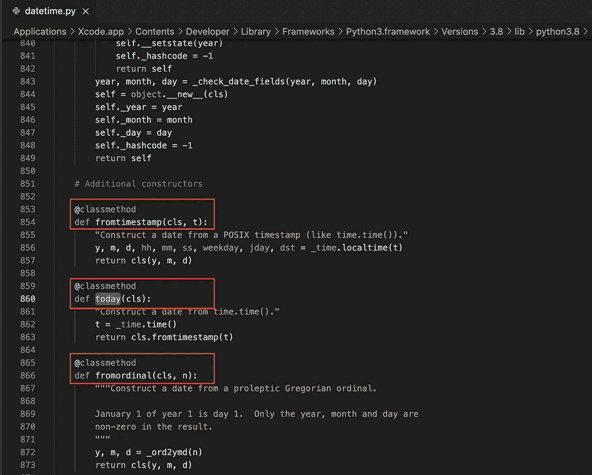

# Python 中的@classmethod 和@staticmethod 是什么？

> 原文：<https://betterprogramming.pub/classmethod-and-staticmethod-in-python-3a9db45b95e1>

## 通过学习一个类的三种方法类型，成为一名方法大师


Chris Ried 在 [Unsplash](https://unsplash.com?utm_source=medium&utm_medium=referral) 上拍摄的照片。

在 Python 中，一个类可以有方法、类方法和静态方法。但是这三者有什么区别呢？它们是如何工作的？

今天，您将通过有用的示例了解特定于类的方法之间的关键方面和差异。

# Python 中的方法

在 Python 中，方法是属于对象的函数。一个方法在一个类中实现，它将`self`实例作为一个参数。

例如，`Weight`类可以有一个`pounds()`方法:

您可以在一个`Weight`对象上调用这个方法:

```
m = Weight()
print(m.pounds())
```

输出:

```
22.05
```

# Python 中的类方法

当您需要一个不特定于实例但以某种方式涉及到类的方法时，类方法是有用的。

例如，您可以通过使用类方法为类创建一个替代的初始化器方法。

要在 Python 中创建一个类方法，用`@classmethod`来修饰它。

如果你想了解更多关于装修工的信息，看看这篇文章。然而，要学习本文中的概念，您不需要理解装饰者是如何工作的。

## 使用类方法更改类变量

让我们从一个简单的演示例子开始。让我们创建一个`Weight`类:

```
**class** Weight:
    kilos = 0
```

现在，您可以使用以下工具创建权重:

```
w1 = Weight()
w2 = Weight()print(w1.kilos)
print(w2.kilos)
```

输出:

```
0
0
```

如果要修改所有权重实例的`kilos`，可以使用一个类方法:

```
**class** Weight:
    kilos = 0

    **@classmethod**
    **def** change_weight(cls, new_weight):
        cls.kilos = new_weight
```

现在您可以调用`change_weight()`方法:

```
w1 = Weight()
w2 = Weight()Weight.change_weight(100)print(w1.kilos)
print(w2.kilos)
```

您可以看到权重实例正在更新:

```
100
100
```

让我们看看这个类方法是如何工作的:

*   `**@**classmethod`将`change_weight()`标记为一个类方法。
*   第一个参数`cls`是一个类方法的强制参数。在方法上类似于`self`。不同之处在于`cls`代表了整个`Weight`类——而不仅仅是它的一个实例。
*   最后一行`cls.kilos = new_weight`，本质上和说`Weight.kilos = new_weight`是一样的。

现在你知道类方法是如何工作的了。但是什么时候实际有用呢？在前面的例子中，您可以直接调用:

```
Weight.kilos = 100
```

而不是搞乱类方法。

那么为什么要这么麻烦呢？

使用类方法的一个经典例子是使用一个方法作为可选的构造函数。

## 使用类方法作为替代构造函数

假设您有一个用千克实例化重量对象的`Weight`类:

```
**class** Weight:
    **def** __init__(**self**, kilos):
        **self**.kilos = kilos
```

像这样创建`Weight`对象:

```
w1 = Weight(100)
```

如果您现在想从磅创建一个重量，您必须这样做:

```
pounds = 500
kilos = pounds / 2.205w2 = Weight(kilos)
print(w2.kilos)
```

输出:

```
226.75736961451247
```

但是你总是需要记住把磅换算成千克。这不切实际。

如果你可以这样做呢？

```
w2 = Weight.from_pounds(500)
```

那看起来更专业，不是吗？

为此，让我们使用一个类方法作为替代的构造函数:

现在，您可以从磅值创建一个`Weight`对象，而不必担心转换问题:

```
w2 = Weight.from_pounds(500)
print(w2.kilos)
```

输出:

```
226.75736961451247
```

这就完成了类方法的例子。

在进入静态方法之前，我们先来看看 Python 中内置`[datetime](https://docs.python.org/3/library/datetime.html#module-datetime)`的实现。有多种方法可以创建一个`date`对象:



这些是充当可选构造函数的类方法，就像我们例子中的`from_pounds()`。

# Python 中的静态方法

类似于类方法，静态方法被绑定到类而不是实例。

区别在于静态方法不修改类。静态方法不接受`self`或`cls`作为参数。

静态方法通常是与类相关的实用方法。

让我们继续上面的`Weight`类，向它添加静态方法`conversion_info()`。这个方法解释了公斤是如何转换成磅的:

现在您可以调用这个方法:

```
Weight.conversion_info()
```

输出:

```
Kilos are converted to pounds by multiplying by 2.205.
```

请注意，您可以在类外创建一个常规函数来做同样的事情。但是因为转换信息与`Weight`相关，所以将它作为一个实用程序放在类中很方便。

# 结论

方法是在类中实现的特定于实例的函数。您可以在该类的对象上调用方法。一个方法将`self`作为第一个参数。这是指实例本身。

类方法不是特定于对象的方法。你可以通过用`@classmethod`修饰一个方法来创建一个类方法。您可以在类上调用类方法，而不是在它的实例上。类方法将`cls`作为引用整个类的第一个参数。

静态方法类似于类方法，但是它不改变类的状态。它既不接受`self`也不接受`cls`作为参数。您可以通过用`@staticmethod`装饰一个方法来创建一个静态方法。

感谢阅读。编码快乐！

# 你可能会发现这些文章很有见地

[](/understand-python-decorators-in-3-minutes-ec48fdc8e2cf) [## 3 分钟了解 Python Decorators

### 用 decorators 扩展方法和类的功能

better 编程. pub](/understand-python-decorators-in-3-minutes-ec48fdc8e2cf) [](/50-python-interview-questions-and-answers-5230fe2a0db6) [## 50 Python 面试问答

### Ace 您的下一次编码面试

better 编程. pub](/50-python-interview-questions-and-answers-5230fe2a0db6) [](/10-useful-python-snippets-to-code-like-a-pro-e3d9a34e6145) [## 10 个有用的 Python 片段，让你像专业人士一样编写代码

### 我每天使用的有用的提示和技巧

better 编程. pub](/10-useful-python-snippets-to-code-like-a-pro-e3d9a34e6145) 

# 参考

 [## 文件

### 欢迎光临！这是 Python 3.9.6 的文档。

docs.python.org](https://docs.python.org/3/)