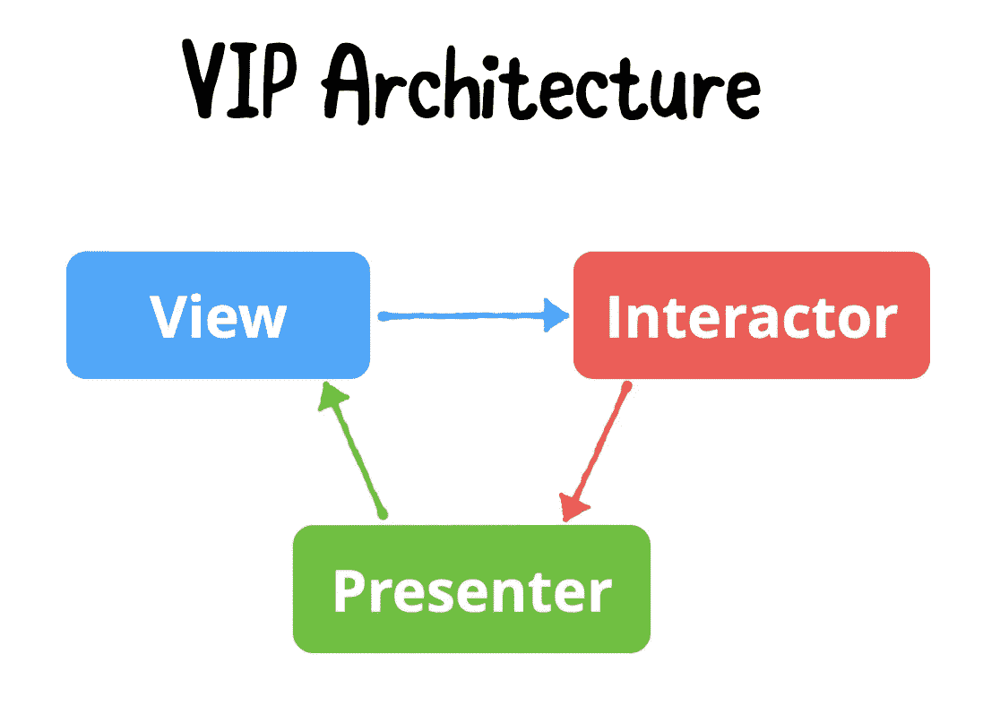
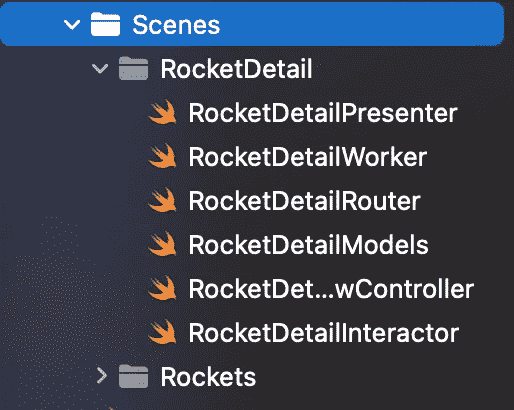
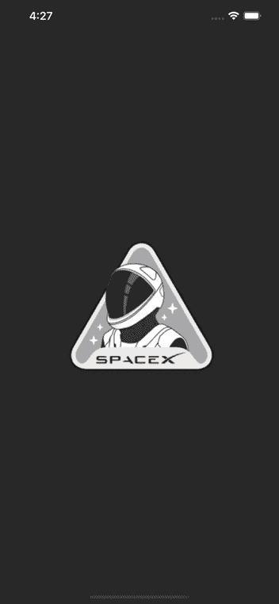

# 在 iOS 中使用 Clean Architecture 为 SpaceX 构建应用

> 原文：<https://betterprogramming.pub/clean-architecture-in-ios-a5963e61fd8>

## 创建一个发射台

[伊万·迪亚兹](https://unsplash.com/@ivvndiaz?utm_source=medium&utm_medium=referral)在 [Unsplash](https://unsplash.com?utm_source=medium&utm_medium=referral) 上的照片

在本演练中，我们将学习如何使用 VIP clean architecture 模式为 Apple 平台开发应用程序。

我们将开发一个干净的 SpaceX 应用程序，在那里我们将展示关于 SpaceX 已经制造和实验的火箭的信息。

# 什么是 VIP？

与 MVVM、MVC 或 VIPER 相比，VIP 架构模式是 iOS 开发中最不为人知的模式之一。它们基本上是 Bob 叔叔的干净架构模式的不同实现。

VIP 仅仅代表视图-交互者-演示者。

用于编写干净 Swift 代码的 VIP 架构是由 Raymond Law 引入的。他创建了一个 [clean-swift](https://clean-swift.com/) 网站，在那里你可以读到如何在 UIKit 中使用 VIP 模式。

VIP 实际上是为了解决 MVC 或大规模视图控制器而创建的，这是 UIKit 应用程序中的一个常见问题，其中视图控制器成为保存代码的主要对象，并且它们变得非常庞大，因为大多数(如果不是全部)逻辑都保存在其中。当你的目标是通过添加越来越多的功能来扩展你的应用程序时，这也会给你带来很多问题。此外，VIP 是单向的，这省去了将我们的代码组件相互混淆的麻烦。

## 视角

视图通常是应用程序的用户界面。它的作用是在每次用户与 UI 交互时向交互器发送请求。

## 互动者

交互器负责应用程序的业务逻辑，比如从网络获取或发送数据，或者将数据保存在数据库中。当视图请求某些东西时，交互器进行处理，并将结果作为响应发送给呈现者。

## 提出者

演示者处理演示逻辑。它将接收到的数据格式化为适合显示的视图模型，然后将其传递给视图。

# CleanSpaceX 入门

CleanSpaceX 是我创建的一个示例项目，用于演示 clean architecture 的实现。它主要由两个场景组成，即火箭和`RocketDetails`。

它们的名字很好地说明了它们的用途，火箭场景从它们的[开源端点](https://github.com/r-spacex/SpaceX-API)获取 SpaceX 火箭的列表以及细节，而`RocketDetails`场景显示特定选定火箭的细节。

在这里，您可以看到创建的场景的结构，每个组件都互不相同。现在让我们一个接一个地看看它们。在此之前，快速预览一下我们将要构建的内容。

# 模型

在该组件中，将保存与所需控制器相关的所有模型。它将是 struct 类型，主要包含请求、响应和`ViewModel`结构。

在上面的模型中，您可以清楚地看到请求、响应和视图模型的结构，这使得事情变得非常明显。

`Request`将包括需要发送给任何网络调用(在我们的例子中是发送给 SpaceX)的参数。`Response`将包括响应我们的网络调用所期望的参数，而`ViewModel`是根据用例映射上述参数的部分。

# 路由器

路由器的工作是执行所有与视图控制器之间转换和传递数据相关的任务。

上面我们讨论了两种情况，我们不仅导航到另一个视图控制器，而且我们还将一些数据传递到我们的目的地视图控制器。注意，这里定义了两个协议，分别命名为`RocketData` `Passing`和`RocketsRoutingLogic`。

1.  `RocketDataPassing`是一种协议，包含需要传递到目的地控制器的数据。
2.  `RocketsRoutingLogic`是保存用于路由的所有方法的协议。

# 工人

Worker 组件处理所有网络请求和响应。响应结构(我们在模型中使用的)将为交互器准备好数据。它将处理成功/错误响应，因此交互器将知道如何继续。

# 互动者

交互者是其中最重要的组成部分，在工作者和展示者之间起着调节者的作用。最初，它与`ViewController`通信，后者传递工人所需的所有请求参数。在进行到 Worker 之前，会进行一次验证，以检查是否所有内容都被正确发送。工作者返回一个响应，交互者将这个响应传递给呈现者。

这里要注意的是，使用了几个名为`RocketsDataStore`和`RocketsBusinessLogic`的协议，它们用于以下目的:

1.  `RocketsDataStore` —用于在视图控制器之间传递数据
2.  `RocketsBusinessLogic` —用于声明该协议中的所有 Interactor 方法，以便它们可以在 ViewController 中使用。

# 提出者

从交互器获得响应后，就该将它格式化为 ViewModel，并将结果传递回`ViewController`。演示者将负责演示逻辑。该组件决定如何将数据呈现给用户。

在`Presenter`中，只声明了一个存储表示逻辑方法的协议。在`presentFetchRockets()`函数中，一个委托方法被调用，这个方法是在我们关联的视图控制器中声明的。这就是它与视图控制器连接的方式。

# 视图控制器

现在是时候看到它全部工作了，所有的组件都已经彼此对齐，但是我们仍然需要执行最后一个主要步骤，以便整个流程工作。

在这里，您可以看到一个简单的表视图已经被声明，它的委托被用来以可表示的形式显示获取的 API 数据。

最后一步是触发交互器，它将最终启动我们的循环，发送一个请求，我们将从提交者那里得到一个响应。在此期间，如果用户想导航到某个地方，那么我们将使`Router`生效。

# 结论

你可以从[这个链接](https://github.com/mh-ahmediqbal/CleanSpaceX)得到整个项目。请随意使用它，并让我知道任何建议。请注意，我们也可以在 Xcode 中安装一个干净的 swift 模板，这将允许我们使用编辑器创建一个完整的场景。

要了解如何配置 Xcode，请[参考本演练的](https://medium.com/@mh.ahmediqbal/installing-clean-architecture-template-in-xcode-50b222a93a94)。