# 采用 ent 和 gqlgen 的干净架构

> 原文：<https://betterprogramming.pub/clean-architecture-with-ent-and-gqlgen-a789933a3665>

## 在 GraphQL 应用中编写可维护的代码


[露丝 D](https://unsplash.com/@ruthanium) 在 [Unsplash](https://unsplash.com/?utm_source=medium&utm_medium=referral) 上拍照。

这篇文章将带您了解如何使用 ent 和 gqlgen 包实现一个具有干净架构的 GraphQL 应用程序。

Clean Architecture 允许我们通过使用明确的规则将代码设计成几层来创建可维护和可测试的项目。这篇文章不是介绍干净架构的基本概念，而是强调如何在 GraphQL 应用程序中实际实现它。如果你想在继续之前了解这个概念，看一看[这篇文章](https://manakuro.medium.com/clean-architecture-with-go-bce409427d31)。

[ent](https://github.com/ent/ent) 是一个用于 Go 的 ORM 框架，而 [gqlgen](https://github.com/99designs/gqlgen) 是一个用于构建 GraphQL 服务器的库。它们都基于模式优先的方法，并使用生成器提供静态类型的 API。我在之前的文章中介绍了这些的整合，所以你可以看看。

# 示例存储库

以下是 GitHub 的最终代码:

[](https://github.com/manakuro/golang-clean-architecture-ent-gqlgen) [## GitHub-manakuro/golang-Clean-Architecture-ent-gqlgen:带有 ent 和 gqlgen 的清洁建筑

github.com](https://github.com/manakuro/golang-clean-architecture-ent-gqlgen) 

# 文件夹结构

最终的文件夹结构如下:

```
├── bin
├── cmd
│  ├── app
│  └── migration
├── config
├── docker
├── ent
├── graph
├── pkg
│  ├── adapter
│  │  ├── controller
│  │  ├── handler
│  │  ├── repository
│  │  └── resolver
│  │
│  ├── const
│  ├── entity
│  │  └── model
│  │
│  ├── infrastructure
│  │  ├── datastore
│  │  ├── graphql
│  │  └── router
│  │
│  ├── registry
│  │
│  ├── usecase
│  │  ├── repository
│  │  └── usecase
```

在下一节中，我们将逐步设置这些。

# 实施概述

*   设置开发环境
*   设置回显
*   设置 ent
*   设置 gqlgen
*   询问
*   变化
*   干净的建筑
*   处理 ULIDs
*   节点接口
*   页码
*   输入过滤器
*   处理错误
*   处理交易
*   测试
*   E2E

# 设置开发环境

在本节中，我们将设置这些环境:

*   带有 docker 的 MySQL
*   数据库的初始化
*   配置文件

## 带有 docker 的 MySQL

本帖将使用 MySQL8.0 搭配 docker。

添加`docker/docker-compose.yml`:

运行起来就可以连接 MySQL 了。

```
$ cd docker
$ docker compose up
```

## 数据库的初始化

要在 MySQL 中初始化数据库，在`docker/mysql/sql/reset_database.sql`中创建 SQL 文件，如下所示:

然后，为了执行这个 SQL，创建`bin/init_db.sh`:

这将把 docker 容器中的`./mysql_data/sql`移动到`/var/lib/mysql/`，并通过 docker 命令执行 SQL。

因此，运行命令:

```
$ ./bin/init_db.sh
```

您将看到在 MySQL 中创建的数据库。

为了简化命令，让我们创建`Makefile`并添加脚本来初始化数据库。

在根项目中创建`Makefile`:

现在，您可以通过运行以下命令轻松完成初始化:

```
$ make setup_db
```

## 配置文件

为了方便地访问共享配置文件，我们将引入 [viper](https://github.com/spf13/viper) 包。

首先安装它:

```
$ go get github.com/spf13/viper
```

并创造出这样的`config/config.go`:

这将读取名为`./config.yml`的 YAML 文件，并允许您在整个应用程序中使用它。

让我们这样补充一下`config/config.yml`:

该文件旨在用作开发模式中的数据库连接和服务器端口。

要在应用程序中使用它，导入配置包并像这样调用`ReadConfig`:

```
config.ReadConfig(config.ReadConfigOption{})fmt.Println(config.C.Server.Address) // 8080
```

# 设置回显

为了快速开始，我们将使用 [echo](https://github.com/labstack/echo) 包设置一个服务器。

安装软件包:

```
$ go get github.com/labstack/echo/v4
$ go get github.com/labstack/echo/v4/middleware
```

添加`cmd/app/main.go`中的代码:

那么这将在 [http://localhost:8080:](http://localhost:8080/) 成功响应

## 热重装

[air](https://github.com/cosmtrek/air) 是 Go 项目的现场重装包。让我们把它引入到我们的应用程序中，以便更快地开发。

安装它:

```
$ go install github.com/cosmtrek/air@v1.27.3
```

在根项目中创建`.air.toml`,并编写如下代码:

这种配置允许我们观察新的变化并自动重建。

运行命令:

```
$ air
```

然后，您可以看到这样的日志:

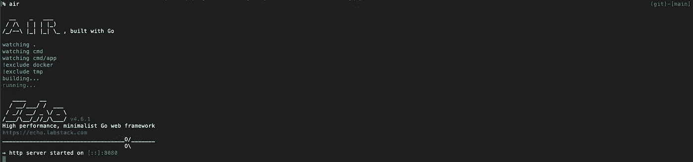

空气

为了简化命令，让我们添加脚本来启动服务器。

打开`Makefile`并添加脚本:

现在我们可以通过运行以下命令来启动服务器:

```
$ make start
```

# 设置 ent

接下来，我们将把 [ent](https://github.com/ent/ent) 包引入到我们的应用程序中，并配置数据库。

在我们的应用程序中，假设将创建这些表:

*   用户—用户可以有多个待办事项
*   todos—todos 可以有一个用户

这两者的关系是一对多的关系。

## 安装 ent

让我们安装它:

```
$ go get -d entgo.io/ent/cmd/ent
```

## 创建用户模式

首先，我们将创建一个用户模式。

运行这个:

```
$ ent init User
```

然后，`ent`目录应该是这样的:

```
ent
├── generate.go
└── schema
    └── user.go
```

打开`ent/schema/user.go`并添加如下字段:

并运行发电机:

```
$ go generate ./ent
```

## 数据库迁移

现在我们已经准备好将模式迁移到数据库。

为了运行迁移，创建`cmd/migration/main.go`并编写:

将迁移脚本添加到`Makefile`:

然后，运行以下命令:

```
$ make migrate_schema
```

迁移后，您可以看到数据库中创建的用户表:

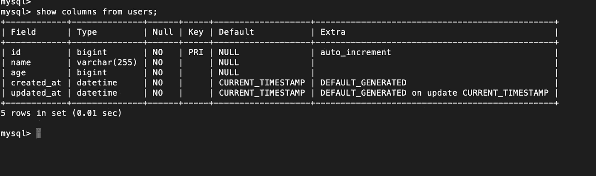

用户表

## 创建 todo 架构

接下来，我们将向我们的应用程序添加一个 todo 模式，并将其连接到`users`边缘。

首先，我们将通过运行以下命令创建一个 todo 模式:

```
$ ent init Todo
```

您可以看到创建的 todo 模式文件:

```
ent/schema
├── todo.go
└── user.go
```

打开`ent/schema/todo.go`，添加一些字段:

要连接用户模式，将 edge 类型添加到`Edges`:

要配置边缘，打开`ent/schema/user.go`，像这样添加边缘:

既然 todo 表已经将 user_id 作为外键。

所以，运行发电机:

```
$ go generate ./ent
```

并迁移它:

```
$ make migrate_schema
```

然后，todos 表创建如下:

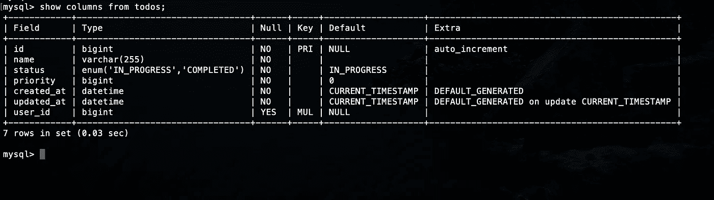

todos 表

*注意:ent 默认使外键*[](https://github.com/ent/ent/blob/master/entc/gen/graph.go#L459)**为空。* [*PR*](https://github.com/ent/ent/pull/1703) *合并后，可以根据需要边设置* `*NOT NULL*` *为外键。**

## *模式描述*

*ent 提供了`[ent describe](https://entgo.io/docs/code-gen/#schema-description)`来获取您图形模式的描述。*

*运行这个:*

```
*$ ent describe ./ent/schema*
```

*输出是这样的:*

*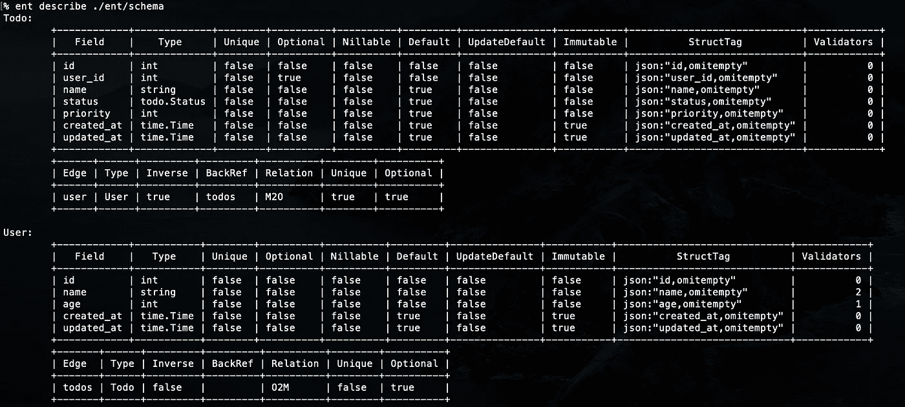*

*输入 shema 描述*

# *设置 gqlgen*

*为了将 GraphQL 集成到 ent 包中， [gqlgen](https://github.com/99designs/gqlgen) 包是可用的，`entgql`包作为插件提供。*

*首先，安装 gqlgen:*

```
*$ go get github.com/99designs/gqlgen*
```

*要设置 gqlgen，请运行以下初始化:*

```
*$ gqlgen init*
```

*这将在根项目下生成以下布局:*

```
*├── gqlgen.yml
├── graph
│   ├── generated
│   │   └── generated.go
│   ├── model
│   │   └── models_gen.go
│   ├── resolver.go
│   ├── schema.graphqls
│   └── schema.resolvers.go*
```

*要启动 GraphQL 服务器，打开`cmd/app/main.go`并编写代码:*

*然后在[可以看到操场页面 http://localhost:8080/playground:](http://localhost:8080/playground:)*

*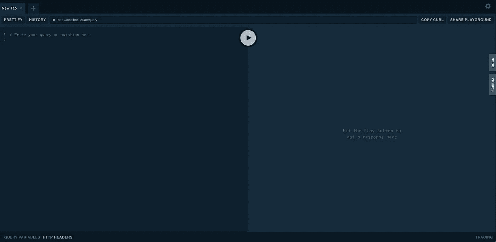*

*GraphQL 游乐场*

## *将 ent 连接到 gqlgen*

*首先安装插件包:*

```
*$ go get entgo.io/contrib/entgql*
```

*为了在 ent 项目中使用`gqlgen`，需要对我们的项目启用 ent 扩展。*

*为此，创建一个名为`ent/entc.go`的新文件，并添加以下代码:*

*然后，打开`ent/generate.go`并将代码改为:*

*运行发电机:*

```
*$ go generate ./ent*
```

*接下来，为了在`gelgen`解析器中使用`ent.Client`,打开`graph/resolver.go`,并将其作为附加的依赖项传递给模式:*

*并将`ent.Cleint`传给`cmd/app/main.go`中的`graph.NewSchema`:*

# *询问*

*我们现在已经完成了 GraphQL 的配置。在下一步中，让我们创建一个查询，并尝试用 ent 客户机检索数据。*

## *用户查询*

*首先，打开`graph/schema.graphqls`并更改为:*

*并创建`graph/user.graphqls`:*

*为了将用户类型绑定到 ent 模型，需要在`gqlgen.yml`中修改`autobind`选项，如下所示:*

*并注释掉模型选项:*

*并运行发电机:*

```
*$ gqlgen*
```

*打开`graph/user.resolvers.go`并写下:*

*在操场上，运行用户查询，您可以看到响应的数据:*

*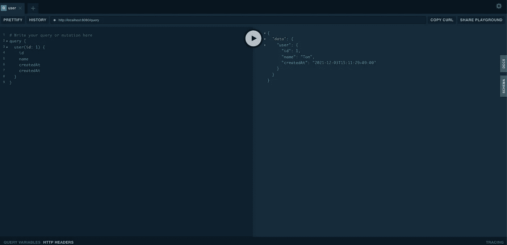*

*操场*

## *待办事项查询*

*让我们在下一步中向我们的应用程序添加一个 todo 查询。*

*创建`graph/todo.graphqls`:*

*`TestTodoStatus`需要绑定到 ent 模型，因此，打开`gqlgen.yml`并将`TodoStatus`添加到`models`选项:*

*然后，运行发电机:*

```
*$ gqlgen*
```

*打开`graph/todo.resolvers.go`并写下:*

*查询结果应该如下所示:*

*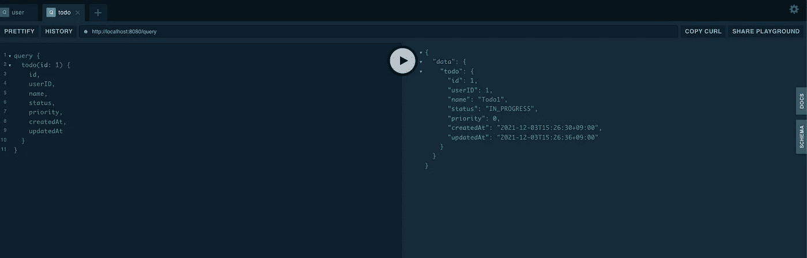*

*待办事项查询*

*现在我们已经实现了 todos 查询，所以我们可以将它包含在用户查询中。*

*打开`graph/user.graphqls`并将`todos`添加到用户查询中:*

*然后，运行发电机:*

```
*$ gqlgen*
```

*查询用户，结果应该如下所示:*

*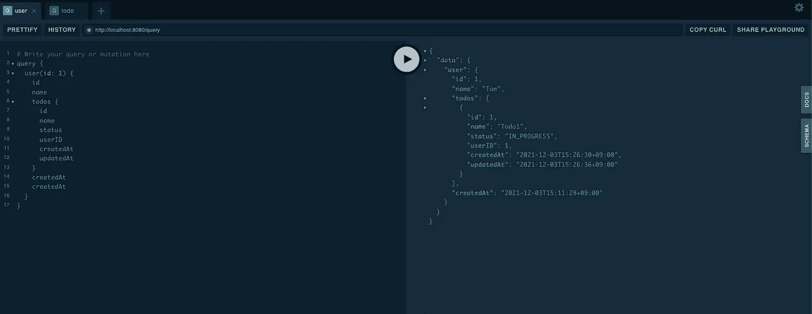*

*用户查询*

# *变化*

*下一步，我们将使用 ent 客户机实现变异。*

*首先，在`graph/schema.graphqls`中添加突变类型:*

*打开`graph/user.graphqls`并添加突变类型，如下所示:*

*为了将`CreateUserInput`和`UpdateUserInput`绑定到 gqlgen，需要在 ent 包中创建模型。*

*为了自动绑定模型，我们将使用 ent 包提供的[模板](https://entgo.io/docs/templates/)特性。*

*创建`ent/templates/mutation_input.tmpl`并粘贴:*

*打开`ent/entc.go`并像这样添加选项:*

*然后，运行发电机:*

```
*$ go generate ./ent*
```

*之后，`ent/mutation_input.go`已经用`CreateTodoInput`和`UpdateTodoInput`类型生成，如下所示:*

*我们已经准备好将这些绑定到 gqlgen，所以运行这个:*

```
*$ gqlgen*
```

*并将解析器添加到`graph/user.resolvers.go`:*

*在操场上执行`createUser`，结果应该是这样的:*

*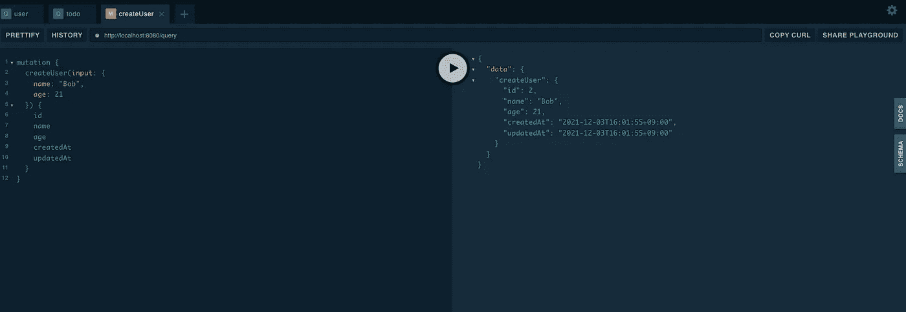*

*操场*

# *干净的建筑*

*为了将 Clean Architecture 集成到我们的应用程序中，将引入四个层，并与文件夹匹配如下。*

*   *实体层-实体*
*   *用例层-用例*
*   *接口适配器层—适配器*
*   *框架和驱动因素层—基础设施*

```
*pkg
├── adapter
│ ├── controller   # Controller
│ ├── repository   # Specific implementaion of repository
│ └── resolver     # GraphQL resolvers
│ 
│ 
├── entity
│ └── model        # Entity of model, (e.g. ent.User, ent.Todo)
│ 
│ 
├── infrastructure
│ ├── datastore    # MySQL configuration
│ ├── graphql      # GrahpQL configuration
│ └── router       # Echo router
│ 
│ 
├── usecase
│ ├── repository   # Interface for adapter
│ └── usecase      # Usecase for application logic*
```

## *实体层*

*实体层应该包括整个应用程序的领域模型。在我们的应用程序中，ent 包对此负责，但是我们不希望在每一层都导入 ent 包，并让它们依赖于特定的技术，这会导致违反依赖规则。不断变化的技术对代码库的影响需要最小化。*

*为此，只需在`entity/model`中导入 ent 包。然后，其他层可以从`entity/model`导入它们作为领域模型。*

*所以让我们创造`pkg/entity/model/user.go`:*

*要使用现有的方法和结构类型，需要将模型定义为别名声明，而不是嵌入式结构或类型定义。*

**注意:可以使用允许您在 Go 中扩展方法的嵌入式结构，但在某些情况下，gqlgen 生成器可能不符合其类型。**

*对于 todo，创建`pkg/entity/model/todo.go`:*

## *用例层*

*用例层有两个目录:*

*   *仓库*
*   *用例*

## *仓库*

*知识库目录为实体模型提供 CRUD API 接口。这是为了在用例文件夹中使用。*

*创建`pkg/usecase/repository/user.go`:*

## *用例*

*在 usecase 文件夹中，创建`pkg/usecase/usecase/user.go`并调用接口:*

## *接口适配器层*

*接口适配器层有三个目录:*

*   *控制器*
*   *仓库*
*   *分解器*

## *控制器*

*控制器目录旨在从 GraphQL 解析器中使用，并调用 usecase 包。*

*首先，创建`pkg/adapter/controller/controller.go`:*

*并创建`pkg/adapter/controller/user.go`:*

## *仓库*

*在 repository 文件夹中，用例存储库的具体实现将被包含进来，并符合它的类型。为了持久化数据库，将使用 ent 包。*

*创建`pkg/adapter/repository/user.go`:*

## *分解器*

*解析器目录包括一组由 gqlgen 命令生成的解析器。为了将文件从`graph`移动到`pkg/adapter/resolver`，打开`gqlgen.yml`并修改解析器部分，如下所示:*

*并运行发电机:*

```
*$ gqlgen*
```

*该目录应该如下所示:*

```
*pkg/adapter/resolver
├── resolver.go
├── schema.resolvers.go
├── todo.resolvers.go
└── user.resolvers.go*
```

## *登记处*

*要使用`pkg/adapter/repository`中的 ent 客户端，需要初始化各层的函数并向下传递。*

*首先，创造`pkg/registry/registry.go`:*

*这是一个生成所有控制器的根注册表函数。*

*接下来，创建`pkg/registy/user.go`:*

*这将 ent 客户端传递给`pkg/adapter/repository`，并符合`pkg/usecase/repositry`中存储库的接口。*

## *在解析器中使用控制器*

*为了使用来自解析器函数的控制器，将其传递给解析器初始化。*

*打开`pkg/adapter/resolver/resolver.go`并像这样添加控制器:*

*然后，打开`pkg/adapter/resolver/user.resolvers.go`并调用解析器功能中的控制器:*

## *框架和驱动程序层*

*框架和驱动程序层有三个目录:*

*   *数据存储*
*   *graphql*
*   *路由器*

## *数据存储*

*数据存储目录包含与初始化数据库和客户端相关的代码。*

*创建`pkg/infrastructure/datastore/datastore.go`:*

## *graphql*

*graphql 目录负责生成一个 graphql 服务器。*

*创建`pkg/infrastructure/graphql/graphql.go`:*

## *路由器*

*路由器目录实现了 HTTP 路由器。*

*创建`pkg/infrastructure/router/router.go`:*

## *主要功能*

*我们已经完成了每一层的组织，所以最后，打开`pkg/cmd/app/main.go`并编写如下初始化:*

## *组织创建和更新功能*

*类似于上面的步骤，创建和更新功能需要根据干净的架构来组织。*

*您可以看到下面的更改:*

*[](https://github.com/manakuro/golang-clean-architecture-ent-gqlgen/pull/1) [## 通过 manakuro 拉动式请求#1 组织创建和更新功能…

### 将此建议添加到可以作为单次提交应用的批处理中。此建议无效，因为没有更改…

github.com](https://github.com/manakuro/golang-clean-architecture-ent-gqlgen/pull/1) 

# 处理 ULIDs

在 ent 包中，`int` type 默认用作数据库中的 id 字段，并自动递增。对于某些应用程序，需要避免递增的数字，最好使用 UUIDs 或 ULIDs。因为我们在应用程序中使用 MySQL，所以由于性能问题，可以排序的 id 最好用作主键。

由于 [PR](https://github.com/ent/contrib/pull/34) 的贡献，ent 包有了它的[例子](https://github.com/ent/contrib/tree/master/entgql/internal/todopulid)和 ULIDs。

因此，让我们按照示例在我们的应用程序中实现 ULIDs。

增加

首先，为 Go 安装 ULIDs 包:

```
$ go get github.com/oklog/ulid/v2
```

## 将 ID 字段更改为 ULIDs

创建`ent/schema/ulid/ulid.go`:

为了配置要定制的 id 字段，打开`ent/schema/user.go`并将 id 类型添加到`Fields`，如下所示:

`GoType`用于转换为 Go 基本类型或实现 [ValueScanner](https://pkg.go.dev/entgo.io/ent/schema/field?tab=doc#ValueScanner) 接口的类型。

打开`ent/schema/todo.go`，添加类型如下:

`user_id`也需要改成 ulid 类型。

然后，运行发电机:

```
$ go generate ./ent
```

由于 ent 迁移[不支持](https://github.com/ent/ent/issues/953#issuecomment-727808386)更改表的主键，所以我们需要在迁移模式之前更改或删除表，如下所示:

```
alter table users modify id varchar(255);
alter table todos modify id varchar(255);
```

运行迁移:

```
$ make migrate_schema
```

## 将 ULIDs 绑定到 gqlgen

接下来，让我们更改 gqlgen 的 ID 模型，并将其绑定到 ulid。

为了使用 pkg 目录下的 ulid 类型，创建一个 id 类型到`pkg/entity/model/id.go`:

然后，打开`gqlgen.yml`并将类型绑定到 ID 模型:

运行发电机:

```
$ gqlgen
```

之后，`pkg/adapter/resolver/user.resolvers.go`应该是这样的:

您可以看到 id 参数已经从`int`更改为`ulid.ID`，因此让我们更改所有层中的 id 类型。

`pkg/adapter/controller/user.go`:

`pkg/usecase/usecase/user.go`:

`pkg/usecase/repository/user.go`:

`pkg/adapter/repository/user.go`:

之后，运行变异，响应应该是这样的:

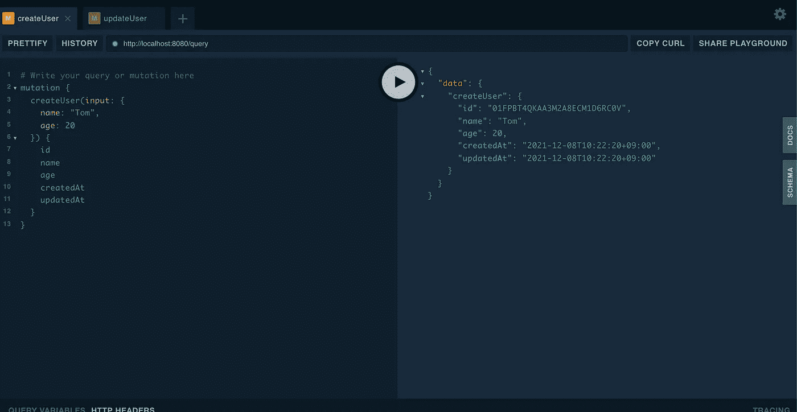

ULIDs* 

# *节点接口*

*[节点接口](https://relay.dev/graphql/objectidentification.htm)是 GraphQL 中的一个标准方式，它通过在具有单一 ID 的根上查询来提供数据。*

*一个例子是这样的:*

```
*{
  node(id: "4") {
    id
    ... on User {
      name
    }
  }*
```

*ent 包通过其 GraphQL 集成支持节点接口，所以让我们来实现它。*

## *向 GraphQL 添加节点接口*

*首先打开`graph/schema.graphqls`，添加节点界面和节点查询:*

*并打开`graph/user.graphqls`，给用户添加界面:*

*接下来，创建`pkg/entity/model/node.go`的节点模型:*

*并将其绑定到`gqlgen.yml`中的节点模型。*

*然后，运行发电机:*

```
*$ gqlgen*
```

*生成后，节点的解析器已经在`pkg/adapter/resolver/schema.resolvers.go`中创建:*

## *将 ID 映射到表*

*在节点接口中，GraphQL 服务器必须根据发送给。为此，我们需要确定 ID 包含在哪个表中。*

*在我们的应用程序中，ULID 被用作主键。通过给它添加前缀，我们可以检测出它是哪个表。*

*例如，我们可以像这样对 users 表使用`0AA`,对 todos 表使用`0AB`:*

```
*// users table
**0AA**01FPBT4QKAA...
**0AA**01FPBT4QKAA...
**0AA**01FPBT4QKAA...// todos table
**0AB**01FPBT4QKAA...
**0AB**01FPBT4QKAA...
**0AB**01FPBT4QKAA...*
```

*所以，让我们实现这一点。创建`pkg/const/globalid/globalid.go`并这样写:*

*这个 globalid 包处理 id 和表的 map 对象，并提供一个函数来标识 id 包含在哪个表中。*

*接下来，向用户模式和 todo 模式添加前缀。*

*打开`ent/schema/user.go`并给`MustNew`函数添加前缀:*

*todo 模式也是如此:*

*`MustNew`功能自动将前缀添加到 ULID。*

*接下来，创建`ent/ulid.go`:*

*这旨在用于解析器函数中，并返回表类型。*

## *实现解析器*

*现在我们已经准备好提供来自节点解析器的数据。*

*打开`pkg/adapter/resolver/schema.resolvers.go`并写下:*

*`ent.WithNodeType`设置将 ID 映射到表的节点类型解析器功能。*

*所以，我们来测试一下。*

*首先，像这样创建用户:*

*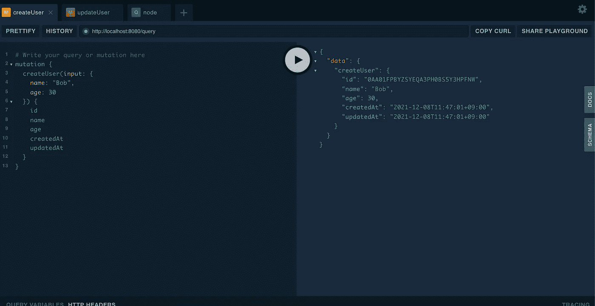*

*节点接口*

*您可以看到前缀`00A`已经附加到 id 上。*

*并查询节点，它成功响应:*

*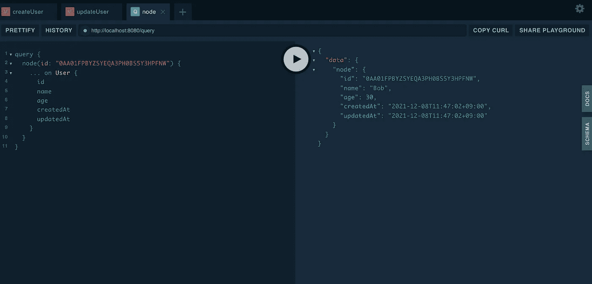*

*节点接口*

# *页码*

*在 GraphQL 中处理分页时，最好实现[中继光标连接](https://relay.dev/graphql/connections.htm)模式。ent 包通过 GraphQL 集成支持这个规范。*

## *添加 Graphql 类型*

*首先，向 GrahpQL 文件添加一些类型。*

*打开`graph/schema.graphqls`增加`Cursor`和`PageInfo`类型:*

*接下来，打开`graph/user.graphqls`并添加连接类型:*

## *绑定模型*

*我们已经在 GraphQL 文件中创建了`Cursor`和`PageInfo`类型。为了在 gqlgen 中配置这些，我们需要在`pkg/entity/model`中为它们创建类型。*

*创建`pkg/entity/model/pagination.go`:*

*打开`pkg/entity/model/user.go`并添加类型:*

*然后，运行发电机:*

```
*$ gqlgen*
```

*生成后，在`pkg/adapter/resolver/user.resolvers.go`中创建了用户解析器功能:*

## *实现分页*

*那么让我们在应用程序中实现分页。*

*首先，在`pkg/usercase/repository/user.go`中创建`List`接口:*

*然后，像这样调用`pkg/usecase/usecase/user.go`中的接口:*

*接下来，调用`pkg/adapter/controller/user.go`中的用例:*

*接下来，将分页实现添加到`pkg/adapter/repository/user.go`:*

*最后，从`pkg/adapter/resolver/user.resolvers.go`中的解析器功能调用控制器:*

*我们已经完成了分页，所以让我们测试一下。结果应该是这样的:*

*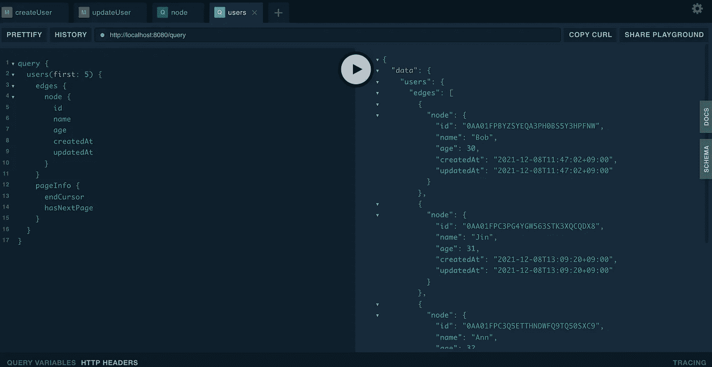*

*操场*

# *过滤输入*

*接下来，我们将向 GraphQL 突变的输入中添加更多的条件。ent 包允许我们在整个生成过程中使用类型安全的 GraphQL 过滤器。*

## *配置 ent*

*要在 ent 中配置它，打开`ent/entc.go`文件并添加这些扩展名:*

*并运行生成:*

```
*$ go generate ./ent*
```

*这就产生了定义与输入过滤器相关的类型的`graph/ent.graphql`。*

## *配置 gqlgen*

*打开`graph/user.graphqls`并将`where: UserWhereInput`添加到`users`查询中:*

*要绑定模型，将类型添加到`pkg/entity/model/user.go`:*

*并运行发电机:*

```
*$ gqlgen*
```

*在生成之后，您可以看到`where`参数已经被添加到位于`pkg/adapter/resolver/user.resolvers.go`的用户解析器中:*

## *实施过滤器输入*

*打开`pkg/usecase/repository/user.go`添加参数到`List`界面:*

*并将其添加到`pkg/usecase/usecase/user.go`中:*

*接下来，打开`pkg/adapter/controller/user.go`并将`where`参数添加到`List`界面:*

*打开`pkg/adapter/repository/user.go`并将过滤器添加到`List`方法中:*

*最后，将参数传递给`pkg/adapter/resolver/user.resolvers.go`的控制器:*

*在操场上，你可以在文档中看到过滤器列表。*

*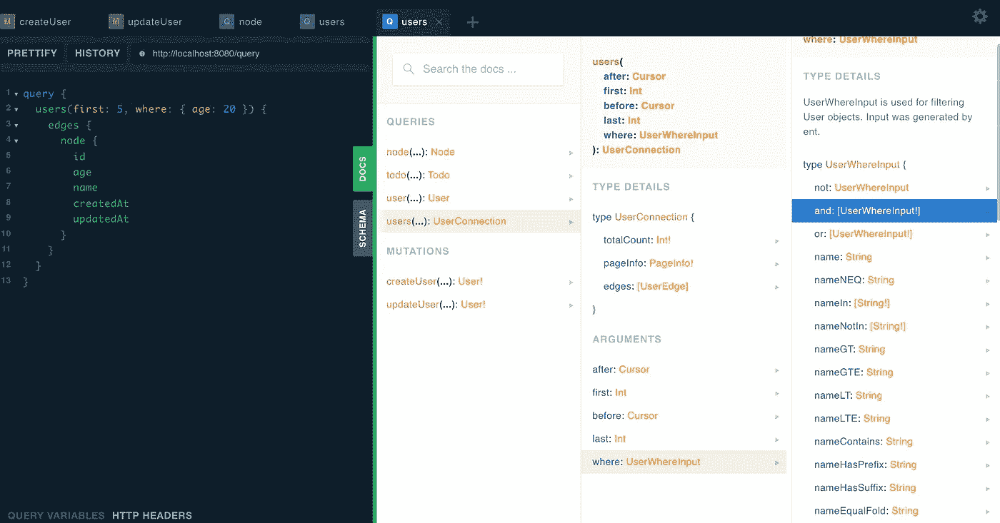*

*输入过滤器*

*如果你需要一个 30 岁以上的用户列表，你可以这样写:*

*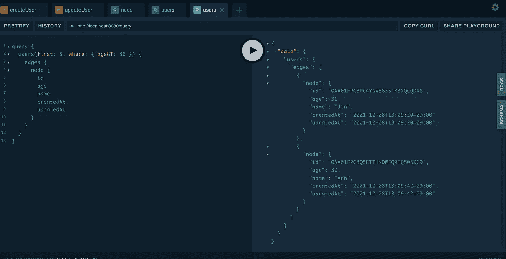*

*操场*

# *处理错误*

*gqlgen 中生成的所有解析器都应该返回一个错误，并发送给最终用户。要返回多个错误，可以像这样使用`graphql.AddError`函数:*

```
*graphql.AddError(ctx, gqlerror.Errorf("error1!"))
graphql.AddError(ctx, gqlerror.Errorf("error2!"))*
```

*响应的错误应该是这样的:*

```
*{
  "data": {
    "todo": null
  },
  "errors": [
    { "message": "error1!", "path": [ "todo" ] },
    { "message": "error2!", "path": [ "todo" ] },
  ]
}*
```

*它们将按照调用的顺序返回。*

*在我们的应用程序中，我们将创建一个名为`error`的模型，它处理所有被捕获的错误，并对最终用户做出适当的响应。此外，确保输出堆栈跟踪。*

*对于堆栈跟踪，我们将介绍[github.com/pkg/errors](https://github.com/pkg/errors)。*

```
*$ go get github.com/pkg/errors@v0.9.1*
```

*并像这样创建`pkg/entity/model/error.go`:*

*这是为了在任何层中返回错误时调用。如果您处理一个数据库错误，那么需要在`pkg/adapter/repository/user.go`中调用它，如下所示:*

*适配器层下的，它可以被多次调用，因为它包装了一个错误并返回一个新的错误。*

*为了在响应之前处理错误，我们将创建`pkg/adapter/handler/error.go`:*

*这将展开所有错误，并通过`graphql.AddError`功能将它们添加到响应中。*

*让我们将此应用于旋变器。打开`pkg/adapter/resolver/user.resolvers.go`并将处理器添加到`CreateUser`:*

*然后，如果名字的大小超过了，它会这样回应:*

*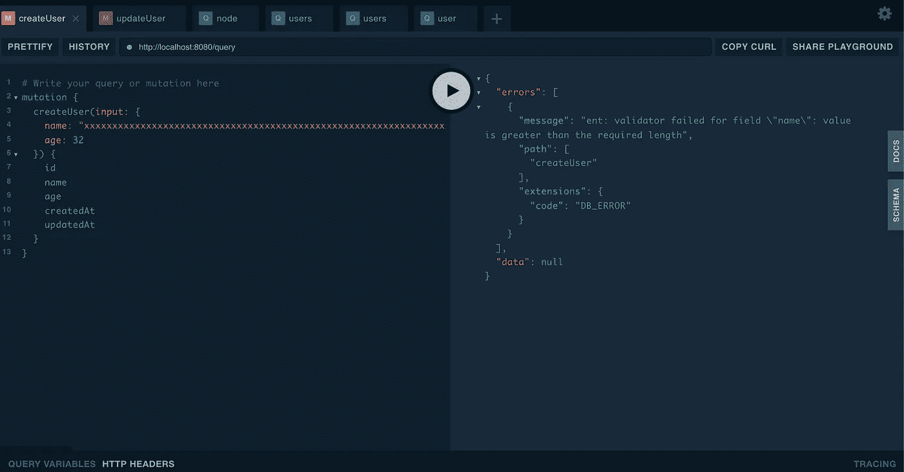*

*操场*

*堆栈跟踪如下所示:*

*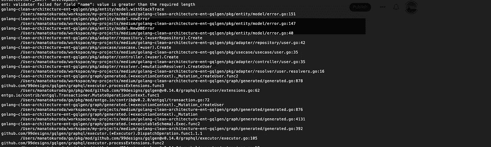*

*堆栈跟踪*

# *处理交易*

*ent 包允许我们在一个数据库事务中执行每个 GraphQL 变化，方法是用一个事务自动包装这些变化，事务在最后提交，或者在 GrahpQL 出错时回滚。*

*要进行配置，打开`pkg/infrastructure/graphql/graphql.go`并添加选项:*

*创建`pkg/repository/with_transactional_mutation.go`:*

*假设`CreateWithTodo`函数在一个事务中创建了一个用户和一个 todo，我们可以编写如下代码:*

*如果创建用户失败，则成功回滚事务。*

*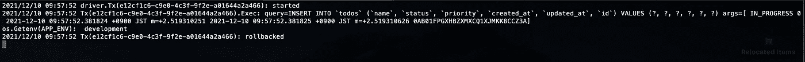*

*反转*

# *测试*

*在我们的应用程序中，我们将使用数据库来测试存储库，而不是模仿界面。*

## *设置数据库*

*首先，创建`docker/mysql_date/sql/reset_database.test.sql`:*

*接下来，创建`bin/init_db_test.sh`:*

*然后运行这个:*

```
*$ ./bin/init_db_test.sh*
```

## *设置环境*

*为了配置数据库，创建`testutil/config.go`:*

*并创造了`testutil/database.go`:*

## *实施测试*

*为了简化测试，我们将通过表驱动测试和 [AAA (Arrange Act Assert)](http://wiki.c2.com/?ArrangeActAssert) 模式来编写。*

*创建`pkg/adapter/repository/user_test.go`并写下:*

*在安排部分，三个用户已经在数据库中准备好了。然后，在 act 部分，从存储库中调用 List 函数并断言结果。*

```
*go test ./pkg/adapter/repository/... ok   golang-clean-architecture-ent-gqlgen/pkg/adapter/repository 0.556s*
```

# *E2E*

*[httpexpect](http://httpexpect) 是针对 Go 的端到端 HTTP 和 API 测试。这基本上是为了用于 Rest API，而不是 GraphQL。但实际上，要测试 GraphQL 服务器，您需要做的就是使用 POST 方法并发送一个查询。*

## *安装 httpextect*

*安装 httpextect:*

```
*$ go get github.com/gavv/httpexpect/v2*
```

## *设置数据库*

*同样，我们将首先为 E2E 测试准备一个数据库。*

*创建`docker/mysql_date/sql/reset_database.e2e.sql`:*

*并添加了`bin/init_db_e2e.sh`:*

*然后，运行脚本:*

```
*./bin/init_db_e2e.sh*
```

## *设置环境*

*为了配置数据库，将`ReadConfigE2E`添加到`testutil/config.go`:*

*创建`testutil/e2e/e2e.go`并添加一些实用函数:*

## *实施测试*

*创建`test/e2e/mutation/user_test.go`:*

*要向 GraphQL 服务器发送查询，请使用 POST 方法并添加一个字符串形式的查询，如下所示:*

*然后运行测试:*

```
*$ go test ./test/e2e/...ok   golang-clean-architecture-ent-gqlgen/test/e2e/mutation 0.525s*
```

# *结论*

*正如您所看到的，使用 ent 和 gqlgen 包，它们是强类型安全的 API，使您的应用程序更加可靠和可维护。此外，构建干净的架构使其更加灵活和可测试。*

*您可以在这里查看最终代码:*

*[](https://github.com/manakuro/golang-clean-architecture-ent-gqlgen) [## GitHub-manakuro/golang-Clean-Architecture-ent-gqlgen:带有 ent 和 gqlgen 的清洁建筑

github.com](https://github.com/manakuro/golang-clean-architecture-ent-gqlgen)*